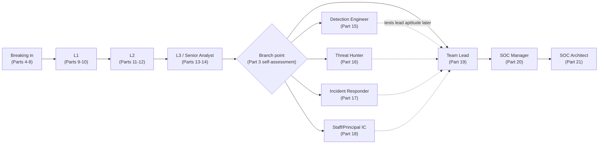

# Part 1 — Why This Book Exists & the Analyst's Series Map

## Why this part exists

**[CONCEPT]** Somewhere in every SOC there is a room where a promotion committee looks at a candidate's evidence packet and decides "ready" or "not yet." The SOC Manager's Operating Handbook is written for the people in that room: how the packet gets built, what the four-axis matrix inside it actually checks, who sits on the committee, and what fairness looks like across a hundred decisions like it. This book is written for the person the packet is about. You are not in the room. You will not see the discussion. You will see a decision, and then you will decide what to do next — close a specific gap, ask a specific question, or walk into next year's cycle with better evidence than this year's. That is the entire subject of this book: what you personally study, build, practice, and demonstrate, from the day you decide to break into a SOC through the day you're deciding whether SOC architect or SOC manager is the better fit for how you actually want to spend your time.

**[CONCEPT]** This part does one job before any of the other twenty-three do theirs: it draws the line between this book and its three companion volumes precisely enough that you never have to guess which one to open. That line matters more here than in almost any other part, because this book and the SOC Manager's Operating Handbook constantly discuss the exact same artifacts — the same competency matrix, the same evidence packet, the same interview loop — from opposite sides of the same desk. A sentence that blurs the two produces a book that quietly duplicates a few hundred pages another author-agent already wrote, badly, from the wrong chair. The rule this whole book is built on, stated once here and enforced everywhere after: **if a claim describes what an organization does to evaluate or develop people, it belongs in a citation into the SOC Manager's Operating Handbook, not a rewrite; if a claim describes what you personally do to generate strong evidence for that evaluation, it stays here.**

**[CONCEPT]** This part also owns the map. Twenty-three parts follow a single spine — L1, L2, L3, a branch into a specialty or into leadership, and onward through team lead, SOC manager, and SOC architect — and you need to know, on your first read, roughly where your own next twelve months land on that spine and which part is actually going to help you this week. The rest of this part does exactly those two things, in order: state the boundary precisely, then walk the spine and hand you the map.

## 1. The boundary: what the SOC Manager's Operating Handbook owns, and what this book owns

**[CONCEPT]** Four things belong entirely to the SOC Manager's Operating Handbook, and this book never re-derives any of them, no matter how directly they bear on your own next move.

The **competency matrix** — the four-axis standard (technical skill, tool proficiency, communication, judgment) a reviewer scores you against at every tier transition — is built, anchored, and calibrated in the SOC Manager's Operating Handbook, Part 10 — Competency Models & Skills Matrices. That part decides what "meets the judgment floor at L2" means in observable terms, and it decides that a tier gates on a floor per axis, never an average across axes. This book never rewrites that standard. It teaches you how to read it, self-score against it honestly, and generate the specific evidence a reviewer using it would actually credit.

The **promotion committee** — who sits on it, how it calibrates across teams so a lenient manager's team doesn't get promoted at a materially higher rate than a strict manager's team for the same underlying performance, and what leveling drift is — belongs to the SOC Manager's Operating Handbook, Part 13 — Career Ladders & Promotion Criteria. That part runs the committee. This book never runs it, sits on it, or second-guesses its calibration mechanics. It teaches you how to read Part 13 §4.2's evidence-packet checklist as your own personal to-do list, months before you're ever nominated.

The **hiring bar** — the leveled job description, the sourcing channel a candidate pool actually comes through, and the rubric a hiring panel scores a candidate against — belongs to the SOC Manager's Operating Handbook, Part 7 — Hiring & Sourcing Analysts and Part 8 — Interviewing & Technical Assessment Design. Those parts design the loop. This book teaches you how to walk through the door each sourcing channel is actually built to find (Part 4), and how to practice for a structured loop you know is scoring you against a written rubric even though you can't see it (Part 8 of this book — not to be confused with Part 8 of that one).

**Leveling drift** — the gradual mismatch between a title and the competency it's supposed to certify, and the audit that corrects it — is named and fixed in the SOC Manager's Operating Handbook, Part 13 §5. This book covers the individual's exposure to it (accepting an off-cycle title bump with no evidence behind it is a real personal risk, not just an organizational bookkeeping problem) without redesigning the audit that catches it.

> **Cross-Book Pointer**
> This part does not explain how the four-axis matrix is built, anchored, or gated, or how a promotion committee calibrates across teams. See the SOC Manager's Operating Handbook, Part 10 — Competency Models & Skills Matrices for the matrix mechanics and Part 13 — Career Ladders & Promotion Criteria for the committee and leveling-drift mechanics. Come back here, and to Part 2 of this book, once you understand what a reviewer is actually going to look at — the self-assessment and evidence-building advice in this book lands against a real target only once you've read those two parts from the organization's side.

**[CONCEPT]** What's left, once those four things are cited and set aside, is genuinely everything a career actually requires day to day: your own self-assessment against a standard you didn't write, your own study plan, your own home-lab builds, your own portfolio, your own interview prep, and your own mindset under a "not yet" you didn't get to argue with in the room. That's not a smaller subject than the SOC Manager's Operating Handbook's. It's a different one, asked from the chair you're actually sitting in.

## 2. Holding the line: why this boundary is harder than it sounds, and how to check it yourself

**[CONCEPT]** The boundary in §1 sounds clean on paper and gets blurry constantly in practice, for one specific reason: the artifact you need to prepare *against* and the artifact that governs the *evaluation* are the same document. A paragraph explaining what the judgment axis checks for can slide, one sentence at a time, from "here's what a reviewer is looking for" into "here's how a reviewer decides," and the second sentence has quietly wandered into the job the SOC Manager's Operating Handbook, Part 10 — Competency Models & Skills Matrices already owns. Catch the drift with one question, every time you're not sure which side of the line a paragraph is standing on: **is this sentence describing how the organization scores, decides, or governs — or is it describing what I do in response?** The first belongs to a citation. The second stays.

Here's what the drift actually looks like, side by side, on the exact topic Part 2 develops in full:

> BLURRED: "The judgment axis is scored by comparing an analyst's stated reasoning against a rubric the reviewer has calibrated across multiple analysts, weighting escalation-avoidance more heavily than speed, because a committee has found that fast wrong calls do more damage than slow right ones."

> CORRECT FOR THIS BOOK: "The judgment axis is the one most likely to be the real gap behind a stalled nomination, per Part 10 §3.4 — so build a habit now, before any formal review, of writing down your reasoning on every genuinely ambiguous ticket before you know how it resolved. Part 11 of this book turns that habit into a specific evidence-building plan."

The blurred version explains how the reviewer's rubric works — that's a rewrite of material Part 10 already owns, and it's also a guess, since this book has no authority to state how any specific committee actually weights its rubric. The corrected version cites the fact that judgment is a common gap, then pivots immediately to what you personally build in response. Every part after this one gets checked against exactly this test.

> **Career Autopsy — "read the matrix chapter and called it preparation"**
>
> **The decision (`CASE-0101`, COMPOSITE CASE EXAMPLE):** An L1 analyst, eleven months in and expecting an L2 nomination soon, reads the SOC Manager's Operating Handbook's competency-matrix chapter cover to cover, takes detailed notes on all four axes, and treats the reading itself as the work of getting ready.
>
> **Why it seemed reasonable:** The chapter is specific, well-written, and answers exactly the question that was nagging at him — what does "ready for L2" actually mean. Understanding the standard felt like the hard part; meeting it felt like it would follow naturally from already doing the job.
>
> **How it failed:** At the nomination review, he could describe the judgment axis fluently but couldn't produce a single documented example of his own reasoning on an ambiguous call — he'd never written any down, because reading about the axis isn't the same activity as generating evidence against it. The committee's feedback named a specific, checkable gap: no evidence of judgment under ambiguity, not "not smart enough" or "not fast enough."
>
> **The fix:** Understanding the standard is a real precondition, not a substitute, for building evidence against it. He started an ambiguous-call reasoning log the same week — the exact habit Part 11 of this book teaches — and reached the same review six months later with three months of dated, written reasoning a reviewer could actually check.

> **Blind Spot**
> Reading how an organization evaluates you is not the same skill as generating evidence that survives that evaluation, and no amount of familiarity with the matrix's language substitutes for having something dated, written, and specific to show a reviewer. If everything you know about the judgment axis came from reading about it rather than practicing against it, that's not readiness — it's vocabulary. Part 11's Field Test exists specifically to tell the two apart.

**[MINDSET]** There's a psychological version of the same boundary worth naming here, because it recurs at every stage this book covers: a "not yet" from a committee that's actually using Part 10's matrix well is a specific, closeable gap, not a verdict on you as a person. Treating it as the former is what makes six more months of real work possible instead of six more months of resentment. This book's job, at every stage, is to hand you the specific gap and the specific plan to close it — never a reason to feel bad about the gap existing in the first place.

## 3. The spine: L1 → L2 → L3 → branch → lead → manager → architect

**[CONCEPT]** This book follows one continuous spine, in order, because most SOC careers accumulate skill roughly in that order even when the job titles along the way don't match it exactly. Stating the spine once, plainly, before the twenty-three parts that walk it:

- **Breaking in** — choosing a route in and building the first portfolio and study plan, before you hold a title at all.
- **L1** — playbook fluency, tool proficiency, and the escalation discipline that gets you nominated for L2.
- **L2** — closing the judgment gap: resolving ambiguity instead of routing around it.
- **L3 / senior analyst** — owning novel investigations and building a portfolio that works for any of the branches ahead.
- **The branch point** — detection engineer, threat hunter, incident responder, staff/principal individual contributor, or team lead.
- **Team lead → SOC manager → SOC architect** — the leadership spine, which forks again into a people-management path and a technical-authority path that never requires managing anyone.

**[MINDSET]** Read that list as a map of where evidence typically accumulates, not as a claim about your résumé. If you broke in through an apprenticeship and never held a formal L1 title, or moved from a help-desk role straight into work that looks a lot like L2 judgment, you are not behind schedule and you have not skipped a required step — you've accumulated the same evidence a different way, and this book's job is to help you name it, not to insist you backfill a title you never needed. The spine orders the book by skill, not by job-title history, and a reader whose actual path zigzags across it is not doing anything wrong.

**[L1/L2]** The first two rungs are where tool fluency and playbook discipline get built, and where the judgment axis first starts to matter — not because L1 work demands deep judgment, but because the habits that make judgment demonstrable later (writing down why a match fired, not just what it matched) start paying off from day one.

**[SENIOR/SPECIALIST]** L3 and the branch point are where the SOC Manager's Operating Handbook, Part 13 §3's four roads — detection engineer, threat hunter, incident responder, or staying a strong individual contributor — become real choices instead of abstract titles, and where a portfolio built at senior analyst needs to actually work for whichever road you pick.

**[LEAD/MANAGEMENT TRACK]** Team lead, SOC manager, and SOC architect are three different aptitudes, not three sizes of the same job, and this book tests your own fit for each one separately rather than assuming technical strength at L3 predicts coaching aptitude, budget literacy, or platform-architecture judgment at the next rung.

The diagram below lays the same spine out as a roadmap, with the branch point drawn as a real fork rather than a single line, and the dotted paths showing that a specialist branch and the leadership track are not mutually exclusive over a full career — plenty of detection engineers eventually test team-lead aptitude, and the reverse happens too.

**Figure 1.1 — The analyst's career spine, from breaking in through SOC architect, with the branch point drawn as a real fork.** *CONCEPTUAL.* Diagram ID `FIG-0101`. Illustrates the order this book follows and where each stage's chapters live, including the dotted paths showing a specialist branch and the leadership track aren't mutually exclusive over a full career. It is a map of where this book places its content, not a claim that any individual reader's actual job-title history will match it rung for rung — see §3's note on reading the spine as skill accumulation rather than a required sequence.

## 4. Where each stage's chapter lives

**[CONCEPT]** The table below turns §3's spine into a lookup: what changes at each stage, which parts of this book cover it, and — for the stages where the organization's own evaluation machinery is the thing you're actually preparing against — where that machinery is defined on the other side of the desk.

The table below sequences the spine against this book's own chapters and, where relevant, the SOC Manager's Operating Handbook chapter that defines how the organization will evaluate that stage.

| Stage | What changes | This book's parts | The organization's evaluation machinery (cite, don't rebuild) |
|---|---|---|---|
| Breaking in | Choosing a route in, building a first portfolio with no employer-sponsored lab access | Parts 4–8 | SOC Manager's Handbook, Part 7 — Hiring & Sourcing Analysts (sourcing channels); Part 8 — Interviewing & Technical Assessment Design (the loop) |
| L1 | Playbook fluency, tool proficiency, first-year study and lab priorities | Parts 9–10 | SOC Manager's Handbook, Part 10 — Competency Models & Skills Matrices, §4.2 (L1 anchor row) |
| L2 | Closing the judgment gap: resolving ambiguity instead of escalating around it | Parts 11–12 | Part 10 §4.2 (L2 anchor row); SOC Manager's Handbook, Part 13 — Career Ladders & Promotion Criteria, §4.2 (evidence packet) |
| L3 / senior analyst | Owning novel investigations; building a branch-agnostic portfolio | Parts 13–14 | Part 13 §2.2 (senior earned through judgment, not volume) |
| Branch point | Choosing detection engineer, threat hunter, IR, staff/principal IC, or lead track | Part 3 (self-assessment), Parts 15–18 | Part 13 §3 (the three named branch bars) and §3.4 (the fourth, staff/principal IC road) |
| Team lead | Testing coaching and delegation aptitude before asking for the seat | Part 19 | Part 13 §3.3 (coaching-aptitude assessment) |
| SOC manager | Learning budget, vendor, and headcount literacy before it's on your desk | Part 20 | SOC Manager's Handbook, Sections B, E, F (the organizational depth itself) |
| SOC architect | Platform-architecture, migration, and build-vs-buy judgment, no people management required | Part 21 | SOC Manager's Handbook, Part 21 — Tooling Procurement & Platform Strategy (the procurement process a manager will ask an architect to weigh in on) |

**[MINDSET]** A table like the one above is only useful once you know roughly where you actually stand, and that's a harder question than it sounds — the honest answer is often "further along on one axis than another," which is exactly why Part 10's own matrix gates per axis rather than averaging. The checklist below is a first, rough self-locator, not a substitute for the fuller self-assessment worksheet Part 2 and Appendix A1 build out — it exists only to point you at the right entry point in this book today.

The checklist below is a rough self-locator: work down the list and stop at the first row where none of the signs describe you yet — that row is very likely where your next few months of reading in this book should focus.

| Stage | Signs you're already past this stage | If none of these ring true yet |
|---|---|---|
| Breaking in | You hold, or have held, a paid or lab-demonstrated triage role | Start with Part 4 |
| L1 | You close most ticket types independently, within SLA, unaided | Start with Part 9 |
| L2 | You've resolved a genuinely ambiguous severity call correctly, without escalating it, and can explain why afterward | Start with Part 11 |
| L3 / senior | You've owned a novel investigation end to end with no playbook to follow | Start with Part 13 |
| Branch point | You've already built work-sample evidence toward a specific branch (merged detections, a completed hunt, a DFIR case) | Start with Part 3 |
| Team lead | You've run at least one coaching or delegation exercise, formally or informally, and know whether you liked it | Start with Part 19 |
| SOC manager | You've shadowed a budget, vendor, or headcount conversation, not just read about one | Start with Part 20 |
| SOC architect | You've weighed in on a build-vs-buy or platform-migration call with real technical authority | Start with Part 21 |

## 5. How this book is organized, section by section

**[CONCEPT]** Twenty-four parts across eight sections, continuous numbering, mirroring the section convention the SOC Manager's Operating Handbook already established for the same reason it works there: labeled sections make it obvious at a glance which part of the spine you're in, and continuous numbering keeps a cross-reference from another volume stable across future drafts.

**[CONCEPT]** Section A (Parts 1–3) finishes this foundation: this part draws the boundary and the map, Part 2 is the clearest worked template for reading the SOC Manager's Operating Handbook's own machinery from the analyst's chair rather than the manager's, and Part 3 builds the self-assessment framework for choosing a branch before you've invested a year of study in the wrong one.

**[L1/L2]** Section B (Parts 4–8) covers breaking in: routes in and how to position yourself for each, the home-lab foundation you build before your first job, certifications (one dedicated part, not one per tier, because the certification decision is the same recurring timing judgment at every stage rather than a different mechanic each time), the resume and portfolio, and interview prep.

**[INTERVIEW PREP]** Interview prep (Part 8 of this book) is deliberately its own part, split from the resume (Part 7) and from breaking-in strategy (Part 4), because each is a genuinely different failure mode: which door to walk through, what document gets you the screen, and what happens once you're in the room being scored against a rubric you can't see. Practicing a timed log-triage exercise or a mock escalation only pays off once you already know, from Part 7, that the resume in front of the interviewer describes you honestly — sequence matters here, not just content.

**[STUDY PLAN]** Parts 10, 12, and 14 each carry a sequenced study curriculum for their stage, paired with home-lab projects specific to that stage's evidence needs — threaded through the book at the point each is actually relevant, rather than collected into one chapter that would either run long or flatten every project into one difficulty tier.

**[L1/L2]** Section C (Parts 9–10) is the first 12 to 18 months: what the queue actually feels like, and the specific study plan and home-lab builds — a small SIEM ingesting real telemetry, a handful of self-written detections, a first incident writeup — that let a candidate with no employer-sponsored lab prove real triage reasoning.

> Where this book's home-lab content actually lives is worth naming plainly here, since a companion volume — a planned *SOC Home Lab Handbook* — does not exist yet. Until it does, every home-lab reference in this book states the project and its learning goal in enough detail to attempt it stand-alone, flagged inline as `[HOME LAB — companion volume not yet written]`. One concrete example, previewed here rather than left as an abstract promise: Part 5's ingestion lab is a single free-tier SIEM (Splunk Free, Elastic, or a self-hosted Wazuh stack), fed real Windows Event Log and Sysmon data from one VM plus a packet capture from a second VM you deliberately run a benign port scan against, with the deliverable being three self-written detections and a one-page writeup explaining what each one catches and what it would miss `[HOME LAB — companion volume not yet written]`. That's enough to start this week; Part 5 covers the sizing, ingestion-pipeline, and hardware-tradeoff detail a future SOC Home Lab Handbook will eventually own in full.

**[SENIOR/SPECIALIST]** Section D (Parts 11–12) is L2: closing the judgment gap, the study plan and cross-source correlation practice that builds it, and an early, no-commitment introduction to detection-tuning as groundwork for a branch decision you haven't had to make yet. Section E (Parts 13–14) is L3: judgment without a playbook, and the study plan and portfolio work that stays useful no matter which branch you pick at the fork ahead.

**[SENIOR/SPECIALIST]** Section F (Parts 15–18) is the branch point itself, ordered detection engineer, threat hunter, incident responder, then staff/principal individual contributor — matching the SOC Manager's Operating Handbook, Part 13 §3's order exactly, so a reader moving between the two books never has to remap which branch comes first in one volume versus the other. Each part builds toward the specific work-sample bar that part of the SOC Manager's Operating Handbook names — five merged detections with a tracked false-positive rate for the detection-engineer branch, two structured hunts with a stated hypothesis and abandonment condition for the hunter branch, a self-run tabletop and a DFIR home-lab build for incident response — and cites Detection Engineering Handbook V2 for the technical methodology behind each, rather than re-teaching query languages or hunt mechanics this book has no business re-deriving.

**[LEAD/MANAGEMENT TRACK]** Section G (Parts 19–21) is leadership, deliberately three separate parts rather than one "management track" chapter, because team lead, SOC manager, and SOC architect select for different aptitudes the same way the three specialist branches do — a reader who self-tests team-lead aptitude in Part 19 and finds it isn't a fit may be exactly the right candidate for Part 21's architect track instead, and folding all three into one chapter would bury that decision the same way an averaged competency score buries a real per-axis gap.

**[MINDSET]** Section H (Parts 22–24) closes the book: the cross-cutting mindset habits that predict growth at every tier, managing your own burnout and pacing, and a closing synthesis chapter that sequences everything earlier into a single 12- to 24-month roadmap tied to your specific next rung or branch.

## 6. Reading the tags and the callouts

**[CONCEPT]** Seven content tags mark every paragraph below the part-title level, each placed as a bold bracketed label at the start of the paragraph or subsection it governs, never doubled on one paragraph: `[CONCEPT]` for foundational material with no assumption you act on it this week, `[L1/L2]` for content aimed at breaking in or the first two rungs, `[SENIOR/SPECIALIST]` for L3 and the specialist branches, `[LEAD/MANAGEMENT TRACK]` for your own preparation and self-testing toward team lead, SOC manager, or SOC architect, `[STUDY PLAN]` for a concrete sequenced curriculum item, `[INTERVIEW PREP]` for candidate-side practice under a scored, timed, adversarial condition, and `[MINDSET]` for the habits and self-assessment discipline that cut across every tier. A reader six months from an L2 nomination can filter mentally toward `[L1/L2]` and `[MINDSET]`; a reader testing management aptitude can filter toward `[LEAD/MANAGEMENT TRACK]`. Neither is reading a different book — the multi-level content model in `BOOK-INDEX.md` is what makes a single manuscript work for both.

**[CONCEPT]** Eight callout boxes carry recurring content across parts: Career Autopsy, Analyst's Note, Ground Truth, Blind Spot, Career Trap, Cross-Book Pointer, Field Test, and What Would Change My Mind, each defined with one fixed template in `STYLE-GUIDE.md` §6. This part leans on Cross-Book Pointer, because a boundary-and-map chapter's entire job is routing you correctly, and on What Would Change My Mind, because the two-book split this whole series is built around is a real design bet, not received wisdom.

> **What Would Change My Mind**
> This book is built on the bet that splitting organizational-evaluation mechanics (the SOC Manager's Operating Handbook) from individual preparation (this book) produces clearer guidance for both audiences than one combined volume would, even at the cost of constant cross-referencing between the two. If readers consistently reported needing both books open side by side for the same task, re-deriving the same context repeatedly, and finding the split added friction rather than removing duplication — rather than occasionally cross-checking a citation, which is the expected and intended amount of back-and-forth — that would be real evidence the split is wrong for this audience, and a future edition should reconsider merging the analyst-facing chapters of both books into one volume organized by career stage rather than by chair.

**[MINDSET]** One last thing worth saying plainly before the spine really starts: nothing in the next twenty-three parts works if you read them the way the Career Autopsy in §2 describes — as material to understand rather than evidence to build. Every `[STUDY PLAN]` and `[INTERVIEW PREP]` tag in this book is attached to something you do, not just something you now know. Treat the tag as an instruction, not a label.

## Cross-references

This part is the entry point of this book and assumes no earlier part here. It previews Part 2 — Reading the Machinery From Below (the clearest worked template for this part's own scope-boundary test), Part 3 — Choosing Your Path (the branch-point self-assessment §3 and §4 reference), and every later part named in §4's and §5's tables. Outside this book, it cites the SOC Manager's Operating Handbook, Part 7 — Hiring & Sourcing Analysts, Part 8 — Interviewing & Technical Assessment Design, Part 10 — Competency Models & Skills Matrices, Part 13 — Career Ladders & Promotion Criteria, and Part 21 — Tooling Procurement & Platform Strategy, for the organizational-evaluation and organizational-decision machinery this entire book cites rather than rebuilds. It flags one home-lab project inline as `[HOME LAB — companion volume not yet written]`, tracked for the planned SOC Home Lab Handbook per this book's own `BOOK-INDEX.md`, structural decision 8.
