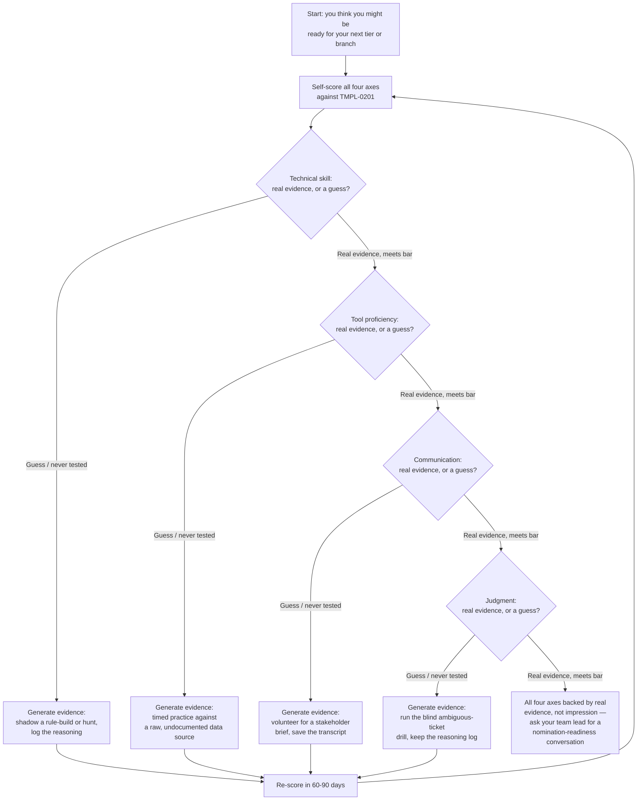

# Part 2 — Reading the Machinery From Below: Competency Matrices & Promotion Committees, From the Analyst's Chair

## Why this part exists

**[CONCEPT]** Two documents already describe you, or will the moment you're nominated for anything: a competency matrix that scores what you can reliably do, and a promotion committee's evidence packet that decides whether you move up. You didn't write either one, you don't get to sit in the room where they're built, and neither should you — that machinery belongs to the person running the SOC, not the person being evaluated inside it. But the fact that you don't build the matrix doesn't mean you can't read it. This part teaches you to read both documents from your own chair: what each of the four axes actually checks for, what the committee's evidence packet actually wants to see, and how to hear a "not yet" as a specific, closeable gap instead of a verdict on your worth.

**[CONCEPT]** Hold the line this part is named for carefully, because it's the sharpest one in this book. If a claim describes how a reviewer writes an anchor, runs a calibration session, or decides who sits on a committee, that claim belongs to *SOC Manager's Operating Handbook*, Part 10 — Competency Models & Skills Matrices and Part 13 — Career Ladders & Promotion Criteria, cited here and left there. If a claim describes what you personally do — score yourself against the same axes, build the evidence a reviewer would actually accept, ask a specific question when a decision comes back vague — it belongs here. Every section below states which side of the desk it's talking about before it says anything else, and if a paragraph ever drifts into explaining how the matrix itself gets built, that's a defect, not a bonus.

## 1. Two documents that already describe you

**[CONCEPT]** The competency matrix is a standing artifact, not a one-time verdict: a set of four axes, each anchored to observable behavior at each tier, scored on a slow cadence — at nomination and roughly annually otherwise — per *SOC Manager's Operating Handbook*, Part 10 — Competency Models & Skills Matrices. It answers one question about you: could you reliably do the next tier's work if handed it tomorrow. It does not answer whether you're having a good quarter, which is a separate measurement (performance) on a separate document, on a faster cadence, that this part deliberately leaves alone.

**[CONCEPT]** The evidence packet is a different artifact entirely, assembled once per candidacy rather than standing continuously: a specific set of items a promotion committee reviews before your name is even discussed, per *SOC Manager's Operating Handbook*, Part 13 — Career Ladders & Promotion Criteria, §4.2. Your competency matrix rating is one line in that packet, not the whole thing — the packet also pulls in a QA score, your handle time and independence numbers, whether you have an open coaching plan, peer input, and, past senior analyst, a branch-specific work sample. Confusing the two documents is common and costly: an analyst who only tracks their own sense of "am I good at the job" has no way to notice that the packet's peer-input line, or its branch-specific work sample, might be the actual gap sitting between them and their next title.

> **Cross-Book Pointer**
> This part does not explain how the four-axis matrix's anchors get written, how a reviewer runs a calibration session across teams, or how the gate-per-axis rule was decided in the first place. *SOC Manager's Operating Handbook*, Part 10 — Competency Models & Skills Matrices owns that organizational machinery in full, from the reviewer's chair. Come back here once you understand what a reviewer is actually looking at, so the self-scoring worksheet in §4 lands against a real target instead of a guess.

**[MINDSET]** The practical reason to keep both documents straight in your own head: it changes what you spend your limited study and practice time on. Time spent making an already-strong axis a little stronger doesn't move the matrix's gate rule (§3), and polishing your technical portfolio doesn't populate the packet's peer-input line or close an open coaching plan. Knowing exactly which document a given hour of effort actually feeds is the difference between a study plan that closes a real gap and one that just feels productive.

## 2. What the four axes actually check for — reading them from your seat

**[CONCEPT]** *SOC Manager's Operating Handbook*, Part 10, §3 defines four axes — technical skill, tool proficiency, communication, judgment — because collapsing everything you do into one blended score hides exactly the information a reviewer needs, the same way it would hide information from you if you scored yourself that way. Each axis checks a genuinely different failure mode. The four subsections below state, briefly, what a reviewer is actually checking on each one, then spend the rest of their length on the only question that's actually this book's to answer: what do you personally do about it.

### 2.1 Technical skill

**[L1/L2]** A reviewer checking this axis is checking whether you reason correctly about what's happening in the environment — recognizing a technique, forming and testing a hypothesis, telling a true positive from a false one — under time pressure and without someone else doing the reasoning for you. At L1, that's mapping an alert to the right playbook step unaided and explaining why a match is or isn't real. At L2, it's forming a hypothesis across multiple log sources with no playbook to follow.

**[SENIOR/SPECIALIST]** *SOC Manager's Operating Handbook* Part 10 is explicit that it does not define what correct detection logic or a sound hunt hypothesis actually look like — that standard lives in *Detection Engineering Handbook V2*, Parts 3–29 for detection-rule and telemetry mechanics and Parts 34–36 for threat-hunting methodology. Your job on this axis isn't to read those parts once; it's to generate a personal record that proves you apply that standard without supervision. Keep a running hypothesis log: for every ticket where you went past the runbook, write your hypothesis, what you tested, and your disposition, before you know whether you were right. A folder of 10 of these, spanning a real range of ticket types, is worth more at review time than a certificate saying you passed an exam on the same material.

### 2.2 Tool proficiency

**[L1/L2]** This axis exists separately from technical skill because it's possible to reason correctly about an attack and still be too slow in the platform in front of you to act on that reasoning inside your SLA. A reviewer checking this axis at L1 wants to see you pull the exact fields a documented playbook calls for, on time, unaided. At L2, the bar moves to building an ad hoc cross-tool query to test a hypothesis with no documentation, in a time budget comparable to L1's simple lookup.

**[L1/L2]** The evidence you personally control here is almost entirely self-generated, because nobody schedules a timed practical exercise for you outside a formal assessment. Pick a raw data source your SIEM doesn't have a prebuilt dashboard for, give yourself a 20-minute budget, and build the query cold. Log how long it actually took and what you had to look up. Repeat it against a different data source every few months — tool proficiency degrades the moment a platform migrates or a field mapping changes upstream, and a six-month-old timed exercise proves less than you'd think.

### 2.3 Communication

**[L1/L2]** *SOC Playbook Handbook*, Part 27 — Escalation Quality already defines, in mechanical detail, what a good hand-off contains: the fields, the framing, the specific information a Tier 2 analyst needs to pick up your case cold with no follow-up question. The competency matrix's communication axis asks a narrower question on top of that standard: does this specific person reliably produce that, unprompted, across a real sample of their own tickets — not just the one escalation a team lead happened to review this week.

**[SENIOR/SPECIALIST]** The evidence problem on this axis is usually a sampling problem, not a skill problem: most analysts write plenty of good escalations and never keep a single one past the week it closed. Save your last handful of escalation drafts before any rewrite a reviewer requested, not just the polished final version — the gap between your first draft and what actually shipped is exactly what a reviewer will ask about if this axis comes back "emerging" rather than "meets bar." Past senior analyst, this axis also starts checking live, unscripted stakeholder communication rather than written escalations alone; volunteering for a stakeholder call your team lead would otherwise take is one of the only ways to generate that evidence before you're actually required to.

### 2.4 Judgment

**[SENIOR/SPECIALIST]** Judgment is the axis *SOC Manager's Operating Handbook* Part 10, §3.4 names as the one most managers skip testing directly, because it's the hardest to observe cleanly — and the one most likely to be the real gap hiding behind a stalled nomination that looks, on the surface, like a technical-skill problem. A reviewer checking this axis wants to see you resolve ambiguous severity calls correctly, applying *SOC Playbook Handbook*, Part 29 — Playbook Severity Model consistently on a case that doesn't map cleanly onto the model's clearest examples, and knowing which categories of ambiguity (legal holds, suspected insider activity, anything touching an executive) still require escalation regardless of your tier.

**[MINDSET]** The single highest-value habit on this axis is narrating your reasoning before you know the outcome, not after. A self-assessment written with the resolution already known measures how well you can justify a known-good answer, not whether you'd have reached it blind. Pull an already-closed, genuinely ambiguous ticket, cover the resolution, write your disposition and your reasoning against a 10-minute clock, and only then check what actually happened. Do this monthly, and you'll have a real, dated record of judgment under the same uncertainty a reviewer is trying to test for — not a reconstruction built after the fact to sound confident.

## 3. The gate rule, from your side of it

**[CONCEPT]** *SOC Manager's Operating Handbook* Part 10, §4.1 gates every tier transition on clearing the minimum bar on all four axes independently — never an average. A reviewer scoring you this way is making a specific, deliberate choice: an analyst who's excellent at technical skill, tool proficiency, and communication but weak on judgment isn't "roughly ready." They're an analyst who will make confident, fast, technically sound decisions on the wrong call, which the organizational side of this book's companion volume treats as more dangerous than an analyst who's merely slow across the board. That rule is not yours to change, argue with, or work around. It is, however, yours to plan against.

> **Career Trap**
> Telling yourself "I'm strong in three of four axes, that should be enough" is the single most common way analysts misread their own readiness, because the gate rule in *SOC Manager's Operating Handbook* Part 10, §4.1 doesn't average — it holds a nomination on any single axis that hasn't cleared, no matter how strong the other three look. The fix: once you've self-scored against §4's worksheet, spend your next study cycle's real effort on your weakest axis specifically, even though — especially because — it's rarely the axis you'd choose to practice if left to your own preference.

> **Career Autopsy — "chasing an average instead of a floor"**
>
> **The decision (`CASE-0201`, COMPOSITE CASE EXAMPLE):** An L2 analyst nearing two years in seat spends an entire study cycle strengthening an already-strong technical-skill axis — building two more home-lab detections and adding a certification — while treating judgment as "probably fine," based on a general sense of confidence rather than any specific evidence.
>
> **Why it seemed reasonable:** The technical work was visible, measurable, and satisfying to build. The judgment axis had no obvious next study action attached to it in the analyst's own mind, so two years of general experience felt like coverage enough.
>
> **How it failed:** The nomination came back "not yet," with the specific gap named as judgment: three ambiguous-severity tickets sampled for the evidence packet had all been escalated rather than resolved, which read as unaddressed ambiguity, not caution. The two additional detections and the certification made no difference to that specific finding, because they were evidence for a different axis entirely.
>
> **The fix:** Treat the four axes as four separate study plans, not one combined effort weighted toward whichever axis is most enjoyable to build evidence for. A weak axis needs its own dedicated action even when — especially when — it's the one you'd rather not spend a study cycle on.

**[SENIOR/SPECIALIST]** The gate rule also means a self-assessment that reports one overall number is actively misleading you. If your own worksheet in §4 produces something like "I'm about a 3.5 out of 4 overall," you've already reintroduced the averaging problem the rule exists to prevent. Score each axis on its own line, and let the lowest one — not the mean — decide what you work on next.

## 4. Self-scoring against the same axes a reviewer uses

**[STUDY PLAN]** You can't run a calibration session or pull a QA sample the way a reviewer can, but you can build a private version of the same instrument, scored against the same axis language, months before any formal nomination touches you. The point isn't to predict your official score — it's to stop finding out what a reviewer thinks about your judgment axis for the first time during a nomination you didn't see coming.

### 4.1 The self-scoring worksheet

**[STUDY PLAN]** Use the worksheet below at the start of every self-audit cycle (§8), before you touch any study material. It's a personal, informal instrument — nobody official ever sees it unless you choose to share it — and its only job is to force you to write down evidence instead of an impression. A blank, fillable version of this same structure lives in Appendix A1 as `TMPL-0201`; the table below is a filled, illustrative instance.

CONCEPTUAL SAMPLE — illustrative self-scores and gap-closing actions, not a validated benchmark.

| Axis | What a reviewer's version tests (*SOC Manager's Handbook* Part 10, §3) | Evidence you personally control | Self-score | This cycle's gap-closing action |
|---|---|---|---|---|
| Technical skill | Forms and tests a hypothesis across multiple log sources with no playbook to follow | A hypothesis log from tickets where you went beyond the runbook, reasoning written before the resolution | Emerging | Shadow 1 hunt session; write the hypothesis before seeing the result |
| Tool proficiency | Builds an ad hoc cross-tool query with no documentation, in a time budget comparable to a documented lookup | Timed practice queries against raw data, with build time logged | Meets bar | Repeat quarterly against a new data source to avoid staleness |
| Communication | Briefs a stakeholder outside the SOC, live and unscripted | Saved drafts of your last 5 escalations, pre-rewrite | Not yet tested | Volunteer for the next stakeholder call your team lead would otherwise take |
| Judgment | Resolves ambiguous severity calls correctly; knows which categories still require escalation regardless | A log of ambiguous calls with reasoning written before you learned the resolution | Emerging | Run the field test in §4.3 monthly, not once |

A worksheet like this doesn't automate the judgment call of whether your evidence is actually good enough — that's still yours to make honestly, and §4.3 exists specifically because you're the worst-positioned person to check your own work for free.

### 4.2 The self-scoring loop, visualized

**[STUDY PLAN]** The worksheet in §4.1 isn't a one-time form; it's the input to a loop that runs continuously until every axis has real evidence behind it, not a guess. Figure 2.1 below shows that loop.

**Figure 2.1 — The self-scoring loop: closing evidence gaps before asking for a nomination.** *CONCEPTUAL.* Diagram ID `FIG-0201`. Illustrates the individual's own pre-check loop feeding into a readiness conversation, distinct from the organization's gate-per-axis nomination flow in *SOC Manager's Operating Handbook* Part 10, Figure 10.1 — that figure decides whether a nomination already in front of a reviewer proceeds; this one decides whether you should ask for one in the first place.

### 4.3 Running your own calibration check

**[MINDSET]** A self-score with no outside check has exactly one blind spot a reviewer's process is specifically designed to catch: your own generosity toward yourself. *SOC Manager's Operating Handbook* Part 10, §6 has a reviewer run their first real matrix calibration on an easy, undisputed case precisely because two reviewers who think they share a definition of "meets bar" usually don't until they compare notes. Run the individual equivalent on yourself.

> **Field Test**
> **Setup:** You've filled out your own `TMPL-0201` self-score for all four axes, with evidence attached to each line.
> **Action:** Hand a peer — ideally someone a tier above you, or your team lead, informally — the same blank worksheet and the same underlying evidence (the hypothesis log, the saved escalations, the ambiguous-call reasoning), without showing them your own scores first, and ask them to score you independently.
> **Expected result:** Expect at least one axis to land a full score-band apart from your own. If every axis matches exactly, either your evidence sample was too thin to disagree over, or your reviewer scored generously rather than honestly — rerun it with someone more willing to push back before you trust the result.

> **Blind Spot**
> Your own self-score can't tell the difference between "not met" and "never tested," and that distinction changes what you do next completely. *SOC Manager's Operating Handbook* Part 10, §8 warns a manager against the same mistake from the other side: a hunter who's never once briefed an executive isn't failing the communication axis, she's unmeasured on it. If you've simply never had the chance to brief a stakeholder outside the SOC, scoring your own communication axis "not met" and grinding on documentation skills you already have solves nothing. Before scoring any axis low, ask honestly whether the gap is a demonstrated weakness or an opportunity nobody has handed you yet — and if it's the latter, the gap-closing action is asking for the opportunity, not more study.

## 5. What a promotion committee's evidence packet actually wants to see

**[SENIOR/SPECIALIST]** *SOC Manager's Operating Handbook*, Part 13, §4.2 lists six specific items a promotion committee expects in front of it before your name is even discussed. None of the six is "your manager thinks highly of you." The table below translates each item, in the committee's own minimum-bar language, into what you personally do to make sure it has something real behind it — not into how the committee weighs or assembles the packet, which stays that book's job.

| Evidence packet item (*SOC Manager's Handbook* Part 13, §4.2) | Minimum bar the committee checks | What you personally do | Who assembles it |
|---|---|---|---|
| Competency matrix rating | "Meets" on every next-level row, not an average | Ask your team lead, ahead of any nomination, which axis is currently rated below bar | Team lead |
| QA calibration score | 85% or higher, sustained across 2 consecutive quarters | Ask for your own QA scores every cycle instead of waiting to be told; don't let 2 quarters pass unmeasured | QA reviewer |
| Handle time and independence | Within 15% of team median; under a 20% escalation rate | Track your own escalation rate informally; if it's climbing, find out why before the committee does | Team lead |
| Open coaching plan | None open in the trailing 6 months | — nothing to build; let any active plan close on its own terms rather than rushing it | SOC manager |
| Peer input | At least 2 peer submissions; no unaddressed concern | Build real working relationships across shifts, not only with your own team lead | Committee |
| Branch-specific work sample | Meets the relevant branch bar (detection engineer, threat hunter, team lead) | Build the work sample itself — merged detections, a completed hunt record, a shadow-lead cycle — well before any nomination | Team lead and specialist reviewer |

> **Ground Truth**
> Most analysts assume a promotion case is really about their manager's overall opinion of them, dressed up afterward in whatever evidence makes that opinion look justified. *SOC Manager's Operating Handbook* Part 13, §4.2 is built the opposite way: it names six specific evidence items with numeric or binary bars before anyone's opinion enters the room, and most of those six should already exist as a byproduct of a QA program and a performance-management process running normally around you — not as a research project assembled from scratch the week before your nomination. If putting your own packet together means digging up evidence that doesn't exist anywhere yet, that's telling you something about a gap in your own tracking, not just your manager's.

> **Cross-Book Pointer**
> How the committee is composed, how it calibrates decisions across teams, and what leveling drift is and why it matters — none of that is this part's job. *SOC Manager's Operating Handbook*, Part 13 — Career Ladders & Promotion Criteria owns that organizational machinery in full. What belongs here is narrower: once you know the packet exists and what its six line items are, what do you personally do, starting now, to make sure each one has real evidence behind it before anyone convenes to review your case.

**[MINDSET]** Notice the "who assembles it" column is never you. Your team lead pulls the QA numbers, the committee gathers peer input, HR reviews pay-band equity — the assembly work belongs to the process described in Part 13's own RACI, and trying to personally build a polished dossier and hand it up unasked is usually a wasted effort that also reads as presumptuous. Your actual job is upstream of assembly: make sure that when someone does pull each of those six threads, there's something real on the other end of it.

## 6. Reading a "not yet" as a specific, closeable gap

**[SENIOR/SPECIALIST]** *SOC Manager's Operating Handbook* Part 13, §6 tells the person delivering a "not yet" to name the specific bar item that wasn't met — "the QA score was 81% against an 85% bar, sustained for one quarter instead of two" — rather than a vague "the committee felt you weren't quite ready," because a specific gap is something you can close on a known timeline and a vague one just reads as a decision that was never really about the bar. That instruction is written to the person delivering the news. You're allowed to hold them to it.

**[MINDSET]** If a "not yet" arrives with no named bar item, the correct response is a direct, unembarrassed question: which of the four axes, or which line in the evidence packet, specifically didn't clear, and by how much. This is not a confrontational question and it is not one you need to apologize for asking — it's the exact question the committee's own process expects someone to be able to answer. If the honest answer turns out to be "there wasn't a specific bar, it was a feeling," that's real information too: it tells you the packet wasn't actually reviewed against the process described in §5, and pushing for that review is a reasonable next step, not an overreach.

> **Career Autopsy — "reading 'not yet' as 'no'"**
>
> **The decision (`CASE-0202`, COMPOSITE CASE EXAMPLE):** An analyst passed over for a specialist-branch nomination receives a short, verbal "not quite there yet, try again later" from their team lead, doesn't ask a follow-up question, and spends the next two quarters quietly job-hunting instead of finding out what specifically the committee wanted to see.
>
> **Why it seemed reasonable:** A vague "not yet" delivered with no specifics feels like a closed door, and asking a team lead to justify a decision that already went against you feels confrontational in a way most analysts would rather avoid.
>
> **How it failed:** The actual gap — one missing structured hunt record against the branch's two-hunt minimum, per *SOC Manager's Handbook* Part 13, §3.2 — was closeable inside a single focused quarter. The analyst instead accepted an external offer at a lateral title and pay band, at a new SOC offering no more actual specialist scope than the one they left.
>
> **The fix:** Treat any "not yet" delivered with no named bar item as incomplete feedback, not a verdict, and ask directly which item on the evidence packet — not which vague impression — didn't clear. *SOC Manager's Handbook* Part 13, §6 explicitly instructs the person delivering a "not yet" to name the specific bar; asking for that when it wasn't offered is a reasonable, expected question, not a challenge to the decision itself.

**[SENIOR/SPECIALIST]** Once you have the specific gap, treat the re-attempt window the same way the branch bars do: *SOC Manager's Handbook* Part 13, §3 sets two full quarters as a reasonable default re-attempt window for a failed branch bar — long enough to show a genuinely different result, short enough that you're not left in limbo. Use that same window for a tier-level "not yet," even where the org hasn't stated one explicitly: pick the single named gap, build the specific evidence that closes it (a second structured hunt, a QA score held above 85% for two full quarters, a peer-input concern actually addressed), and ask for a re-read at the end of that window rather than waiting for the next scheduled cycle to notice on its own.

## 7. Where this feeds forward: branches, leadership, and interview prep

**[SENIOR/SPECIALIST]** The four axes don't stay identical once you're past senior analyst — *SOC Manager's Operating Handbook* Part 10, §5 is explicit that the ladder forks by track, not just by tier, and each specialist branch needs its own version of judgment and tool proficiency rather than "more of the same, but faster." A detection engineer's judgment anchor is a tradeoff inside an analytic's design; a team lead's is knowing when to let someone else be wrong and learn from it instead of stepping in. The self-scoring habit built in §4 doesn't change shape at the fork — it's the same worksheet, rebuilt against whichever branch's anchors actually apply to you. This book's own Parts 15 through 18 build the branch-specific study plans and portfolio work — a merged-detection record, a completed hunt log, a shadow-lead cycle — that turn a self-score on the relevant branch's version of these axes into the actual work sample *SOC Manager's Handbook* Part 13, §3 requires before a title changes.

**[LEAD/MANAGEMENT TRACK]** The team-lead branch deserves one specific flag here, because it's the branch most often handed to someone on the strength of the wrong axis. *SOC Manager's Handbook* Part 13, §3.3 requires a passed coaching-aptitude assessment and a completed shadow-lead cycle before that title changes, precisely because being the fastest, most technically excellent individual contributor tells a committee nothing about whether you'll delegate a task instead of quietly rewriting it yourself. If you're eyeing that seat, self-testing the same aptitude — do you rewrite a delegated task, or coach it — belongs in your own self-scoring loop well before anyone offers you the role, not after.

**[INTERVIEW PREP]** If any of this evidence-gathering happens while you're also interviewing externally, the overlap is not a coincidence. Most SOCs run some version of these same four axes even when they don't use this exact language, and a hiring loop scores a candidate against very similar observable behavior — *SOC Manager's Operating Handbook* Part 8 — Interviewing & Technical Assessment Design is explicit that a well-built interview loop targets the same L1 or L2 row a competency matrix already defines. Your `TMPL-0201` worksheet and its attached evidence — the hypothesis log, the saved escalations, the ambiguous-call reasoning — is also the raw material for the story bank this book's own Part 8, Interview Prep From the Candidate's Chair, teaches you to build. One evidence-gathering habit serves both an internal nomination and an external interview; there's no reason to build two separate records for the same underlying proof.

## 8. A quarterly self-audit rhythm

**[STUDY PLAN]** *SOC Manager's Operating Handbook* Part 13, §4.1 runs its promotion committee on a quarterly cadence. Run your own self-audit a half-step ahead of that rhythm, not in sync with it, so you're never walking into a committee cycle with a self-score you haven't looked at in eight months. The table below is one reasonable way to spread the loop from §4.2 across a quarter without it consuming a weekend all at once.

CONCEPTUAL SAMPLE — one illustrative quarterly rhythm; adjust the pacing to your own shift pattern and workload.

| Week | Activity | Output |
|---|---|---|
| Week 1 | Fill out `TMPL-0201` cold, before reviewing last quarter's copy | A fresh, honest four-axis self-score |
| Week 2 | Compare against last quarter's copy; flag any axis unchanged for 2 cycles running | A short list of stalled axes |
| Week 3–10 | Run the gap-closing action for your single lowest axis (§4.1's last column) | New evidence attached to the worksheet |
| Week 11 | Run the Field Test in §4.3 with a peer or team lead | An outside check on at least 1 axis |
| Week 12 | Decide, honestly, whether you're ready to ask for a nomination-readiness conversation | A go/no-go decision, in writing to yourself |

**[MINDSET]** The habit only holds value if it survives past the first promotion it helps you earn. An analyst who runs this rhythm hard for one cycle, gets the nomination, and then stops has traded a standing habit for a one-time push — and the next tier's version of the same four axes will need the same discipline all over again, from a colder start than if the rhythm had never stopped. Keep the worksheet running quarterly regardless of whether a nomination is anywhere on the horizon; the version of you that's ready two quarters before anyone asks is in a categorically better position than the version scrambling to build evidence after being asked.

---

**Cross-references:** This part assumes Part 1 — Why This Book Exists & the Analyst's Series Map for the scope boundary it tests directly, and feeds forward into Part 3's specialization framework and this book's own Part 8 — Interview Prep From the Candidate's Chair, Part 11 — Making the Jump to L2, and Parts 15–19's branch and leadership tracks, all of which reuse the self-scoring habit built here against their own tier- or branch-specific anchors. Outside this book, it cites *SOC Manager's Operating Handbook*, Part 10 — Competency Models & Skills Matrices and Part 13 — Career Ladders & Promotion Criteria for the organizational mechanics of the matrix and the committee, Part 8 — Interviewing & Technical Assessment Design for how a hiring loop reuses this same matrix, and *SOC Playbook Handbook*, Part 27 — Escalation Quality and Part 29 — Playbook Severity Model for the communication and judgment axes' underlying technical standards, without re-deriving any of the four.
