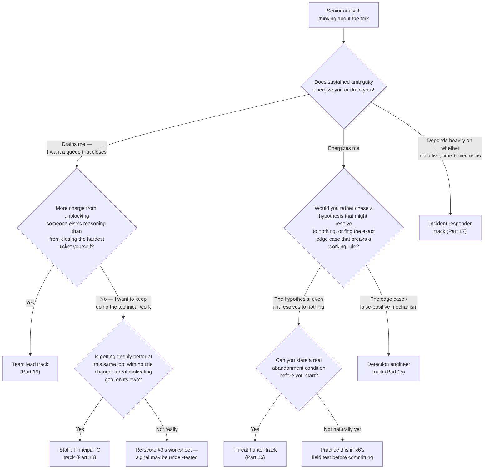

# Part 3 — Choosing Your Path: A Specialization Decision Framework

## Why this part exists

**[CONCEPT]** Somewhere around senior analyst, the SOC Manager's Operating Handbook's own career ladder stops being a single line and forks into four real roads: detection engineer, threat hunter, incident responder, or team lead, plus a fifth, often-unlabeled road that just means staying a strong individual contributor at senior scope. SOC Manager's Operating Handbook, Part 13 — Career Ladders & Promotion Criteria, §3 owns exactly what evidence a promotion committee will demand before certifying you on any of those four named roads — a work-sample bar for detection engineering, a hunt-record bar for hunting, a coaching-aptitude bar for team lead, and (per §3.4) an explicit dual-ladder rung for the fifth road. This part does not re-derive any of that. What it owns is narrower and comes earlier: how you personally decide which road to point a year or more of study time at, before you've built the evidence any of those bars will ask for.

**[CONCEPT]** That ordering matters. A committee bar is a finish line — it tells you what "done" looks like once you've already chosen a direction and put in the work. It says nothing about which direction to run in the first place, and running hard in the wrong direction for a year is a real, avoidable cost. This part's job is the decision that happens before the work: a self-assessment built around aptitude signals — does sustained ambiguity energize you or drain you, do you want a hypothesis that might resolve to nothing or a queue that reliably closes, do you get more charge from unblocking someone else's reasoning than from closing the hardest ticket yourself — rather than title prestige, current salary bands, or which branch your team happens to be short-staffed on this quarter.

**[L1/L2]** If you're still an L1 or L2 analyst, this fork is probably a year or more away, and that's fine. Read this part now to orient yourself — knowing the shape of the choice ahead changes what you notice about your own reactions to ambiguous tickets long before you're actually nominated for anything — but don't force a decision early. Part 14's senior-analyst portfolio work is what actually builds the evidence this part's self-assessment should be tested against, and you'll get more out of a second pass through this part once you're closer to the fork than you will from over-committing to a branch now based on a guess about who you'll be in two years.

**[CONCEPT]** The rest of this book's Section F — Parts 15 through 18 — builds the full study plan, portfolio, and home-lab work for each of the four named branches plus the fifth road, in the same order SOC Manager's Operating Handbook Part 13 §3 presents them, so a reader flipping between the two books never has to remap which branch is "first." This part previews those four bars just enough to route you toward the right one before you start.

## 1. The fork, and why title and salary are bad compasses

**[CONCEPT]** Every one of the five roads out of senior analyst can be described in a way that sounds appealing on paper. Detection engineer sounds like the technical-authority track. Threat hunter sounds like the elite, proactive track. Team lead sounds like the track with a bigger number on the offer letter and a title your family understands. Staying a strong individual contributor sounds, by contrast, like standing still — which is exactly the framing SOC Manager's Operating Handbook Part 13 §3.4 names as the trap when a ladder doesn't build an explicit rung for it. None of those descriptions tells you anything about whether the actual day-to-day work of that role will fit how you think.

**[MINDSET]** Title prestige and salary band are bad compasses for the same underlying reason: they describe how a role is perceived from outside it, not what it feels like to do the work from inside it. A threat hunter's actual week includes long stretches where a carefully reasoned hypothesis produces nothing — no adversary, no finding, just a clean, honest negative result — and if that stretch feels like wasted time to you rather than a real, useful answer, no amount of prestige attached to the title will make that feeling go away once you're six months into the role. A detection engineer's actual week includes deliberately trying to break your own rule with a false positive before someone else finds it first, which rewards a specific appetite for edge cases that has nothing to do with how technically senior the title sounds.

> **Ground Truth**
> Detection engineering and threat hunting reward almost opposite tolerances for a hypothesis resolving to nothing. If a hunt that finds no adversary and no finding feels like wasted time rather than a real, useful negative result, that's a signal worth taking seriously before you spend six months building a hunt portfolio for a branch that will grind on you — this part's self-assessment framework is meant to surface that signal before Part 16's hunt-specific study plan asks you to commit to it, not after.

**[MINDSET]** Salary bands are an even weaker compass, because they usually converge faster across branches than people expect once you're two or three years past the branch point — a strong detection engineer, a strong hunter, and a strong team lead at the same seniority tier tend to land within a similar band at most SOCs, with the real pay variance driven by tenure, market, and individual performance far more than by which of the four roads was chosen. Choosing the branch with the marginally higher posted salary this year, when you have no real signal that the work fits you, trades a small, uncertain short-term gain for a much larger risk: spending a year building a portfolio for a role you turn out to dislike, then having to start over.

## 2. Six aptitude signals that predict fit better than a job title

**[CONCEPT]** Instead of ranking the four branches plus the fifth road by appeal, this part asks you to score yourself against six narrower signals — each one a specific tolerance or preference that the day-to-day work of one or more branches genuinely requires, independent of how the branch is marketed. None of these six signals is a technical skill; Parts 15 through 18 own building the technical skill once you've chosen a direction. These are dispositions — closer to "how do you actually feel three hours into this kind of work" than "how good are you at it today."

### 2.1 Ambiguity tolerance

**[SENIOR/SPECIALIST]** Ambiguity tolerance is the most general of the six signals: does an open, unresolved case still sitting on your desk at the end of a shift feel like a normal, even interesting, state of affairs, or does it feel like a small failure you want to close before you can relax. This signal runs through nearly every branch, but it cuts hardest for threat hunting and for staying a strong individual contributor at senior scope, both of which routinely leave you holding something unresolved for longer than a triage queue ever would.

### 2.2 Hypothesis patience

**[SENIOR/SPECIALIST]** Hypothesis patience is narrower and more specific than general ambiguity tolerance: given a falsifiable hypothesis and a fixed time box, can you let the hypothesis fail cleanly — reach a real, stated negative result — without treating the absence of a finding as evidence you did something wrong. This is the signal that most directly predicts fit for the threat-hunter branch, because SOC Manager's Operating Handbook Part 13 §3.2 names exactly this distinction as the branch's defining failure mode: a candidate can be technically strong at querying and still be a poor hunter if every hunt starts from "let's see what's weird in this data" instead of a hypothesis with a real abandonment condition attached.

### 2.3 Edge-case orientation

**[SENIOR/SPECIALIST]** Edge-case orientation is the pull toward finding the one benign action that breaks a rule you just wrote, rather than treating the rule as finished once it deploys clean. Detection engineering runs almost entirely on this signal: SOC Manager's Operating Handbook Part 13 §3.1 sets the branch's work-sample bar around a tracked false-positive rate specifically because a detection engineer who ships a rule and moves on, instead of actively hunting for what will make it misfire, produces exactly the kind of detection debt that erodes a SOC's trust in its own alert queue.

### 2.4 Incident tempo tolerance

**[SENIOR/SPECIALIST]** Incident tempo tolerance is comfort making a real, consequential decision — contain this host, don't contain that one — on incomplete evidence, inside a compressed and often unpredictable time window, without a manager or a runbook resolving the ambiguity for you first. This is a genuinely different flavor of ambiguity than a hunter's: a hunter's ambiguity resolves on their own schedule over hours or days; an incident responder's resolves under externally imposed pressure, often at an inconvenient hour, with a real system still actively compromised while you decide.

### 2.5 Coaching energy

**[LEAD/MANAGEMENT TRACK]** Coaching energy is whether watching someone else work through a problem more slowly than you would, and resisting the urge to just take over and fix it yourself, feels satisfying or corrosive. This is the signal SOC Manager's Operating Handbook Part 13 §3.3's CASE-1301 autopsy is built around from the organizational side — a SOC promoting its fastest, highest-QA-score analyst directly into a team-lead seat with no prior check on this exact signal, and getting someone who kept personally closing the hardest fifth of the queue rather than delegating it. Part 19 of this book covers testing this signal on yourself in far more depth before you ever ask for the seat; this part only asks you to notice it honestly for the first time.

### 2.6 The depth-without-title driver

**[SENIOR/SPECIALIST]** The depth-without-title driver is whether getting measurably better at the same individual-contributor job, without a new title or a role change attached, is a real, motivating goal on its own — or whether it quietly feels like standing still while peers move into named branches. SOC Manager's Operating Handbook Part 13 §3.4 names the organizational failure that shows up when this signal has nowhere to go: a ladder with no explicit Staff or Principal Analyst rung becomes "promote into management or your pay tops out," which pushes people with a genuinely strong depth-without-title driver into a management track that doesn't actually fit them, purely because it was the only route to a bigger number on the next offer.

## 3. The self-scoring worksheet

**[STUDY PLAN]** The worksheet below (`TMPL-0301`) turns the six signals from §2 into a one-page self-score you can fill out honestly in about 15 minutes, on your own, before doing anything else in this part. Score yourself 1 to 5 on each signal using the anchors as a guide, not a rigid rubric — the anchors describe a feeling, not a checklist, and you're the only person who can honestly report which end of each spectrum you actually land on.

TEMPLATE — The branch-fit self-scoring worksheet, permanent ID `TMPL-0301`, home Appendix A1 — Self-Assessment & Competency-Mapping Worksheets

```text
Score each signal 1-5 based on how it actually feels in practice, not how you'd like it to feel.
```

The table below is the worksheet's first pass: score each signal, then read the anchor column closest to your number.

| Signal | Score 1 looks like | Score 3 looks like | Score 5 looks like | Weights most toward |
|---|---|---|---|---|
| Ambiguity tolerance | An open case at shift's end feels like a failure | Tolerable if it closes within the week | An unresolved case weeks in still feels like progress | Hunter, staying IC |
| Hypothesis patience | A hunt with no finding feels like wasted time | Acceptable once, frustrating twice in a row | A clean negative result feels as useful as a real finding | Threat hunter |
| Edge-case orientation | Tuning a noisy rule feels like someone else's job | Will tune a rule if assigned to | Actively hunts for the benign action that breaks your own rule | Detection engineer |
| Incident tempo tolerance | Incomplete evidence during a live incident feels paralyzing | Manageable with a second reviewer nearby | Comfortable making a containment call alone on partial evidence | Incident responder |
| Coaching energy | Watching someone else work slower than you would is uncomfortable | Tolerable when mentoring a junior analyst | More satisfying than closing the hardest ticket yourself | Team lead |
| Depth-without-title driver | Getting better without a new title feels like standing still | Fine for a year or two | A real, motivating goal on its own, indefinitely | Staff / Principal IC |

The worksheet's second table reads the pattern across your six scores as a starting hypothesis about which branch to investigate first — deliberately not a verdict, because a self-reported score hasn't yet been tested against real conditions the way §6's field tests will test it.

| Highest-scoring signals | Investigate first | Caution |
|---|---|---|
| Hypothesis patience and ambiguity tolerance, both 4 or 5 | Threat hunter (Part 16) | Confirm on a real bounded hunt (§6) before assuming the pattern holds under real time pressure |
| Edge-case orientation 4 or 5, others mixed | Detection engineer (Part 15) | A high score here paired with low tool-proficiency evidence (SOC Manager's Handbook Part 10's tool-proficiency axis) is a study gap, not a wrong branch |
| Incident tempo tolerance 4 or 5, ambiguity tolerance low or mid | Incident responder (Part 17) | Tempo tolerance in a scheduled drill is not the same as tempo tolerance at 3 a.m. on a real page — treat this as a hypothesis, not a conclusion |
| Coaching energy 4 or 5 | Team lead (Part 19) | Voluntary interest still has to be genuine — see SOC Manager's Handbook Part 13 §3.3 on why nobody should end up here by default |
| Depth-without-title driver 4 or 5, all others moderate | Staff / Principal IC (Part 18) | Confirm this isn't ambiguity avoidance in disguise (§7) before settling here |
| No signal clearly above the others | Not a wrong result — see §8 | Re-run this worksheet after the field-test probes in §6 generate real evidence instead of self-report alone |

> **Blind Spot**
> A self-scored worksheet filled out in 15 minutes at a desk cannot tell you how a signal holds up under real conditions — it measures how you predict you'll feel, not how you actually feel three hours into a genuinely unresolved hunt or a live containment call. Treat every score above as a hypothesis about yourself, not a settled fact, and go run at least one of §6's field tests before treating a single worksheet pass as the final answer.

## 4. Reading the four branch bars from the other side of the desk

**[SENIOR/SPECIALIST]** Every branch bar described below is an organizational evaluation mechanic — what a promotion committee will actually check before certifying you on that branch. SOC Manager's Operating Handbook, Part 13 — Career Ladders & Promotion Criteria, §3 owns that mechanic in full; the four short summaries below exist only so the aptitude signals in §2 have a real target to point at, not to re-derive how a committee runs. Read each one as "this is what I'll eventually be scored against," not as a to-do list — Parts 15 through 18 own the to-do list.

### 4.1 Detection engineer — the work-sample bar

**[SENIOR/SPECIALIST]** SOC Manager's Handbook Part 13 §3.1 sets the entrance bar as a work-sample bar, not a self-declared interest: at least five detections merged through a real detection-as-code review pipeline under your own authorship, with a post-deployment false-positive rate inside whatever tuning threshold that pipeline's review gate sets. Detection Engineering Handbook V2, Part 22 — Detection as Code covers the pipeline mechanics themselves — the git-based rule review, the peer-review gates — in the depth this book has no reason to duplicate. The aptitude signal that predicts whether building toward that bar will feel like real work or a grind is §2.3's edge-case orientation, not raw scripting speed.

### 4.2 Threat hunter — the hunt-record bar

**[SENIOR/SPECIALIST]** SOC Manager's Handbook Part 13 §3.2 sets the bar as a completed hunt record: at least two structured hunts run under a real methodology, with at least one resolving to a documented negative finding or converting into a shipped detection candidate. Detection Engineering Handbook V2, Parts 34 and 35 — Threat Hunting Fundamentals and Hunt Types — cover the methodology itself: hypothesis formation, scoping, and the range of hunt types a hunt record might draw from. The signal that predicts fit here is §2.2's hypothesis patience specifically — the committee's own stated failure mode is a candidate who's technically strong at querying but never learned to state a falsifiable hypothesis and an abandonment condition before touching the data.

### 4.3 Incident responder — the skill-stack and tempo bar

**[SENIOR/SPECIALIST]** Part 17 of this book covers the specific skill stack IR demands beyond triage — basic host and memory forensics, malware-behavior fundamentals short of full reverse engineering, and containment decision-making under incomplete information — in the depth this part has no reason to anticipate. What matters here is the aptitude signal underneath that skill stack: §2.4's incident tempo tolerance. A candidate can be a genuinely strong technical investigator and still be a poor fit for IR specifically if the compressed, externally imposed tempo of a live incident is what actually grinds on them, independent of how sound their forensic reasoning is once they're given time to think.

### 4.4 Team lead — the coaching-aptitude bar

**[LEAD/MANAGEMENT TRACK]** SOC Manager's Handbook Part 13 §3.3 sets this bar concretely: a passed coaching-aptitude assessment, a completed shadow-lead cycle covering at least one full stand-up rotation and one QA calibration session run with a current team lead observing, and — named explicitly as the part committees skip most often — genuine, voluntary interest. Part 19 of this book covers self-testing that aptitude before you ever ask for the seat, including the same coaching-aptitude signal (§2.5) this part introduces here. The organizational autopsy behind this bar, CASE-1301 in SOC Manager's Handbook Part 13 §3.3, is worth reading in full before you assume the fastest triage analyst on your team — possibly you — is automatically the right choice for an open lead seat; the bar exists because that assumption specifically has already failed in a documented, recurring way.

### 4.5 Staying a strong individual contributor — the fourth road

**[SENIOR/SPECIALIST]** SOC Manager's Handbook Part 13 §3.4 names this explicitly as a real, titled, paid rung — a Staff or Principal Analyst band that doesn't require a branch change or a role change into management — precisely because a ladder with only three named branches quietly turns "promote into management or your pay tops out" into the only real option for someone with a strong depth-without-title driver (§2.6) and no interest in any of the other three. Part 18 of this book covers building the case for this rung where one doesn't formally exist yet, and the mentoring and runbook-quality evidence that make the case concrete; this part's job is only to make sure you don't overlook this road because it's the one with no obvious title attached to chase.

> **Cross-Book Pointer**
> This part does not explain how a promotion committee is composed, how it calibrates evidence across candidates, or what a detection-as-code review pipeline or a hunt's methodology actually require technically. See SOC Manager's Operating Handbook, Part 13 — Career Ladders & Promotion Criteria for the full committee mechanics and the exact evidence bar for all four branches plus the fourth-road rung, and Detection Engineering Handbook V2, Parts 22 and 34–35 for the technical methodology behind the detection-engineer and threat-hunter bars specifically. Come back here once you understand what you'll eventually be scored against, so this part's aptitude framework routes you toward a bar that's real instead of one you've imagined.

**[INTERVIEW PREP]** Once you've used this part to settle on a direction — even a provisional one — Part 8's interview-prep work becomes branch-specific in a way it can't be beforehand: the story bank you build for an internal move into detection engineering should center on tuning decisions and false-positive tradeoffs, not on ambiguous-hunt reasoning that would actually serve a threat-hunter conversation better. Choosing a direction here, even loosely, is what makes Part 8's practice concrete instead of generic.

## 5. The decision tree: routing yourself toward a starting hypothesis

**[CONCEPT]** The diagram below sequences the same six signals from §2 into a rough decision tree, using the two questions this book's own index singles out as the clearest version of the fork: does sustained ambiguity energize you or drain you, and would you rather chase a hypothesis that might resolve to nothing or find the exact edge case that breaks a working rule. Treat the tree the same way you treat the worksheet in §3 — a routing hypothesis to test against §6's field tests, not a verdict to accept on sight.





**Figure 3.1 — The specialization decision tree: detection engineer, threat hunter, incident responder, team lead, or staying a strong individual contributor.** *CONCEPTUAL.* Illustrates the self-assessment questions this part uses to route a reader toward a starting hypothesis, not a capture of any individual's actual decision path. Diagram ID `FIG-0301`.

## 6. Testing the signal before you spend a year on it

**[SENIOR/SPECIALIST]** A worksheet score and a decision-tree path are both self-report, and §3's own worksheet already flags self-report as a blind spot. The three field tests below are short, bounded probes — hours, not months — built to generate real evidence about one signal each before you commit a year of study to the wrong branch. None of these replaces the actual portfolio work Parts 15 through 17 build in depth; each one only has to be honest enough to confirm or challenge a single worksheet score.

> **Field Test — edge-case orientation**
> **Setup:** One log source forwarding to a home-lab SIEM or log pipeline `[HOME LAB — companion volume not yet written]` — Sysmon on a single Windows VM, or `auditd` on a Linux VM, shipping to a free-tier Elastic, Wazuh, or Splunk Free instance is enough on its own for this probe; a full ingestion build is Part 5 and Part 10's job, not this one.
> **Action:** Pick one technique you can safely generate yourself — PowerShell with an encoded command, or a living-off-the-land binary like `certutil` fetching a file — and write one detection rule against it. Then, in a separate 60-minute block, deliberately try to make your own rule fire on a benign version of the same action, and tune it once.
> **Expected result:** If tuning your own rule against a false positive felt genuinely satisfying rather than tedious, that's real edge-case-orientation evidence, not self-report. If it felt like a chore you wanted to hand off to someone else, that's equally real evidence — weigh it honestly against your §3 worksheet score either way.

> **Field Test — hypothesis patience**
> **Setup:** The same or a similar home-lab log source as above `[HOME LAB — companion volume not yet written]`, plus a blank sheet for a hypothesis and an abandonment condition, written before you touch any data.
> **Action:** Write one falsifiable hypothesis — for example, "if a scheduled task was used for persistence in the trailing 14 days, evidence will appear in the Task Scheduler event log with a non-standard binary path" — and write down what you'll see, or fail to see, in a fixed 2 hours that makes you stop rather than keep digging. Hunt for exactly 2 hours, then stop, whatever the result.
> **Expected result:** A real fit for the hunter track produces a genuine sense that a clean, honest negative result was worth the 2 hours. If the 2 hours feel wasted specifically because nothing was found, that's the exact mismatch §1's Ground Truth callout names — real, useful data about fit, not a personal failure.

> **Field Test — incident tempo tolerance**
> **Setup:** A disposable VM you're willing to damage, isolated from any real network, with a snapshot you can roll back `[HOME LAB — companion volume not yet written]` — this single VM is enough for this probe; the full DFIR lab build with a deliberately infected or attacker-emulated environment is Part 17's job, not this one.
> **Action:** Run one safe, known technique-emulation tool (for example, an Atomic Red Team test) against the VM without narrating each step to yourself in advance. Give yourself a hard 90-minute limit to answer three questions from the resulting telemetry alone: what happened, how far did it get, and what would you contain right now with the evidence you actually have.
> **Expected result:** A real fit for the IR track shows up as a willingness to commit to a containment call inside the 90 minutes despite incomplete evidence, and to state plainly what you don't know rather than freezing or bluffing confidence you don't have. If the 90-minute limit itself felt like the main obstacle rather than the underlying ambiguity, that's tempo-tolerance data worth taking seriously either way.

**[MINDSET]** Coaching energy (§2.5) and the depth-without-title driver (§2.6) don't have a comparable home-lab probe, because neither is a technical exercise — they show up in how you already behave around other people's work today. Notice, over your next two weeks on shift, whether you catch yourself rewriting a newer analyst's escalation instead of asking them a question that lets them fix it themselves, and whether a stretch of steady, unglamorous improvement on your own queue this month felt satisfying on its own or only felt like progress toward some other title. Part 19 builds a fuller version of the coaching check once you're actually close to asking for a lead seat; this is only the first honest look.

## 7. Common mis-reads: when the fork gets answered by circumstance, not aptitude

**[MINDSET]** The most common way this decision goes wrong isn't picking the branch with the best-sounding title — it's letting something other than your own aptitude signals answer the question for you, and mistaking that answer for a real choice.

> **Career Trap**
> Choosing whichever branch your current team happens to be short-staffed on this quarter feels like being helpful, and sometimes it is the right short-term call for the team. It is not the same thing as choosing the branch that fits you, and SOC Manager's Operating Handbook Part 13 §3.3 names the underlying problem directly for the team-lead branch specifically: nobody should end up in a branch because they were the convenient technical choice and nobody asked whether they actually wanted the day-to-day work. The fix: if a staffing gap is pushing you toward a branch, run at least one §6 field test for that branch honestly before agreeing, and say out loud — to your own manager, not just to yourself — that you're testing fit, not committing to a year of study on the strength of the gap alone.

**CASE-0301 — chose threat hunter because it sounded elite.** *COMPOSITE CASE EXAMPLE* — constructed from patterns across multiple senior-analyst branch transitions, not one traceable individual.

> **Career Autopsy — "chose threat hunter because it sounded elite"**
>
> **The decision:** A senior analyst with strong triage speed and a high QA score chose the threat-hunter branch primarily because hunt work carried more visibility on the team — conference-style internal show-and-tells, more attention from the SOC manager — and because the team was, at that moment, thin on hunters.
>
> **Why it seemed reasonable:** The visibility felt like a genuine career accelerant, the manager actively encouraged the move, and nothing in the analyst's day-to-day L2/L3 work had ever actually tested hypothesis patience one way or the other — there was no signal yet to contradict the choice.
>
> **How it failed:** Six months into building toward SOC Manager's Handbook Part 13 §3.2's hunt-record bar, every hunt that resolved to a clean negative finding felt like a personal failure rather than a real result, and the analyst started quietly padding hunt scope to manufacture something that felt more like a finding — the opposite of the falsifiable, bounded hypothesis discipline that bar actually requires. After two hunts stalled on exactly this pattern, the analyst asked to move off the branch.
>
> **The fix:** Re-run this part's §3 worksheet honestly, without the visibility and staffing considerations attached, which surfaced a high edge-case-orientation score that had never been tested. A transfer into the detection-engineer branch, with a real field-test probe (§6) run first this time, confirmed the fit before another six months went into building the wrong portfolio.

## 8. Revisiting the choice

**[MINDSET]** A branch choice made honestly from this part's framework is still a hypothesis, not a permanent verdict, and treating it as reversible is healthier than treating the first choice as a life sentence — but reversing it is genuinely costly, not free, because a year of detection-engineering portfolio work doesn't transfer cleanly into a hunt record or a shadow-lead cycle. Revisit the worksheet in §3 honestly at a fixed checkpoint — six to 12 months after committing to a direction — rather than only when the work starts feeling wrong, the same way SOC Manager's Handbook Part 13 §3 itself treats a failed first attempt at any branch bar as diagnostic information with a defined re-attempt window, not a permanent verdict on the person.

**[MINDSET]** The honest version of this check asks a narrower question than "do I still like this branch": it asks whether the specific signal you scored highest on in §3 is still the one showing up in your actual work, or whether the work has quietly drifted toward testing a different signal than the one that drew you in. A detection engineer who's spent the last two quarters almost entirely on platform migration and query-language plumbing, with no real edge-case tuning work at all, isn't necessarily in the wrong branch — but they also haven't actually tested the signal that led them there in some time, and that's worth noticing before a stalled feeling gets misread as a wrong choice.

> **What Would Change My Mind**
> This part treats a self-scored worksheet, checked against a bounded field-test probe, as a better predictor of branch fit than title appeal or a marginal salary difference. If structured data from a real promotion pipeline showed that self-reported aptitude signals like the ones in §2 don't correlate with actually clearing the branch-specific work-sample bar in SOC Manager's Operating Handbook Part 13 §3 any better than chance, that would undercut this part's central bet, and the framework here should shift toward weighting the §6 field tests far more heavily than the §3 worksheet alone — treating self-report as a starting guess to be overturned by evidence, not a co-equal input.

---

**Cross-references:** This part assumes Part 1 — Why This Book Exists & the Analyst's Series Map and Part 2 — Reading the Machinery From Below (self-scoring against the competency axes this part's signals sit alongside). It connects forward to Part 14 — The Senior-Analyst Study Plan and the Portfolio That Earns a Branch Choice, and to Parts 15 through 19 — Becoming a Detection Engineer, Becoming a Threat Hunter, Becoming an Incident Responder, Staying a Strong Individual Contributor, and The Team Lead Transition — for the full study plan, portfolio, and home-lab work behind each branch this part only previews. Outside this book, it cites SOC Manager's Operating Handbook, Part 13 — Career Ladders & Promotion Criteria (§3's four branch bars, in full organizational depth) and Part 10 — Competency Models & Skills Matrices (the four-axis evaluation standard this part's six signals sit next to, not inside), and Detection Engineering Handbook V2, Part 22 — Detection as Code and Parts 34–35 — Threat Hunting Fundamentals and Hunt Types, for the technical methodology behind the detection-engineer and threat-hunter bars specifically.
