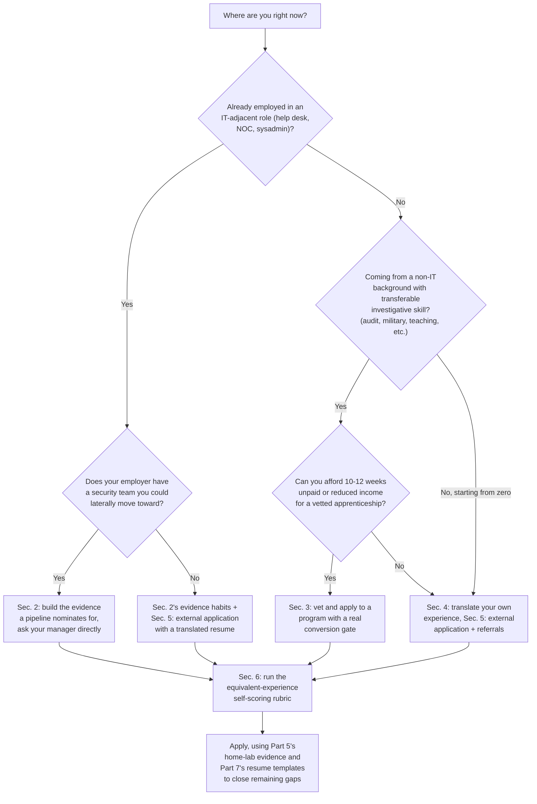

# Part 4 — Breaking Into the SOC: Routes In and How to Position Yourself for Each

## Why this part exists

**[CONCEPT]** A SOC hires through roughly four doors: an internal help-desk-to-SOC pipeline, a structured apprenticeship, a career-changer application from an adjacent field, or a straight external application against an open posting. SOC Manager's Operating Handbook, Part 7 — Hiring & Sourcing Analysts owns all four from the organization's side — why each channel exists, what it costs a SOC to run, and how a manager decides which one to point a given requisition at. This part answers the question from the other side of the same desk: given that these four doors exist and select for different things, which one should you actually walk through, and what do you personally need to build, say, and prove to be the candidate each door is built to find?

**[CONCEPT]** The four doors are not four versions of the same test with different difficulty settings. A help-desk pipeline is built to find someone who has already proven they can handle this organization's systems and its stressed-out users; an apprenticeship is built to find someone teachable with no track record yet; a career-changer application is built (when the posting is written well) to find transferable judgment wearing an unfamiliar vocabulary; a cold external application is built to find someone whose resume alone, with no internal advocate and no cohort structure behind it, clears a bar the posting states explicitly. Treating all four as "apply and hope" wastes the structural advantage two of them offer for free.

**[CONCEPT]** This part also covers the single mechanic that connects all four doors: the "or equivalent experience" clause. A well-written leveled job description states, per Part 7 §6, that a must-have requirement can be satisfied by an equivalent — military intelligence work, audit, help desk, teaching — instead of a matching job title. Whether that clause is written well or written as a throwaway line, translating your own background into the capability language it's actually testing for is a skill you build once and reuse at every stage of this book's spine, not just at the door.

> **Cross-Book Pointer**
> This part does not explain how a SOC decides which sourcing channel to fund, what a leveled job description template looks like from the writer's side, or how a certification-based ATS filter gets built (and why it backfires). See Part 7's full organizational mechanics behind every channel this part covers from the candidate's chair. Read §1, §3, §6, and §8 specifically before finishing this part — knowing what the sourcing side is optimizing for is what makes the positioning advice below land as a plan instead of a pep talk.

## 1. Four doors, one underlying test

**[CONCEPT]** Every one of the four channels is, underneath its packaging, checking the same thing a leveled job description's must-have section states directly: can you do the two or three things this specific tier actually requires, unsupervised, on day one or shortly after. SOC Manager's Operating Handbook, Part 10 — Competency Models & Skills Matrices frames that check as four axes — technical skill, tool proficiency, communication, judgment (Part 10 §3.1–3.4) — and a hiring manager writing a leveled posting is translating those same four axes into the must-have list you'll read as a candidate. That translation is how the organization evaluates; your job is what you do in response to it, and that response starts with reading a posting as an axis test rather than a wish list.

**[MINDSET]** The instinct that sinks most candidates at this stage is treating the posting's requirements as a checklist to match term-for-term rather than a set of capability claims to satisfy in your own words. A posting that asks for "two years of SOC analyst experience, or two years in a role requiring structured investigation under time pressure" is not asking whether your job title contained the word "analyst." It's asking whether you have evidence of structured investigation under time pressure — which a compliance investigator, a claims adjuster, or a systems administrator debugging production outages under an SLA clock can have in abundance, worded in a way that doesn't announce itself.

**[L1/L2]** The four doors differ mainly in how much of that translation work is already done for you before you walk in. A help-desk pipeline and a well-run apprenticeship do a large share of it — a mentor or a program curriculum already maps your prior work onto the tier you're entering. A career-changer application and a cold external submission leave the entire translation job on your desk, with no one checking your work before a hiring panel sees it. The rest of this part goes door by door, then gives you the translation method itself in §6 so it's available no matter which door you use.

> **Ground Truth**
> "Just apply to open SOC analyst postings and see what happens" is the default advice in most career-changer forums, and it's the weakest version of a real strategy because it skips the one variable that actually predicts an offer: whether anyone advocates for your resume before an ATS filter or a skimming recruiter ever reads it past the first ten seconds. Per Part 7 §3's `CASE-0701` — a composite built from recurring patterns across several mid-market SOC hiring processes, not one traceable organization — an L2 posting's automated filter rejected 71% of applicants before a human saw them. Even as an illustrative figure rather than a sourced benchmark, it names the real mechanism: cold external application means betting your candidacy on being in whatever share the filter doesn't discard, sight unseen. The other three doors exist specifically to put you in front of a human before that filter matters.

## 2. The help-desk-to-SOC pipeline: what it rewards

**[L1/L2]** SOC Manager's Operating Handbook, Part 7 §4 describes what a help-desk-to-SOC pipeline is built to select for from the organization's side: real ticketing discipline, a proven calm-under-pressure track record, and direct familiarity with the specific environment a SOC will be defending. A worked (composite) example there — CASE-0702 — runs an eight-week shadow track gated on 12 months of tenure and a clean escalation record, converting roughly 30% of nominated agents. That's how the organization decides who gets nominated and what the program teaches once you're in it. What you personally control is everything upstream of that nomination decision.

**[L1/L2]** Three things make you the candidate a pipeline like that actually nominates, and none of them require anyone to have told you the pipeline exists yet:

- **A tenure and performance record with no gaps you'd have to explain away.** The tenure gate cited above is real and enforced from the org's side specifically because it screens for reliability under a lighter-weight, lower-stakes version of exactly what a SOC needs. If you've been in a help-desk or NOC seat for eight months and you're already angling for a SOC move, the honest move is to spend the next four months building a visibly clean record rather than lobbying for an early exception — an exception you win by asking is a weaker credential than tenure you actually earned.
- **A documented habit of asking why, not just closing the ticket.** The single most common trait separating an agent a mentor analyst wants to shadow-train from one who gets politely declined is whether they ever escalate a "this printer driver conflict looks like it might be a credential-reuse problem" observation instead of just resolving the printer ticket. Start doing this on your current queue now, in writing, even if nobody asked you to — it is free evidence that costs you nothing but the two extra minutes of typing a note.
- **A visible, low-cost relationship with someone on the SOC team before you need anything from them.** A pipeline nomination usually starts with someone on the security team recognizing a name, not with a stranger's tenure spreadsheet. Ask a SOC analyst for 20 minutes to walk you through what a real alert investigation looks like, and actually follow up on what they tell you — this is the single cheapest thing in this part and the thing candidates skip most often out of a fear of "bothering" someone.

> **Career Trap**
> Waiting for a formal invitation into a help-desk-to-SOC pipeline that may not exist at your employer, on the theory that applying externally before being tapped would look impatient or presumptuous, costs you months for nothing in return. Most organizations don't have a named, documented pipeline (Part 7 §4's version is closer to an aspiration than the norm) — if yours doesn't, the fix isn't to wait quietly for one to appear. Ask your manager directly whether a lateral move to the security team is something they'd support, in writing if you can get it in an email rather than a hallway conversation, and treat a "not right now, but here's what I'd want to see first" answer as a real, usable roadmap rather than a rejection.

> **Analyst's Note**
> If there's no pipeline and no clear internal path, the fastest legitimate substitute is building the home-lab evidence in Part 5 while you're still in the help-desk seat and bringing a finished project to that manager conversation instead of a bare request. "I'd like to move to the SOC" is an ask. "I built a small home lab that ingests real Windows event logs and wrote three detections against it — here's what I learned, and here's why I think I'm ready to shadow the team" is evidence, and evidence is what actually moves a manager who's on the fence.

**[L1/L2]** If your employer genuinely has no security team to move laterally into, the help-desk-to-SOC channel still teaches you something worth taking to an external application: name the specific ticketing and escalation discipline you already have, in the language of Part 10's communication and judgment axes, rather than leaving it implicit in a job title a hiring panel has no reason to associate with security work. §6 below walks through exactly how.

## 3. The apprenticeship route: what it rewards

**[L1/L2]** A registered or structured apprenticeship, per Part 7 §5, is built to reach people with no existing employment relationship to a given SOC at all — career-changers, community-college and bootcamp graduates, veterans transitioning out of a related specialty. From the organization's side, a cohort program is a real financial and staffing commitment: a curriculum, a named program owner, mentor time, and a defined evaluation gate before conversion. Part 7 §5 puts an illustrative 10 to 12 weeks on that commitment — its own label for the figure is "not a specific published program," so treat it as a rough planning range to ask a real program against, not a benchmark every cohort will match. From your side as an applicant, the calculus is different and simpler: an apprenticeship is worth your time in proportion to how real its evaluation gate is, not how polished its marketing looks.

**[STUDY PLAN]** Vet a program before committing months to it, using three questions a good program answers without hesitation and a weak one dodges:

- **What is the actual conversion rate to a full analyst role, and can they show you a number rather than a testimonial?** A program that can't or won't state its conversion rate is telling you something about how much it actually tracks outcomes versus how much it's optimized for enrollment revenue.
- **Who owns the curriculum, and do they still work an active SOC queue or have they moved fully into training?** A curriculum designed and kept current by someone still doing the job ages far better than one written once by someone who left the operational role years ago.
- **What does the supervised live-work component actually look like — real tickets under mentor review, or simulated exercises only?** Part 7 §5 describes the credible version as graduated, supervised live-queue work in roughly the same shape as a help-desk shadow track; a program offering only canned lab exercises with no exposure to a real, messy queue is teaching you less than it's charging you to believe it is.

**[STUDY PLAN]** Cost matters too, and the honest range is wide. A registered apprenticeship built with a community college or workforce-development partner is often free or low-cost to the apprentice specifically because the fixed curriculum cost is shared across a cohort and subsidized by the sponsoring organizations (Part 7 §5). A private bootcamp charging several thousand dollars for a "SOC apprenticeship" with no employer sponsorship and no stated conversion rate is a different product wearing the same name — treat the price tag itself as a screening question, not a detail to worry about later.

> **Ground Truth**
> "Complete this apprenticeship and a SOC job is basically guaranteed" is common bootcamp marketing language and is true only for the subset of programs with a real employer partner and a documented conversion gate behind them. A program with no employer partnership is selling you training, not a pipeline — that's not automatically worthless, but it puts you back in the external-application pool in §5 once the coursework ends, and you should budget your time and money accordingly rather than assuming the certificate alone opens a door.

**[STUDY PLAN]** Whatever program you choose or build informally on your own time, the evaluation gate at the end almost always tests the same thing a real triage queue tests: can you reason through an ambiguous alert out loud and land on a defensible disposition under a time limit. Spend disproportionately more of the cohort's hours on the supervised live-queue component than on the classroom material you could learn equally well from a book — the classroom material is replaceable with self-study; the supervised reps against real, messy data are not.

## 4. The career-changer route: translating outside experience into capability language

**[CONCEPT]** A career-changer — someone moving in from military intelligence, internal audit, systems administration, retail loss prevention, teaching, or any other field with no obvious job-title overlap with "SOC analyst" — brings a genuinely relevant capability that almost never appears as a keyword a recruiter or an ATS is trained to look for (Part 7 §6). The organizational fix, from the hiring-manager side, is writing an "or equivalent experience" clause that states the equivalent concretely instead of leaving it as a vague afterthought. Most postings you'll actually encounter do this badly or not at all — which means the translation burden sits entirely on you, whether or not the employer did their part of the job.

**[INTERVIEW PREP]** The translation move itself has three steps, and it works the same way regardless of your specific background:

1. **Name the underlying activity, not the job title.** Strip away the industry-specific vocabulary and describe what you actually did in plain verbs: reviewed disparate records for inconsistency, reconstructed a sequence of events from incomplete data, made a time-pressured call about whether something warranted escalation, documented a finding someone else had to be able to act on without re-doing your work.
2. **Map the activity to one of Part 10's four axes.** Structured investigation under incomplete information maps to judgment. Producing a written finding someone downstream has to act on without your presence maps to communication. Learning a new system's normal behavior fast enough to spot deviations maps to technical skill or tool proficiency depending on how hands-on the system exposure was. This step is what turns "I have relevant experience" into a claim a hiring panel can actually evaluate against the same axes Part 10 §3 defines.
3. **Restate the activity in SOC-adjacent language without inventing security experience you don't have.** "I investigated discrepancies in access logs to determine whether a control had failed" is honest and specific. "I have hands-on security monitoring experience" when your actual work was an annual audit cycle is not honest, and an interviewer running Part 8's structured technical assessment will find the gap within the first two follow-up questions.

**[INTERVIEW PREP]** The table below works through five common non-traditional backgrounds using this method — a worked reference, not an exhaustive list, and not a substitute for doing the translation on your own specific history.

| Background | What the day job actually involved | Capability axis it maps to (Part 10 §3) | How to phrase it |
|---|---|---|---|
| Military intelligence analyst | Synthesizing fragmentary, multi-source reporting into a single assessment under a reporting deadline | Judgment; communication | "Synthesized reporting from multiple, often-conflicting sources into a single actionable assessment on a fixed reporting cycle" |
| Internal audit / compliance investigator | Reconstructing a sequence of transactions or access events to determine whether a control failed | Judgment; technical skill | "Reconstructed event sequences from disparate system logs to determine root cause of a control failure" |
| Systems administrator | Diagnosing why a system misbehaves by comparing current state against known-good baseline behavior | Technical skill; tool proficiency | "Diagnosed system anomalies by comparing live behavior against an established baseline, using native logging and monitoring tools" |
| Retail loss-prevention investigator | Correlating point-of-sale, camera, and inventory data to identify a specific pattern of loss | Judgment; technical skill | "Correlated data across multiple independent systems to identify and substantiate a specific pattern of anomalous activity" |
| Classroom teacher (30-student room, real time) | Sustained real-time monitoring of many simultaneous behavior streams, triaging which ones need intervention now versus later | Judgment; communication | "Maintained sustained situational awareness across many simultaneous activity streams, triaging which required immediate intervention" |

**[INTERVIEW PREP]** Notice that none of the phrasing in the right-hand column mentions cybersecurity — that's deliberate. The claim being made is the capability, not a fabricated security background, and a hiring panel reading Part 10's axes is checking for the capability, not the vocabulary. You add the security framing separately, in the sentence right after, where you explain what SOC-specific study or lab work (Part 5, Part 6) you've done to pair the transferable capability with the domain knowledge it's missing.

> **Career Autopsy — "translating everything into generic resume-speak"**
>
> **The decision (`CASE-0401`, COMPOSITE CASE EXAMPLE):** A former internal auditor moving toward a SOC analyst role rewrote her resume using a general career-services template, converting "reconstructed transaction sequences from general ledger and access-log discrepancies to identify unauthorized fund transfers" into "detail-oriented professional with strong analytical and communication skills."
>
> **Why it seemed reasonable:** The generic version read as more polished and more universally "employable," and a well-meaning career coach had told her specific industry jargon might confuse a security recruiter who wouldn't know what "general ledger reconciliation" meant.
>
> **How it failed:** The polished version described no activity at all — a recruiter skimming for the capability behind a posting's "structured investigation under time pressure" equivalent-experience clause had nothing concrete to match against "strong analytical skills," a phrase that appears on thousands of resumes with nothing behind it. Two months and zero callbacks later, she was still describing the same experience, just with all the load-bearing detail sanded off.
>
> **The fix:** She rewrote the bullet back toward the specific, concrete version — the actual data sources, the actual reasoning step, the actual outcome — and added one sentence translating it explicitly into judgment-and-technical-skill language a SOC hiring panel would recognize. Callback rate changed within the same week of resubmitting to postings she'd already applied to once.

> **Blind Spot**
> You cannot reliably judge, on your own, whether your translated bullet reads as a concrete capability claim or as the same generic buzzword soup the Career Autopsy above describes — everyone's own writing sounds specific to them because they know what it refers to. Get at least one translated bullet read cold by someone with no context on your actual job, and ask them to describe back, in their own words, what they think you did all day. If they can't, the bullet isn't doing its job yet, no matter how accurate it feels to you.

## 5. The external application: what it rewards, and why it's the hardest door alone

**[L1/L2]** A cold external application against an open posting is the only one of the four doors with no built-in human advocate and no cohort structure behind it — Part 7 §8's channel comparison lists job boards and inbound applications as carrying "highest exposure to the certification-keyword trap" for exactly this reason. That doesn't make it a bad channel; it's the highest-volume door, and Part 7 §1 gives 30 to 45 days as an illustrative fill time for a well-written L1 posting at a mid-market SOC — its own language is explicit that this is "illustrative... rather than a sourced industry benchmark," not a number to expect at every employer — against a genuinely large applicant pool. It does mean external application rewards a different set of behaviors than the other three doors, and treating it identically to them wastes effort.

**[L1/L2]** What actually moves the needle on a cold external application, in rough order of leverage:

- **A referral from anyone inside the organization, even a weak one.** A referral routes your resume past the automated filter entirely in most ATS configurations and gets it in front of a human on the first pass — this single move does more for your odds than another certification or another resume rewrite.
- **A resume that mirrors the posting's must-have capability language, honestly.** Part 7 §2.1 describes a well-written posting's must-have section as short and load-bearing, three items at most. If your resume's bullets don't visibly answer those specific three items in language close enough to be recognized by a skimming reader, you're relying on the reader to do translation work most skimming readers under time pressure won't do for a stranger.
- **A direct message to the hiring manager or a team member, when you can find one, that adds context an ATS can't see.** This is not a substitute for applying through the actual process — it's a supplement that raises the odds a human looks at your application at all, which matters most for exactly the kind of non-traditional background §4 covers, where the resume's keyword match is weakest even when the underlying capability is strong.
- **Applying to a genuinely leveled posting rather than a vague one.** A posting with a specific scope-of-work section and a short must-have list (Part 7 §2.1's `TMPL-0701` skeleton, filled in well) is telling you clearly what it's testing for; a posting that's obviously the previous year's copy with the title changed (Part 7 §2.2's title-inflation defect) is a worse bet for your effort regardless of how well you fit the role, because the panel behind it hasn't done the work to evaluate you against anything specific.

> **Ground Truth**
> "Just keep applying to enough postings and the numbers will work out" treats every application as an independent roll of the same dice, and it isn't — a cold external application with no referral and a resume that doesn't mirror the posting's actual must-have language has meaningfully worse odds than any of the other three doors, not marginally worse. If external application is your only available lever right now, spend more of your time getting one referral than submitting ten more blind applications; the referral changes which pile your resume lands in before anyone reads a word of it.

## 6. Decoding "or equivalent experience" in a real posting

**[INTERVIEW PREP]** The method in §4 works generically. This section makes it concrete against an actual posting in front of you, whichever door you're using. Before you decide whether you're qualified — or whether it's worth the effort of a referral, a translated resume, or an apprenticeship application — run your own experience against the posting's must-have list the way a self-audit, not a hope.

**[INTERVIEW PREP]** Score yourself against each must-have item using the equivalent-experience self-scoring rubric (`TMPL-0401`, filed in Appendix A1) below, one row per item in the actual posting. This is a self-check, not a guarantee a hiring panel will score you the same way — it exists to tell you honestly whether you're close enough that the translation work in §4 is worth doing, versus a genuine gap worth closing first with a home-lab project (Part 5) before you apply.

| Must-have item (from the posting, verbatim) | Do you have a direct match? | Do you have an equivalent activity, even under different vocabulary? | Can you name a specific example, not a general claim? | Score (0–2) |
|---|---|---|---|---|
| *(copy each must-have line from the actual posting into its own row)* | Yes / No | Yes / No | Yes / No | — |

**Scoring:** 2 points if you have a direct match with a specific example ready; 1 point if you have an equivalent activity you can name a specific example for; 0 points if you can only make a general, unsupported claim. Total your score across every must-have row and divide by twice the number of rows to get a rough coverage percentage.

**[INTERVIEW PREP]** Read the result as a decision aid, not a verdict:

- **Above roughly 75% coverage:** apply now, and spend your remaining prep time on the translation phrasing from §4 for whichever rows scored a 1, not on more certifications or more waiting.
- **Roughly 40–75% coverage:** apply if you have a referral or another advocate (§5), and treat the gap rows as your next home-lab priority (Part 5) regardless of outcome on this specific posting.
- **Below roughly 40% coverage:** this specific posting is very likely testing for a tier you haven't reached yet — that's useful information about which tier to target next, not a reason to inflate your resume to close the gap on paper instead of in fact.

> **Field Test**
> **Setup:** You've filled in the rubric above against a real posting you're considering applying to.
> **Action:** Hand the filled-in rubric — not the posting, the rubric with your own answers — to someone who knows your work history but has never worked in security, and ask them to guess, row by row, which of your answers you're most confident is a genuine equivalent versus a stretch.
> **Expected result:** They should be able to tell the difference on most rows just from how specific your example is. If they can't distinguish your solid rows from your stretch rows, the specificity problem from §4's Career Autopsy is still present in your self-scoring, not just your resume — fix the vague rows before you submit anything.

## 7. Choosing your own route: a self-assessment

**[MINDSET]** The four doors aren't mutually exclusive, and the strongest candidates usually run more than one at once — building home-lab evidence while working a help-desk seat, applying externally while also asking about an internal pipeline, treating an apprenticeship application as one lever among several rather than a single bet. The decision tree below is a starting orientation, not a rule that only one path is available to you at a time.

Mermaid source retained below as the editable source of truth per this book's diagram build process.

**Figure 4.1 — Choosing a route in, given your starting point.** *CONCEPTUAL.* Illustrates the self-assessment questions this part uses to route a reader toward the door (or combination of doors) most worth their next few months of effort; it is a structural starting orientation, not a claim that any individual reader's actual path will match one branch cleanly. Every path converges on the equivalent-experience self-scoring rubric in §6 before applying — no door skips that check. Diagram ID `FIG-0401`.

**[MINDSET]** Notice what the diagram does not decide for you: whether you'd rather spend the next few months building tenure and evidence toward an internal move, or accelerate through an apprenticeship, or go external immediately with what you already have. That's a genuine tradeoff between speed and control, and it's yours to make based on how much runway you actually have — financially, and in terms of how long you're willing to stay in your current seat.

> **Cross-Book Pointer**
> This part routes you toward a door; it does not cover what happens once you're being formally evaluated inside any of them — a structured interview loop, a practical triage exercise, a behavioral panel scored against a written rubric. See SOC Manager's Operating Handbook, Part 8 — Interviewing & Technical Assessment Design for how that evaluation is actually built from the panel's side, and see this book's own Part 8 — Interview Prep From the Candidate's Chair for how to prepare for it once you've chosen your door.

## 8. Building your own capability-translation statement

**[INTERVIEW PREP]** Close the loop from §4 and §6 by writing out, in full sentences, the specific translation statements you'll actually use in a resume bullet and in an interview answer — not a mental note, a written draft you can revise before you need it under pressure. The capability-translation statement worksheet (`TMPL-0402`, filed in Appendix A3) below gives you the structure; fill in a row for every distinct piece of non-traditional or non-obvious experience you plan to lean on.

| Field | What to write | Example |
|---|---|---|
| The actual activity | The specific thing you did, no job titles, no industry jargon | "Reviewed 200+ access-log entries weekly against a change-management record to flag unauthorized modifications" |
| The capability axis it evidences (Part 10 §3) | Which of technical skill, tool proficiency, communication, or judgment this activity actually demonstrates, and why | "Judgment — deciding which discrepancies warranted escalation versus routine correction, with no fixed rule covering every case" |
| The SOC-relevant framing, one sentence | How you'd say this out loud to an interviewer without overclaiming security experience you don't have | "That's the same underlying skill as triaging which alerts warrant escalation versus routine closure — I haven't done it against security telemetry specifically yet, which is why I built [home-lab project, Part 5]" |
| The gap you're pairing it with | The specific study or lab evidence (Part 5, Part 6) that closes the domain-knowledge gap this translation alone doesn't cover | "Built a small SIEM lab ingesting Windows event logs and wrote three detections to get hands-on exposure to the technical side this role needs" |

**[INTERVIEW PREP]** The main limitation of this worksheet: it produces a translation statement, not proof. A hiring panel running a real technical assessment (Part 8) will test whether the capability you've named actually generalizes to security-specific reasoning, not just whether you can describe it convincingly. Treat this worksheet as the resume-and-opening-answer layer, and treat Part 5's home-lab projects as the layer that gives an interviewer something concrete to probe once your translated statement gets you into the room.

> **What Would Change My Mind**
> This part treats a well-executed translation of non-traditional experience, backed by even modest home-lab evidence, as competitive against a traditional-background candidate for the same L1 or L2 req — based on the pattern in Part 7's CASE-0701, where three non-traditionally-credentialed candidates cleared a real technical bar once a filter stopped screening them out before anyone looked. If structured outcome data from a real hiring pipeline showed non-traditional candidates consistently underperforming traditionally-credentialed candidates on the actual technical assessment once both groups get past the resume stage, that would undercut this part's central bet — and the guidance here should shift from "translation plus a small lab project is enough" toward "translation gets you the interview; expect a materially larger lab and study investment to be competitive once you're in it."

## Where this goes next

**[CONCEPT]** Whichever door you use, you'll arrive at the same next two jobs this book covers in sequence: building the concrete, standalone evidence — home-lab projects and a certification chosen for what it actually signals rather than for its marketing — that Part 5 and Part 6 walk through, and turning that evidence into a resume and portfolio that survives a real screen in Part 7. The capability-language habit this part teaches doesn't stop mattering once you're hired, either — Part 11's judgment-gap work and Part 13's senior-analyst evidence-building both lean on the same skill: describing what you actually did in terms the person evaluating you is trained to recognize, rather than assuming they'll do the translation for you.

---

**Cross-references:** This part assumes SOC Manager's Operating Handbook, Part 3 — Tiering Models: L1/L2/L3 and Beyond (the tier definitions a leveled posting's must-have language encodes), Part 7 — Hiring & Sourcing Analysts (the organizational mechanics behind every channel covered here — §1, §3, §4, §5, §6, §7, and §8 specifically), and Part 10 — Competency Models & Skills Matrices (the four-axis framework, §3.1–3.4, this part's translation method maps non-traditional experience onto). Within this book, it assumes Part 1 — Why This Book Exists & the Analyst's Series Map and Part 2 — Reading the Machinery From Below, and it points forward to Part 5 — The Home-Lab Foundation, Part 6 — Certifications: What Actually Matters, and When, Part 7 — Building a Resume and Portfolio That Survives a Real Screen, and Part 8 — Interview Prep From the Candidate's Chair. It does not cite SOC Playbook Handbook or Detection Engineering Handbook V2 — breaking-in strategy has no technical-mechanics counterpart in either companion volume.
