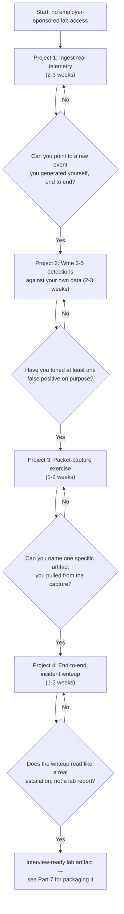

# Part 5 — The Home-Lab Foundation: What to Build Before Your First SOC Job

## Why this part exists

**[CONCEPT]** If you don't already work in a SOC, nobody is going to hand you a SIEM, a queue of real alerts, and a mentor to check your reasoning. Every other candidate applying for the same L1 seat has read the same three certification study guides you have. What almost none of them have is a raw event they generated themselves, watched land in a platform they configured themselves, and can still explain field by field six months later. That gap — not a missing certification, not a missing degree — is what a home lab closes, and it's the reason this part exists before Part 6's certification-sequencing table and before Part 7's resume advice: a lab you can talk about under follow-up questions is worth more interview-clearing weight than almost anything else you can build in the same three months, and it takes real, sequenced effort to get there instead of a weekend.

**[CONCEPT]** This part covers four specific builds, in a specific order: a small SIEM ingesting telemetry you actually generated, three to five detections you wrote and tuned yourself, a packet-capture exercise that ends with you naming a real artifact instead of reading someone else's answer key, and an incident writeup that ties the first three together into one document a stranger could act on. Each one is scoped tightly enough to attempt this month, on hardware you likely already own or a cloud VM costing less than a streaming subscription.

**[CONCEPT]** What this part does not do is tell you how a hiring panel will score what you build, or what an internal competency matrix expects once you're actually hired. Those are organizational mechanics that belong to a different desk.

> **Cross-Book Pointer**
> This part does not define the technical-skill or tool-proficiency axes a competency matrix eventually scores you against, or how a hiring panel designs the exercise that tests for them — that's organizational machinery, and it belongs to SOC Manager's Operating Handbook, Part 10 — Competency Models & Skills Matrices (§3.1 for technical skill, §3.2 for tool proficiency) and Part 8 — Interviewing & Technical Assessment Design. What this part owns is narrower and comes first chronologically: the actual home-lab work that generates real evidence toward those same two axes before anyone is formally scoring you against them. Read Part 10 §3.1–3.2 once, so you know what "good" eventually looks like on paper; then come back here for what you personally build between now and the day someone hands you that matrix.

Every home-lab project below is the kind of build a dedicated SOC Home Lab Handbook would eventually own in full step-by-step depth — exact configuration files, hardware benchmarks across a range of budgets, a maintained list of which vendor free tiers changed their limits this quarter. That book doesn't exist yet. Until it does, each project section below carries enough concrete detail to attempt stand-alone, flagged inline as `[HOME LAB — companion volume not yet written]` the first time it comes up, per this book's tracked-gap convention.

## 1. What a home lab actually needs to prove — and what it can't

**[CONCEPT]** A home lab's job is narrow: give an interviewer, or a future version of yourself, something concrete to ask a follow-up question about. "I built a SIEM lab" proves nothing on its own — plenty of candidates say that sentence after installing something once and never touching it again. "I ingested Sysmon telemetry from my own laptop, wrote a detection for encoded PowerShell, and had to tune it twice because my own backup script triggered it" proves you did the work, because a made-up answer doesn't usually include the part where your own backup script broke your rule.

> **Ground Truth**
> "Just build a home lab" is repeated everywhere a career-changer looks for advice, and it's mostly right — but the version of that advice that actually helps is narrower than the version usually given. A lab that ingests one canned sample dataset and runs five pre-written Sigma rules against it teaches you almost nothing about triage reasoning, because every hard part — deciding what's worth logging, watching a detection misfire against your own noise, explaining why an event means what you say it means — has already been solved by whoever built the sample dataset. The version of "build a home lab" that clears an interview is "generate your own telemetry, write your own detections against your own noise, and be able to explain every step," which is a smaller, harder, and far more defensible claim than the generic advice implies.

**[L1/L2]** The four projects in this part exist because they rehearse the same loop an L1 shift runs all day: something happens, it gets logged, a detection or a human notices it, someone investigates, someone writes it up so the next person doesn't have to start from zero. Project 1 builds the logging. Project 2 builds the noticing. Project 3 builds the investigating. Project 4 builds the writing up. Running that full loop once, on data you understand because you generated it, is worth more rehearsal value than reading ten walkthroughs of someone else's investigation.

> **Blind Spot**
> A solo home lab has no second reviewer. You can write a detection, convince yourself the logic is sound, and be wrong about an edge case for months, because nobody else ever looks at it. You can misread a packet capture and never find out, because there's no senior analyst standing over your shoulder saying "that's not what that field means." A lab you built entirely alone can prove you did the work; it cannot prove your reasoning was correct, only that it was internally consistent with itself. Get at least one project reviewed by someone who's triaged real alerts before you lean on it heavily in an interview — a working analyst willing to spend an hour, a study-group peer further along than you, even a paid hour with a mentor. Part 7 covers how to find that reviewer when you're building the portfolio version of this lab.

> **What Would Change My Mind**
> This part treats a sequenced, four-project solo lab as sufficient interview-ready evidence for an L1 or L2 candidacy, on the strength of the pattern this book draws from hiring-manager feedback in Parts 6 and 7. If structured data from a real hiring pipeline showed candidates with a solo, never-reviewed lab clearing technical interviews at a meaningfully lower rate than candidates whose otherwise-identical lab had been reviewed once by a working analyst, that would sharpen this part's claim from "build the lab" to "build the lab and budget for one outside review," and this section should be rewritten to make the review step mandatory rather than a recommended add-on.

## 2. Sequencing the four builds

**[STUDY PLAN]** Build these in order, not in parallel, because each one depends on the last one's output being real. Project 2's detections need Project 1's telemetry actually flowing before you can test them against real noise instead of a static sample. Project 3's packet capture is far more useful if it's traffic your own Project 1 sensor also saw, so you can cross-reference the same event two ways. Project 4 doesn't work at all until the first three exist, because it's the writeup that ties them together.

**Figure 5.1 — The sequenced home-lab build path, gated by a self-check at each step.** *CONCEPTUAL.* Illustrates the order this part recommends and the self-assessment gate between each project; the week counts are a starting budget, not a guarantee, and a reader working five hours a week outside a full-time job should expect the slower end of each range. Diagram ID `FIG-0501`.






The table below sequences the four projects against a realistic time budget and states which axis each one seeds evidence toward, so you can see why the order in Figure 5.1 isn't arbitrary (CONCEPTUAL SAMPLE — illustrative time budgets, not a validated benchmark).

| Project | Prerequisite | Time Budget | What It Proves | Where the Evidence Lands Later |
|---|---|---|---|---|
| 1. Real telemetry ingestion | None — start here | 2-3 weeks | You can stand up an ingestion pipeline and verify it carries live data, not a demo | Seeds the tool-proficiency axis SOC Manager's Operating Handbook, Part 10 §3.2 anchors at L1 |
| 2. Self-written detections | Project 1 live and generating events | 2-3 weeks | You can write, test, and tune a detection against real noise, not a curated dataset | Seeds the technical-skill axis, Part 10 §3.1; direct input to Part 15's branch portfolio |
| 3. Packet-capture exercise | Project 1's sensor placed inline, or a public PCAP substitute | 1-2 weeks | You can read raw traffic and name a specific artifact, not just summarize a dashboard | Continues in Part 10's L1 study plan and home-lab projects |
| 4. Incident writeup | Projects 1-3 completed at least once | 1-2 weeks | You can turn a detection into an escalation-quality writeup a stranger can act on | Portfolio material for Part 7; story-bank material for Part 8 |

## 3. Project 1 — A small SIEM ingesting real telemetry `[HOME LAB — companion volume not yet written]`

**[L1/L2]** The goal of Project 1 is narrow: get at least two real telemetry sources flowing into one platform you can query, and prove to yourself the events are real by tracing one back to an action you personally took. It does not need to be big, expensive, or production-grade.

### 3.1 Choosing a stack you can actually run on a home machine

**[L1/L2]** Three stacks cover almost every reasonable home-lab budget. Security Onion is the fastest path to a working sensor-plus-SIEM combination out of the box, because it bundles Suricata, Zeek, and an Elastic-based console into one installer — good if you want fewer moving parts to debug in week one. A self-assembled Elastic stack (Elasticsearch, Logstash or Elastic Agent, Kibana) takes longer to configure but teaches you more about how ingestion pipelines actually route and parse data, which pays off directly in Project 2. Splunk's free tier, capped at 500MB of ingest a day, is worth considering if a future employer already runs Splunk and you want the query-language fluency, though the daily cap forces you to be deliberate about what you log rather than ingesting everything by default.

**[L1/L2]** Hardware needs are modest: a repurposed laptop or an old desktop with 8GB of RAM and 4 CPU cores handles any of the three stacks for a single-analyst lab, and a $10-a-month cloud VM (a small instance from any major provider) is a reasonable substitute if you don't have spare hardware, as long as you shut it down between study sessions to control cost. Run the platform itself in a VM or a dedicated machine, separate from your daily-use computer, so a misconfigured firewall rule or an accidental exposed port doesn't put your own files at risk.

### 3.2 What "real telemetry" means, and why a sample dataset alone doesn't count

**[L1/L2]** Real telemetry means data generated by something you control, arriving through a pipeline you configured, not a dataset downloaded from a GitHub repository and loaded in bulk. Two sources are enough to start: install Sysmon and Winlogbeat on a Windows VM (or your own Windows machine, if you're comfortable pointing a beat agent at it) to capture process creation, network connection, and registry-modification events, and pull syslog from a home router or firewall that supports it — pfSense and OPNsense both export syslog natively, and even a consumer router's basic connection log is a usable second source if that's what you have. A Linux VM's auth log (`/var/log/auth.log` or the systemd journal, shipped via Filebeat or a similar agent) is a reasonable third source once the first two are stable.

**[L1/L2]** A downloaded sample dataset still has a place — it's useful later, in Project 2, for testing a detection against traffic patterns you can't safely generate yourself. It just doesn't substitute for the ingestion pipeline itself. Building the pipeline is the actual skill Project 1 exists to build; loading a pre-built dataset into someone else's finished pipeline skips the part of the exercise that teaches you anything.

### 3.3 Verifying the pipe is actually live

**[L1/L2]** Before moving to Project 2, confirm the pipeline is carrying real data end to end, not just that the installer finished without an error.

> **Field Test**
> **Setup:** Your SIEM or log platform is installed and at least one agent (Sysmon/Winlogbeat, a syslog export, or a Filebeat auth-log shipper) is configured to send to it.
> **Action:** Perform one specific, memorable action on the monitored host — log in with a specific username at a specific time, or run one command you'll remember. Then go into the platform and search for that exact event within five minutes of performing it.
> **Expected result:** You should find the exact event, with the exact timestamp and fields matching what you did, inside that five-minute window. If you can't find it, or the timestamp is hours off, or the fields don't match what you expect, the pipeline has a real problem — a parsing failure, a clock-sync issue, or a misconfigured agent — and it needs to be fixed before Project 2, because a detection written against a broken pipeline will look like it's working when it's actually matching against garbage.

## 4. Project 2 — Writing and tuning your own detections `[HOME LAB — companion volume not yet written]`

**[L1/L2]** Project 2's goal is to write three to five detections against your own Project 1 telemetry, test each one against both a true positive you deliberately trigger and a false positive your own normal activity generates, and tune at least one of them after it misfires. That last part — the tuning — is the piece most self-taught labs skip, and it's the piece that actually resembles the job.

### 4.1 Five detections worth writing first

**[STUDY PLAN]** Start with detections you can both trigger safely and explain in one sentence:

- Encoded or obfuscated PowerShell command line (`-EncodedCommand`, `-enc`, or a base64-looking argument) — trigger it yourself with a benign encoded command, then check whether your normal admin scripts also produce false positives.
- A non-standard process opening a handle to LSASS memory — a classic credential-dumping indicator; Sysmon Event ID 10 with the target image set to `lsass.exe` is the field to key on.
- A spike in failed authentication attempts against SSH or RDP from a single source in a short window — a basic brute-force detection, and a good one to test against your own mistyped password to confirm the threshold isn't so low it fires on you.
- An outbound connection from an endpoint to a newly observed external IP or domain it has never contacted before — a baseline-deviation detection, harder to build well, and a reasonable stretch goal once the first three work.
- A scheduled task or registry run-key created outside your normal software-install window — a simple persistence-mechanism detection.

**[L1/L2]** Write each detection as a query against your own platform's data, not as a copy of someone else's Sigma rule pasted in unmodified. You can read public detection logic for the idea; translating it into a query that actually matches your own field names and your own noise is the part that teaches you something.

### 4.2 Tracking your own false-positive rate on purpose

**[STUDY PLAN]** After each detection fires for the first time, deliberately do something legitimate that could plausibly trigger it, and see whether it does. If your encoded-PowerShell rule also fires on a legitimate backup script that happens to use base64 encoding, that's not a failure — that's the exercise working. Write down what triggered the false positive, what field or threshold you changed, and what you checked afterward to confirm the true positive still fired after the tuning change. Two or three logged tuning passes, each with a before-and-after note, is a far stronger interview answer than five detections that have never once misfired, because five detections that have never misfired against your own real usage almost certainly haven't been tested against enough real activity to mean anything yet.

If you want your detections managed with the same version-controlled, reviewed discipline a real detection-engineering team uses — even solo, using your own git repository and a self-review habit before merging a change — Detection Engineering Handbook V2, Part 22 — Detection as Code covers the branching, review-gate, and metadata mechanics a production pipeline runs on; adapting a lightweight version of that discipline to a one-person lab is optional here but pays off directly if Part 15's detection-engineer branch turns out to be your target.

> **Career Trap**
> Copying a public Sigma or YARA rule into your lab, confirming it fires against a sample malware sample, and calling that "a detection I wrote" is a common shortcut, and it collapses the first time an interviewer asks why the rule uses the specific field or threshold it does. You won't have an answer, because you didn't make that decision — whoever wrote the original rule did. The fix: read public rules for ideas, but write the actual query yourself against your own schema, and be ready to explain every line, including the ones you'd change if you saw a specific false positive.

## 5. Project 3 — A packet-capture exercise `[HOME LAB — companion volume not yet written]`

**[L1/L2]** Project 3's goal is a single rep of reading raw traffic and pulling out one concrete, nameable artifact — a filename, a beacon interval, a credential, a suspicious domain — rather than skimming a capture and reporting a vague impression.

### 5.1 Generating traffic worth analyzing

**[L1/L2]** Two paths work, and neither requires exposing yourself to real malware risk. The safer, more controlled path is to generate traffic against your own lab: run an Nmap scan from one lab VM against another and capture it with `tcpdump` or Wireshark on the target, or run a handful of Atomic Red Team techniques (many ship as simple PowerShell or shell one-liners) against a disposable VM and capture the resulting network activity. The second path, useful if you'd rather not run anything adversary-shaped even in a sandboxed VM, is analyzing a public, purpose-built capture from a source like malware-traffic-analysis.net, which publishes real (defanged) malware traffic captures specifically for training use, complete with a write-up you should read only after attempting your own analysis first.

### 5.2 What to actually look for

**[L1/L2]** Open the capture in Wireshark and work through a short, repeatable checklist rather than scrolling randomly: check the DNS queries for volume or entropy anomalies (a domain generating hundreds of near-identical subdomain lookups is a common command-and-control pattern); check for a regular time interval between connections to the same destination, which suggests a beacon rather than human-driven browsing; check HTTP streams for a User-Agent that doesn't match any browser you'd expect on that host; and check for cleartext credentials or a suspicious file transfer inside a stream that should have been encrypted. Use Wireshark's "Follow TCP Stream" feature to actually read the reconstructed conversation, not just the packet list — the conversation is usually where the real artifact is.

> **Field Test**
> **Setup:** You have one packet capture, either self-generated against your own lab or a public training capture, that you have not yet analyzed.
> **Action:** Set a 20-minute timer. Within that window, identify and write down one specific artifact from the capture — a file transferred, a beacon interval in seconds, a credential in cleartext, or a domain you'd flag as suspicious and why.
> **Expected result:** You should be able to name the artifact, the exact packet or stream it came from, and one sentence of reasoning for why it matters — not a vague "there's some weird traffic in here." If 20 minutes isn't enough to find anything concrete, that's a real signal that this specific skill needs more reps before an interview, not a sign the capture was too hard; a live triage exercise runs on a similar clock, and there's no partial credit for "I would have found it eventually."

## 6. Project 4 — The incident writeup `[HOME LAB — companion volume not yet written]`

**[L1/L2]** Project 4 ties the first three projects into one artifact: a single simulated incident, detected by your own Project 2 rule, investigated using techniques from Project 3, and documented the way a real escalation would be — not as a lab report written for a grader, but as a handoff written for a Tier 2 analyst who has never seen your environment before.

### 6.1 Running one simulated incident end to end

**[L1/L2]** Pick one scenario you can run safely against your own lab — a scripted brute-force attempt against a lab-only SSH or RDP service, or a benign Atomic Red Team technique like a scheduled-task persistence mechanism — and run it without telling yourself in advance exactly what you'll see. Let your Project 1 SIEM catch it through your Project 2 detection. Pull a packet capture of the same activity if it generated network traffic, using the same technique from Project 3. Then investigate it the way you'd investigate a real ticket: what fired, what else you'd want to check before deciding severity, and what you'd do next.

### 6.2 Writing it up like a real escalation, not a lab report

**[INTERVIEW PREP]** Don't invent your own writeup format. Mirror the structure a real escalation actually needs, because the writeup is more convincing to an interviewer, and more useful to you later, if it reads like the real thing rather than a school assignment.

> **Cross-Book Pointer**
> This part does not define what a mechanically good escalation contains, field by field — that standard already exists in SOC Playbook Handbook, Part 27 — Escalation Quality, which specifies the fields and framing a Tier 2 analyst needs to pick up a case cold. Build your Project 4 writeup against that same structure instead of improvising your own, so the artifact you bring to an interview already looks like the real thing an interviewer is calibrated to expect. SOC Playbook Handbook, Part 29 — Playbook Severity Model is worth a second look too: state an explicit severity call for your simulated incident and be ready to defend it, the same way a real escalation has to.

**[INTERVIEW PREP]** Once written, this document does two jobs later in this book that Part 5 doesn't cover itself: Part 7 shows you how to package it into a portfolio piece a resume can point to, and Part 8 shows you how to turn it into story-bank material for a behavioral interview question about a time you investigated something ambiguous. Neither part needs you to have already read them — just keep the writeup somewhere you can find it again, dated, with the raw evidence (the query, the capture, the screenshot of the alert firing) attached, not just the prose summary.

## 7. Keeping the lab alive: turning four projects into portfolio evidence

**[MINDSET]** None of the first six sections matter if the lab gets built once, screenshotted, and never touched again. A detection you wrote eight months ago and haven't looked at since doesn't prove ongoing judgment — it proves you could do the exercise once, under no time pressure, with nobody asking you a follow-up question yet.

> **Career Autopsy — "build it once, screenshot it, call it done"**
>
> **The decision (`CASE-0501`, COMPOSITE CASE EXAMPLE):** A career-changer spends three weekends building a Security Onion lab, loads a public sample dataset, confirms five downloaded Sigma rules fire against it, takes four screenshots for a portfolio slide, and doesn't open the lab again for the five months leading up to their first real interview.
>
> **Why it seemed reasonable:** The lab existed, it looked complete in screenshots, and the candidate had genuinely learned something during the three weekends of building it — the mistake was believing that a completed artifact stays true forever, the same way a finished essay does, rather than treating it as a skill that decays without use.
>
> **How it failed:** The interviewer asked a specific, ordinary follow-up question — "walk me through what would happen if this rule's threshold were half what it is" — and the candidate had no answer, because the rule was never theirs to begin with and five months of not touching it had erased even the surface-level familiarity from the original build. The interview notes recorded "cannot reason about own stated project," which reads far worse to a hiring panel than "junior, but growing," because it suggests the portfolio slide overstated what actually happened.
>
> **The fix:** Rebuild the lab following the sequence in this part — generate your own telemetry, write your own detections, tune at least one against a real false positive — and keep at least one project actively changing at all times, even something as small as adding one new detection a month, so there's always a recent, real answer to "what have you changed about this lab in the last 90 days."

> **Analyst's Note**
> Keep a one-line, dated changelog next to your lab — "changed LSASS-access rule's process allowlist after my own EDR agent update false-positived it, 2026-03-14" is a fine entry. Six months from now, that file is a better interview-prep resource than the lab itself, because it's a record of real changes with real reasoning attached, not a reconstruction you're trying to remember under pressure in the room.

## 8. A build-readiness self-audit

**[STUDY PLAN]** Use the worksheet below before you claim any of the four projects as interview-ready, and score yourself the way an interviewer's follow-up question would — not the way you'd like to remember the project going.

```text
TEMPLATE — Home-lab build-readiness self-audit, permanent ID TMPL-0501

Score each item honestly before an interviewer scores it for you.

Project 1 — Real telemetry ingestion
  [ ] I can show a raw event I generated myself, landing in the platform within the last 90 days.
  [ ] I can explain every field in that event without looking it up.
  <!-- name the specific telemetry source and what it captures, not just "logs" -->

Project 2 — Self-written detections
  [ ] I can name the exact technique or behavior each detection targets.
  [ ] I have at least one documented false positive I tuned on purpose, with a before/after note.
  <!-- name the false-positive scenario and the exact field or threshold you changed -->

Project 3 — Packet-capture exercise
  [ ] I can point to one specific artifact I extracted (a file, a beacon interval, a credential).
  [ ] I can explain why that artifact matters without re-reading my own notes first.

Project 4 — Incident writeup
  [ ] My writeup states an explicit severity call and defends it.
  [ ] A stranger could act on my writeup without needing to ask me a clarifying question.
  [ ] Last meaningfully updated: __________ — if this is older than 90 days, treat the project as
      stale and revisit it before relying on it in an interview (see §7).
```

This worksheet checks whether the evidence exists and is recent; it doesn't check whether your underlying reasoning was correct, which is exactly the gap the Blind Spot callout in §1 names — pair this self-audit with at least one outside review before treating a clean scorecard as proof the lab is interview-ready.

## Cross-references

This part assumes Part 1's series map and Part 4's breaking-in framework as context for who's reading it and why. It hands off directly to Part 6 — Certifications: What Actually Matters, and When, Part 7 — Building a Resume and Portfolio That Survives a Real Screen, and Part 8 — Interview Prep From the Candidate's Chair, all of which consume the artifacts this part builds. Part 10 — The L1 Study Plan and Home-Lab Projects continues this same thread once you're actually on the job. Outside this book, it cites SOC Manager's Operating Handbook, Part 10 — Competency Models & Skills Matrices (§3.1–3.2) for the technical-skill and tool-proficiency axes these projects seed evidence toward, without re-deriving how that matrix is scored; SOC Playbook Handbook, Part 27 — Escalation Quality and Part 29 — Playbook Severity Model for the writeup structure Project 4 mirrors; and Detection Engineering Handbook V2, Part 22 — Detection as Code for the optional version-controlled discipline behind Project 2. Every home-lab project in this part is flagged `[HOME LAB — companion volume not yet written]` and tracked toward the planned SOC Home Lab Handbook per Appendix A7.
