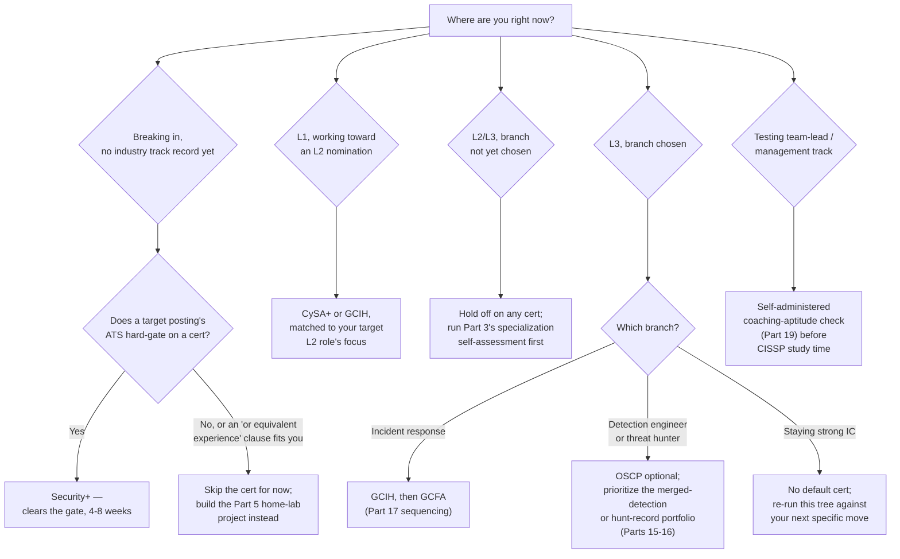

# Part 6 — Certifications: What Actually Matters, and When

## Why this part exists

**[CONCEPT]** SOC Manager's Operating Handbook, Part 7 — Hiring & Sourcing Analysts (§3) and Part 12 — Ongoing Training & Skill Development already cover certifications from the organization's side of the desk: how an applicant-tracking filter built around certification keywords screens out capable candidates before a human ever reads their resume, and how a manager decides whether an existing analyst's certification request is worth funding out of a training budget. Both are real questions, and both belong to that book, not this one — this part does not re-derive the mechanics of either an ATS filter or a training-budget approval process. What it owns instead is narrower and entirely yours: given what those mechanics actually do to a resume or a funding request, which certification is worth *your* study hours and *your* exam fee, at *your* specific career stage, for *your* specific next move.

**[CONCEPT]** Five certifications get named specifically because they cover the ground most SOC careers actually cross: CompTIA Security+, CompTIA CySA+, GIAC GCIH, Offensive Security's OSCP, and GIAC GCFA. Others exist and get a fair mention where they matter, but these five map cleanly onto the L1 → L2 → L3 → branch spine this book follows, and treating them as a single sequencing problem — not five separate "should I get this" questions — is the whole point of this part.

## 1. Three different jobs a certification can do for you

**[CONCEPT]** Every certification decision this part covers reduces to the same question, asked three different ways depending on who's evaluating you and what they already know. A certification can clear an automated keyword filter that has no way to read your actual experience. It can hand a human recruiter or panelist, who has nothing else to go on, a baseline claim that you know a shared vocabulary. Or it can validate, to someone who already trusts the exam format, that you can actually perform a specific task under real conditions. Most bad certification decisions come from picking the credential that does one of these three jobs well while assuming it does all three.

**[CONCEPT]** A multiple-choice exam is structurally suited to the first two jobs and weak at the third — memorizing enough vocabulary to recognize a right answer among four options says almost nothing about whether you can disposition an ambiguous alert under time pressure. A proctored, live practical exam that requires you to actually compromise a host, write a working detection, or reconstruct a forensic timeline is suited to the third job specifically, and mostly wasted on the first two, because nobody screening an entry-level resume needs a $1,600 exam fee to tell them you can follow instructions. Knowing which job you actually need done, before you pay for the exam, is the entire discipline this part teaches.

> **Ground Truth**
> Certification marketing sells all five exams named in this part as if they measure the same thing on an ascending scale — Security+ for beginners, working up to OSCP for the serious professional. They don't measure the same thing at all. Security+ tests recognition of shared vocabulary; OSCP tests live, timed performance against a real target. Treating them as points on one ladder instead of tools built for different jobs is why a candidate can hold three certifications and still freeze on a hands-on exercise that has nothing to do with any of them.

## 2. The five certifications, read from your side of the desk

**[L1/L2]** **CompTIA Security+** is a multiple-choice exam covering vendor-neutral security fundamentals — networking basics, common attack types, access control concepts, a bit of cryptography vocabulary. It validates almost no hands-on skill; it validates that you know what the words mean. That's a genuinely useful thing to prove when you have zero other track record, and a close-to-worthless thing to prove once you have six months of real triage on your resume. Typical study time runs 40 to 80 hours for someone with no prior IT background, less for someone coming from an adjacent role. Cost runs roughly $400, and it renews every three years — a renewal cost worth noting now, because a certification you stop needing the moment you clear the stage it was built for is still billing you every three years unless you let it lapse deliberately.

**[L1/L2]** **CompTIA CySA+** sits one step up: still primarily multiple choice, with some scenario-based and performance-based items layered in, covering log analysis, threat-detection concepts, and basic incident-response workflow at a level closer to what an L1 analyst working toward an L2 nomination actually does day to day. It's a reasonable second step after Security+ if your target role's postings name it, and a skippable one if they don't — the marginal vocabulary it adds over Security+ plus a real six months of triage experience is thin. Study time runs 60 to 100 hours; cost runs roughly $440 to $480, renewing every three years.

**[L1/L2]** **GIAC GCIH** (Certified Incident Handler) is a proctored, scenario-based multiple-choice exam built around a structured incident-handling framework — preparation, identification, containment, eradication, recovery, lessons learned. It doesn't require you to actually handle a live incident under exam conditions, but the scenarios are specific enough that memorization alone struggles; you need to have internalized the framework, not just the term for each phase. This is the certification that pays off most cleanly for someone who has already been doing real triage for a while and wants a structured vocabulary for what they've been doing by instinct — a better fit for an L1 analyst six to twelve months from an L2 nomination, or an L2 analyst eyeing the incident-response branch, than for someone with zero hands-on hours yet. Study time (including the associated training course most candidates take) runs 80 to 120 hours; cost runs roughly $2,500 including training, renewing every four years.

**[SENIOR/SPECIALIST]** **Offensive Security's OSCP** is a live, proctored practical exam: you're handed a network of real machines and a fixed window to compromise them, write up what you did, and prove it worked. There is no multiple-choice fallback. This is the certification in this part's list with the highest hands-on validity by a wide margin, and it is also the easiest one to misapply — it validates offensive-technique fluency, not SOC triage judgment, and a candidate who holds it with zero defensive experience can still struggle on a log-triage exercise that has nothing to do with exploitation. Its real value to a SOC career shows up at the branch point: an L3 analyst cross-training toward threat hunting or detection engineering gets genuine, demonstrable benefit from understanding an attack chain from the compromise side, because that's exactly the reasoning a hunter runs backward. Study time is substantial — most candidates budget 150 to 250 hours across a 90-day lab window before attempting the exam. Cost runs roughly $1,600 for the exam and lab bundle, with no renewal requirement.

**[SENIOR/SPECIALIST]** **GIAC GCFA** (Certified Forensic Analyst) is, like GCIH, a proctored scenario-based multiple-choice exam, this time built around forensic methodology — artifact analysis, timeline reconstruction, evidence handling. It grounds the *framework* for forensic reasoning without requiring you to run a live forensic investigation under exam conditions, which makes it a genuinely useful step before a hands-on forensic rotation, not a substitute for one. It belongs later in a sequence than GCIH for almost every reader, because the incident-handling framework GCIH teaches is the container the forensic methodology GCFA teaches actually sits inside. Study time runs 100 to 150 hours; cost runs roughly $2,500 including training, renewing every four years.

> **Cross-Book Pointer**
> This part covers what these five certifications mean for your own study time and sequencing. It does not re-derive the full certification scorecard a manager uses to decide whether to fund one of your training requests out of a budget line, including certifications outside this part's five (BTL1/BTL2, CISSP, cloud-vendor security specialties). See SOC Manager's Operating Handbook, Part 12 — Ongoing Training & Skill Development (§2.2) for that scorecard, built around exam format and hands-on validity, from the manager's side of the funding decision. Read it to understand how a request you submit will actually get evaluated, then come back here for what to submit and when.

## 3. Reading a job posting's certification line for what it actually is

**[L1/L2]** Before spending a study season on any certification because a job posting lists it, find out whether that posting is testing for it or filtering on it — the two produce very different postings and reward very different responses. SOC Manager's Operating Handbook, Part 7 (§3) walks this exact failure mode from the organizational side, through a composite case built from patterns across several mid-market hiring processes rather than one traceable employer: an applicant-tracking system configured to auto-reject any resume lacking two of three named certifications, plus a job-title keyword match, auto-rejected 71% of submitted applications before a recruiter ever read one — a realistic proportion for this kind of filter, not a measured industry benchmark — and several of the auto-rejected candidates would have cleared the actual technical bar had anyone interviewed them. That filter existed on the employer's side of the desk. Your job is recognizing when you're looking at one from the outside, because the study plan that gets you past a keyword filter is not the same study plan that builds real capability.

**[L1/L2]** Three signals tell you a certification line is a filter rather than a genuine capability requirement: the posting names two or three interchangeable certifications joined by "or" rather than one specific credential tied to a specific tool or method the role actually uses; the certification sits in a "required" or "must-have" section next to a long list of other loosely related requirements rather than a short, load-bearing list; and the posting is for an L1 or early-L2 role, where a candidate has little other track record for a filter to check against in the first place. A posting for a senior detection-engineering role that names a specific, narrow requirement tied to a technique the team actually uses is a different animal — that one is closer to a genuine capability check, however imperfectly a certification proxies for it.

> **Analyst's Note**
> When a posting's required-certifications section reads like a shopping list — three unrelated credentials, a vendor tool cert, a project-management credential that has nothing to do with triage — that's not a technical bar, it's a first-pass filter someone built once and never revisited. Apply anyway if your actual capability matches the role, and lead your cover note or resume summary with the concrete work you've done, not an apology for the certification you don't hold. A filter built around keywords can be beaten by a resume built around capability language, which Part 7 of this book covers in full.

> **Field Test**
> **Setup:** You've found five job postings at or near your current target level.
> **Action:** For each one, sort every listed requirement into "capability stated specifically" (a tool, a technique, a decision authority) versus "certification or credential named with no specific capability attached." Count each column.
> **Expected result:** If certifications-with-no-attached-capability outnumber specific capability statements across most of the five, you're looking at a market segment that filters on credentials more than it evaluates skill — a real, if unfortunate, signal about where to spend study time versus where to spend home-lab time, not a reason to assume the underlying jobs don't require real skill once you're actually in the room.

## 4. Certification value by career stage: the sequencing table

**[STUDY PLAN]** The table below sequences which certification — if any — is worth the study time and exam fee at each stage this book's spine covers, and what to spend that same time on instead once you already have the evidence the certification would otherwise supply.

| Career stage / your actual next move | Certification(s) worth considering | What it actually proves at this stage | What it's mostly a filter for | Typical study-time budget | Better use of the same hours if you already have this stage's evidence |
|---|---|---|---|---|---|
| Breaking in, zero industry track record | Security+ | Baseline vocabulary — you know what a CVE, a firewall rule, and an escalation path actually are | ATS/recruiter keyword gate at the L1 stage (SOC Manager's Handbook Part 7 §3) | 40–80 hrs over 4–8 weeks | — (this is the stage where the exam fee genuinely earns its keep) |
| Breaking in, adjacent experience (help desk, audit, military, teaching) | Security+ only if a target posting hard-gates on it | Same vocabulary claim, but you likely have a stronger, more specific proof point already in your work history | Same ATS gate, unless the posting carries an "or equivalent experience" clause | 40–80 hrs, or zero if you route around the gate | Part 5's home-lab foundation project plus Part 7's capability-language resume rewrite (both this book) |
| L1, working toward an L2 nomination | CySA+, or GCIH if the target L2 role leans incident-handling | Structured triage or incident-handling vocabulary | Weak — rarely gates an internal nomination | 60–120 hrs over 8–12 weeks | Part 11's ambiguous-call reasoning log — the actual evidence an L2 nomination reads (SOC Manager's Handbook Part 13 §4.2) |
| L2/L3, branch not yet chosen | None yet | Nothing — you don't know which specialist vocabulary you'll need | No relevance at this stage | 0 hrs | Part 3's specialization decision framework (this book) |
| L3, incident-response branch | GCIH, then GCFA | Structured incident-handling, then forensic-methodology frameworks, in that order | Occasionally named as a stated requirement in MSSP client contracts | GCIH 80–120 hrs; GCFA 100–150 hrs | Part 17's DFIR home-lab project (this book), run in parallel rather than instead of |
| L3, detection-engineer or threat-hunter branch | OSCP, optional | Live, proctored offensive-technique fluency — seeing an attack chain end to end from the compromise side | Rarely a filter; a differentiator, not a gate | 150–250 hrs over a 90-day lab window | A merged, tracked detection-as-code portfolio (Part 15, this book) — usually the stronger and cheaper signal for this specific branch |
| Testing team-lead or management track | CISSP, self-funded, timed to precede the transition | Governance and risk-framework breadth a technical portfolio doesn't demonstrate | Occasionally named in senior/lead postings; weak filter below that level | 100–150 hrs over 3–4 months | Part 19's self-administered coaching-aptitude check (this book) — worth running before, not after, a study season |

**[STUDY PLAN]** Two patterns in that table are worth naming directly. First, the certification with the best return on study time is almost always the one attached to the stage you're currently *at*, not the one attached to the stage you're hoping to reach next — a GCFA studied a year before you've handled a single real forensic artifact fades from memory long before you get to use it. Second, every row past the breaking-in stage has an entry in the last column, and that column is doing the real work of this part: for most readers past their first certification, a home-lab project or a documented piece of real work is a stronger, cheaper signal than the next credential in line.

**[STUDY PLAN]** Figure 6.1 turns that same table into a routing decision you can run against your own situation in under a minute — which branch you land on determines whether you open a study guide or a hypervisor next.

Mermaid source retained below as the editable source of truth per this book's diagram build process.





**Figure 6.1 — Which certification, if any, right now: a routing decision tree by career stage.** *CONCEPTUAL.* Illustrates the routing logic Sections 2 through 7 build toward — a structural aid for your own next study decision, not a capture of any individual's actual certification history. Every "breaking in" path and every branch-specific path ultimately converges on the same question this part asks throughout: does the credential prove something a cheaper home-lab project or work sample can't prove just as well. Diagram ID `FIG-0601`.

## 5. A self-scoring rubric: should you sit this exam now?

**[STUDY PLAN]** Use the worksheet below before committing study time or an exam fee to any of the five certifications, or to a certification outside this part's list that a specific job posting names. It doesn't replace the sequencing table in Section 4 — it checks whether your specific situation, not just your career stage in the abstract, actually supports the exam right now.

```text
TEMPLATE — Should-I-sit-this-exam-now self-scoring rubric, permanent ID TMPL-0601

Score each statement 0 (not true), 1 (partly true), or 2 (true) as it applies to
your situation right now, for the specific certification you're considering:

1. I currently hold zero industry-recognized certification, and the roles I'm
   applying to have no other way to evaluate me before a screen.
   <!-- name the specific roles you checked, not a general sense of the market -->
   Score: ___

2. The job postings I'm actually targeting name this certification (or a close
   substitute) as a stated requirement, not just a "nice to have."
   Score: ___

3. This certification's exam format requires me to actually perform the task
   under proctored or timed conditions, not just recognize a correct answer
   among a set of options.
   Score: ___

4. I have already tried the free or low-cost way to build the same evidence —
   a home-lab project, an open-source contribution, a completed CTF room — and
   it wasn't enough on its own for my target roles.
   <!-- name what you tried, not just that you considered trying something -->
   Score: ___

5. This certification's strongest external market value points toward the
   specific next role I actually want, not a different role I'd have to
   explain my way out of later.
   Score: ___

6. I have a concrete study plan: a specific number of hours per week, a start
   date, and an exam date — not an open-ended "I'll get to it."
   Score: ___

TOTAL: ___ / 12

10-12: Sit the exam now — your situation matches what this certification is
  actually built to prove.
6-9: Not yet. Find your lowest-scoring item and close that specific gap first
  (usually item 4 or 5) before spending the fee.
0-5: Skip this certification for now. Redirect the study hours toward the
  home-lab or portfolio work Section 6 covers instead.
```

**[MINDSET]** This rubric can't tell you whether a specific employer's ATS or panel actually filters on the certification you're scoring — it only checks whether your own reasoning for pursuing it holds up under a structured question set instead of a vague sense that "it can't hurt." A high score built on an assumption about how a specific employer screens, rather than something you've actually verified against a real posting, is still a guess — just a more disciplined one.

## 6. The home-lab alternative: when a lab beats a cert for the same hour

**[SENIOR/SPECIALIST]** Every row in Section 4's sequencing table past the breaking-in stage points toward a home-lab or portfolio alternative, and that's a deliberate pattern, not padding. A certification proves you can pass an exam built by someone else, on someone else's schedule, testing someone else's idea of what matters. A home-lab project proves you built something, debugged it when it broke, and can talk about the specific decisions you made — which is closer to what an interviewer or a promotion committee actually wants to see once you have any real track record to show them at all. Part 5 — The Home-Lab Foundation (this book) covers the sequenced builds that matter before your first SOC job; the projects referenced from this part assume you've read that groundwork already.

**[STUDY PLAN]** For a reader specifically weighing OSCP against the offensive-technique fluency it's meant to prove, there's a cheaper and more defensible first step than the $1,600 exam-and-lab bundle: build the same fluency yourself, on infrastructure you control, before deciding whether the certification is worth adding on top of it.

**[HOME LAB — companion volume not yet written]** Build two or three deliberately vulnerable virtual machines on your own hypervisor — VirtualBox, VMware Workstation Player, or a free-tier cloud VM, whichever you already have — rather than relying only on a subscription platform's pre-built rooms. Isolate them on a host-only or NAT network with no route to your real home network. Pick or build machines with a documented, layered vulnerability chain: an exposed service with a known CVE for initial access, a misconfigured permission or credential for lateral movement, and a privilege-escalation path (a writable service binary, a scheduled task running as a higher-privileged user, a cached credential) for the final step. Work the full chain from enumeration to root without a walkthrough, timing yourself the way the OSCP exam will. Then — and this is the step a pure offensive-training platform doesn't push you toward — go back through the same machine from the defender's side: for each step in your own attack chain, name what log source or telemetry would have caught it, and what a detection rule for that specific step would need to look for. That second pass is the part that makes this project worth more to a SOC analyst than to an aspiring pentester, and it's also free evidence you can describe concretely in an interview whether or not you ever sit the OSCP exam. A dedicated SOC Home Lab Handbook would eventually own the detailed build steps — network topology options, snapshot and reset discipline across repeated attempts, specific vulnerable-VM sources to pull from — but the project above has enough detail to start this week.

> **Blind Spot**
> Running this lab project convinces you that you can execute a known attack chain end to end. It doesn't tell you whether you can recognize a *novel* one you haven't already read the vulnerability write-up for — that's a different, harder skill, and neither this lab nor the OSCP exam itself fully tests it. Treat a completed chain as evidence you understand the mechanics, not evidence you'd catch something you'd never seen described before.

## 7. Certifications and the branch point

**[SENIOR/SPECIALIST]** The sequencing table's IR row states GCIH before GCFA without much explanation; the reasoning is structural, not arbitrary. GCIH's framework — preparation through lessons-learned — is the container the whole incident lives inside, and GCFA's forensic methodology is one specialized activity that happens during the identification and eradication phases of that same container. Studying forensic timeline reconstruction before you've internalized where it sits inside a full incident lifecycle produces isolated technique knowledge with nowhere to attach it. Part 17 — Becoming an Incident Responder (this book) covers the fuller skill stack and home-lab sequencing for this specific branch; this part's job stops at the certification order.

**[SENIOR/SPECIALIST]** For the detection-engineer and threat-hunter branches, OSCP's value is real but narrower than its reputation suggests. It teaches you to think like the thing you're trying to detect, which is genuinely useful groundwork for writing a detection or forming a hunt hypothesis — but it does not teach detection authoring, query-writing, or hunt methodology themselves. A reader choosing between spending the next three months on OSCP versus on Part 15's or Part 16's branch-specific portfolio work should treat OSCP as optional preparation for that work, never a substitute for it, and should default to the portfolio work first if the choice has to be one or the other on a tight timeline.

**[MINDSET]** Resist the pull to treat a certification as the deciding move at the branch point itself. The decision of which branch to pursue belongs to Part 3's specialization framework — aptitude signals, not credential availability — and a certification studied before that decision is made risks becoming a sunk-cost argument for a branch you chose because you'd already paid for the exam, not because it actually fit.

## 8. Certifications, the evidence packet, and the management track

**[LEAD/MANAGEMENT TRACK]** A promotion committee's evidence packet, per SOC Manager's Operating Handbook Part 13 (§4.2), is built to check demonstrated capability against a specific tier's competency-matrix axes — not to check a list of certifications held. A certification can support an entry in that packet if it's tied to a specific piece of work the certification informed, but a bare "holds GCIH" line does little of the work an actual investigation writeup or a tracked false-positive rate does. If you're building toward a nomination, spend the marginal hour on the work sample, not on adding a certification the packet was never built to weigh heavily.

**[LEAD/MANAGEMENT TRACK]** CISSP is the one exception worth calling out on its own terms. It's a broad, governance- and risk-framework exam with low hands-on validity for triage or engineering work — a genuinely poor fit as evidence of technical readiness, and a genuinely reasonable fit once you're testing or pursuing team lead, SOC manager, or SOC architect, where governance and risk-framing breadth actually is the job. The honest sequencing note: study it to *prepare* for that transition, ideally started before you have the title, not funded reactively after you already have direct reports and no time left to study. Part 20 — From Team Lead to SOC Manager (this book) covers the fuller reading and skill-building sequence for that jump; CISSP is one piece of it, not the centerpiece.

> **Career Trap**
> Treating a management-track certification as a way to test whether you actually want the management track is backwards, and it's an expensive way to find out. CISSP study time teaches you risk-framework vocabulary; it teaches you nothing about whether you enjoy coaching a struggling analyst through a missed escalation instead of just fixing the ticket yourself. Run Part 19's self-administered coaching-aptitude check before you spend a study season on a credential built for a seat you haven't yet confirmed you want.

## 9. Interview prep: what a certification actually buys you in the room

**[INTERVIEW PREP]** SOC Manager's Operating Handbook, Part 8 — Interviewing & Technical Assessment Design covers, from the panel's side, how a structured technical exercise is built to test demonstrated reasoning rather than credential possession — the reason a certification rarely survives contact with a real hands-on exercise on its own. From your side of that same room, the practical move is narrating what the certification actually validated, specifically, rather than letting it sit on the resume as an unexamined credential the interviewer has to take on faith.

**[INTERVIEW PREP]** If you hold GCIH, be ready to describe a specific incident-handling decision you made that used the framework, not just the framework's phase names. If you hold OSCP, be ready to walk through one machine's attack chain from memory, including a step where your first approach failed and what you changed. A certification you can't back with a concrete, personal example the moment someone asks "tell me about a time you used this" reads to an experienced interviewer as a credential you passed once and haven't touched since — which is close to true for a lot of certified candidates, and noticeable the moment it comes up. Part 8 — Interview Prep From the Candidate's Chair (this book) covers building the fuller story bank this specific move draws from.

> **Blind Spot**
> Holding a certification tells you nothing about whether you can perform under the specific pressure a real interview exercise applies — timed, watched, with someone asking follow-up questions mid-task. Practicing the exercise types themselves, per Part 8's field tests, closes that gap; re-reading your certification study materials does not.

## 10. The mindset trap: collecting versus building

**[MINDSET]** The single most common certification mistake this part exists to prevent isn't picking the wrong credential — it's picking several credentials in a row as a substitute for the harder, slower work of building a track record, because each new certification feels like forward motion in a way that a quiet month of home-lab debugging doesn't.

> **Career Autopsy — "stack three certifications, then apply"**
>
> **The decision (`CASE-0601`, COMPOSITE CASE EXAMPLE):** A career-changer with eleven months of runway before needing a new income source spent nine of those months earning Security+, CySA+, and GCIH back to back, planning to submit applications only once the third certification landed, reasoning that a thicker credential stack meant a stronger application.
>
> **Why it seemed reasonable:** Each exam individually tested real, defensible knowledge, each one passed cleanly on the first attempt, and every completed certification felt like measurable proof that the career change was actually happening — a concrete milestone in a process that otherwise had none.
>
> **How it failed:** The first real interview included a 30-minute log-triage exercise against a synthetic multi-source dataset. The candidate could name every phase of the GCIH incident-handling framework on request and froze reconstructing an actual session from raw firewall and proxy logs, because nine months of multiple-choice study had never once required building or reading raw log data end to end. Two more interviews produced the same result before the pattern was obvious: three certifications had proven vocabulary fluency, and the exercise was testing something the vocabulary never touched.
>
> **The fix:** The remaining two months went entirely into two home-lab projects — a small SIEM ingesting real endpoint and network telemetry, and a handful of self-written detections against it — built specifically to generate raw-log triage reps under self-imposed time pressure. The next interview's log-triage exercise went noticeably better, not because any new certification had been added, but because the candidate had finally practiced the actual skill the exercise was built to test.

**[MINDSET]** The tell that you've drifted from building toward collecting is simple to check honestly: can you point to a specific piece of work — a rule you wrote, an investigation you documented, a machine you compromised and then explained defensively — that a certification's vocabulary helped you build, or is the certification itself the only artifact you have? If it's the latter, the next study hour belongs in a lab, not in a fourth exam registration.

> **What Would Change My Mind**
> This part ranks a completed, documented home-lab or portfolio project above an additional certification for every stage past the initial breaking-in credential, based on the interview-exercise pattern in the autopsy above and the hiring-side evidence cited from SOC Manager's Operating Handbook Part 7 §3. If structured data from a real hiring pipeline showed candidates with a third or fourth certification and no home-lab portfolio clearing technical interviews at a comparable rate to candidates with an equivalent home-lab portfolio and no certification stacking, that would undercut this part's central bet on project-based evidence, and this ranking should shift toward treating the two as closer to interchangeable signal than currently claimed here.

## Where this goes next

**[CONCEPT]** None of this part's sequencing advice replaces having something to show for the time you spend, certification or otherwise. Part 7 — Building a Resume and Portfolio That Survives a Real Screen (this book) is where the certifications and home-lab projects this part routes you toward actually turn into a document and a story a screener or an interviewer can act on — the natural next stop whether you sat an exam this quarter or skipped every one of them in favor of the lab work Section 6 describes.

---

## Cross-references

**Within this book:** Assumes Part 3 — Choosing Your Path: A Specialization Decision Framework (the branch decision a certification should never substitute for) and Part 5 — The Home-Lab Foundation (the project-based alternative this part routes toward at nearly every stage). Points forward to Part 7 — Building a Resume and Portfolio That Survives a Real Screen, Part 8 — Interview Prep From the Candidate's Chair, Part 11 — Making the Jump to L2 (the ambiguous-call reasoning log a promotion nomination actually reads), Part 15 — Becoming a Detection Engineer, Part 16 — Becoming a Threat Hunter, Part 17 — Becoming an Incident Responder, Part 19 — The Team Lead Transition (the coaching-aptitude self-check), and Part 20 — From Team Lead to SOC Manager.

**Other volumes:** SOC Manager's Operating Handbook, Part 7 — Hiring & Sourcing Analysts (§3) for the organizational side of the ATS certification-filter problem this part teaches you to read from the outside; Part 8 — Interviewing & Technical Assessment Design for the panel's-side reason a certification rarely survives contact with a real hands-on exercise, which Section 9 covers from your side of the same room; Part 12 — Ongoing Training & Skill Development (§2) for the manager's certification-funding scorecard this part's sequencing table deliberately does not re-derive; and Part 13 — Career Ladders & Promotion Criteria (§4.2) for the promotion-evidence packet a certification alone rarely satisfies. This part does not cite SOC Playbook Handbook or Detection Engineering Handbook V2 directly — the technical depth behind the branch-specific skills these certifications touch lives in this book's own Parts 15–17, which carry those citations where the technical mechanics actually belong.
