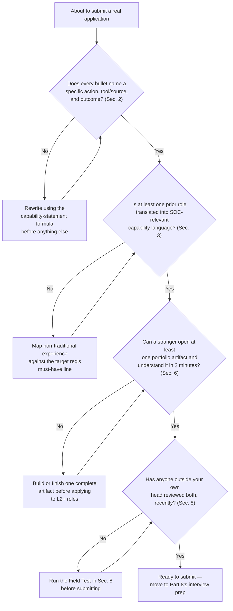

# Part 7 — Building a Resume and Portfolio That Survives a Real Screen

## Why this part exists

**[CONCEPT]** A resume and a portfolio do a narrower job than most career advice pretends: they exist to get you into a room, not to get you the job. Part 4 of this book covers which door to walk through and how to position yourself for it; Part 8 covers what happens once you're in the room, being scored against a rubric you can't see. This part sits between those two, and the boundary matters — spend your energy here on the document and the artifacts that get a stranger to pick up the phone, then stop and save the rest of your preparation for Part 8.

**[CONCEPT]** SOC Manager's Operating Handbook, Part 7 — Hiring & Sourcing Analysts owns the other side of this same document: how a manager builds a leveled job description, where the must-have line sits, and why a kitchen-sink requirements list or a certification-keyword filter screens out capable candidates before anyone reads their actual experience. That's the organization's evaluation mechanism, and this part does not re-derive it. What this part owns is narrower and entirely yours: writing toward the target that mechanism already defines, not designing the mechanism itself. Every rewrite technique below exists to answer one question a reviewer or an applicant-tracking system is already asking on the other side of the screen — does this resume state, in language that maps to what the role actually needs, that this person can do the job, not merely that they've heard of it.

**[CONCEPT]** A portfolio does different work than a resume. A resume makes a claim; a portfolio gives a stranger something to check the claim against. "Wrote detection logic" is a claim. A public repository with five documented detection rules, a stated false-positive rate for each, and a commit history showing you retuned one after it fired too often is evidence — it survives the follow-up question a resume line can't answer on its own. This part covers both halves: the document that earns the phone call, and the concrete artifacts that make the conversation after that call go somewhere real.

## 1. What a resume screen is actually testing for

### 1.1 The must-have line, not a keyword list

**[CONCEPT]** Behind almost every resume screen, automated or human, sits some version of a leveled job description with a short must-have section and a longer strongly-preferred section, built the way SOC Manager's Operating Handbook, Part 7 — Hiring & Sourcing Analysts describes it: two or three capability statements that actually gate a candidate out, and everything else used only to break ties. Where that line sits is the organization's design decision, not yours to make — but it tells you precisely what to optimize for. A resume that answers the must-have line in the reviewer's own language clears the gate. A resume that lists 15 tools and shows no evidence of judgment, hoping volume compensates for precision, is betting against a filter built specifically to catch that bet.

**[L1/L2]** If you're applying to L1 roles, the must-have section is usually short and forgiving by design. SOC Manager's Handbook Part 7 §1 notes that a well-written L1 posting on a mainstream job board typically fills inside 30 to 45 days — an illustrative figure for a mid-market SOC that book itself flags as not a sourced industry benchmark, not a number to treat as a guarantee for your own search — but even as a rough heuristic it says the bar clearing that gate is lower than career-changer anxiety usually assumes. Your job at this stage is proving you can reason under structure — follow a playbook, read a log line correctly, escalate when you should — not proving five years of judgment you don't have yet.

**[SENIOR/SPECIALIST]** Above L1, the calculus reverses. The mid-level market is thin enough, per SOC Manager's Handbook Part 7 §1, that a reviewer is actively looking for a reason to move your resume forward, not a reason to reject it. A resume that hides your best evidence behind vague language is throwing away an advantage the market itself is handing you.

> **Cross-Book Pointer**
> This part does not cover how a hiring manager decides where the must-have/strongly-preferred line sits, how an applicant-tracking system gets configured, or why a kitchen-sink requirements list backfires from the organization's side. See SOC Manager's Operating Handbook, Part 7 — Hiring & Sourcing Analysts, §2, for the full mechanics behind `TMPL-0701`, the leveled job-description skeleton a real screen is built from. Come back here once you understand what the gate actually checks for, so the rewriting advice below lands against a real target instead of a guess.

### 1.2 Certifications and titles are not capability statements

**[CONCEPT]** SOC Manager's Handbook Part 7 §3 documents what a certification-keyword filter does on the organization's side: reject resumes that don't match a named certification or job-title string, regardless of the actual reasoning ability behind them. You can't fix a filter you don't control, but you can stop making the same mistake in reverse — leading a resume with a certification list and a string of job titles instead of the reasoning behind them. A hiring manager reading past an automated filter is looking for exactly what the filter can't see: what you actually did with the knowledge a certification represents. Part 6 of this book covers which certifications are worth the study time in the first place; this part assumes that call is already made and covers how to present whatever you hold as supporting evidence, not as the headline.

**[MINDSET]** Treat every certification and every job title on your resume as a claim that needs at least one supporting bullet nearby, not as a stand-alone credential that speaks for itself. "GCIH-certified" tells a reviewer you passed an exam. "GCIH-certified; applied that certification's incident-handling framework to lead containment on a home-lab ransomware-emulation exercise, documented in the portfolio link above" tells them you can use it.

## 2. The capability-statement formula: turning duties into evidence

**[CONCEPT]** A capability statement has three parts, in order: the specific action you took, the specific tool or data source you took it against, and the concrete outcome or decision that resulted. Drop any one part and the sentence collapses back into a duty description — something the role requires, not something you demonstrably did. "Monitored security alerts for threats" names a duty. "Triaged an average of 45 EDR alerts per shift, correctly escalating the four that required Tier 2 containment and closing the rest with documented false-positive reasoning" names a capability, and it maps directly onto the technical-skill and judgment anchors a reviewer is actually checking for.

**[L1/L2]** If your only real triage experience so far is a home-lab project rather than a paid role, the formula still applies. The reviewer's checklist doesn't distinguish "did this at work" from "did this and can prove it" — it distinguishes "can do this" from "cannot yet." State the lab project with the same three parts you'd use for a job duty, and let the portfolio link in Section 6 carry the proof.

The table below rewrites five common duty-style bullets into capability statements and names which axis, per SOC Manager's Operating Handbook, Part 10 — Competency Models & Skills Matrices, §3, each rewrite actually answers (CONCEPTUAL SAMPLE — illustrative rewrites, not drawn from a specific real resume).

| Duty-style bullet (weak) | Capability statement (rewrite) | Axis it answers |
|---|---|---|
| "Monitored SIEM alerts for suspicious activity" | "Triaged 40–50 daily SIEM alerts against a 12-step playbook, escalating true positives within a 15-minute SLA and closing false positives with documented reasoning" | Technical skill |
| "Familiar with Splunk and CrowdStrike" | "Built ad hoc cross-tool queries in Splunk and CrowdStrike Falcon to confirm a hypothesis with no saved dashboard available, inside the same time budget as a playbook lookup" | Tool proficiency |
| "Communicated with team members regarding incidents" | "Wrote hand-off notes for Tier 2 that included scope, evidence gathered, and a specific next action, with 0 rewrite requests over a 3-month sample" | Communication |
| "Handled ambiguous security events" | "Resolved 6 of 8 sampled ambiguous severity calls to the same disposition a senior reviewer reached independently; escalated the other 2 per the insider-threat exception rather than guessing" | Judgment |
| "Passionate about cybersecurity, always learning" | "Completed a self-directed home-lab SIEM build ingesting Sysmon and firewall logs, then wrote and tuned 3 custom detections against injected attacker behavior" | Technical skill + tool proficiency |

This table doesn't invent the real number behind your own version of these bullets — if you don't already track a rough alert volume, an SLA, or a sampled accuracy rate, Section 8's Field Test gives you a way to reconstruct one before you write it down.

> **Career Trap**
> Padding a weak bullet with an adjective — "results-driven," "detail-oriented," "team player" — instead of a number or a specific action doesn't make it stronger; it makes it read like every other resume the reviewer saw that day. If you can't attach a number, a tool name, or a decision to a bullet, either go find the number (pull your own ticket history, check a home-lab log) or cut the bullet. A shorter resume with five real capability statements beats a longer one with 15 adjectives.

## 3. Translating non-traditional experience into capability language

**[CONCEPT]** Part 4 of this book covers how to recognize the "or equivalent experience" clause a leveled job description attaches to its must-have items, and why that clause only works if you can state your non-traditional background in the same capability language the clause is written in. SOC Manager's Operating Handbook, Part 7 — Hiring & Sourcing Analysts, §6, states the organization's side of the same gap: a military intelligence analyst, an internal auditor, or a help-desk lead brings a genuinely transferable skill that "almost never appears as a keyword an ATS or a skimming recruiter is trained to look for." Your resume is where that translation has to happen, because per that same section, it is explicitly not the hiring manager's job to do it for you.

**[L1/L2]** The translation isn't a euphemism exercise — it's a real mapping from one domain's vocabulary to another's, and it only works if the underlying skill is genuinely the same one. The table below gives five worked examples (CONCEPTUAL SAMPLE — illustrative mappings; state your own real numbers, not these exact ones, on an actual resume).

| Prior role and activity | Underlying transferable capability | Resume phrasing that maps to a SOC must-have line |
|---|---|---|
| Help-desk lead triaging 30+ tickets per shift under an SLA | Structured triage under time pressure, escalation judgment | "Triaged and prioritized 30+ concurrent tickets per shift against a defined SLA, escalating the subset requiring specialist involvement" |
| Internal auditor investigating expense-report anomalies | Pattern recognition across disparate structured data sources | "Reconstructed anomalous transaction patterns from multiple independent data sources to support a compliance finding" |
| Military intelligence analyst producing situation reports | Hypothesis-driven analysis under incomplete information, written briefing discipline | "Produced time-sensitive analytic assessments from incomplete, multi-source information under a fixed reporting deadline" |
| QA engineer reproducing and documenting software defects | Disciplined reproduction and documentation of an anomaly for a technical audience | "Reproduced and documented defects with enough detail for an engineering team to act without a follow-up question" |
| Classroom teacher monitoring 30 students in real time | Sustained attention and pattern-spotting across many simultaneous signals | "Maintained real-time awareness and rapid response across 30+ concurrent, competing demands per class period" |

**[MINDSET]** Resist the urge to bury the translation in a "Skills" section as a bare keyword and assume the reviewer will connect it. Say the connection out loud, once, in a bullet — the reviewer scoring your resume against a must-have line is working fast and won't do inference work you could have done for them in one sentence.

> **Analyst's Note**
> If you genuinely don't know whether a prior skill transfers, describe the activity to a working analyst in one sentence and ask what it would be called in a SOC. A 5-minute conversation like that has resolved more stalled resume rewrites than another hour spent staring at a blank bullet point.

## 4. Format discipline: length, structure, and the kitchen-sink resume

**[CONCEPT]** A resume that tries to prove everything proves nothing well. The kitchen-sink defect SOC Manager's Operating Handbook Part 7 §2.2 documents on the job-description side — stacking every tool the team has ever touched into one undifferentiated list — has a mirror-image failure on the candidate side: a 3-page resume listing every tool you've ever opened, every certification you've ever started, and a paragraph-length "objective" statement that says nothing a reviewer couldn't already infer from the job title you're applying to.

**[L1/L2]** Concretely: one page if you have fewer than roughly seven years of relevant experience, two pages at most beyond that. Reverse chronological order. A skills section that names the specific tools you've used at a level someone could ask a follow-up question about, not a 20-item list padded with anything you've merely heard of. No objective statement — the capability statements already do that work, and an objective statement is the resume equivalent of the banned filler this book's own style guide flags: it sounds like content without carrying any.

**[CONCEPT]** Format for a machine reader as well as a human one, even though this part doesn't own how an applicant-tracking system parses a document — that mechanism, and its failure modes, belong to SOC Manager's Handbook Part 7 §3. Multi-column layouts, tables, text boxes, and embedded graphics frequently parse into garbled or missing text on the systems many mid-size SOCs actually run. A single-column, standard-heading document is a defensive choice, not a stylistic downgrade — it protects a strong resume from being unreadable to the first system that touches it.

> **Career Trap**
> A resume built in a visually striking template — icons for skill levels, a sidebar timeline, a color-coded skills matrix — often looks better to the human eye and worse to the actual pipeline it has to survive first. If you're applying anywhere that runs a resume through an applicant-tracking system before a human opens it (assume this is most places above a very small SOC), test your resume by copying its text into a plain text file and checking whether it still reads in the right order. If it doesn't, the ATS probably can't read it either, and a beautifully designed resume a filter can't parse is functionally the same as no resume at all.

## 5. Building a portfolio: what actually gives an interviewer something to ask about

**[CONCEPT]** A resume gets you a phone call. A portfolio gives the person on that call — and later, the panel Part 8 covers — something concrete to ask about instead of a generic behavioral question pulled from a standard list. "Tell me about a time you handled an ambiguous alert" invites a rehearsed, generic answer. "Walk me through the false-positive rate on the third detection in your repository, and what you changed after the first week" invites a real one, because it's anchored to an artifact the interviewer can see, and a rehearsed answer falls apart fast against a specific follow-up about something real.

**[SENIOR/SPECIALIST]** The portfolio's job matters more, not less, the further you get from L1. An L1 candidate can lean on the realistic-preview conversation and a clean triage exercise — SOC Manager's Handbook Part 7 §7 covers what that preview looks like from the hiring side. An L2 or senior candidate is being evaluated against the judgment axis specifically, and judgment is the axis a resume bullet can claim but a portfolio artifact actually lets a reviewer inspect: a documented hunt with a stated hypothesis and a stated abandonment condition, built toward in Part 16 of this book, shows the reasoning, not just the conclusion.

**[MINDSET]** A portfolio only works if it's checkable. A bullet that says "led detection engineering initiatives" and a portfolio that's a private repository no one can open are functionally the same claim with extra words. Before listing a portfolio item on a resume, confirm a stranger with the link and no context could open it and understand what they're looking at within two minutes.

> **Ground Truth**
> "Just build a GitHub portfolio" is repeated in career-changer advice constantly, and it's mostly right but incomplete. An empty repository with a generic README and one half-finished script does not read as evidence — it reads as an unfinished attempt, and a visible unfinished attempt is sometimes worse than no portfolio at all, because now the interviewer has a concrete reason to doubt follow-through instead of an open question. The advice that actually holds up is narrower: build a small number of complete, documented artifacts rather than a large number of abandoned ones.

## 6. Three portfolio artifacts worth building

### 6.1 The home-lab project writeup

**[L1/L2]** Part 5 of this book walks through the specific home-lab builds worth attempting before your first SOC job — a small SIEM ingesting real telemetry, a handful of self-written detections, a packet-capture exercise. This part picks up exactly where that one leaves off: once you've built something, the writeup is what turns it from a personal project into a portfolio artifact a reviewer can actually evaluate.

**[CONCEPT]** A good project writeup is not a lab report and not a resume bullet — it's closer to an incident summary a Tier 2 analyst could pick up cold, because that's genuinely the skill it demonstrates. It states what you were trying to find out, what you built or ran to find it, what you actually found, and — the part career-changer writeups skip most often — what you'd do differently if you ran it again. That last section is where judgment shows up; a writeup with no second-guessing in it reads like a checklist that was followed, not a project that was reasoned about.

Use the template below whenever you finish a home-lab project you intend to make public — filed in Appendix A3 as `TMPL-0702`, the portfolio-project writeup template.

```markdown
TEMPLATE — Portfolio project writeup, permanent ID TMPL-0702

PROJECT: <!-- one-line name -->
GOAL / HYPOTHESIS: <!-- what you were trying to find out or build, stated as a
  question a stranger could evaluate whether you answered -->

WHAT YOU BUILT OR RAN: <!-- brief — the environment, the data sources, the tool
  choices, one paragraph max; this is context, not the point of the writeup -->

WHAT YOU FOUND: <!-- the actual result, including a negative or partial result;
  state a number or a specific observation, not "it worked" -->

WHAT YOU'D DO DIFFERENTLY: <!-- the honest second-guess — a false assumption you
  made, a step you'd reorder, a detection you'd tune differently now -->

WHAT THIS PROVES (and doesn't): <!-- name the specific capability a reviewer
  could reasonably infer from this, and one thing it does NOT prove, so you're
  not overclaiming in the interview that follows -->
```

This template doesn't decide which home-lab projects are worth writing up in the first place — that judgment call belongs to Part 5's project list and your own time budget; it only structures the writeup once you've picked one.

### 6.2 The sanitized investigation narrative

**[SENIOR/SPECIALIST]** Once you have real job experience, a sanitized investigation narrative is usually stronger evidence than a home-lab writeup, because it demonstrates you can do this against real, messy, production data rather than a controlled lab environment. "Sanitized" is doing real work in that sentence, not a formality — it means removing anything that could identify the employer, the specific systems, any indicator that's still sensitive, and any detail a reasonable person would recognize as confidential, while keeping the actual reasoning intact.

**[MINDSET]** The reasoning is the entire value of the writeup — genericize the environment, never the thinking. "An alert fired on unusual outbound traffic from a finance-department workstation" preserves the investigative shape while removing anything identifying; changing the reasoning itself to make the story sound cleaner defeats the purpose, because the reasoning is what an interviewer is actually going to probe.

> **Career Trap**
> The instinct to make a sanitized narrative more impressive by adding detail almost always adds identifying detail instead of investigative depth — a specific timestamp, an internal system name, an indicator still under an active confidentiality obligation. Before sharing any investigation writeup, run it past two questions: could a determined reader identify the employer from this, and is anything here still confidential regardless of how old the incident is? If you can't answer both cleanly, don't publish it — describe the investigation verbally in an interview instead, where you control the room and can stop short of a detail that shouldn't leave it.

### 6.3 A public detection-content and scripts repository

**[SENIOR/SPECIALIST]** A public repository of detection content and utility scripts is the single portfolio artifact that most directly previews the detection-engineer branch (Part 15 — Becoming a Detection Engineer, later in this book), but it's worth starting well before you've committed to that branch. The underlying discipline — documenting why a detection exists, not just what it matches — is generically useful evidence at any senior-analyst-track interview.

**[HOME LAB — companion volume not yet written]** The project: a public Git repository containing three to five detection rules — Sigma format is a reasonable default because it's engine-agnostic and a reviewer at any SOC can read it without owning your specific SIEM — and one or two utility scripts, such as a log parser or an indicator-enrichment helper you actually used on a home-lab investigation. Each detection needs, at minimum: a plain-language description of what it detects and why, the MITRE ATT&CK technique it maps to, a stated assumption about the log source it depends on, and — the part that separates a real portfolio piece from a rule dump — a documented false positive you found during testing and what you changed in response. Commit the false-positive fix as its own commit with a real message, not squashed into the original, so the history itself shows iteration rather than a single upload. A README at the repository root should state, in three or four sentences, what the repository is and point a reader to the most interesting detection first — don't make an interviewer hunt for your best work.

**[CONCEPT]** Detection Engineering Handbook V2, Part 22 — Detection as Code, describes what a mature detection-as-code pipeline looks like inside a real SOC: branching strategy, PR review gates, automated lint and regression testing, a release and rollback process, and enforced separation between the person who writes a rule and the person who approves it. Your personal repository doesn't need any of that infrastructure — you're one person, and a full CI pipeline for a 5-rule portfolio repo would be more setup than substance. What it should borrow from that standard, at a scale of one, is the habit underneath the infrastructure: a rule doesn't ship without a stated rationale, a stated assumption, and a record of what broke and what you did about it.

> **Analyst's Note**
> Pin the commit that fixes a real false positive to the top of the repository's README with a one-line link, even if it happened months after the original commit. That single commit is usually the most interview-relevant thing in the entire repository, because it's the only piece of evidence that shows you noticed a rule was wrong on your own and did something about it without being told to.

### 6.4 A fourth artifact for the leadership-curious: an informal coaching log

**[LEAD/MANAGEMENT TRACK]** If you're already testing team-lead aptitude the way Part 19 — The Team Lead Transition, later in this book, describes, start a fourth artifact early and keep it private until you need it: a running log of informal coaching moments — a time you helped an L1 reason through an escalation without taking the ticket over, a QA calibration session you participated in per SOC Manager's Operating Handbook, Part 15 — Quality Assurance Programs. This isn't something you publish alongside a detection repository; it's evidence for a much later, more personal conversation — either a manager's own promotion-evidence request, or your own honest self-check about whether you actually want to coach people or just want the title that implies you do.

## 7. Keeping the portfolio alive: the maintenance problem

**[MINDSET]** A portfolio built once, demonstrated in one interview cycle, and never touched again ages quickly — not because the original work stops being real, but because "I built this two years ago and haven't looked at it since" is itself an answer to the judgment question, and it's not the answer you want on record. Keep at least one artifact actively changing: a new detection added to the repository every few months, a home-lab writeup updated after you rebuild the environment against a newer tool version, a note added to a sanitized narrative reflecting something you'd handle differently with a year more experience.

**[STUDY PLAN]** Treat a quarterly portfolio review as a fixed calendar item: 20 minutes, four times a year, to add one thing, update one writeup's "what you'd do differently" section with genuinely new hindsight, or retire an artifact that no longer represents your current skill level. A portfolio that only grows and never gets edited eventually contains embarrassingly dated work standing in for who you are today.

> **Blind Spot**
> Your own sense that a portfolio "still looks fine" is an unreliable check, because you already know the context behind every artifact in it — you can't see it the way a stranger opening the link cold would. Ask someone outside your own head to open the portfolio with zero context and tell you, unprompted, what they think you're best at. If their answer doesn't match the artifact you'd lead with yourself, the portfolio's ordering or framing needs work, not necessarily its content.

## 8. Self-scoring your resume and portfolio before you submit anything

**[MINDSET]** Before submitting anything, score your own resume and portfolio against the rubric below rather than trusting a gut feeling that "it looks pretty good." The rubric doesn't replace an outside reviewer — the Field Test below still matters — but it catches mechanical gaps an outside reviewer might not think to check for, like whether you've actually covered all four axes a reviewer scores against rather than three of them.

The table below is a self-scoring worksheet for a resume-and-portfolio pair, used just before submitting to a real requisition (CONCEPTUAL SAMPLE — a scoring structure for your own use, not a validated hiring-outcome predictor).

| Dimension | 0 — Not yet | 1 — Partial | 2 — Solid | Fix it in |
|---|---|---|---|---|
| Capability-statement specificity | Bullets describe duties, no numbers or tools named | Some bullets have a number or tool, most don't | Every bullet names an action, a tool or source, and an outcome | Sec. 2 |
| Four-axis coverage | Resume demonstrates only 1 axis (usually technical skill) | Covers 2 or 3 axes | At least 1 bullet maps clearly to each of technical skill, tool proficiency, communication, and judgment | Sec. 2 |
| Non-traditional experience translated | Prior roles listed with no capability mapping | Mapping exists but stays implicit | Prior experience explicitly stated in SOC-relevant capability language | Sec. 3 |
| Format / ATS safety | Multi-column, graphics, or a template known to break parsers | Simple format, but untested against a plain-text copy check | Single-column, plain-text-copy-tested, no objective statement | Sec. 4 |
| Portfolio artifact count | 0 public artifacts, or 1 abandoned/incomplete repo | 1 complete artifact | 2 or more complete, documented artifacts a stranger could open cold | Sec. 6 |
| Portfolio freshness | Nothing touched in over a year | Touched within the last year, no recent addition | Actively maintained per the quarterly-review habit in Sec. 7 | Sec. 7 |
| External review | No one outside your own head has read either document | Reviewed by someone outside the field | Reviewed by at least 1 working analyst or someone recently through a SOC hiring loop | Below |

**[MINDSET]** A resume and portfolio scoring 2 across every row is rare and not actually the bar. A realistic target before submitting to a role you're seriously pursuing is no row below a 1, with at least 4 rows at a 2, and the external-review row never left at 0.

> **Field Test**
> **Setup:** Your resume and at least one portfolio artifact are in a state you'd consider ready to submit.
> **Action:** Hand both to someone who has done real SOC hiring or interviewing recently — not a friend outside the field, per Section 7's Blind Spot — and ask them to name, unprompted, the two strongest capability statements and the single weakest one, plus whether the portfolio artifact makes them want to ask a follow-up question.
> **Expected result:** They should name a specific bullet and a specific reason within a few minutes, not a vague "looks good." If they can't point to your strongest bullet without re-reading the whole document twice, the specificity in Section 2 hasn't actually landed yet, no matter how solid it reads to you.

## 9. Sequencing this: are you actually ready to submit?

**[CONCEPT]** Figure 7.1 turns the rubric in Section 8 into a single decision path — not a replacement for actually scoring yourself, but a fast way to tell which section of this part to revisit before you submit a real application.

Mermaid source below is the editable source of truth for this figure; the rendered image is produced in a later build pass per this book's diagram process.



**Figure 7.1 — Self-assessment flow: is your resume and portfolio actually ready to submit?** *CONCEPTUAL.* Diagram ID `FIG-0701`. Illustrates the decision path this part's sections feed into for a reader about to submit a real application; it is a structural self-check, not a scored assessment on its own — pair it with the rubric in Section 8 for an actual score. Every path converges on Part 8's interview preparation once the document and portfolio both clear this check.



**[INTERVIEW PREP]** One more thing worth doing before you submit, not after: for each portfolio artifact you're listing, write one spoken sentence you could actually say out loud if an interviewer opens the link live on a call — "this is the detection I had to retune after a false positive taught me the log source wasn't what I assumed." Part 8 covers building a full story bank and practicing delivery under pressure; this is only making sure you're not narrating your own work for the first time in the room.

## Where this goes next

**[CONCEPT]** A resume and portfolio that clear this part's own checks are inputs to Part 8's interview preparation, the same way a correctly sourced candidate pool is the input SOC Manager's Operating Handbook Part 8 assumes before it can do its own job — neither a strong document nor a strong assessment process can compensate for the other's absence. The detection-content repository in Section 6.3 is a head start on the work-sample bar Part 15 covers in full once you've chosen the detection-engineer branch; the sanitized investigation narrative in Section 6.2 is the same raw material the story bank in Part 8 draws from later. None of this replaces actually doing the work the resume and portfolio describe — it only makes sure the work you've already done is visible to the person deciding whether to call you.

---

**Cross-references:** This part assumes Part 4 — Breaking Into the SOC: Routes In and How to Position Yourself for Each (the "or equivalent experience" framing Section 3 builds on), Part 5 — The Home-Lab Foundation: What to Build Before Your First SOC Job (the projects Section 6.1's writeup template turns into portfolio evidence), and Part 6 — Certifications: What Actually Matters, and When (the certification-sequencing decision Section 1.2 assumes is already made). It cites SOC Manager's Operating Handbook, Part 7 — Hiring & Sourcing Analysts (the leveled job description, `TMPL-0701`, and the certification-filter trap this part writes toward), SOC Manager's Operating Handbook, Part 10 — Competency Models & Skills Matrices (the four-axis framework Section 2's capability statements map onto), SOC Manager's Operating Handbook, Part 15 — Quality Assurance Programs (the calibration-session evidence Section 6.4 points to), and Detection Engineering Handbook V2, Part 22 — Detection as Code (the detection-as-code discipline Section 6.3's personal repository borrows at individual scale). It points forward, within this book, to Part 8 — Interview Prep From the Candidate's Chair, Part 15 — Becoming a Detection Engineer, Part 16 — Becoming a Threat Hunter, and Part 19 — The Team Lead Transition.
