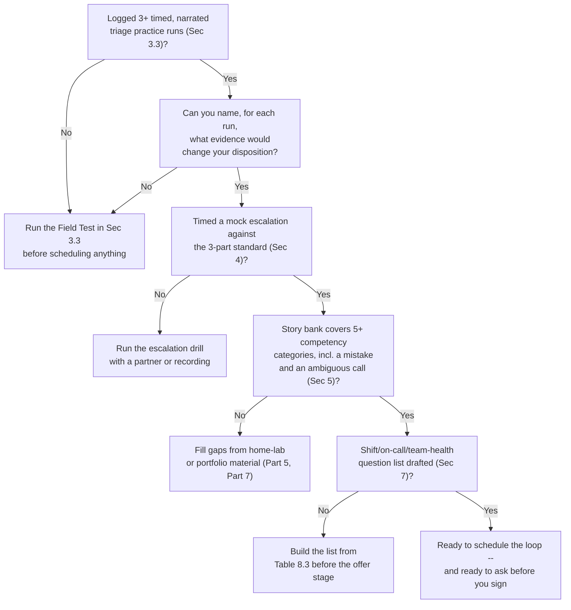

# Part 8 — Interview Prep From the Candidate's Chair

## Why this part exists

**[CONCEPT]** Part 7 got a resume that survives a real screen and a portfolio an interviewer can actually ask about. This part starts at the moment that stops mattering as much as what happens next: you're on a call, or in a proctored room, or on a mock escalation with a clock running, and a structured loop is scoring you against a written rubric you can't see but can predict. SOC Manager's Operating Handbook, Part 8 — Interviewing & Technical Assessment Design owns how that loop gets built — the three-stage structure, the scorecard anchored to observable behavior, the calibration gate that locks scores before a panel debriefs, the de-biasing controls around take-home exercises and panel composition. This book does not re-derive any of that. What it owns is the other side of the same desk: what you personally practice, build, and rehearse so that when the machinery runs, it has real evidence to score instead of your best guess at what sounds good.

**[INTERVIEW PREP]** Four things get real space here: practicing the initial screen, practicing the proctored log-triage exercise, practicing the mock escalation, and practicing the behavioral panel — each treated as a distinct rehearsal problem, not one generic "interview prep" blob. Layered on top: how to narrate your reasoning out loud under a clock so a rubric line has something to check off, how to build a story bank of real judgment calls (including home-lab ones, if you don't have professional incidents yet) mapped to the competencies a panel actually probes, and the specific questions to ask about shift pattern and on-call reality before you sign an offer, not after your first bad Tuesday night.

> **Cross-Book Pointer**
> This part does not explain how a SOC hiring loop is structured, how a rubric line gets written so it survives a legal challenge, or how a panel calibrates before scoring a real candidate. See SOC Manager's Operating Handbook, Part 8 — Interviewing & Technical Assessment Design for all of that — the screen/practical-assessment/panel structure, the scorecard mechanics, and the de-biasing controls this part assumes are already in place on the other side of the table. Come back here once you understand what's actually being measured; the practice advice below is built to generate evidence against that specific measurement, not against a guess at what "doing well" means.

## 1. What the loop is actually scoring, and why that changes how you practice

**[CONCEPT]** A calibrated SOC loop runs three stages: a short screen for baseline fit, a proctored practical assessment (the log-triage exercise and the mock escalation), and a panel-and-behavioral round where independent written scores get locked before anyone debriefs — the exact structure SOC Manager's Operating Handbook, Part 8 §2.2 designs from the hiring side. Every rubric line in that structure is written to answer one question: what would an interviewer actually see or hear that earns this score? "Reaches a defensible disposition" is a line you can be scored against. "Sounded confident" is not supposed to be a line at all, even though it's exactly what an unstructured interviewer defaults to measuring when no rubric exists.

**[INTERVIEW PREP]** That single fact changes what "practicing" should mean for you. If the loop is scoring observable behavior, then your preparation goal isn't sounding right — it's making your reasoning process visible in a form a rubric line can actually check off: naming the missing field out loud, stating why you ruled out the alternative explanation, naming the specific enrichment you'd request instead of saying "I'd investigate further." A candidate who reaches the right answer silently and announces it has given the panel nothing to score except the label. A candidate who reaches the same answer while narrating every step has given the panel four or five separate, checkable pieces of evidence along the way. The rest of this part is built around that difference.

The table below maps each loop stage to what it primarily tests and where in this part you practice for it — use it to decide which section to spend the most hours on given your own weakest stage, not as a checklist to complete once and move past.

**Table 8.1 — Loop stage, what it tests, and where to practice it.** Use this to triage your own prep time before a real loop, not as a substitute for the exercises themselves.

| Loop stage | Primarily tests | Typical format | Practice covered in |
|---|---|---|---|
| Screen | Baseline fit, honest logistics, gross mismatch | 20–30 min, phone or video | §2 |
| Log-triage exercise | Skill — working an alert to a defensible disposition | 45–90 min, proctored | §3 |
| Mock escalation | Judgment — what to escalate, how, with what context | 10–20 min, panel-observed | §4 |
| Panel + behavioral | Communication, collaboration, competency-mapped judgment | 45–60 min, small panel | §5 |
| — (post-offer, your turn to ask) | Shift reality, on-call reality, team health | Offer stage, your questions | §7 |

## 2. Practicing the screen

**[L1/L2]** The screen is the stage newer candidates most often waste by treating it as throwaway small talk before the "real" interview starts. It isn't. A recruiter or team lead is confirming, in 20 to 30 minutes, that your shift availability actually matches the role, that you understood the realistic preview of the job rather than a marketing version of it, and that a small number of scoped technical questions don't reveal a mismatch nobody wants to discover after two more rounds of panel time.

**[INTERVIEW PREP]** Rehearse two things specifically for this stage. First, a 60-to-90-second answer to "why this role" that names something concrete — a specific skill you're trying to build, a specific reason the tier or team fits where you actually are, not a version of "passionate about cybersecurity" dressed up in longer sentences. Second, an honest answer to the logistics questions. If the role is a fixed night rotation and you can genuinely do it, say so plainly; if you're not sure, say that too and ask for the specifics rather than agreeing to "flexible hours" language you haven't actually tested against your own life. Section 7 covers the deeper version of this conversation, the one that happens once an offer is real — the screen is not the place to negotiate shift pattern, but it is the place to stop a genuine mismatch before either side invests more time in it.

> **Analyst's Note**
> Don't try to win the screen by sounding maximally flexible on a shift question you haven't actually thought through. You're not negotiating against the recruiter at that point — you're negotiating against your own future self in week three, when the rotation you agreed to sounds nothing like what you remember agreeing to.

## 3. Practicing the log-triage exercise

### 3.1 What "skill" scoring actually rewards

**[INTERVIEW PREP]** The exercise puts you in front of something close to a real alert — usually sanitized, already-produced detection content rather than an invented puzzle — and watches how you work it. SOC Manager's Operating Handbook, Part 8 §3.1 builds the exercise this way specifically so it tests the same cognitive work a real analyst does: read the evidence, decide what's missing, reach a disposition you can defend, including "unable to determine" when the evidence genuinely doesn't support a confident call. Detection Engineering Handbook V2, Part 1 — Detection Engineering Foundations is the source for the vocabulary a rubric typically expects you to use without prompting — event, signal, alert, disposition — rather than looser terms that blur what you're actually claiming happened.

**[L1/L2]** At the entry-level calibration, expect a single alert with a clear evidence trail and one missing field, budgeted around 45 to 60 minutes. The bar isn't cleverness — it's reaching a defensible disposition and correctly naming the missing field without being prompted to look for it.

**[SENIOR/SPECIALIST]** At the L2 or L3 calibration, expect an alert with genuine ambiguity — two or more plausible explanations that don't resolve cleanly from the evidence given — over 60 to 90 minutes. The bar there isn't picking the right explanation; it's reaching "unable to determine" appropriately and naming exactly what enrichment would resolve it, or defending a confident call with reasoning that would survive a challenge. A candidate who guesses correctly with no stated reasoning scores worse on this exercise than one who reaches a cautious, well-justified "I can't tell yet" — that's a deliberate design choice on the hiring side, not an accident, because an overconfident wrong disposition costs a real SOC more than a correctly cautious escalation.

### 3.2 Narrating reasoning so a rubric can see it

**[INTERVIEW PREP]** The mechanical skill underneath all of this is narrating continuously, not presenting a final answer. Say what you're seeing as you see it. Say what's missing the moment you notice it's missing. State your working hypothesis before you've confirmed it, and say explicitly what would confirm or rule it out. Close with your disposition and your confidence in it, stated as a claim someone else could check, not a mood.

A candidate who goes quiet for 3 or 4 minutes and then announces a correct answer has given a proctor scoring against a written rubric almost nothing to check off during that silence, even though the reasoning happened somewhere in their head. The exercise is not measuring whether you can eventually get there; it's measuring whether the specific reasoning steps a rubric line names actually happened where someone could observe them.

> **Analyst's Note**
> If you catch yourself going quiet for more than about 15 seconds while you think, say what you're doing even if it's small: "I'm cross-checking the source address against the last hour of DNS activity." An unscoreable silence and a wrong guess cost you the same rubric line either way — the silence just feels less like a mistake while it's happening.

### 3.3 Building a self-timed practice set from your own lab

**[STUDY PLAN]** You practice this exercise the same way you'd practice any timed performance skill: repeated, timed reps against material close to the real thing, with a way to check your own output afterward. Part 5 — The Home-Lab Foundation: What to Build Before Your First SOC Job is where the detections, log samples, and packet-capture exercises this practice set draws from get built in the first place; this section is only about repurposing that material for timed rehearsal, not building it from scratch a second time.

**[INTERVIEW PREP]** Pull three or four already-resolved home-lab alerts, or real tickets if you have them, and set a hard timer — 10 minutes for a single-alert entry-level scenario, closer to 30 for an ambiguous one. Narrate your full reasoning out loud, record yourself if you can, and only look at the resolution after the timer stops. Score yourself against the same things §3.1 describes: did you name what's missing, did you state a hypothesis before confirming it, did you reach a defensible disposition or a well-justified "unable to determine." A recording gives you something a memory of the exercise won't: a stopwatch record of how much of your reasoning was actually said out loud versus thought silently, which is the exact gap a real proctor will be scoring.

If you want fresh telemetry instead of re-grading yourself against tickets whose outcome you already half-remember, build a small scripted noise-and-scenario generator against your own home lab `[HOME LAB — companion volume not yet written]` — a script that fires a mix of ordinary background noise and one known-cause "attack" event on a schedule you don't memorize in advance, so the alert it produces is genuinely new material to practice against, rather than the same three home-lab detections replayed until you've memorized their answers.

> **Blind Spot**
> Practicing against a detection you personally wrote has a specific, structural limit: you already know the intended answer before you start the timer, so the drill tests how well you can articulate reasoning, not whether you can actually reach a disposition under real uncertainty. It will make you fluent; it won't tell you whether you're accurate under genuine ambiguity. Get at least one practice round on material someone else built — a study partner's home-lab writeup, a public detection-engineering blog's sanitized case, or the scripted noise-and-scenario generator described above `[HOME LAB — companion volume not yet written]` — before trusting your own self-scored result.

> **Field Test**
> **Setup:** You have at least three already-resolved home-lab alerts or real tickets you haven't reviewed in a few weeks.
> **Action:** Set a 10-minute timer per ticket. Narrate your full reasoning out loud, recording if possible, without looking at the resolution until time is up.
> **Expected result:** You should be able to name, for each ticket, what was missing, what your working hypothesis was, and what evidence would have changed your answer — regardless of whether your final disposition matched the real one. If your recording has long stretches of silence before a stated answer, that's the specific gap to close before a real proctored exercise, not a sign the exercise itself is unfair.

## 4. Practicing the mock escalation

**[INTERVIEW PREP]** Where the log-triage exercise tests whether you can work an alert alone, the mock escalation tests whether you can hand it off — verbally, to a panelist playing a Tier 2 analyst or team lead, inside a 10-to-20-minute window, per SOC Manager's Operating Handbook, Part 8 §3.2. The standard your handoff gets judged against isn't invented for the hiring loop; it's SOC Playbook Handbook, Part 27 — Escalation Quality's own criteria for what a real escalation needs: the context the receiving tier actually requires, a severity call that's justified rather than asserted, and a concrete next action named explicitly. Practicing this exercise is, by construction, practicing the exact escalation habit a real SOC wants from you on day one.

> **Ground Truth**
> Most candidates walk in assuming this exercise is "explain what you found," scored loosely on clarity. It's scored against three specific, nameable criteria, and a candidate who narrates excellent analysis but never states a concrete next action fails that line on the rubric even though the underlying investigation was strong. Treat the exercise as a structured handoff with three required parts, not a summary.

**[INTERVIEW PREP]** Rehearse the handoff as three explicit beats, timed: state the context (what fired, what you found, what you ruled out), state your severity call and the reason behind it, and state the specific next action you need from the receiving tier. Practice compressing rather than expanding — the instinct under a clock is almost always to talk longer to fill the silence, which crowds out the third beat entirely. A partner, a recording, or even a stopwatch alone can tell you whether your real handoff fits inside the time budget with all three beats intact.

## 5. Building a story bank for the behavioral panel

### 5.1 What the panel is actually probing

**[INTERVIEW PREP]** The panel-and-behavioral stage scores communication, collaboration, and genuine culture-add — not "culture fit" — against specific competencies drawn from the role's leveled job description, with each interviewer submitting an independent written score before any group debrief happens, per SOC Manager's Operating Handbook, Part 8 §2.2 and §4.1. Your job going in is to have real, specific accounts ready, mapped to the categories a panel is likely to probe, rather than reconstructing an answer live under pressure and hoping it lands.

**[INTERVIEW PREP]** A story bank is exactly that: five to eight real judgment calls, each written down in advance, structured the same simple way every time — the situation in a sentence or two, the specific decision and the reasoning behind it, the outcome, and one honest note on what you'd do differently now. If you don't have professional incidents yet, Part 5's home-lab investigations and Part 7 — Building a Resume and Portfolio That Survives a Real Screen's portfolio writeups are legitimate, real material — a hiring panel cares about the reasoning you can demonstrate, not whether the ticket carried a company's real customer data.

**Table 8.2 — Story bank worksheet.** A fuller, fillable version of this worksheet (`TMPL-0801`) lives in Appendix A4, companion to this part; the table below is the working reference for building your own before a real loop.

| Competency category | Sample question form | What a strong story includes | Home-lab-eligible |
|---|---|---|---|
| Judgment under ambiguity | "Tell me about a time the evidence didn't clearly resolve" | The specific missing evidence, the hypothesis you held, why you didn't force a confident call | Yes |
| Escalation discipline | "Tell me about a call you escalated that turned out to be nothing" | Why escalating was still correct at the time, what you'd tell yourself doing it again | Yes |
| Mistake and recovery | "Tell me about a wrong call you made" | The actual error, how you caught it, what changed afterward — not a disguised humblebrag | Yes |
| Mentoring or collaboration | "Tell me about helping someone else through a call" | What you didn't do (take over the ticket), what you did instead | Only with a study partner or peer |
| Working under overload | "Tell me about a surge day or a queue backing up" | How you prioritized, what you deliberately let wait, and why | Partially — hard to simulate real volume alone |

### 5.2 The generic-answer failure

**[INTERVIEW PREP]** The single most common story-bank failure is treating one strong story as flexible enough to answer any behavioral question, instead of building distinct stories for distinct competencies. It's an easy mistake to see coming once you know the mechanism.

**COMPOSITE CASE EXAMPLE (`CASE-0801`)** — the following merges patterns seen across several career-changer and early-career interview debriefs into one illustrative narrative; it is not a single traceable candidate.

> **Career Autopsy — "one flexible answer for every behavioral question"**
>
> **The decision:** A career-changer preparing for an L1 loop wrote a single, well-polished story — a genuinely good example of catching a discrepancy in a previous compliance role — and planned to adapt it on the fly to whatever behavioral question the panel actually asked.
>
> **Why it seemed reasonable:** The story was strong, well-rehearsed, and the candidate reasoned that a good enough story could be bent to fit "tell me about a conflict," "tell me about a mistake," and "tell me about ambiguity" alike, since all three questions were, underneath, asking about the same general competence.
>
> **How it failed:** Three panelists independently scored the candidate against three different named competencies, and the same story, retold with minor edits each time, mapped cleanly onto none of them — it wasn't really about a mistake, it wasn't really about conflict, and the "ambiguity" framing felt visibly retrofitted. Two of the three written scorecards flagged the answers as vague or repetitive before debrief ever started.
>
> **The fix:** Build a real story bank with a distinct story per competency category, per Table 8.2, before the panel stage — not one flexible story stretched five ways. A bank of five specific stories, each honestly mapped to one category, reads as more experience than one polished story reused, even when the underlying track record is identical.

### 5.3 Practicing the senior and lead-track variant

**[SENIOR/SPECIALIST]** If you're interviewing for a senior-analyst seat or a specialist branch, pull your story bank from the branch-portfolio work Part 14 — The Senior-Analyst Study Plan and the Portfolio That Earns a Branch Choice describes: a self-written detection with a tracked false-positive rate, a documented hunt with a stated hypothesis, a shadow-coaching log. Those artifacts aren't just resume lines — they're the raw material for a specific, well-evidenced answer to "tell me about a novel investigation you owned," which reads as far stronger than a generalist story stretched to cover senior-level judgment it wasn't really testing.

**[LEAD/MANAGEMENT TRACK]** SOC Manager's Operating Handbook, Part 8 §3.3 calibrates the practical assessment differently again for a senior or team-lead-track candidate, adding a coaching component: the same alert, plus a fictional L1's incorrect disposition to review. The bar there is doing both things at once — reaching the correct call yourself and giving feedback that would genuinely help the fictional L1 improve, not just handing back a corrected answer. Practicing this means rehearsing specific, kind, actionable feedback out loud, the same feedback you'd actually want to have received as an L1 — "here's the field you missed and why it mattered" rather than "that's wrong, try again." This exercise is, in effect, a live version of the self-administered coaching-aptitude check Part 19 — The Team Lead Transition: Testing Your Own Aptitude Before You Ask for the Seat covers in full; if the fictional-L1 exercise feels natural rather than performative, that's a real, useful data point for the broader question Part 19 asks.

## 6. Narrating reasoning under time pressure: the mindset layer

**[MINDSET]** Narrating out loud under a clock is a trained skill in its own right, separate from whether your underlying reasoning is any good. A candidate who's genuinely calm under time pressure sounds different from one who has memorized a script for sounding calm, and a proctor watching several candidates a week can usually tell the difference within a few minutes. The habit worth building isn't a performance of composure — it's a small set of concrete verbal moves that hold up even when you're actually under pressure, because they don't depend on feeling calm to execute.

Three moves do most of the work: narrating what you're doing the instant you start doing it rather than after you've finished it, stating uncertainty explicitly the moment you notice it ("I don't have enough here to confirm that yet") instead of either guessing confidently or going silent, and treating a wrong turn as a correction to say out loud rather than a mistake to hide ("that hypothesis doesn't hold up — here's why, and here's what I'm checking instead"). Part 22 — The Analyst Mindset covers confidence calibration as a general, cross-tier habit; this section is the specific version of that habit under an adversarial, timed, evaluated condition, which is a harder test of the same skill than an ordinary shift.

> **Field Test**
> **Setup:** You've run at least one timed, recorded practice triage per §3.3.
> **Action:** Play the recording back and mark every gap of silence longer than about 15 seconds, every confident claim with no stated evidence behind it, and every moment you noticed uncertainty but didn't say so out loud.
> **Expected result:** A strong recording has few long silences, ties every confident claim to a specific piece of evidence named in the same breath, and states uncertainty explicitly rather than papering over it with a guess. If you find more than two or three of any category in a 10-minute recording, that's the specific habit to drill next — not a sign to redo the whole exercise from scratch.

## 7. Before you accept: questions about shift pattern, on-call, and team health

**[INTERVIEW PREP]** Once you clear the loop, the information asymmetry flips. The organization already knows exactly what its coverage model, on-call rotation, and holiday roster look like; you don't, and a job posting's "flexible hours" or "occasional on-call support" language is precisely the vague phrasing SOC Manager's Operating Handbook, Part 7 §7's realistic-job-preview practice exists to replace with real numbers — but not every SOC runs that practice well, and the burden of asking specifically falls on you if it doesn't. SOC Manager's Operating Handbook, Part 6 — Shift Pattern & Coverage Design is where the actual mechanics behind these questions live: the four coverage models (fixed shift, rotating shift, follow-the-sun, on-call/bridge), the primary/secondary on-call paging structure with its acknowledgment window, holiday-roster mechanisms, and whether shift-handoff overlap is protected, paid time or something that gets cut whenever the schedule is short-staffed. You're not inventing these questions from nothing — you're asking about the exact mechanics that chapter names, from the other side of the desk.

> **Cross-Book Pointer**
> This part does not explain how a manager chooses between coverage models, designs a rotation direction, or builds a holiday roster — that's organizational scheduling mechanics. See SOC Manager's Operating Handbook, Part 6 — Shift Pattern & Coverage Design for what each model actually costs in fatigue and coverage-gap risk, and for what a real on-call and handoff structure looks like when it's designed well. Read it before a final-stage interview so you recognize a real, specific answer to the questions below and can tell it apart from a vague one.

**[INTERVIEW PREP]** The table below is a working question list for the final stage before you accept — a fuller, fillable version (`TMPL-0803`) lives in Appendix A4, companion to this part.

**Table 8.3 — Questions to ask before accepting an offer.** Ask these once you're past the panel and into offer discussion; asking too early in the loop reads as negotiating before you've been offered anything.

| Topic | Question to ask | Strong answer sounds like | Red-flag answer sounds like |
|---|---|---|---|
| Coverage model | "Which of fixed, rotating, follow-the-sun, or on-call does this seat run?" | Names the model directly, with the actual shift length and rotation speed | "It varies" or "we're pretty flexible about it" |
| On-call structure | "What's the primary/secondary on-call structure, and the page-acknowledgment window?" | A stated number (e.g., a 10–15 minute ack window) and a named secondary escalation path | "You'll figure it out" or no secondary mentioned at all |
| On-call compensation | "Is on-call compensated separately from base pay?" | A stated stipend or differential, distinct from per-incident pay | "It's baked into the salary" with no further detail |
| Holiday roster | "How are holiday shifts assigned — volunteer, seniority, or lottery?" | A named, pre-published mechanism | "We work it out closer to the date" |
| Shift-handoff overlap | "Is there a protected, paid overlap window between shifts?" | A stated number of minutes, described as non-negotiable | "Handoff happens informally" or "it depends how busy it is" |
| Rotation direction/speed (if rotating) | "Which direction does the rotation move, and how fast?" | A specific answer (e.g., forward-rotating, weekly blocks) | No one on the call knows, or the question visibly hasn't come up before |
| Team health | "What's 12-month attrition looked like on this team?" | A real number, even an uncomfortable one, with context | Deflection to "we're a great culture fit here" with no number |

> **Career Trap**
> Accepting a vague "flexible schedule" or "on-call is rare" answer at face value, because pushing further feels like it might jeopardize an offer you want, is the exact mechanism behind the surprise-shift-pattern attrition pattern SOC Manager's Operating Handbook, Part 7 documents from the hiring side. The fix: ask the specific questions in Table 8.3, and treat a genuinely vague answer as real information in itself — a hiring team that can't state its own on-call acknowledgment window in numbers likely hasn't examined it critically either, which is worth knowing before you sign, not after your first bad on-call week.

## 8. A self-assessment flow and a 2-week practice sprint

**[STUDY PLAN]** Figure 8.1 below sequences the readiness checks this part covers into a single self-assessment flow — a way to decide, honestly, whether you're actually ready to schedule a real loop or accept a real offer, rather than assuming readiness because the calendar says it's time.



**Figure 8.1 — Interview-readiness self-assessment flow.** *CONCEPTUAL.* Illustrates a sequence of honest readiness checks a candidate can run against themselves before a real loop or a real offer; it is a self-assessment aid, not a capture of any specific hiring process or a guarantee that clearing every gate produces an offer. Diagram ID `FIG-0801`.




**[STUDY PLAN]** The self-scoring rubric below turns the same checks into a number you can track across a short practice sprint rather than a single yes/no gate.

**Table 8.4 — Self-scoring interview-readiness rubric (1 = not started, 4 = consistently demonstrated).** Score yourself weekly during a practice sprint; a score of 3 or better across every row is a reasonable bar before scheduling a real loop (CONCEPTUAL SAMPLE — illustrative scoring bands, not a validated benchmark).

| Dimension | 1 | 2 | 3 | 4 |
|---|---|---|---|---|
| Reasoning narration | Silent thinking, answer announced at the end | Narrates sometimes, drops silent when stuck | Narrates most steps, occasional gaps | Continuous narration, states uncertainty explicitly every time |
| Escalation structure | No clear structure, rambles to fill time | States context, misses severity or next action | Hits all three beats, runs over time | Hits all three beats inside the time budget, every rep |
| Story bank coverage | One or zero prepared stories | Two to three stories, some overlap | Five distinct stories, mapped to categories | Five-plus stories, each specific and rehearsed aloud |
| Shift/on-call question readiness | Hasn't thought about it yet | Knows to ask, hasn't drafted specific questions | Table 8.3 questions drafted | Questions drafted and already asked in a real screen |

**[STUDY PLAN]** A short, structured sprint is enough to move most of Table 8.4's rows by at least one point — it doesn't need to be long to be real.

```text
CONCEPTUAL SAMPLE -- illustrative 2-week interview-prep sprint, not a validated benchmark

Week 1
  - 3x timed log-triage practice runs (Sec 3.3), recorded, self-scored against Sec 3.1's bar
  - Draft all 5+ story-bank entries (Table 8.2), one per competency category
  - Draft the shift/on-call/team-health question list (Table 8.3)

Week 2
  - 2x mock escalation drills with a partner or recording (Sec 4), timed to the budget
  - Re-run 1 log-triage practice on material you have NOT seen before (Sec 3.3's Blind Spot fix)
  - Say every story-bank entry out loud, unscripted, once each -- not just read silently
  - Re-score yourself against Table 8.4; anything still at 1 or 2 gets the remaining days
```

> **What Would Change My Mind**
> This part treats structured, timed, narrated self-practice as a materially better predictor of real-loop performance than passive review (reading about triage, rehearsing answers silently). If a controlled comparison showed candidates who only reviewed material silently scoring as well on a real proctored exercise as candidates who ran the timed, recorded drills in this section, that would undercut this part's central bet on rehearsal-under-a-clock over familiarity alone, and this section's guidance should shift toward treating the two as closer to interchangeable prep than it currently claims.

## 9. Where this goes next

**[CONCEPT]** This part assumed a leveled job description, a real portfolio, and a story worth telling already exist from Parts 4 and 7, and it borrowed every piece of "what good looks like" — the rubric's shape, the escalation standard, the panel's scoring discipline — from SOC Manager's Operating Handbook and SOC Playbook Handbook rather than inventing a competing version of either. What it built instead is entirely yours to run: timed practice reps against your own material, a story bank mapped to real competencies, and a question list that turns the offer stage from a one-way disclosure into something you actually interrogate before you sign. Appendix A4 carries the fillable versions of the story-bank worksheet (`TMPL-0801`), the self-timed log-triage practice script (`TMPL-0802`), and the shift/on-call/team-health question list (`TMPL-0803`) introduced here. Part 9 picks up once you've actually started the job this loop was screening for — nothing past this point should need to re-litigate what a calibrated loop is scoring; it should assume you already know, and already practiced against it.

## Cross-references

This part assumes Part 4 — Breaking Into the SOC: Routes In and How to Position Yourself for Each and Part 7 — Building a Resume and Portfolio That Survives a Real Screen (the portfolio and translated-experience material a story bank draws from), and points forward to Part 9 — Surviving and Excelling as an L1 Analyst, Part 14 — The Senior-Analyst Study Plan and the Portfolio That Earns a Branch Choice, Part 19 — The Team Lead Transition, and Part 22 — The Analyst Mindset. Home-lab practice material draws on Part 5 — The Home-Lab Foundation. Outside this book, it cites SOC Manager's Operating Handbook, Part 6 — Shift Pattern & Coverage Design, Part 7 — Hiring & Sourcing Analysts, and Part 8 — Interviewing & Technical Assessment Design (loop mechanics, scoring, and the realistic-preview obligation this part's own practice and question list are built against, never re-derived here); SOC Playbook Handbook, Part 27 — Escalation Quality (the mock-escalation standard); Detection Engineering Handbook V2, Part 1 — Detection Engineering Foundations (triage vocabulary). The self-built noise-and-scenario generator in §3.3 is flagged `[HOME LAB — companion volume not yet written]` rather than cited to a part number, per this book's tracked-gap convention.
