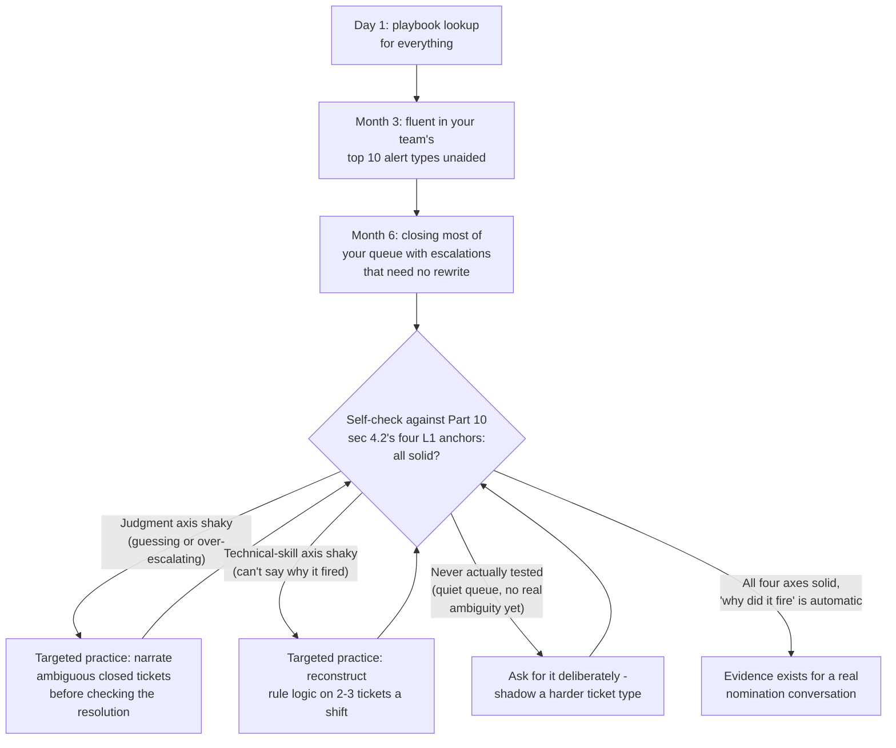

# Part 9 — Surviving and Excelling as an L1 Analyst

## Why this part exists

**[CONCEPT]** Somewhere around your third month on a real queue, the job stops being a training exercise and starts being your actual job, and nobody rings a bell to mark the transition. This part is about that stretch — the first 12 to 18 months on a live L1 seat — and it answers one question only: what do you, personally, do during that stretch that either builds toward a fast L2 nomination or quietly builds toward a plateau instead. It is not a study plan (that's Part 10, which sequences the reading and home-lab projects this part assumes you're doing in parallel) and it is not a description of how your organization will eventually score you.

**[CONCEPT]** That second point is worth being explicit about, because this part sits directly on top of material the SOC Manager's Operating Handbook, Part 10 — Competency Models & Skills Matrices already owns from the other side of the desk. That book's §4.2 defines the observable L1 anchors a reviewer checks against on four axes — technical skill, tool proficiency, communication, and judgment — and names exactly what evidence a manager goes looking for on each one. This part does not redefine those anchors, recompute how they're scored, or describe the committee process that eventually consumes them; that stays where it belongs. What this part does is walk through the first year from your chair, showing you what generates that evidence as a byproduct of doing the job well, rather than as a project you run separately to impress a reviewer. If you've read Part 2 — Reading the Machinery From Below, this part is where the self-scoring habit that chapter builds actually gets fed real material to score.

**[CONCEPT]** The arc below follows the shape the first year actually takes, not a tidy list of skills: what the ramp genuinely feels like, playbook fluency as a staged skill rather than a switch that flips, adjusting to shift work without losing the plot, the specific discipline an escalation requires, judgment exercised on a short leash before you have the authority to exercise it freely, and — the section this part cares about most — the single habit that predicts, better than raw ticket volume or tenure, whether you're headed for a nomination inside 18 months or a plateau that quietly becomes permanent.

## 1. The first 90 days: what actually happens to a new L1

### 1.1 The ramp curve nobody puts in the offer letter

**[L1/L2]** The onboarding deck almost always implies a two- to four-week ramp: shadow a few shifts, pass a knowledge check, get handed a live queue. What actually happens for most new L1 analysts is closer to 90 days before the job stops feeling like translation work — reading an alert, mentally converting it into "which playbook is this," flipping to that playbook, and reading each step as if for the first time, even on an alert type you closed yesterday. That's not a sign you're behind. It's the default shape of building fluency in a genuinely new vocabulary of tools, field names, and organizational context, all at once, under a live SLA clock.

> **Ground Truth**
> "You'll be fully ramped in two weeks" is standard onboarding language and is rarely true for anyone starting L1 with no prior hands-on SOC experience. The real number is closer to 90 days to stop needing the playbook open for your team's 10 most common alert types, and closer to six months before your handle time on those alert types looks like everyone else's. If you're three weeks in and still slow, that's on schedule, not a warning sign — the actual warning sign is being six months in and still needing the playbook open for alert types you close weekly.

**[L1/L2]** The concrete cost of this curve is less about speed and more about confidence calibration: a new analyst who feels behind because they're not yet fast tends to either escalate defensively (passing along anything even mildly unfamiliar, to avoid being wrong) or push through too fast on things they don't actually understand yet (closing a ticket because the pattern looks familiar, not because they checked it). Both habits are corrections for the wrong problem. Slow is expected at 90 days. Escalating without reasoning, or closing without checking, is the thing worth catching early — see §5 for the shape that actually should take.

### 1.2 Alert volume vs. alert comprehension

**[L1/L2]** A queue that hands you 40 alerts a shift teaches you something different depending on whether you're closing them by pattern-matching to yesterday's tickets or by actually checking what fired each time. Closing 40 tickets by pattern-matching alone produces a fast analyst who has built almost no transferable judgment — the habit that actually separates a fast nomination from a plateau, covered in full in §6, starts exactly here, in month one, not later once you feel "ready" to think harder about it. The habit is cheap to start early and expensive to retrofit after a year of pure pattern-matching, because a year of pattern-matching also builds a year of confidence in an unexamined process.

## 2. Playbook fluency: three stages from lookup to instinct

### 2.1 Stage one — following the steps

**[L1/L2]** Fluency with a playbook starts as literal, step-by-step lookup: read step 1, do exactly what it says, read step 2, and so on, with the playbook document open the entire time. This stage is not a problem to fix quickly — a new analyst who skips it and works from memory too early is the analyst who misses the one field a playbook update added last month, because they stopped actually reading it. Stage one done well means reading every step every time, even the ones you're sure you remember, until the SLA clock tells you that you don't need to anymore.

### 2.2 Stage two — anticipating the steps

**[L1/L2]** The second stage shows up as a specific, checkable behavior: you read the alert and already know which playbook step is coming next, before you look. You're not skipping steps — you're confirming them faster because you've internalized the shape of the investigation. This is the stage most L1 analysts reach for their team's most common five to 10 alert types somewhere in month two or three, and it's also the stage where handle time starts converging toward the team median, which is one of the concrete data points SOC Manager's Handbook Part 10 §4.2 checks under the technical-skill and tool-proficiency axes.

### 2.3 Stage three — deviating with a reason

**[L1/L2]** The third stage is the one that actually matters for a nomination, and it's rarer than most new analysts assume it is by their own self-assessment: recognizing when this specific alert, despite matching the playbook's trigger condition, doesn't fit the playbook's assumed scenario, and being able to say specifically why before you deviate from the documented steps. A playbook is written for the typical case a rule was tuned against; a real environment produces edge cases the playbook's author never saw. Stage-three fluency is not "ignore the playbook when it's inconvenient" — it's "follow the playbook, and also notice out loud when this ticket's actual data doesn't match what the playbook assumes, before you decide what that means for disposition."

> **Analyst's Note**
> A genuinely useful test of your own stage-three fluency: pull up a playbook for an alert type you close constantly, and try to write, from memory, the one sentence that explains *why* the playbook's trigger condition catches what it's trying to catch. If you can only recite the steps and not the reason the steps exist, you're still solidly in stage two — which is fine at month three and a real gap at month nine.

## 3. Adjusting to shift work without losing the first year

### 3.1 The specific costs of rotating and night shifts

**[MINDSET]** If you asked about shift pattern and on-call reality before accepting the offer — Part 8 covers exactly that question list for a candidate still deciding — you already know roughly what you signed up for. Living inside it is a different problem than anticipating it. A rotating schedule or a permanent overnight shift costs you two things that matter directly to the skills this part is about: it shrinks the overlap window you share with the analysts and team leads who could otherwise mentor you in real time, and it degrades the sleep quality that ambiguous-call reasoning specifically depends on — judgment under time pressure is one of the first cognitive skills to degrade under sleep debt, well before raw alertness does.

**[MINDSET]** The mentorship gap is the more fixable of the two, and it's worth naming as a real cost rather than something to just tolerate: a new analyst on a permanent overnight shift genuinely gets fewer unscripted minutes with a senior analyst than a day-shift peer does, purely because fewer senior people are awake and online at the same time. That's not a reason to avoid an overnight seat if it's the seat available to you — it's a reason to be deliberate about capturing the overlap minutes you do get (shift handoff, the last 20 minutes before a senior peer logs off) rather than assuming mentorship will happen passively the way it might on a day shift.

### 3.2 What to actually control

**[MINDSET]** You can't control the roster, but you can control a short list of things that determine whether shift work costs you your first-year ramp or just costs you convenience: a consistent sleep anchor even across a rotating pattern (the same core sleep window every workday, rather than a schedule that shifts by hours each week), deliberately using shift-handoff minutes to ask one specific question rather than a vague "anything I should know," and treating a quiet overnight shift as study time for the material in Part 10's curriculum rather than as dead time to get through. If the pacing genuinely isn't sustainable past the first few months, that's a real signal worth taking seriously rather than pushing through silently — Part 23 covers self-diagnosing fatigue versus a genuine skill plateau in depth, and this part isn't the place to relitigate that distinction, just to flag that it exists.

## 4. Escalation discipline: building toward a bar you can already read

### 4.1 What "good" is measured against

**[L1/L2]** SOC Playbook Handbook, Part 27 — Escalation Quality already defines, in mechanical detail, what a good hand-off contains: the specific fields, the framing, the information a Tier 2 analyst needs to pick the case up cold with no follow-up question. This part doesn't re-derive that standard — go there for the actual checklist of what belongs in a well-formed escalation. What belongs here is narrower: the personal habit that gets you to consistently produce that standard, unprompted, on a real queue under time pressure, rather than only on the one escalation a team lead happens to review this week.

**[L1/L2]** The SOC Manager's Operating Handbook, Part 10 §4.2 names the L1 communication anchor a reviewer checks for directly: escalation notes that meet the Playbook Handbook's Part 27 bar with no rewrite needed. That's the organization's side of the evaluation — a manager sampling your written escalations and checking whether they land clean. Your side of it is simpler to state and harder to sustain: write every escalation as if the person receiving it has zero context beyond what's on the ticket, every time, not just when you remember to.

### 4.2 What you personally do before you hit submit

**[L1/L2]** A concrete personal check that catches most of the gap between "technically complete" and "no rewrite needed": before you submit an escalation, read it back once as if you are the Tier 2 analyst receiving it cold, with no memory of having worked the ticket yourself. Ask specifically whether you'd need to ask a clarifying question before acting on it. If the honest answer is yes, the escalation isn't done — the clarifying question you'd ask is the exact thing missing from the note.

**[L1/L2]** Track your own rewrite rate deliberately for the first six months, even informally. If your team lead sends anything back with "can you add..." more than occasionally, that's not a character flaw — it's a specific, fixable pattern, and the fix is almost always the same short list of omissions (what you ruled out and why, not just what you found; the exact field values that triggered the call, not a paraphrase; what you'd want checked next if you're wrong). A rewrite rate that's trending down month over month, on its own, is evidence — the kind SOC Manager's Handbook Part 10 §4.2 samples for directly on the communication axis.

> **Cross-Book Pointer**
> This part does not restate what a mechanically complete escalation contains — SOC Playbook Handbook, Part 27 — Escalation Quality owns that checklist in full, field by field, and SOC Playbook Handbook, Part 29 — Playbook Severity Model owns how severity gets scored on the alert you're escalating. Read both before your first real escalation if you can; come back here for the habit of consistently producing that standard once you know what it actually looks like.

## 5. Judgment on a leash: escalate, guess, or reason it through

### 5.1 The three responses to an ambiguous call

**[L1/L2]** Every ambiguous ticket gets one of three responses, and only one of them builds anything. The first is guessing — picking a disposition because the ticket needs to close and you're not sure, without surfacing the uncertainty to anyone. The second is reflexive escalation — passing along anything that isn't obviously clear-cut, without attaching your own reasoning, as a way of avoiding the risk of being wrong. The third is reasoning it through and then choosing correctly between closing it yourself (on the clear-cut cases the severity model actually covers) and escalating it with your reasoning attached (on the genuinely ambiguous ones) — which is exactly the L1 judgment anchor SOC Manager's Handbook Part 10 §4.2 names: apply the severity model consistently on the clear cases, and escalate the genuinely ambiguous ones instead of guessing.

**[L1/L2]** The second response — reflexive escalation — feels safe and is actually the more corrosive of the two failure modes over a full year, because it doesn't look like a mistake in the moment. Nobody gets in trouble for escalating too much. But an L1 analyst who escalates every borderline call never builds a track record of resolving ambiguity correctly, which means there's no evidence to point to when a nomination conversation eventually happens — not "not yet met," but genuinely never tested, the same gap SOC Manager's Handbook Part 10 §8 names from the reviewer's side. You can't get credit for judgment you never had the chance to demonstrate.

> **Career Trap**
> Escalating every borderline call to stay safe feels like the responsible choice, and it costs you exactly the evidence a fast L2 nomination depends on. The fix isn't to start guessing instead — it's to escalate genuinely ambiguous calls *with your own reasoning and proposed disposition attached*, explicitly framed as "here's what I think this is and why, flagging it because I want a second opinion before I commit," rather than a bare "not sure, escalating." The second version still gets the safety of a second reviewer and also generates the exact judgment-axis evidence a bare escalation never does.

### 5.2 Building the muscle without the authority yet

**[L1/L2]** You don't have to wait for L2 authority to build L2-shaped judgment. On every escalation you send with reasoning attached, write down what you'd have done if it had been entirely your call, before you find out how it was actually resolved. This costs nothing extra in the moment — you're already reasoning through the ticket to write the escalation — and it turns every ambiguous ticket you touch into a small, low-stakes test of your own judgment against a real outcome, with the resolution as the answer key. Do this consistently for a few months and you'll have a personal, dated record of ambiguous-call reasoning that's worth more than any self-assessment you could write from memory later.

## 6. The habit that actually separates a fast L2 nomination from a plateau

### 6.1 What "why did this fire" means, mechanically

**[L1/L2]** The single habit this part cares about most is this: after you disposition a ticket, before you move to the next one, ask specifically what in the underlying data caused the match — not "what category of thing is this," but "what field, what threshold, what sequence of events actually tripped the analytic." Detection Engineering Handbook V2, Part 1 — Detection Engineering Foundations lays out the exact vocabulary this question needs — event, signal, analytic, detection rule, alert — walking one real captured behavior through every layer so the terms stop collapsing into each other. Go there once for the vocabulary; the habit itself is what this section is about.

**[L1/L2]** In practice, the question breaks into three smaller ones you can ask in under a minute, even on a busy shift: what specific field values or event sequence made this alert fire (not the alert's title — the underlying data); would this alert have fired if one specific detail had been slightly different (a different process name, a different time window, a different source); and is the match actually evidence of the technique the alert claims to detect, or is it a coincidental pattern the analytic's logic happens to also catch. That third question is the one that most reliably separates an analyst asking "why" from one just closing tickets by category — it's the question that catches a rule with a real false-positive mechanism, months before anyone runs a formal tuning review on it.

### 6.2 The plateau path, and how it hides

**[MINDSET]** A plateau doesn't announce itself as failure — it shows up as an analyst who is fast, has clean handle-time numbers, and has closed hundreds of tickets, all of which look like exactly the record a nomination should be built on. The gap only shows up when someone asks a question the volume never tested: why did any of these actually fire. An analyst who's closed 400 tickets by pattern-matching to yesterday's tickets has a different, thinner kind of experience than one who's closed 150 tickets while asking why on each one — the second number is smaller and the underlying evidence is stronger on exactly the technical-skill axis a reviewer checks.

> **Career Autopsy — "close fast, ask later"**
>
> **The decision (`CASE-0901`, COMPOSITE CASE EXAMPLE):** An L1 analyst at a mid-sized SOC posts the best handle-time numbers on the team for three straight quarters, closing roughly 30% more tickets per shift than the team median, by building a fast internal shorthand for "this alert type usually means this" and applying it consistently without re-checking the underlying data on repeat alert types.
>
> **Why it seemed reasonable:** The shorthand worked. Dispositions were almost always correct, SLA numbers looked excellent, and nobody flagged a problem for three quarters, because volume and accuracy both looked strong on every dashboard a manager would normally check.
>
> **How it failed:** Nominated for L2 at month 14, the analyst sat for a live ambiguous-ticket walkthrough — the same verification method SOC Manager's Handbook Part 10 §3.4 describes a reviewer using to test the judgment axis directly — and couldn't reconstruct why two of the three sampled alerts had actually fired, only what they usually meant. The technical-skill axis came back "not yet met," not because the analyst had made a single wrong call in 14 months, but because 14 months of fast, correct dispositions had never once required — or built — the underlying reasoning a reviewer could check.
>
> **The fix:** The analyst spent the next 10 weeks deliberately reconstructing the rule logic behind their team's 20 most common alert types from the query text itself, one or two a shift, before returning to the same walkthrough format and clearing the axis on the second attempt. The fix cost 10 weeks that three quarters of "ask why" habit, built in parallel with the ticket volume all along, would have made unnecessary.

### 6.3 Building the habit into your actual shift

**[L1/L2]** The habit is cheap enough to run inside a busy shift if you keep it small and specific: pick two or three tickets a shift — not every ticket, which isn't sustainable — and spend an extra two to three minutes on each actually reading the underlying query or rule logic behind the alert, not just the alert's summary text. Keep a short running note, dated, of what you found: the field that actually triggered it, whether it matched your expectation, and anything that surprised you. This note is not a formal deliverable for anyone else — it's the raw material Part 10's study plan and Part 11's judgment-gap work will both draw on later, and it's also, on its own, evidence of exactly the technical-skill-axis behavior a reviewer is trying to sample when they ask you to walk through a closed ticket live.

> **Field Test**
> **Setup:** Pick five tickets you closed and dispositioned correctly sometime in the last month, across at least two different alert types.
> **Action:** Without looking anything up, write down, from memory, the specific field or event sequence that caused each one to fire. Then go check the actual rule or query logic against what you wrote.
> **Expected result:** If you can reconstruct at least four of the five correctly, the "why did it fire" habit is real and already operating below conscious effort. If you can only describe what each alert type usually means rather than what specifically fired this time, the habit isn't built yet — start with two tickets a shift, per §6.3, rather than trying to apply it retroactively to everything at once.

> **What Would Change My Mind**
> This part treats the "why did it fire" habit as the single strongest individual predictor of a fast L2 nomination, ahead of raw ticket volume or tenure, based on the mechanism argued above: it's the habit that actually generates technical-skill-axis evidence a live walkthrough can check, where volume alone doesn't. If a SOC's own nomination data showed high-volume, low-reasoning analysts clearing the judgment and technical-skill axes at the same rate as analysts who documented this habit consistently, that would undercut the claim, and this section's guidance should shift toward treating the habit as one input among several rather than the load-bearing one.

## 7. Early mindset habits that compound

### 7.1 Documentation discipline under time pressure

**[MINDSET]** The shift you're most tempted to skip a documentation step is the shift you most need it, because a busy queue is exactly when the details you'd normally remember get lost between tickets. The discipline worth building now, while the stakes are low, is writing the disposition reasoning down at the moment you make the call, not reconstructing it later from memory if someone asks. Part 22 covers this habit at full length as one of the cross-tier mindset patterns that predicts growth; this part's version of it is narrower — it's the specific thing that makes the §5.2 and §6.3 habits actually work, because a habit that isn't written down at the time doesn't survive contact with a genuinely busy shift.

### 7.2 Curiosity after the ticket closes

**[MINDSET]** A closed ticket clears the queue and stops being anyone's problem, which is exactly why it's worth deliberately staying curious about a small number of them anyway. The habit isn't reopening closed tickets — it's noticing, occasionally, when something about a resolved case still doesn't sit right, and following that thread for a few extra minutes rather than filing the itch away and moving on. Most of the time this leads nowhere. Occasionally it's how you notice a rule quietly degrading, a pattern repeating across supposedly unrelated tickets, or a disposition that was technically correct but missed something a slightly different question would have caught.

### 7.3 What your own self-assessment can't tell you

**[MINDSET]** Everything in this part so far is something you can build and check largely on your own — reading rule logic, tracking rewrite rates, keeping a reasoning log. One thing you genuinely cannot check on your own is whether your judgment is actually correct, as opposed to merely confident and internally consistent. That's not a flaw in your discipline; it's a structural limit of self-assessment that applies to everyone, which is exactly why SOC Manager's Handbook Part 10 §2 treats "I'd know it if I saw it" as an unworkable standard even for an experienced reviewer grading someone else, let alone for you grading yourself.

> **Blind Spot**
> A reasoning log you keep and grade yourself against tells you whether you're being consistent, not whether you're being correct — you can be confidently, consistently wrong about a specific category of ambiguous call for months and your own log will look clean the entire time, because it only ever checks your reasoning against your own judgment. Get at least a handful of your ambiguous-call reasoning entries reviewed by someone who's actually worked L2 or above, even informally, well before any formal nomination review puts a stranger's judgment against yours for the first time.

## 8. Seeing your own evidence take shape

### 8.1 A self-check worksheet, not the org's evidence packet

**[STUDY PLAN]** SOC Manager's Handbook Part 13 §4.2 describes the evidence packet a promotion committee eventually expects — QA scores, competency-matrix ratings, peer input, a branch-specific work sample. You don't assemble that packet yourself, and this part isn't asking you to try. What you can do, well before any nomination conversation, is check your own first-year progress against the same four axes that packet eventually draws on, using the plain-language version of the L1 anchors below.

The table below is a self-check, not a formal score — use it to spot which axis is genuinely solid, which is still building, and which you honestly haven't had a real chance to test yet.

| Axis | The L1 bar, in plain terms | Ask yourself | Still building | Solid |
|---|---|---|---|---|
| Technical skill | You can explain, from the underlying data, why an alert did or didn't fire — not just what category it belongs to | Could I reconstruct this alert type's trigger logic from memory right now? | — | — |
| Tool proficiency | You pull the exact fields a documented playbook calls for, inside SLA, without help | Do I still need to ask someone where a field lives on alert types I close weekly? | — | — |
| Communication | Your escalation notes get picked up cold, with no rewrite requested | What's my actual rewrite rate over the last month, not my guess at it? | — | — |
| Judgment | You resolve clear-cut severity calls consistently and escalate genuinely ambiguous ones with reasoning attached, instead of guessing or reflexively passing everything along | The last time I escalated, did I attach my own reasoning, or just my uncertainty? | — | — |

**[STUDY PLAN]** A blank, expanded version of this same structure lives in Appendix A1, built to be filled in over time rather than once — the honest way to use it is monthly, not as a single verdict. If an axis comes back "haven't had a real chance to test it," that's a different finding than "still building," and the right response is different too: go looking for the kind of ticket that would actually test it (ask a team lead for one, or shadow a harder case) rather than assuming time alone will eventually supply one.

### 8.2 What this isn't

**[STUDY PLAN]** Filling in that table well doesn't get you promoted, and it isn't meant to. It's meant to make sure that by the time a real nomination conversation happens — whenever that is — you already know which axis is genuinely strong, which one needs a specific, nameable fix, and which one has simply never been tested yet, instead of walking into that conversation with only a vague sense of "I think I'm ready." Part 11 picks up directly from here for the specific work of closing a real judgment gap once you can see it named this clearly; this part's job stops at making the gap visible to you in the first place.

**Figure 9.1 — A first-year L1 self-check timeline, checked against SOC Manager's Handbook Part 10 §4.2's four L1 anchors.** *CONCEPTUAL.* Illustrates the self-assessment loop this part builds — a rough timeline of what fluency typically looks like by month 3 and month 6, feeding into a recurring self-check against the four axes, with a distinct branch for "never tested" versus "tested and still building." This is a design for how to check yourself, not a capture of any individual's actual first-year timeline; timelines in §1.1 and §2 vary by person and by queue. Diagram ID `FIG-0901`.

## Cross-references

This part assumes the four-axis self-scoring habit introduced in Part 2 — Reading the Machinery From Below and hands off directly to Part 10 — The L1 Study Plan and Home-Lab Projects (the sequenced curriculum this part's habits run alongside) and Part 11 — Making the Jump to L2: Closing the Judgment Gap (the deliberate work of closing a gap this part teaches you to see). It touches Part 8 — Interview Prep From the Candidate's Chair for the shift-pattern questions asked before accepting an offer, Part 22 — The Analyst Mindset for the cross-tier documentation and curiosity habits named in §7, and Part 23 — Managing Your Own Burnout, Plateaus, and Career Pacing for shift-adjustment sustainability. Outside this book, it cites SOC Manager's Operating Handbook, Part 10 — Competency Models & Skills Matrices (§4.2's L1 anchors and §3.4's live-walkthrough verification method) and Part 13 — Career Ladders & Promotion Criteria (§4.2's evidence packet) for how the organization evaluates, never restating either mechanic; SOC Playbook Handbook, Part 27 — Escalation Quality and Part 29 — Playbook Severity Model for the technical standards behind §4 and §5; and Detection Engineering Handbook V2, Part 1 — Detection Engineering Foundations for the event/signal/analytic/rule vocabulary §6's "why did this fire" habit depends on.
