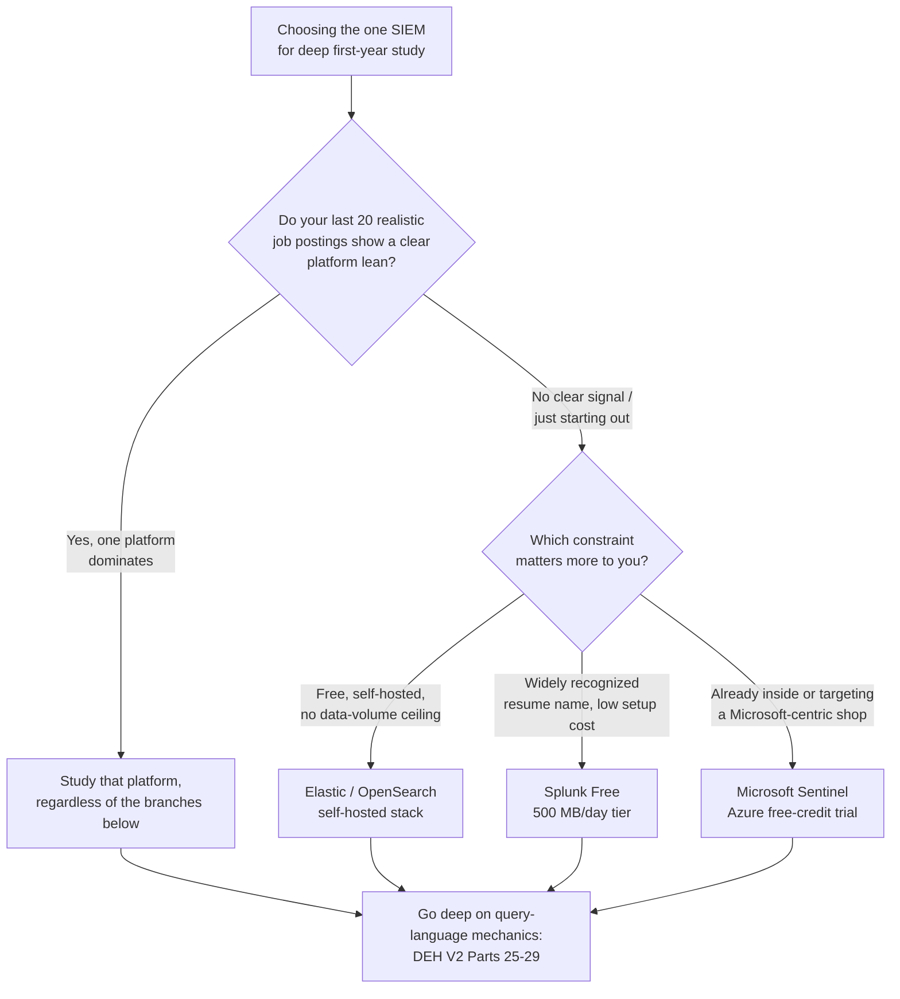

# Part 10 — The L1 Study Plan and Home-Lab Projects

## Why this part exists

**[CONCEPT]** Part 9 covered what the first year on a real queue feels like and the habits that separate an L1 headed for a fast L2 nomination from one who plateaus. This part covers the other half of that first year: what you actually sit down and study, in what order, and what you build in a home lab to turn "I read about this" into "I can do this under time pressure." The two halves aren't optional add-ons to each other — the shift-floor habits Part 9 teaches only compound if you're feeding them real technical depth, and the study plan below only pays off if you're actually applying it against live tickets.

**[CONCEPT]** This part's target is narrow and deliberately shallow in scope: two axes, not four. SOC Manager's Operating Handbook, Part 10 — Competency Models & Skills Matrices scores an analyst against four axes — technical skill, tool proficiency, communication, and judgment. Communication is Part 27 of the SOC Playbook Handbook's territory and this book's own Part 9; judgment is this book's Part 11. This part builds the study plan and home-lab projects for the other two: technical skill (can you reason correctly about what's happening in the data) and tool proficiency (can you act on that reasoning fast enough, in the specific tool in front of you, to matter inside an SLA). Everything below is chosen because it moves one of those two axes, not because it's interesting in the abstract.

**[CONCEPT]** One more scope note before the curriculum starts: this part tells you what to study and build. It does not re-derive how a reviewer will score you on it, how a promotion committee weighs the evidence, or what "meets the L2 floor" actually means as an organizational threshold — that mechanics lives in SOC Manager's Operating Handbook, Part 10, cited throughout below, and Part 13 for the committee side. Your job here is to generate strong evidence. Reading this part as a substitute for that book's own chapters is the exact conflation Part 2 of this book warns against.

## 1. The shape of a first-year curriculum: four pillars, in sequence

**[STUDY PLAN]** The first-year technical curriculum has four pillars, and they're listed here in the order you should actually study them, not alphabetically or by how impressive each one sounds on a resume:

1. Networking fundamentals — enough to read a packet capture, a firewall log, and a proxy log without guessing.
2. Common log sources — the handful of log types and fields that show up in the overwhelming majority of real alerts.
3. One SIEM, studied deeply — not five SIEMs studied shallowly.
4. MITRE ATT&CK as a working vocabulary — not a poster you memorize once and never open again.

**[STUDY PLAN]** The sequencing matters because each pillar is a prerequisite for the next one actually landing. You can't read a Sysmon network-connection event usefully if you don't already know what a TCP three-way handshake and a DNS lookup are doing underneath it. You can't get real value out of a SIEM's query language if you don't yet know which fields in which log source actually matter. And ATT&CK is close to meaningless as a study target until you've triaged enough real alerts across enough log sources to recognize a technique when you see one instead of memorizing a label with no data behind it. Studying these four out of order — the single most common mistake in this curriculum — produces exactly the "sounds fluent, can't disposition anything" gap this book's Part 4 already warns a resume-heavy, lab-light candidate walks into an interview with.

**[STUDY PLAN]** Depth over breadth is the discipline that holds the whole plan together, and it's worth stating as an explicit trade before the pillars get specific: if you have five hours a week outside your shift, spending one hour each on five different SIEM trial accounts this month produces less real skill than spending all five hours in the one you've already chosen. Shallow exposure to five tools looks like more work than deep fluency in one, and it produces a weaker interview answer and a weaker set of home-lab artifacts either way.

> **Career Autopsy — "collect a SIEM trial account for every product on the job board"**
>
> **The decision (`CASE-1001`, COMPOSITE CASE EXAMPLE):** Six months into an L1 role, an analyst notices that different job postings in the local market mention Splunk, Sentinel, QRadar, and Elastic in roughly equal numbers. Reasoning that breadth of tool exposure looks stronger on a resume than depth in one, she spins up free trial or community-edition instances of all four over two months, ingesting the same small sample dataset into each and building one dashboard per platform.
>
> **Why it seemed reasonable:** Every one of the four platforms is genuinely in demand somewhere, "experience with multiple SIEMs" is language she's seen in real job descriptions, and each new trial account felt like closing a gap rather than opening four shallow ones.
>
> **How it failed:** In a first-round technical screen for an L2-adjacent role, the interviewer asked her to build a query joining two data sources with no dashboard already built for it — a five-minute task for anyone genuinely fluent in a query language's join and field-extraction syntax. She could describe conceptually what she wanted the query to do in all four platforms, but couldn't actually write working syntax fast in any of them, because 40 hours spread across four tools is 10 hours of real practice time in each — not enough for any platform's query language to become reflexive rather than something she was still looking up.
>
> **The fix:** She picked the one platform most common in her actual target job postings, deleted the other three trial accounts, and put the next three months entirely into that one — writing every practice query from a blank search bar instead of editing an existing one, until the syntax stopped requiring conscious recall. The tool-proficiency gap the screen exposed closed inside that single quarter; a fifth trial account never would have closed it at all.

> **Cross-Book Pointer**
> This part tells you what to study and build to generate technical-skill and tool-proficiency evidence. It does not define how a reviewer scores that evidence, what the L1 and L2 anchors for those two axes actually say word for word, or how a promotion nomination consumes the result — that's SOC Manager's Operating Handbook, Part 10 — Competency Models & Skills Matrices, §3.1 (technical skill) and §3.2 (tool proficiency) for the organizational side of exactly the same two axes this part builds toward, and §4.2 for the worked L1-to-L2 anchor table a reviewer will actually check your evidence against. Read that section once before starting this plan, so you're building toward a real target instead of a guess at one — then come back here for what you personally do about it.

## 2. Pillar one: networking fundamentals worth your study hours

**[L1/L2]** You don't need a Cisco-track depth of networking knowledge to triage effectively — you need enough to read what a packet capture, a firewall log, or a proxy log is actually telling you, and to stop guessing at what a field like `src_port`, `dst_port`, or a TTL value means. Four topics carry almost all of the real weight:

- The TCP three-way handshake and what a SYN, SYN-ACK, RST, or FIN actually indicates about a connection's state — the difference between "this connection was refused" and "this connection was actively torn down mid-session" shows up constantly in firewall and NDR logs.
- DNS resolution end to end: a query, a response, what a CNAME chain looks like, and what an NXDOMAIN actually means versus a legitimate empty response.
- HTTP/HTTPS request and response structure well enough to read a proxy log line: method, host, URI, status code, user-agent, and why a 403 is a materially different signal from a 500.
- Enough subnetting and CIDR notation to read `10.0.4.0/22` and know instantly whether two IP addresses are on the same segment, without running a calculator.

**[L1/L2]** Study this with a packet analyzer open, not a slide deck. Wireshark (free) reading your own machine's traffic, or a small sample capture from a public repository of test pcaps, teaches the handshake and DNS flow far faster than a diagram, because you're matching the concept to bytes you can actually click on and inspect.

> **Field Test**
> **Setup:** Capture 10 minutes of your own normal browsing traffic in Wireshark, on any machine you're allowed to capture from, then close the tool without looking at it yet.
> **Action:** Re-open the capture 24 hours later and, without any online lookup, identify: one full TCP handshake and its teardown, one DNS query/response pair, and one HTTP request with its response status code — writing down what each one means in one sentence, timed at three minutes per item.
> **Expected result:** You should be able to point at all three inside the time limit and explain them correctly in your own words. If you can't find a DNS query/response pair inside three minutes of your own everyday traffic, the gap isn't obscure networking theory — it's basic filter syntax and traffic-pattern recognition, and it's worth another week before moving to pillar two.

**[STUDY PLAN]** This is the one pillar with a genuinely low ceiling for a triage-focused first year — you're not studying networking to become a network engineer, and CCNA-depth routing-protocol material is a poor use of your five weekly study hours this year. Once you can reliably read the four items above out of real traffic, move on. Detection Engineering Handbook V2, Part 3 — Telemetry Engineering I: Host & Identity Sources and Part 4 — Telemetry Engineering II: Network, Application & AI Sources go far deeper on what each network log source captures and where it lies to you; that depth is worth returning to once pillar three gives you a SIEM to actually query that telemetry in.

## 3. Pillar two: common log sources, known cold

**[L1/L2]** A first-year analyst doesn't need encyclopedic knowledge of every log source a mature SOC ingests. You need a small, memorized core of sources and fields that show up in the overwhelming majority of real alerts, known well enough that you're not context-switching to a reference doc mid-ticket for the basics.

**[STUDY PLAN]** The table below sequences the log sources worth memorizing first, in the order they're likely to actually appear in your queue.

| Log source | What it tells you | Fields worth knowing cold | Depth reference |
|---|---|---|---|
| Windows Security Event Log | Logons, logoffs, privilege use, account changes | Event ID 4624/4625 (logon/failed logon), 4688 (process creation, if enabled), 4720/4732 (account/group changes), Logon Type | DEH V2 Part 8 — Windows Detection Engineering |
| Sysmon | Process creation, network connections, file/registry changes with a parent-child process chain | Event ID 1 (process create), 3 (network connection), 11 (file create), `ParentImage`/`CommandLine` | DEH V2 Part 9 — Sysmon Detection Engineering |
| Firewall / proxy | Allowed and blocked connections, web categories, bytes transferred | Source/destination IP and port, action (allow/deny), URL category, bytes in/out | DEH V2 Part 4 — Telemetry Engineering II |
| DNS query logs | What domains a host actually resolved, regardless of what it later connected to | Queried domain, record type, response code, resolving client | DEH V2 Part 4; Part 15 — DNS Detection Engineering |
| EDR alert/telemetry | Vendor-classified behavior plus the same process-lineage detail Sysmon captures, usually richer | Alert classification, process tree, file hash, MITRE technique tag if the vendor supplies one | DEH V2 Part 3; Part 11 — Endpoint Detection Engineering |
| Cloud control-plane logs (if your environment has any) | Who did what administrative action, from where, using which credential | Actor identity, event/action name, source IP, MFA status | DEH V2 Part 19 — Cloud Infrastructure Detection Engineering |

**[STUDY PLAN]** Notice what isn't on this list yet: email headers, Kerberos ticket fields, WAF-specific signals, and most cloud-identity telemetry. Those are real and eventually worth knowing, but they show up less often in a generalist L1 queue's first year than the six rows above, and Detection Engineering Handbook V2's Appendix A1 — Windows & Endpoint Telemetry Field Reference and Appendix A2 — Identity & Application Telemetry Field Reference are the right place to look them up the first few times you actually need one, rather than front-loading all of it into month one.

> **Analyst's Note**
> Don't try to memorize a field reference sheet cover to cover. Instead, every time a real ticket sends you to look up a field you didn't already know, write it on a running list. After a month, that list is a far better personalized study sheet than any generic one, because it's ranked by what your specific queue actually throws at you — not by what a textbook's author guessed a generic SOC sees most.

## 4. Pillar three: one SIEM, studied deeply

**[STUDY PLAN]** Pick one SIEM and commit to it for the rest of your first year. The choice matters less than the commitment — a self-hosted Elastic stack, Splunk's free tier, or a Microsoft Sentinel trial will all teach you real, transferable query-language reasoning if you actually go deep in one of them, and none of them will if you spread 10 hours a month across three.

### 4.1 Picking the one

**[STUDY PLAN]** Weigh two things, in this order: first, does your actual target job market show a clear lean toward one platform (check the last 20 postings you'd realistically apply to, not a general industry survey); second, if there's no clear signal, pick based on which constraint matters more to you — free self-hosted depth with no data-volume ceiling (an Elastic or OpenSearch stack you run yourself) versus a lower setup cost with a widely recognized name on a resume (Splunk's free tier, capped at 500 MB of daily ingest) versus proximity to a Microsoft-centric enterprise environment (a Sentinel trial backed by Azure free credits).



**Figure 10.1 — Choosing the one SIEM to study deeply in your home lab.** *CONCEPTUAL.* Illustrates the decision path this section describes — job-market signal first, then a self-hosted-depth-versus-recognized-name tradeoff if the market gives no clear answer — not a claim that one platform is universally correct. Diagram ID `FIG-1001`.




### 4.2 What "deep" actually means

**[STUDY PLAN]** Depth here means four concrete, checkable things, not a vague sense of comfort with the interface:

- You can write a query against raw, unindexed data from a blank search bar — no saved search, no example to edit — to answer a specific question, in a time budget comparable to how long it would take an experienced analyst to do the same lookup manually.
- You know the platform's field-extraction quirks well enough to know when a field you expect isn't there, and why (a parser gap, a schema change, a source that never populated it).
- You've built at least three dashboards or saved searches from scratch, each answering a real triage question a documented playbook step would ask (not aggregations you invented for their own sake).
- You can join or correlate across at least two different log sources inside the platform without external documentation open.

**[STUDY PLAN]** Notice that none of these four is "you passed a vendor certification exam." A certification in the platform you've chosen is a reasonable, optional addition once the four items above are real — Part 6 covers the timing tradeoff — but it's evidence of exam performance, not of the query-writing fluency a real screen or a real shift actually tests.

**Detection Engineering Handbook V2 owns the query-language mechanics themselves, not this part.** Part 23 — Query Language Strategy walks one canonical detection through all six major query surfaces before the language-specific parts go deep individually; Part 25 — KQL (Sentinel/Defender), Part 26 — Splunk SPL, Part 27 — QRadar AQL, and Part 29 — Elastic (EQL/KQL/ES|QL) each cover syntax, joins, and performance at scale for the platform you've picked. Appendix A5 — Query Language Quick Reference is the fastest lookup once you already know roughly what you're trying to write and just need the exact syntax.

## 5. Pillar four: MITRE ATT&CK as a working vocabulary

**[CONCEPT]** ATT&CK's actual value to a first-year analyst isn't as a body of knowledge to memorize — it's as a shared vocabulary that lets you and a detection engineer, a threat hunter, or a more senior analyst describe the same behavior in the same terms without a paragraph of explanation each time. "This looks like T1059.001" carries more information, faster, than "this looks like someone running weird PowerShell stuff," and it's the difference between sounding like you've studied a poster and sounding like you actually use the framework.

> **Ground Truth**
> A lot of career-changer material treats "memorize the ATT&CK matrix" as a first-week goal, and it's mostly the wrong instinct for an L1 analyst specifically. The matrix currently covers hundreds of techniques and sub-techniques across more tactics than any generalist queue will throw at you evenly — memorizing all of it before you've triaged a single real alert produces labels with no data behind them, which evaporates under any real follow-up question. Learn the 20 to 30 techniques that actually recur in your own environment's alerts first, cold, and expand outward from there as your queue actually exposes you to new ones.

**[STUDY PLAN]** A practical sequence: for your first month on ATT&CK, don't study the matrix in the abstract at all — instead, every time you close a ticket, spend two minutes tagging it with the tactic and technique ID it actually maps to (initial access, execution, persistence, credential access, and lateral movement cover most of what a generalist L1 queue sees). Keep that tag list. After 30 tickets, you'll have a personal, environment-specific short list of the 15 to 20 techniques that actually recur — study those specifically, in depth, before expanding to anything you haven't yet seen live.

> **Field Test**
> **Setup:** You've been tagging closed tickets with ATT&CK technique IDs for at least three weeks, per the sequence above.
> **Action:** Pull five already-tagged tickets at random. Without looking at your own prior tag, re-derive the tactic and technique from the raw alert data alone, timed at five minutes each, then compare against what you tagged the first time.
> **Expected result:** You should match your own prior tag, or land on a defensible adjacent sub-technique, on at least four of the five. If you're missing more than that, the gap usually isn't ATT&CK knowledge — it's that the underlying technical-skill reasoning (what the data is actually showing) isn't solid yet, and that's worth returning to pillars two and three before pushing further into the framework.

**[STUDY PLAN]** Detection Engineering Handbook V2's Appendix A4 — MITRE ATT&CK Mapping Quick Reference cross-references every technique to the specific detection content elsewhere in that book — useful once you want to go deeper on a technique your own tagging habit has surfaced as a recurring one, rather than as a starting point.

## 6. Home-lab projects that build the axes a reviewer will actually check

**[STUDY PLAN]** Reading builds the technical-skill axis only partway — the tool-proficiency axis specifically requires hands-on repetition inside a real platform, timed, without a dashboard someone else already built for you. The home-lab project below is designed to produce exactly that evidence, mapped directly onto the L1 anchors SOC Manager's Operating Handbook, Part 10, §4.2 names: "maps an alert to the correct playbook step unaided" for technical skill, and "pulls the exact fields a documented playbook calls for, within SLA, unaided" for tool proficiency.

### 6.1 The ingestion-and-investigation lab `[HOME LAB — companion volume not yet written]`

**[L1/L2]** If you already built the small ingestion lab this book's Part 5 describes before landing your first role, this project extends it rather than replacing it. If you're starting from nothing, here's enough detail to build it now — the planned SOC Home Lab Handbook will eventually own deeper step-by-step build instructions for a project like this one, but this section carries enough detail to attempt it stand-alone in the meantime:

- **Minimum topology:** two virtual machines — one Windows host running Sysmon (a modular config such as the widely used SwiftOnSecurity or Olaf Hartong baseline is a reasonable starting point, tuned down if it's too noisy for your VM's resources) and Windows Event Forwarding or a lightweight forwarder pointed at your chosen SIEM; one Linux host running an agent (Filebeat, or your SIEM's own universal forwarder) shipping `auditd` and SSH authentication logs. Add a third source if you can: a virtual firewall (pfSense or OPNsense) or a Suricata sensor on a mirrored interface, shipping connection and alert logs into the same SIEM.
- **Ingestion target:** the one SIEM you chose in §4 — this project is explicitly not an excuse to spin up a second platform.
- **Minimum deliverables, each built from a blank search bar with no template:** three saved searches or dashboards, each reconstructing one specific triage step a real playbook would document — for example, "given a suspicious logon alert, pull the account's last 10 logon events across both hosts with source IP and logon type," "given a suspicious outbound connection, pull the parent process chain that spawned it," and "given a DNS query for a flagged domain pattern, pull every host that queried it in the last 24 hours."
- **A timed field-pull drill, run monthly:** pick a specific field from the log-source table in §3 you haven't queried recently, and time yourself pulling it correctly, unaided, from raw data. Track the times in a simple log. A downward trend over months is your own tool-proficiency evidence, independent of anyone else's assessment of it.

**[STUDY PLAN]** Keep at least one part of this lab actively changing — add a new log source, rebuild a dashboard against a different question, or re-run the timed drill against a field you haven't touched in months. A lab built once, screenshotted, and never touched again proves you could do the exercise a single time; it doesn't prove the ongoing fluency the tool-proficiency axis is actually checking for.

### 6.2 Mapping the lab back to the axes

**[STUDY PLAN]** The table below is a self-scoring worksheet — a practical checklist for judging your own readiness before you ever sit down with a reviewer, not a substitute for that reviewer's own evidence-gathering process (a QA sample, a timed practical exercise, a live walkthrough — see SOC Manager's Operating Handbook, Part 10, §6 for how that evidence actually gets collected on the organization's side).

| Checkpoint | "I've read about this" | "I can actually do this" | Axis it feeds |
|---|---|---|---|
| Reading a packet capture | Can define a handshake, DNS query, HTTP request in the abstract | Correctly identifies all three in a real capture, unaided, inside 3 minutes each (§2 Field Test) | Technical skill |
| Log-source fluency | Can list common fields from memory | Pulls the exact field a ticket needs, from raw data, inside a realistic SLA | Tool proficiency |
| SIEM query-writing | Can explain what a query should do | Writes it from a blank search bar, correctly, without external documentation | Tool proficiency |
| Dashboard/saved-search building | Has seen example dashboards in training material | Has built three from scratch that answer a real triage question | Technical skill + Tool proficiency |
| ATT&CK mapping | Can name tactics and techniques from a reference sheet | Correctly re-derives a technique from raw alert data, unaided (§5 Field Test) | Technical skill |

**[STUDY PLAN]** A blank, fillable version of this same worksheet, alongside the study-plan calendar in §7, lives in the L1 study-plan calendar template (`TMPL-1001`), filed in this book's Appendix A3 — Resume, Portfolio & Study-Plan Templates. Use it monthly, not once — a single self-score at the start of the year tells you where you're starting; a repeated one tells you whether the plan is actually working.

## 7. Sequencing the year: a worked calendar

**[STUDY PLAN]** The block below sequences the four pillars and the home-lab work into a 12-month plan, assuming roughly five study hours a week outside your actual shift — the same baseline assumption this book's Part 5 uses, adjusted down if your shift pattern genuinely doesn't allow it (per this book's own guidance: cut the pace, don't cut the home-lab time).

```text
TEMPLATE — First-year L1 study-plan calendar, permanent ID TMPL-1001
CONCEPTUAL SAMPLE — illustrative pacing, not a validated benchmark; adjust to your own shift pattern.

Months 1–2   Pillar 1 (networking fundamentals) + Pillar 2 (log sources), studied together.
             Home lab: stand up the two-VM base topology from §6.1; no dashboards yet.
             Checkpoint: §2 Field Test passes cleanly before moving on.

Months 3–5   Pillar 3 begins: pick the one SIEM (§4.1), ingest the home-lab sources into it.
             Study: platform fundamentals, field extraction, blank-search-bar query practice.
             Home lab: build the first of the three §6.1 saved searches/dashboards.
             Checkpoint: can write a simple query from a blank search bar, unaided, in a
             time budget comparable to an experienced analyst's, on at least 3 of 5 attempts.

Months 6–8   Pillar 3 deepens: cross-source joins/correlation inside the chosen SIEM.
             Pillar 4 begins in parallel: start the per-ticket ATT&CK tagging habit (§5).
             Home lab: finish all three §6.1 dashboards; start the monthly timed field-pull drill.
             Checkpoint: §5 Field Test passes on at least 4 of 5 sampled tickets.

Months 9–10  Consolidation: re-run the §6.2 self-scoring worksheet in full.
             Address whichever row is weakest with 2 extra weekly hours, not a new pillar.
             Home lab: rebuild at least one dashboard against a new question — don't leave
             the lab static.

Months 11–12 Portfolio pass: write up the home-lab build and its three dashboards as a short,
             sanitized artifact (this book's Part 7 owns the writeup format).
             Re-run the §6.2 worksheet once more; compare to the month-9/10 pass.
             Forward-look: read SOC Manager's Operating Handbook Part 10 §4.2's L2 column
             and this book's Part 11 before your own next review cycle, not after it's
             already scheduled.
```

**[STUDY PLAN]** This calendar is illustrative pacing, not a fixed law — a reader coming in with prior networking or IT-helpdesk experience should compress months 1 through 2 and push the freed time into pillar three; a reader with zero prior technical background should expect months 1 through 2 to run closer to three months and should not compress the home-lab work to compensate.

## 8. Self-assessment discipline: are you learning, or just consuming

**[MINDSET]** The honest failure mode of any self-run study plan is mistaking exposure for skill — you watched the video, read the chapter, or clicked through the vendor's guided tour, and it feels like progress because attention was paid and time passed. None of that is the same as being able to reproduce the skill cold, under a timer, with nobody walking you through it. Every Field Test in this part exists specifically to catch that gap before an interviewer or a reviewer catches it for you.

**[MINDSET]** A rough but useful ratio to hold yourself to: spend at least as much weekly time actually building, querying, and drilling as you spend reading or watching. If a study log shows six hours of video content and zero hours with your hands actually in the SIEM in a given month, that month produced almost no tool-proficiency evidence, regardless of how much material got covered.

> **Blind Spot**
> Running every Field Test in this part solo, checked only against your own memory of what "should" have happened, validates that you can produce an answer under time pressure. It does not validate that the answer is correct, because you have no independent check on your own reasoning. Get at least one Field Test in this plan reviewed by someone who's actually triaged real alerts before — a shift lead, a more senior peer, or even a single paid hour with a working analyst if nobody at your own employer has the bandwidth. A confident wrong answer, rehearsed and re-confirmed only by yourself, is a worse outcome than an unconfident right one.

> **What Would Change My Mind**
> This part bets that one SIEM studied deeply produces stronger technical-skill and tool-proficiency evidence than the same study hours spread across several platforms, based on the pattern this book's own hiring-side chapters (Part 6, Part 8) describe from real technical-screen feedback. If structured evidence from a real hiring or promotion pipeline showed candidates with broad, shallow multi-platform exposure clearing technical screens at a comparable rate to candidates with deep single-platform fluency, that would undercut this part's central sequencing bet, and the guidance above should shift toward treating platform breadth as at least a partial substitute for platform depth in a first-year plan.

## 9. Common ways this plan gets derailed

**[MINDSET]** Two failure patterns account for most derailed first-year study plans, and both are avoidable once they're named.

**[STUDY PLAN]** The first is pillar-skipping under manager or team pressure to "get certified fast" — starting pillar three, or a certification built on top of it, before pillars one and two are actually solid. The result is a candidate who can navigate a SIEM's interface but can't explain what the query result actually means, which is a materially weaker position in a real technical screen than the reverse.

**[STUDY PLAN]** The second is treating the home lab as a one-time deliverable instead of a standing habit — building it once for an interview or a portfolio screenshot, then never touching it again. Section 6.1 already names the fix: keep at least one part of the lab actively changing, every month, for the whole year.

> **Career Trap**
> Chasing a second or third certification in a different platform before your chosen SIEM's fluency checkpoints in §4.2 are all genuinely met feels like forward progress — a new credential, a new line on a resume — but it's study time and exam-fee money spent on the axis you've already invested in least efficiently, while the tool-proficiency gap a real technical screen tests stays open. The fix: hold the line at one certification matched to your actual next move, per this book's Part 6, and put the freed hours into finishing this part's home-lab checkpoints instead.

## Cross-references

This part assumes the L1/L2 tiering vocabulary from SOC Manager's Operating Handbook, Part 3 — Tiering Models: L1/L2/L3 and Beyond, and builds directly toward the technical-skill and tool-proficiency anchors defined in that book's Part 10 — Competency Models & Skills Matrices, §3.1–§3.2 and §4.2, without re-deriving how those anchors are scored or how a nomination consumes the evidence (Part 13 — Career Ladders & Promotion Criteria). It cites Detection Engineering Handbook V2, Parts 3–4 and 8–9 for telemetry depth, Parts 23–29 for query-language mechanics, and Appendices A1, A2, A4, and A5 for field- and technique-level reference. Inside this book, it extends the home-lab foundation from Part 5, hands off communication and judgment evidence-building to Part 9 and Part 11, and forward-references Part 6 (certification sequencing), Part 7 (portfolio writeups), and Part 12 (the L2 study plan, where detection-tuning practice formally begins).
