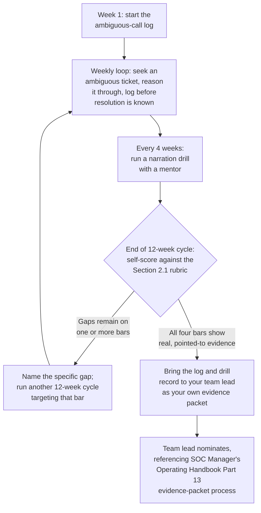

# Part 11 — Making the Jump to L2: Closing the Judgment Gap

## Why this part exists

**[CONCEPT]** Somewhere in most L1 analysts' second year, a nomination stalls, and nobody involved can point to exactly why. Handle time is fine. QA scores are fine. Nobody's written up a communication problem. The nomination just doesn't move, the feedback is vague, and the analyst is left holding a "not yet" with no specific gap to close. SOC Manager's Operating Handbook, Part 10 — Competency Models & Skills Matrices names the axis that's almost always hiding behind that exact stall: judgment. Of the four axes that gate a tier change — technical skill, tool proficiency, communication, and judgment — judgment is the one a manager is least likely to have tested directly, because it's the hardest to observe in a clean exercise, and it's the one a strong L1 track record can look like you've already built when you haven't.

**[CONCEPT]** This part is not about how a manager scores that axis, runs the committee, or decides your case. That mechanic belongs entirely to the SOC Manager's Operating Handbook, and re-deriving it here would just be a worse copy of a chapter that already exists. This part is about the narrower, more personal question sitting underneath that organizational machinery: what do you, specifically, do — starting this week, months before anyone convenes a review about you — to make sure the judgment axis is genuinely built, not just assumed, by the time someone finally checks it. That means deliberately seeking out the ambiguous tickets your queue is quietly structured to let you avoid, narrating your reasoning to someone who already knows the answer before they tell you, and keeping a record of your own ambiguous calls specific enough that you can hand it to a reviewer as evidence instead of a feeling.

**[CONCEPT]** One more framing point before the mechanics: closing the judgment gap is not a certification you either have or don't. It's a habit you build reps toward, the same way handle time improves through repetition rather than a single insight. Everything below is built around generating those reps deliberately, because a queue left to its own devices will not generate enough of them for you on its own — and the analyst who waits for ambiguity to show up, rather than going looking for it, is the analyst most likely to be the one holding the vague "not yet" a year from now.

## 1. Why judgment is the axis that actually stalls a nomination

### 1.1 The gate rule, from your side of the desk

**[L1/L2]** The most important structural fact to understand about how you'll be evaluated is this: a competency matrix gates each tier transition on every axis clearing its floor independently, not on an average across the four. SOC Manager's Operating Handbook, Part 10 §4.1 states the reasoning plainly — an analyst who's excellent at technical skill and tool proficiency but weak on judgment isn't "roughly L2 on average," because a fast, confident, technically sound wrong call does more damage before anyone catches it than a slow, cautious one does. That means a strong score on three axes buys you nothing on the fourth. If judgment doesn't clear the L2 floor, the other three don't matter, no matter how good they look on paper.

> **Cross-Book Pointer**
> This part does not explain how the four-axis matrix is built, how a reviewer scores a specific cell, or how the gate-per-axis rule gets applied in a real nomination cycle. See SOC Manager's Operating Handbook, Part 10 — Competency Models & Skills Matrices, §3.4 for the judgment axis's actual definition and §4.1 for the gate mechanics, from the reviewer's side of the desk. Come back here once you understand what you're actually being checked against — this part's job is what you do about it, not how the checking works.

**[L1/L2]** Practically, this means you cannot treat judgment as the axis that will "sort itself out" once the other three are solid. It's the one axis most L1 queues are structurally bad at generating natural evidence for, because a well-run L1 queue is designed to route the majority of what it sees through a playbook with a clean decision tree — which is exactly what makes L1 workable at scale, and exactly what starves the judgment axis of real reps if you let the queue's own routing decide what you spend your time on.

### 1.2 The self-deception this part exists to correct

**[MINDSET]** Here's the specific trap: a year of strong L1 metrics feels like readiness, and it isn't the same evidence as readiness. SOC Manager's Operating Handbook, Part 10 §1 makes this point from the manager's chair with a sharp example — a packet that leads with "closed 340 tickets this quarter, zero SLA breaches" is citing performance data to answer a competency question, because a quiet quarter with no hard calls produces the same clean numbers as a quarter spent skillfully resolving difficult ones. Ask yourself the same question that section asks a manager to ask: if this quarter had been genuinely harder — more ambiguous severity calls, more cases that didn't map onto a runbook step — would your numbers look any different? If the honest answer is "no, just a lower ticket count," your metrics have told you almost nothing about your own judgment, only about your throughput on cases that never really tested it.

> **Ground Truth**
> "I've been doing this a year and I'm good at it, so I must be ready for L2" is the single most common belief this part exists to correct, and it's usually sincere, not lazy. The problem isn't that the belief is dishonest — it's that being reliably good at L1-shaped work and being ready to reason through L2-shaped ambiguity are different skills that a routine queue never forces apart. You can be genuinely excellent at one and simply untested on the other, and the two feel identical from the inside until a real ambiguous case exposes the gap in front of a reviewer instead of in private, on your own terms, where a gap is still something you can close rather than something you get scored on.

**[MINDSET]** There's a second, quieter version of the same trap worth naming directly: mistaking "unmeasured" for "not ready." SOC Manager's Operating Handbook, Part 10 §8 makes a related point from the manager's side — a matrix can't see a skill nobody's ever asked someone to demonstrate, and scoring that as "not met" rather than "never tested" blocks a genuinely capable person over a gap in the evidence, not a gap in the person. The individual-side version matters just as much: if you've never had a real ambiguous ticket land on your queue, you don't actually know which category you're in. The only way to find out before a reviewer does is to go generate the evidence yourself — which is what the rest of this part is about.

## 2. Reading the evidence packet as your own to-do list

### 2.1 What the Analyst II bar actually requires, in numbers

**[L1/L2]** SOC Manager's Operating Handbook, Part 13 — Career Ladders & Promotion Criteria, §2.1 lays out the specific, observable bar a committee expects before an Analyst I moves to Analyst II — which is this book's L1-to-L2 transition under a different label. Four items, and none of them sufficient alone:

- Sustained handle time within 15% of the team median across the trailing 90 days — not one good week.
- Independent closure, with no escalation required, on at least 80% of the ticket types L1 owns.
- A calibrated QA score at or above 85%, sustained across two consecutive quarters, not a single reviewer's one-time score.
- A "meets" rating on every Analyst II row of the competency matrix — not an average across rows.

**[L1/L2]** Look closely at the second and fourth items, because they're the ones most L1 analysts underweight while chasing the first and third. An 80% independent-closure rate means the committee expects you to be resolving the large majority of ambiguous-adjacent tickets yourself, not escalating them to protect your queue metrics. And "meets" on every matrix row, not an average, means a judgment gap doesn't get quietly absorbed by strong handle time — the same gate-per-axis logic from Section 1.1, restated as a literal promotion bar. If you're optimizing purely for handle time and QA score while quietly escalating anything that isn't a clean pattern match, you can hit two of these four bars cleanly and fail the other two without ever noticing, because nothing in your day-to-day metrics currently tells you that.

> **Cross-Book Pointer**
> This part does not explain how the promotion committee is composed, how it calibrates scores across different team leads, or how it handles a borderline case. See SOC Manager's Operating Handbook, Part 13 — Career Ladders & Promotion Criteria, §4 for that organizational machinery. This section only translates §2.1's bar and §4.2's evidence packet into things you personally do before a committee ever sits down.

### 2.2 Turning the evidence packet into a personal checklist

**[L1/L2]** SOC Manager's Operating Handbook, Part 13 §4.2 lists exactly what a promotion committee expects to see in an evidence packet before a candidate's name is even discussed — a structural requirement built to stop a promotion case from arriving as a manager's paragraph of praise with a title request attached. Read that same table from the other side of the desk, and every row becomes something you can start generating months before anyone assembles a packet on your behalf.

The table below reads each evidence-packet item as a personal to-do, not an organizational process you wait on.

| Evidence item (org side) | What a committee checks it for | What you personally do about it now |
|---|---|---|
| Competency matrix rating | "Meets" on every next-level row, not an average | Ask your team lead directly which axis, if any, they'd currently score below "meets" — don't wait for a formal review to find out |
| QA calibration score | 85% or higher, sustained across two quarters | Track your own QA feedback by axis, not just the overall score — a judgment-related QA note buried in an 88% overall score is easy to miss if you only look at the headline number |
| Handle time and independence | Within 15% of median; under 20% escalation rate | Review your own escalation log monthly and tag each one "needed" or "could have resolved with more time" — honestly, not defensively |
| Open PIP or coaching plan | None open in the trailing six months | Not something you generate evidence for — just don't let a live coaching issue sit unaddressed while you're also trying to build judgment evidence elsewhere |
| Peer input | At least two peer submissions, no unaddressed concern | Ask a peer, informally, how they'd describe your handling of a specific hard call — not "am I ready," which invites a vague yes, but "walk me through how you saw me handle X" |
| Branch-specific work sample | Meets the branch bar (detection engineering, hunting, team lead) | Not yet applicable at L1-to-L2 — this row starts mattering at the senior-analyst branch point Part 13 covers; don't spend energy here yet |

**[L1/L2]** That last row is worth pausing on. The branch-specific work-sample requirement belongs to the fork past senior analyst, not the L1-to-L2 transition — SOC Manager's Operating Handbook, Part 13 §3 opens that fork later in the ladder, and this book's own Part 14 covers building toward it. Don't let a well-meaning but premature detection-engineering side project distract you from the judgment evidence that's actually gating your next move. Fix the axis in front of you first.

> **Career Trap**
> Treating an informal "you're basically L2 already" from your manager as equivalent to an actual nomination is a specific, common trap, and it costs you real time. A verbal nod isn't an evidence packet, it isn't a matrix score, and it carries no weight in a committee room where someone other than your manager is looking at the case. The fix: ask directly what specific evidence your manager would point to for each of the four §2.1 bars today, in writing if you can get it, and treat any gap they name as your actual to-do list — not a formality standing between you and a promotion that's already effectively decided.

## 3. Seeking ambiguous tickets on purpose

### 3.1 Why your queue is quietly built to hide judgment reps from you

**[L1/L2]** A well-run L1 queue is designed to route the large majority of alerts through a clean decision tree, precisely because that's what makes L1 economically workable — SOC Manager's Operating Handbook, Part 3 §1 covers why that filtering arithmetic works from the organization's side. The consequence for you personally is that the queue, left on autopilot, will hand you exactly the kind of reps that build speed and pattern recognition, and comparatively few of the kind that build judgment. If you only ever work whatever the routing logic hands you next, you're optimizing for the axis you're least likely to be gated on and starving the one you're most likely to stall against.

**[L1/L2]** There's a second, more personal version of the same problem: even when a genuinely ambiguous ticket does land in your queue, the fastest way to protect your own handle-time and escalation-rate numbers is to escalate it early, before you've actually reasoned through it. That instinct is rational in the short term and corrosive in the long term, because it trades away the exact rep that Section 2.1's 80%-independent-closure bar is measuring, and it does so quietly enough that your dashboard never tells you it's happening.

> **Career Autopsy — "protect the queue by escalating anything that isn't obviously clean"** (`CASE-1101`, COMPOSITE CASE EXAMPLE)
>
> **The decision:** An L1 analyst, about a year into the role, adopts a personal rule: if a ticket doesn't map cleanly onto a playbook step within the first five minutes of looking at it, escalate rather than spend the extra 20 to 30 minutes it might take to actually resolve the ambiguity himself.
>
> **Why it seemed reasonable:** His handle-time and SLA numbers stayed excellent, Tier 2 never complained about a bad escalation — because he escalated the hard cases before he'd committed to a wrong disposition to defend — and nothing in his day-to-day dashboard suggested a problem. Every visible metric said he was doing well.
>
> **How it failed:** Nominated at month 14, his competency matrix review found strong technical skill, tool proficiency, and communication, but no direct evidence of resolved ambiguity, because he'd never actually built any. His independent-closure rate came in well under the 80% bar in SOC Manager's Operating Handbook, Part 13 §2.1 — not because he was slow or inaccurate, but because a specific pattern of escalating ambiguous severity calls that peers at the same tenure were resolving showed up clearly once someone actually looked for it. The nomination was held for one cycle, with the specific gap named in writing rather than left as a vague "not yet."
>
> **The fix:** He reframed the number that mattered — not "zero bad escalations," but "ambiguity resolved independently" — and started deliberately keeping two or three ambiguous tickets a week to work through fully rather than fast-escalating them. A wrong disposition caught by Tier 2 became the rep, not a failure to avoid. Independent closure crossed the 80% bar within one more cycle.

### 3.2 Concrete ways to go find the ambiguity yourself

**[L1/L2]** Waiting for the queue to hand you a hard case is not a plan. Here's what actually generates the reps on purpose:

- **Ask your team lead directly for stretch tickets.** Most team leads are glad to route a genuinely ambiguous case your way once you ask, because it saves them from guessing who's ready for one — say explicitly that you're trying to build judgment evidence, not just clear the queue faster.
- **Volunteer to shadow a Tier 2 escalation you sent up yourself.** Watching how the case actually gets resolved after it leaves your hands is a direct, low-cost way to see the reasoning a more senior reviewer applies to exactly the kind of ambiguity you're trying to learn to resolve without help.
- **Ask to sit in on a QA calibration session as an observer.** SOC Manager's Operating Handbook, Part 15 — Quality Assurance Programs runs these on a standing cadence specifically to check whether reviewers agree on where the bar sits; sitting in on one, even without your own tickets in the sample, shows you what "meets the judgment floor" actually looks like when two experienced reviewers argue about a borderline case.
- **Review a peer's already-closed ambiguous ticket, with their permission, before you look at how they resolved it.** This is a lower-stakes version of Section 4's mentor drill, and it's available to you the same week you decide to start, with no formal process required.

> **Analyst's Note**
> Keep a running note of every ticket where you almost escalated but decided to resolve yourself instead, and why you made that call. Six months in, that file is one of the single best pieces of interview and self-review evidence you'll own — a record of real judgment calls with your own reasoning attached at the time, not a reconstruction you're trying to remember accurately under pressure in a review or an interview.

**[MINDSET]** The reframe underneath all of this: an ambiguous ticket you get wrong, and then understand exactly why, is worth more toward closing this gap than ten easy tickets closed correctly in a row. Calibrate your own sense of a "good week" around whether you generated a real judgment rep, not just around whether your numbers stayed clean — the two are not the same measurement, and Section 1.2 already covered why conflating them is the mistake that produces the stalled nomination in the first place.

## 4. Narrating reasoning to a mentor before you're told the resolution

### 4.1 The drill, and how to actually get someone to run it on you

**[L1/L2]** SOC Manager's Operating Handbook, Part 10 §3.4 describes the fastest way a manager can actually test judgment: sit with an analyst on a real, already-closed ambiguous ticket, and ask them to narrate their reasoning out loud, live, before revealing how it was actually resolved. 10 minutes of real reasoning on a real case tells a reviewer more than a page of self-assessment, because self-assessment measures how well you can describe good judgment in the abstract, not whether you exercise it under the same uncertainty you'll face on shift. That's the org-side version, run on you, usually only once a formal review is already underway.

**[L1/L2]** The individual-side version is the same drill, triggered by you, months earlier, on your own initiative. Most mentors and senior analysts will run this for you if you ask specifically, because it costs them 10 to 15 minutes and most people enjoy watching someone else reason through a case they already know the answer to. The ask is simple and specific: "Can you pull two or three ambiguous tickets you've already resolved, and let me narrate my reasoning before you tell me what actually happened?" That specific phrasing matters — it's a request for a structured drill, not a vague ask for feedback, and it's far more likely to actually get scheduled than "can you help me get ready for L2" ever is.

> **Field Test**
> **Setup:** You believe you've built real judgment toward the L1-to-L2 gap, and you have access to a mentor or senior peer who can pull already-resolved ambiguous tickets.
> **Action:** Have them select three tickets that were genuinely ambiguous at the time they were worked, not ambiguous only in hindsight. Without being told the resolution, narrate your reasoning and disposition for each one, timed at 10 minutes per ticket, out loud.
> **Expected result:** You should reach the same disposition — or a defensible "unable to determine without X" — on at least two of the three, and be able to name specifically what additional evidence would have changed your answer on any you missed. If you can't reconstruct defensible reasoning under a time limit on cases someone else has already resolved, the judgment gap isn't closed yet, regardless of how confident it feels day to day on your own queue.

### 4.2 What this drill can't validate on its own

**[L1/L2]** Running this drill with a peer at your own level, rather than a mentor who already knows the resolution, is better than not running it at all, but it has a real limit worth naming before you rely on it.

> **Blind Spot**
> Narrating your reasoning to a peer at the same level as you can confirm that you can explain a judgment call clearly. It cannot confirm that the call itself is correct, because your peer has no independent way to check it either — you'll both walk away confident in a reasoning process that might be reaching a wrong conclusion by way of a shared blind spot neither of you can see from inside the exercise. Run this drill with someone who already knows the real resolution at least once a month, even if it's a 15-minute favor from a senior peer rather than a scheduled mentor relationship — the point of the exercise is being checked against ground truth, not just against your own ability to sound confident.

**[SENIOR/SPECIALIST]** One more thing worth knowing this early: the exact same narration habit doesn't stop mattering once you clear L2. SOC Manager's Operating Handbook, Part 13 §2.2 describes the test a committee runs before certifying "Senior" — handing a candidate a ticket type the runbook genuinely doesn't cover, and watching whether they escalate immediately, guess and move on, or reason from the underlying threat model to a defensible disposition they can explain afterward. Building the narration habit now, on L1-to-L2 ambiguity, is direct practice for the exact same skill a senior-analyst review will test later, just against harder cases and higher stakes. You are not building a skill that expires the day you make L2.

## 5. Building the ambiguous-call reasoning log

### 5.1 What goes in the log

**[STUDY PLAN]** Narration drills are periodic; a log is continuous, and it's what turns scattered practice into a record a reviewer — or you, six months later — can actually audit. Every time you face a genuinely ambiguous call, write down the following before you know how it resolves, and fill in the resolution only after the fact, in a separate field, so the two never get blended together in your own memory.

```text
TEMPLATE — the ambiguous-call reasoning log, permanent ID TMPL-1101

For each genuinely ambiguous ticket, log the following BEFORE the resolution is known.
Fill in the "actual resolution" fields only after the ticket closes, in a separate pass.

Ticket type / category: ___________________________
What made this ambiguous (name the specific competing explanations): _____________
Your working hypothesis at the time: ______________________________
What evidence would confirm it: ___________________________________
What evidence would rule it out: __________________________________
Your disposition and one-line reason: ______________________________
Your confidence at the time (low / medium / high): _________________

--- fill in only after the ticket actually closes ---
Actual resolution: _________________________________________________
Did your disposition match? (yes / no / partial): __________________
If no or partial, what would have changed your answer: _____________

<!-- Log every ambiguous call you make, not only the ones that turn out to be
     interesting or wrong. A log that only contains your misses tells a reviewer
     nothing about your base rate, and a log that only contains your wins is
     exactly the kind of survivorship-biased evidence a reviewer should distrust. -->
```

You fill this out yourself, on your own tickets, with no submission requirement and no reviewer until you decide to show it to one. Its main limitation is the one Section 5.2's callout names directly: a log you write and grade entirely alone can drift toward flattering your own reasoning over time if nothing outside your own head ever checks it.

### 5.2 What the log is actually for, later

**[STUDY PLAN]** The log has three real uses, and none of them require anyone else's participation to start paying off. First, it's the raw evidence behind the "meets" rating on the judgment row of the competency matrix — a manager scoring that row from memory is scoring an impression; a manager scoring it against three months of your own documented ambiguous-call reasoning is scoring something auditable. Second, it's the fastest way to notice your own pattern before a reviewer does — if you review your own log after two months and notice you're consistently escalating a specific ticket type rather than resolving it, that's Section 3.1's problem showing up in your own data, months before it shows up as a stalled independent-closure rate.

**[INTERVIEW PREP]** Third, and worth flagging even though it's early: this log is also the raw material for the story bank Part 8 builds for interview prep, and for the peer-input conversations Section 2.2's checklist recommends having now. "Walk me through a hard call you made" is a near-certain interview and review question, and answering it from a contemporaneous log beats reconstructing a plausible-sounding story from memory under pressure in the room — the log has your actual reasoning at the time, not the cleaned-up version hindsight tends to produce.

> **Analyst's Note**
> Log the call the same day, before your shift ends, or you won't remember your actual reasoning by the time you sit down to write it — you'll remember the resolution and unconsciously reconstruct a reasoning path that leads to it, which defeats the entire point. A 2-minute entry logged immediately is worth more than a detailed one written from memory a week later.

> **What Would Change My Mind**
> This part treats a self-kept ambiguous-call log as meaningfully better evidence of judgment than an unaided memory of "hard calls I've handled," on the theory that logging at the time — before the resolution is known — protects against hindsight bias in a way memory alone doesn't. If a structured comparison showed analysts who kept no log performing just as well on the Section 4.1 narration drill as analysts with three months of logged entries, that would suggest the log's value is mostly in the discipline of writing things down at all, not in the specific timing-before-resolution mechanic this section insists on — and this section's guidance should soften from "log before you know the resolution" to "log regularly, in whatever order is sustainable."

## 6. A stopgap when real ambiguity is scarce

**[L1/L2]** Some queues genuinely don't generate enough ambiguous tickets to build the reps above at a useful pace — a very new SOC, a heavily automated Tier 1 function, or a small client base with unusually clean telemetry can all leave you with a technically excellent queue and almost no natural judgment reps in it. If that's your situation, don't wait for the queue to change. Build a small stopgap yourself.

**[L1/L2]** Using the same home-lab SIEM ingestion pipeline this book's own Part 5 walks you through building, inject two or three deliberately "grey area" scenarios where a legitimate administrative action overlaps with a technique's indicators closely enough that severity genuinely isn't obvious from the telemetry alone — for example, a PsExec-style remote execution that could be an IT team's routine patch deployment or a lateral-movement step, logged with just enough surrounding context (a nearby scheduled-task creation, a slightly unusual account) to make either reading plausible. Freely available adversary-emulation log sets (the Security-Datasets/Mordor project, or your own Atomic Red Team execution against a lab endpoint with Sysmon running) give you realistic telemetry to build these from without needing to hand-craft raw logs yourself. Write your own "correct" answer key — mapped to a real ATT&CK technique and a stated severity rationale — before you forget your own reasoning for building the scenario, then set it aside for at least a week before running the Section 4.1 narration drill against your own creation, cold. A dedicated SOC Home Lab Handbook doesn't exist yet to carry the deeper build instructions for scenario injection and timing at scale `[HOME LAB — companion volume not yet written]`; this paragraph carries enough to attempt a small version of it now. For a fuller, hypothesis-driven version of this same idea built against raw, unaggregated data, this book's own Part 12 — The L2 Study Plan and Home-Lab Projects covers that build in more depth; treat this section's version as the lightweight starting point, not the finished exercise.

## 7. Putting it on a calendar: a 12-week closing plan

**[STUDY PLAN]** None of Sections 3 through 6 requires a formal program to start, but a habit without a schedule tends to quietly stop happening the first busy week. The table below sequences a first 12-week pass at closing the judgment gap into a repeatable cycle, not a one-time program (CONCEPTUAL SAMPLE — illustrative pacing, not a validated benchmark; adjust to your own queue's ambiguity supply and your mentor's availability).

| Weeks | Focus | Deliverable |
|---|---|---|
| 1–2 | Start the log (`TMPL-1101`); ask your team lead for one stretch ticket a week | At least 2 logged ambiguous calls |
| 3–4 | Continue the log; ask a mentor to run the Section 4.1 narration drill once | 1 completed narration drill, logged |
| 5–6 | Shadow a Tier 2 escalation you personally sent up; review your own escalation log for "needed vs. avoidable" | 1 shadowed escalation; escalation log reviewed |
| 7–8 | Sit in on a QA calibration session as an observer; second narration drill | 1 observed calibration session; 2nd drill logged |
| 9–10 | Self-score against the Section 2.1 rubric below; address whichever bar is weakest | Written self-score, one identified gap |
| 11–12 | Third narration drill with a mentor; review full log for patterns | 3rd drill logged; a one-page pattern summary |

**[STUDY PLAN]** The table below is a self-scoring rubric against the same four bars SOC Manager's Operating Handbook, Part 13 §2.1 names — use it honestly, at the end of each 12-week cycle, before you ask anyone else to weigh in.

| Bar (per Part 13 §2.1) | Not yet observed | Partially met | Met | Your evidence |
|---|---|---|---|---|
| Handle time within 15% of median, trailing 90 days | — | — | — | Ticket system report |
| Independent closure ≥80% on L1 ticket types | — | — | — | Escalation log review (Section 3.2) |
| QA score ≥85%, sustained two quarters | — | — | — | QA feedback by axis (Section 2.2) |
| "Meets" on every Analyst II matrix row, incl. judgment | — | — | — | Reasoning log + narration drills |

Fill the "Your evidence" column with a specific pointer — a log entry date, a session you sat in on, a QA note — not a general impression. A row you can't point to specific evidence for is a row you haven't actually tested yet, which is a different finding from "not met," per Section 1.2, and tells you exactly where to spend the next cycle.



**Figure 11.1 — The personal 12-week judgment-closing loop, feeding into a self-assessed readiness check.** *CONCEPTUAL.* Illustrates the individual's own repeatable cycle for generating and reviewing judgment evidence ahead of a formal nomination — not a capture of any specific analyst's actual timeline, and not a claim about how long the gap takes to close for any given reader. Diagram ID `FIG-1101`. The nomination step itself, and everything the committee does with the packet once it exists, belongs entirely to SOC Manager's Operating Handbook, Part 13 — this figure stops at the handoff.




**[MINDSET]** 12 weeks is a planning unit, not a promise. Some readers will clear all four bars in one cycle; others, especially on a queue that generates ambiguity slowly, will need two or three cycles before the evidence is real rather than thin. Either outcome is fine. What matters is that at the end of any given cycle, you can point to specific logged reasoning and specific drills run, rather than a general sense that some time has passed and you probably feel more ready than you did before.

---

**Cross-references:** This part assumes SOC Manager's Operating Handbook, Part 10 — Competency Models & Skills Matrices (§3.4 for the judgment axis's definition, §4.1 for the gate-per-axis rule, §1 and §8 for the performance-versus-competency and "unmeasured versus not met" distinctions) and Part 13 — Career Ladders & Promotion Criteria (§2.1 for the Analyst-II bar, §4.2 for the evidence-packet items this part turns into a personal checklist), and cites Part 15 — Quality Assurance Programs for the calibration-session observation in Section 3.2, and Part 3 — Tiering Models: L1/L2/L3 and Beyond for the queue-filtering economics Section 3.1 cites. Within this book, it builds on Part 2 — Reading the Machinery From Below and Part 9 — Surviving and Excelling as an L1 Analyst, and connects forward to Part 12 — The L2 Study Plan and Home-Lab Projects (the fuller hypothesis-driven lab exercise Section 6 previews), Part 8 — Interview Prep From the Candidate's Chair (the story-bank use of the reasoning log in Section 5.2), and Part 13 — L3 / Senior Analyst: Judgment Without a Playbook, whose self-test the narration habit in Section 4.2 directly previews.
