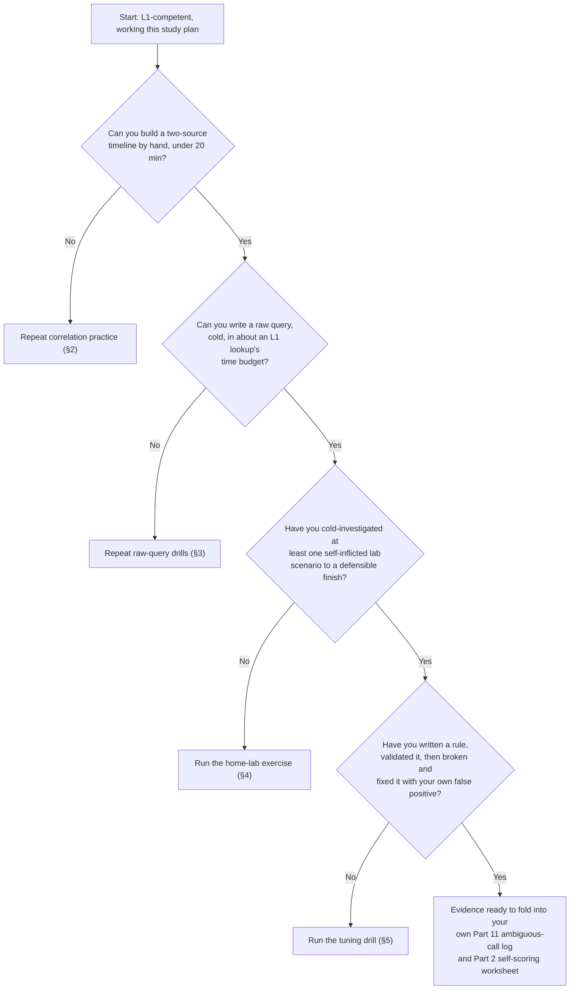

# Part 12 — The L2 Study Plan and Home-Lab Projects

## Why this part exists

**[CONCEPT]** Part 11 named the judgment gap and told you to go hunting for ambiguous tickets and keep a log of your reasoning. That's necessary and it isn't enough on its own, because judgment doesn't build in a vacuum — it builds on top of a specific technical habit most L1 analysts never had to practice: pulling raw data apart yourself instead of reading it off a screen someone else built. This part is the concrete curriculum for that habit. Four drills, sequenced: cross-source correlation done by hand, raw queries written against data with no dashboard waiting for you, a home-lab investigation designed to feel exactly as ambiguous as a real L2 ticket, and a first, deliberately small pass at writing and then breaking a detection rule.

**[CONCEPT]** The target evidence for all four drills already has a name, and it isn't this book's to invent. SOC Manager's Operating Handbook, Part 10 — Competency Models & Skills Matrices §4.2's worked matrix defines the L2 anchors for technical skill and tool proficiency in exactly the terms this part trains toward: forming and testing a hypothesis across multiple log sources with no playbook to follow, and building an ad hoc cross-tool query with no documentation in a time budget comparable to an L1 lookup. That's how the organization will score you. This part is what you do, on your own time, so that score isn't the first time you've tried to do the thing it's measuring.

**[CONCEPT]** One boundary worth stating before section 1 starts: the detection-tuning drill in section 5 is groundwork, not a branch commitment. It previews the work-sample bar Part 15 — Becoming a Detection Engineer builds toward, but nothing here asks you to decide, yet, whether detection engineering is your branch. Part 3 — Choosing Your Path owns that decision framework, and it wants you arriving with real evidence about whether breaking your own rule felt satisfying or felt like busywork — not a guess made before you'd ever tried it.

## 1. What actually changes between the L1 and L2 study plans

**[CONCEPT]** Part 10 — The L1 Study Plan and Home-Lab Projects builds fluency: one SIEM studied in depth, ATT&CK as working vocabulary, enough repetition on documented playbook steps that the mechanics stop being the hard part. Everything in that plan assumes a target already exists — a saved search, a runbook, a dashboard panel someone else configured to answer a known question. That's the correct thing to build first. It is also exactly the thing L2 asks you to stop leaning on.

**[L1/L2]** The shift is specific enough to name in one sentence: at L1, you're good at finding the answer someone already built a path to; at L2, you're good at building the path yourself, on a question nobody anticipated. SOC Manager's Operating Handbook, Part 10 — Competency Models & Skills Matrices §4.2 draws the same line from the reviewer's side — pulling the exact fields a documented playbook calls for, within SLA, unaided, is the L1 tool-proficiency anchor; building an ad hoc cross-tool query to test a hypothesis with no documentation, in a comparable time budget, is the L2 one. Notice what didn't change: the time budget. L2 isn't "the same task, but you're allowed to take longer." It's a materially harder task you're expected to do about as fast.

**[MINDSET]** That last point is worth sitting with, because it's where a lot of L1-to-L2 study plans quietly go wrong. It's tempting to spend the extra study hours getting faster at the L1 lookups you already do well, because getting faster feels like visible progress. It doesn't move the axis that's actually gating you. Speed on a documented path and speed on an undocumented one are different skills built by different practice, and only the second one is what a stalled L2 nomination is usually missing.

> **Ground Truth**
> A lot of career-changer advice treats "learn the SIEM" as a single skill you either have or don't. It's actually two skills stacked on top of each other — operating the interface, and reasoning about raw data through it — and most first-year study plans, including a well-run version of Part 10's, only fully build the first one. If your SIEM time so far has mostly been "find the field the playbook tells me to check," you haven't built the second skill yet regardless of how fluent the first one feels. That's not a criticism of the L1 plan; it's a fact about what L2 is actually asking for next.

**[STUDY PLAN]** A rough allocation that holds up in practice: once you can clear an L1 lookup inside its documented SLA without thinking hard about it, shift the balance of your study hours toward the four drills in this part at something close to a 1:1 ratio against continued L1-style repetition, rather than the roughly 4:1 ratio that made sense during your first months on a queue. The four sections below are sequenced deliberately — correlation before raw querying, raw querying before the ambiguous investigation, all three before the tuning drill — because each one assumes the previous one's mechanics are already comfortable enough that you're not spending the exercise re-learning syntax instead of practicing judgment.

## 2. Cross-source correlation practice

**[STUDY PLAN]** Pick two log sources you can already reach — a home-lab pair works fine, and section 4 reuses the same lab, so build toward that anyway. A common, useful pairing is authentication/identity logs (who logged in, when, from where) and endpoint process-creation telemetry (what ran, under which account, spawned by what). A third source — DNS or proxy logs — makes the drill materially harder and is worth adding once the two-source version stops feeling difficult.

### 2.1 The drill: build one timeline by hand

**[STUDY PLAN]** Pull a raw export from each source covering the same 30-minute window — a CSV, a raw query result, whatever your platform gives you before it's been joined into anything. Do not use a built-in "investigate" or "timeline" feature if your platform has one; that's the exact crutch this drill exists to remove. By hand — in a spreadsheet, a text editor, or a scratch query with a manual join — build a single ordered timeline: this account authenticated here, then this process ran on that host under that account, then this connection went out. Time-box it at 20 minutes for a two-source pull. If it takes an hour the first few times, that's the actual size of the skill gap; note the time and try again the following week rather than abandoning the drill.

**[STUDY PLAN]** The two raw exports rarely line up on sight — different timestamp formats, a username field in one and a SID in the other, a hostname that's short-form in one source and fully qualified in the second. Reconciling that mismatch by hand, once, is most of the actual skill.

```text
CONCEPTUAL SAMPLE — illustrative fragments only, not a real capture.

Auth export (raw):
14:02:11Z  user=jsmith  src=10.4.2.18  result=success  method=password

Endpoint export (raw):
2024-XX-XXT14:02:47.000  host=WKS-0182  account=JSMITH  proc=powershell.exe
  parent=explorer.exe  cmdline="-enc <base64>"

Hand-built timeline:
14:02:11 — jsmith authenticates from 10.4.2.18 (password, no MFA flag present)
14:02:47 — WKS-0182 (jsmith's mapped host) spawns powershell.exe from explorer.exe,
           encoded command line — 36 seconds after login, worth flagging on its own
```

The 36-second gap and the encoded command line aren't things a pre-built dashboard necessarily highlights — they're things you notice because you built the join yourself and had to look at both raw records side by side to place them on one clock.

### 2.2 Where this actually plugs into the evidence you need

**[STUDY PLAN]** Detection Engineering Handbook V2, Part 30 — Correlation Engineering owns the real mechanics behind what you're approximating by hand here: multi-event rule logic, entity resolution, and the specific failure modes — late, missing, or duplicate events, ordering problems, clock skew — that make automated correlation harder than it looks. This drill doesn't teach you to build that logic; it teaches you what the logic is standing in for, so that when a correlation rule silently drops an event later in your career, you recognize the gap instead of trusting the output because the dashboard looked confident.

> **Analyst's Note**
> Keep the two datasets in separate tabs or separate query panes while you work, not pre-merged into one view by a tool. The moment you let something else do the joining, you've stopped practicing the skill and started practicing reading — which is a real skill, just not the one this drill is for. Speed comes later. Right now the point is building the muscle that notices when two records that should share a timestamp or a hostname don't, because that mismatch is where most real correlation problems actually live.

## 3. Writing queries against raw data with no dashboard

**[STUDY PLAN]** This drill is section 2's natural extension: instead of joining two exports by hand, write the query from a blank pane, in your platform's actual query language, against data nobody has pre-filtered for you. The test isn't "can you find the answer." It's "can you find it by writing the query yourself, cold, in roughly the time a documented lookup would have taken."

### 3.1 The raw-query drill

**[STUDY PLAN]** Give yourself one specific, answerable question with no existing saved search behind it — "which hosts made an outbound connection to a destination none of our other 50 hosts talked to in the same seven days" is a good starting shape, because it forces you to think in terms of rarity and a comparison set rather than a single lookup value. Write the query from a blank pane. No autocomplete-driven field browsing, no copying a structure from an existing saved search and swapping one value. If you get stuck on syntax rather than logic, that's a signal to go build syntax fluency directly — Detection Engineering Handbook V2, Part 23 — Query Language Strategy and the language-specific chapters that follow it (Parts 24–29, covering Sigma, KQL, SPL, AQL, YARA-L, and the Elastic query surfaces) own that syntax in real depth. This drill assumes you can look up a function name; it's testing whether you can structure the question, not whether you've memorized every operator.

> **Field Test**
> **Setup:** You've completed a handful of raw-query drills and feel reasonably fluent in your platform's query language.
> **Action:** Have someone else — a peer, a mentor, even a study partner working through this same part — hand you a question they wrote, one you've never seen, with no saved search behind it. Write the query cold, out loud if you can, narrating your reasoning as you go, timed against roughly an L1 lookup's time budget.
> **Expected result:** You should reach a working query within that time budget on most attempts, and be able to explain, mid-write, why you structured it the way you did. If you're silent for long stretches or repeatedly restart from scratch, the fluency you're scoring yourself on in the worksheet in section 6 is thinner than it feels doing the drill alone, where you always get to pick the question.

### 3.2 Getting raw data if you don't have a live L2 queue yet

**[STUDY PLAN]** If your day job hasn't handed you L2-shaped ambiguity yet, don't wait for it — practice against data that doesn't care what your title is. Public, purpose-built datasets exist for exactly this: `EVTX-ATTACK-SAMPLES` on GitHub gives you real Windows Event Log captures from known attack techniques with no dashboard attached; Splunk's `Boss of the SOC` (BOTS) datasets give you a full raw incident to investigate from nothing; the Mordor/OTRF project gives adversary-emulation telemetry in a similarly raw form. None of these tell you the answer up front, and none of them come with a prebuilt panel — which is precisely the property that makes them useful here, and precisely the property a polished vendor demo dataset usually lacks.

> **Career Trap**
> The trap in this section isn't skipping the drill — it's quietly rebuilding the crutch you're trying to remove. Spending your practice hours making the raw-query drill's results *pretty* — building a saved search out of the query once it works, adding it to a personal dashboard, polishing a panel for your portfolio — feels like progress and photographs well, but it converts a no-dashboard exercise back into a dashboard the moment you save it. Do that afterward, once, for the two or three queries you're proudest of and might reuse in an interview story (Part 8 wants exactly that artifact). During practice hours, throw the query away when you're done and write the next one from blank again.

## 4. The home-lab hypothesis-driven investigation exercise

**[STUDY PLAN]** Sections 2 and 3 build the mechanical skill. This exercise is where you practice using it under real ambiguity, because a real L2 ticket's hardest property isn't the query syntax — it's that nobody tells you which two log sources matter, whether the thing you're looking at is even suspicious, or when to stop looking. A home lab lets you manufacture that exact uncertainty on purpose, safely, on your own schedule.

**[STUDY PLAN]** Building this specific exercise is exactly the kind of step-by-step lab instruction the planned SOC Home Lab Handbook would eventually own in full `[HOME LAB — companion volume not yet written]`. Until it exists, here's enough detail to run it now, assuming you already have a small SIEM ingesting endpoint and network telemetry from at least one home-lab host — the build Part 5 — The Home-Lab Foundation and Part 10 walk you through if you don't yet.

### 4.1 Building the mystery you'll forget

**[STUDY PLAN]** Enable process-creation, network-connection, and authentication logging on your lab host if it isn't already flowing into your SIEM. Then, on a day you won't investigate it same-day, run one self-inflicted, safely reversible technique against your own lab endpoint — a scheduled task created from an unusual path, a small file staged and sent to an external-looking test destination, a script that spawns a child process a normal user session wouldn't produce. Atomic Red Team's smaller, single-technique tests are a reasonable source if you want something pre-built rather than hand-written; a manually scripted three- or four-step sequence works just as well and is arguably better practice, because you also have to think like the person who'd eventually detect it. Write down, somewhere you won't accidentally see during the exercise, exactly what you did and when — this is your ground truth, and you'll need it in section 4.3.

**[MINDSET]** Wait at least a few days before investigating, not a few hours. The point of the delay is that same-day memory of exactly what you clicked is a second dashboard in disguise — a mental one, but still a prebuilt answer key sitting in your head while you're supposed to be reasoning from raw data. A few days is usually enough that the specifics blur while the telemetry stays put, which is closer to how a real ambiguous ticket actually arrives: something happened, you weren't there for it, and the logs are the only witness left.

### 4.2 Investigating cold

**[STUDY PLAN]** Come back to the SIEM with one starting fact — "something happened on this host sometime in this window" — and nothing else. No saved search, no dashboard panel scoped to the technique you ran. State a falsifiable hypothesis before you touch the query pane: what do you think happened, and what specific evidence would prove you wrong. Then investigate using only the skills from sections 2 and 3 — hand correlation across sources, queries written from a blank pane — until you reach a disposition you could defend to someone else, or a defensible "can't determine this without X" if the evidence genuinely runs out.

> **Cross-Book Pointer**
> This exercise is a lighter-weight cousin of a structured hunt, not the same thing. Detection Engineering Handbook V2, Part 34 — Threat Hunting Fundamentals and Part 35 — Hunt Types own the full discipline a real hunt needs — rigorous scoping, a stated abandonment condition, a documented conclusion that converts into a detection candidate or a real negative finding — and Part 16 — Becoming a Threat Hunter builds the career-evidence bar built on top of that discipline. Come back to those once you're weighing the threat-hunter branch seriously. This exercise borrows the hypothesis-first habit early and deliberately keeps the stakes low, because right now the goal is practicing under ambiguity, not producing a hunt record.

### 4.3 Grading yourself honestly

**[STUDY PLAN]** Compare your disposition against the ground-truth note from section 4.1. Score it on three things, not one: did you land on the right technical answer, did you correctly identify what you couldn't determine from the available telemetry, and — the one people skip — did your stated confidence match how solid the evidence actually was. A confident wrong answer is a worse result than an honest "I found X and Y, but I can't rule out Z without more data," even though the second one feels less satisfying to write down.

> **Blind Spot**
> You designed the mystery, which means part of you already knows the answer before you start investigating, no matter how many days you wait or how hard you try to forget. That doesn't make the exercise worthless — the query-writing and correlation reps are real regardless — but it does mean a clean, fast, correct resolution here proves less than it feels like it proves about your ability to resolve a real ambiguous ticket, where the "ground truth" isn't sitting in a note you wrote yourself. Treat a strong result on your own home-lab mystery as evidence you've built the mechanical skill, not as evidence the judgment gap from Part 11 is closed. For that, you still need real, externally-resolved ambiguous tickets — which is exactly what Part 11's own ambiguous-call log is for, and why this exercise feeds that log rather than replacing it.

**[INTERVIEW PREP]** Write up whatever you find anyway, even the ones that resolve to "inconclusive." A short, honest writeup — what you hypothesized, what you checked, what you concluded and why — is exactly the kind of home-lab artifact Part 8 — Interview Prep From the Candidate's Chair wants in your story bank: a real investigation you can narrate under pressure, including the part where the evidence ran out and you said so instead of guessing.

## 5. Basic detection-tuning practice: write a rule, then break it

**[STUDY PLAN]** This drill has two deliberately separated halves, and skipping the second one defeats the purpose of the first. Half one: write a simple detection rule against your home-lab telemetry from section 4's environment and confirm it fires correctly on a true positive. Half two: deliberately construct a piece of ordinary, legitimate activity that trips the same rule, and then fix it.

### 5.1 Writing and validating a first rule

**[STUDY PLAN]** Keep the rule blunt on purpose — something like "alert on any PowerShell execution" or "alert whenever a scheduled task is created from a path outside the standard system directories" is a fine, deliberately unsophisticated starting point. Detection Engineering Handbook V2, Part 40 — Detection Autopsy spends an entire capstone chapter dismantling rules exactly this naive and rebuilding them properly; your job at this stage isn't to write a good rule, it's to complete the full loop — author it, run it against real telemetry, confirm it actually fires on the technique from section 4.1 — at least once. Detection Engineering Handbook V2, Part 37 — Detection Testing has the fuller checklist (fires correctly, fires for the right reason, survives a missing field or a delayed event) once you're ready to test the rule properly rather than just confirming it fired.

### 5.2 Manufacturing your own false positive on purpose

**[STUDY PLAN]** Now do the part that actually builds the skill this drill exists for: run something legitimate on the same lab host that trips the same rule. If your rule watches for PowerShell execution, run a routine administrative script through PowerShell. If it watches for scheduled tasks from unusual paths, create a legitimate one from a slightly nonstandard install location. Watch the false positive fire, then fix it — narrow the match condition, add a legitimate exclusion, or restructure the logic — without breaking the rule's ability to catch the original true positive from section 5.1. Confirm both: the true positive still fires, the false positive you built no longer does.

```text
CONCEPTUAL SAMPLE — illustrative rule logic only, not a real production analytic.

Rule v1 (blunt, section 5.1):
  ALERT WHEN process.name = "powershell.exe"

True positive (§4.1 scenario): fires correctly on the encoded-command execution.

Self-built false positive: a scheduled backup script legitimately launches
powershell.exe with no encoding, no unusual parent process, every weeknight
at 02:00 — the rule fires on it too, identically to the real technique.

Rule v2 (tuned, section 5.2):
  ALERT WHEN process.name = "powershell.exe"
    AND command_line CONTAINS "-enc" OR "-EncodedCommand"
    AND parent_process.name NOT IN (known_backup_scheduler_binary)

Result: true positive from §4.1 still fires; the 02:00 backup script no longer does.
```

Neither version above is a rule worth deploying anywhere real — that's exactly the point. The loop you just ran, not the elegance of the logic, is the rep.

> **What Would Change My Mind**
> This part treats one deliberate write-a-rule-then-break-it cycle as useful groundwork for the detection-engineer branch decision in Part 3, on the reasoning that how it feels to build and then dismantle your own false positive is a real, cheap signal about fit before you invest months in Part 15's fuller portfolio. If it turned out that reaction — satisfying versus tedious — didn't actually predict which analysts went on to build a strong merged-detection record, that would mean this drill is a fine technical-skill rep but a weak fit-signal, and this section's framing should drop the aptitude-preview claim and keep only the mechanical one.

### 5.3 What this previews, and what it doesn't commit you to yet

**[STUDY PLAN]** Detection Engineering Handbook V2, Part 38 — False Positive Engineering owns the real taxonomy behind what you just did by hand — the categories of false positive, the difference between suppressing a symptom and rewriting the underlying logic, and why an exception list quietly becomes technical debt if nobody tracks it. Read that once you've run the drill yourself at least twice; it'll mean more against your own two false positives than it would as pure theory. What this drill does not do is tell you you're ready for Part 15's work-sample bar — five detections merged through a real review pipeline with a tracked post-deployment false-positive rate, per SOC Manager's Operating Handbook, Part 13 — Career Ladders & Promotion Criteria §3.1's own description of that bar. One rule, broken and fixed once in a lab with no reviewer and no production stakes, is a first rep, not a portfolio.

## 6. Sequencing the plan: a worked schedule and a self-check

**[STUDY PLAN]** The four drills build on each other in the order they're written above, and rushing past one to get to the "more interesting" next one is the single most common way this plan produces weak results. The schedule below sequences a reasonable pace for someone studying outside a full-time shift rotation (CONCEPTUAL SAMPLE — illustrative pacing, not a validated benchmark; halve the pace, per Part 10's own caveat about a fixed night rotation, before skipping a phase).

| Weeks | Focus | Weekly time budget | What "landed" looks like |
|---|---|---|---|
| 1–3 | Cross-source correlation by hand (§2) | 4–5 hours | Build a two-source timeline from raw exports in under 20 minutes, no built-in join feature used |
| 4–6 | Raw queries, no dashboard (§3) | 4–5 hours | Answer a new, self-posed question by writing a query from a blank pane, in a time budget close to a documented lookup |
| 7–9 | Home-lab hypothesis-driven investigation (§4) | 5–6 hours | Run and cold-investigate at least one self-inflicted scenario; write a disposition with a stated confidence level that matches the evidence |
| 10–12 | Write-a-rule, break-a-rule (§5) | 3–4 hours | One rule authored, validated against a true positive, then deliberately broken and re-tuned against a false positive you built yourself |

**[STUDY PLAN]** The self-scoring worksheet below mirrors the axis structure Part 2 — Reading the Machinery From Below already teaches you to score against, drawn from SOC Manager's Operating Handbook, Part 10 — Competency Models & Skills Matrices's four-axis structure, so the evidence you're building here maps directly onto what a reviewer will eventually look at instead of sitting in a separate, unrelated pile.

| Drill | Axis it builds evidence for | Self-score (never attempted / attempted, inconsistent / consistent under a time budget) | Where the evidence lives |
|---|---|---|---|
| Cross-source correlation by hand | Technical skill (SOC Manager's Operating Handbook, Part 10 — Competency Models & Skills Matrices §3.1) | — | Saved timelines, dated |
| Raw queries, no dashboard | Tool proficiency (SOC Manager's Handbook Part 10 §3.2) | — | Query log or notebook |
| Hypothesis-driven home-lab investigation | Judgment (SOC Manager's Handbook Part 10 §3.4) | — | Part 11's ambiguous-call log |
| Write a rule, break a rule | Technical skill, previewing Part 15's branch bar | — | Rule text, before/after tuning notes |



**Figure 12.1 — The L2 personal-evidence self-check.** *CONCEPTUAL.* Diagram ID `FIG-1201`. Illustrates a private, individual gate for deciding whether to repeat a drill or move on, distinct from — and feeding evidence into, not replacing — the organizational L2 readiness gate SOC Manager's Operating Handbook Part 10 §4.1 runs on the reviewer's side. Not yet rendered to a static SVG; the Mermaid source above is the editable source of truth until a build pass generates one.




## 7. What this practice can't prove about you yet

**[MINDSET]** Four completed drills are real evidence of a real habit, and they are not, by themselves, a finished case for readiness. They tell you — and can eventually tell a reviewer — that you've built the mechanical skill L2 requires. They don't establish sustained performance over real time, on real stakes, in front of real ambiguity you didn't design, which is exactly the gap Part 11's own ambiguous-call log exists to start closing next.

> **Career Autopsy — "trusted the vendor's cross-source workflow to be the correlation skill"** (`CASE-1201`, COMPOSITE CASE EXAMPLE)
>
> **The decision:** An analyst preparing for L2 spent several months getting fast inside their SIEM's built-in "cross-source investigation" feature — a vendor workflow that auto-joins identity, endpoint, and network events into one prebuilt timeline — and treated growing fluency with that feature as proof of correlation skill.
>
> **Why it seemed reasonable:** The workflow was the actual daily tool, using it well produced fast, confident-looking results, and getting good at your employer's real platform feels like the opposite of wasted effort.
>
> **How it failed:** During a live incident on a newly onboarded acquisition's environment, the workflow's default lookback window silently excluded a set of older but relevant events, and the dashboard gave no indication anything had been cut — because nobody had built it to answer this exact question. The analyst trusted the timeline as complete because it always had been before, and missed twenty minutes of relevant activity that a raw, hand-written query would have caught immediately.
>
> **The fix:** Pair every hour of vendor-workflow fluency with an equal hour of the raw, hand-joined practice in section 2. The workflow is a legitimate speed tool once the underlying skill exists — the failure was letting it substitute for that skill instead of sitting on top of it.

> **Career Trap**
> The most tempting shortcut through this whole part is finding or building a slicker home-lab dashboard specifically for the section 4 exercise — a panel that auto-highlights anomalies, a saved search tuned to the technique you're about to run. Every hour spent on that is an hour spent rebuilding the exact prebuilt answer key the exercise is designed to deny you. If you want a portfolio-quality artifact from this lab work, build the dashboard afterward, from what you learned doing it cold — never before.

**[MINDSET]** None of this works as a one-time pass either. A correlation drill you ran once eight months ago and a rule you broke and fixed a single time prove you could do each thing once, not that the habit is current. Keep at least one of these four drills active on a recurring basis — the queue-shaped ones are easy to let lapse the moment a real L2 nomination lands, which is precisely the point at which the underlying skill needs to be sharpest, not shelved.

---

**Cross-references:** This part assumes Part 10 — The L1 Study Plan and Home-Lab Projects (the fluency this plan builds on) and Part 11 — Making the Jump to L2 (the ambiguous-call log this plan's evidence feeds). It connects forward to Part 3 — Choosing Your Path, Part 14 — The Senior-Analyst Study Plan and Branch Portfolio, and Part 15 — Becoming a Detection Engineer for what the tuning drill in §5 previews without committing to. Outside this book, it cites SOC Manager's Operating Handbook, Part 10 — Competency Models & Skills Matrices (the L2 axis anchors this plan trains toward, scored organizationally, never re-derived here) and Part 13 — Career Ladders & Promotion Criteria §3.1 (the detection-engineer work-sample bar this part's tuning drill is only a first rep toward), and Detection Engineering Handbook V2, Part 23 (Query Language Strategy), Parts 24–29 (query-language syntax), Part 30 (Correlation Engineering), Parts 34–35 (Threat Hunting Fundamentals and Hunt Types), and Parts 37–38 (Detection Testing and False Positive Engineering) for the technical mechanics this part's drills approximate by hand, without re-teaching any of them.
