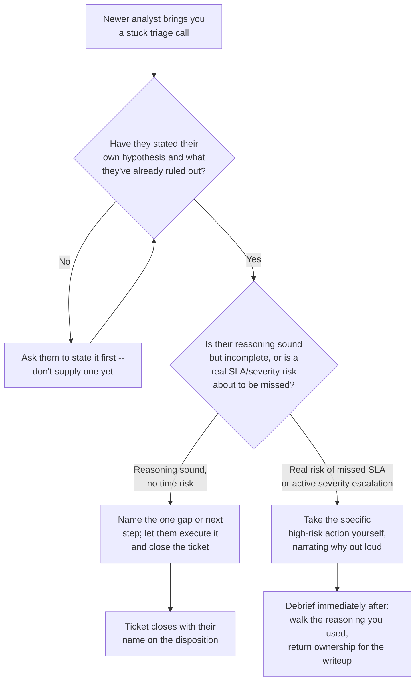

# Part 13 — L3 / Senior Analyst: Judgment Without a Playbook

## Why this part exists

**[CONCEPT]** Every earlier rung in this book had a runbook underneath it. L1 triage has a decision tree. L2's harder tickets still resolve against a documented escalation path, even when that path takes real judgment to walk (Part 11 covers closing that specific gap). Senior analyst — L3 — is the first rung where the honest answer to "what do I do when the playbook doesn't cover this" is sometimes "there is no entry for this, and writing one is part of your job." That's not a motivational reframe. It's a literal description of the work: a genuinely novel investigation, a triage call from someone newer than you that needs your input without your hands on the keyboard, a severity score that the model in SOC Playbook Handbook, Part 29 — Playbook Severity Model doesn't cleanly assign because the case sits between two of its worked examples.

**[CONCEPT]** This part is not about how a promotion committee decides you're ready for that rung. SOC Manager's Operating Handbook, Part 13 — Career Ladders & Promotion Criteria owns that mechanic in full — who sits on the committee, what evidence packet it expects, how it calibrates across teams so one lenient manager doesn't inflate titles faster than a strict one. This part is about the narrower, more personal question underneath the org's evaluation: what actually changes about the *work* at senior analyst, and what you personally do — this month, on your own initiative, before anyone convenes a committee about you — to build the judgment that rung is supposed to certify, rather than merely accumulating the tenure and speed that often gets mistaken for it.

**[CONCEPT]** That distinction — judgment versus tenure-and-speed — is the spine of this part, and it isn't this book's invention. SOC Manager's Operating Handbook, Part 13 §2.2 draws it explicitly from the org's side: "a ladder that promotes to Senior purely on volume and speed metrics is really just certifying 'very fast Analyst I.'" Section 2 below builds the individual-side mirror of that line — how to tell, from your own chair, which one you've actually built — without re-deriving the committee's own evaluation criteria to do it.

> **Cross-Book Pointer**
> This part does not explain how a promotion committee composes itself, calibrates across teams, or decides a borderline case. See SOC Manager's Operating Handbook, Part 13 — Career Ladders & Promotion Criteria for that organizational machinery, and Part 10 — Competency Models & Skills Matrices for the judgment-axis anchors a reviewer will actually score you against. Come back here for what you do, on your own, to make sure the evidence that packet eventually contains is real.

## 1. What actually changes at senior analyst

**[SENIOR/SPECIALIST]** Three things change between a strong L2 and a real L3, and none of them is "more of the same triage, faster." The first is ownership of novel investigations — cases where no existing runbook entry, no prior ticket in the queue's history, and no five-minute Slack message to a teammate gets you to a disposition, and the case is yours to reason through from the underlying threat model rather than from a matched pattern. The second is a shift in how you show up on someone else's ticket: a newer analyst brings you a triage call, and your job is to make their reasoning better without quietly taking the keyboard and finishing it yourself. The third is applying SOC Playbook Handbook, Part 29's severity model to a case that refuses to map cleanly onto any of that model's worked examples — not abandoning the model, and not forcing the case into the nearest category regardless of fit, but making a defensible call about where it actually sits and documenting why.

**[SENIOR/SPECIALIST]** All three of these are judgment calls under incomplete information, made in real time, with your name on the outcome. That's the actual job description hiding behind the title "Senior Analyst" — not a faster version of L1/L2 triage, and not yet the people-management job Part 19 covers for the team-lead track. If your current day-to-day still consists entirely of tickets that match something you've seen before, resolved faster than your peers, you are doing excellent L2 work. You are not yet doing the L3 job, no matter what your badge says.

### 1.1 Owning a novel investigation

**[SENIOR/SPECIALIST]** "Novel" doesn't mean rare in the sense of a zero-day nobody's ever seen. It means novel *to your available reference material* — no runbook entry, no closed ticket in your SIEM's history that matches closely enough to reuse the disposition, and no senior teammate immediately available to just tell you the answer. The work is building a disposition from the underlying threat model: what would have to be true for this to be malicious, what would have to be true for it to be benign, and which pieces of available evidence actually distinguish between those two worlds rather than being consistent with both.

**[SENIOR/SPECIALIST]** Ownership also means the investigation is yours end to end — you decide what to pull next, you decide when you have enough evidence to disposition rather than keep pulling more, and you write the closing rationale in language a peer reviewing it cold could actually audit, not just a category code. An L2 ticket that gets escalated because it's ambiguous is a successful L2 outcome. An L3 ticket that gets escalated because it's ambiguous, with no attempt to reason through the threat model first, is a missed rep — the exact rep that builds the judgment Section 2 is about to test for.

> **Analyst's Note**
> The tell that you've actually made the jump: you stop asking "has anyone seen this before" as your first move on a strange case, and start asking "what would I expect to see if this were the bad scenario, and does the evidence I have so far actually support or contradict that." The first question outsources your judgment to institutional memory. The second one builds your own.

### 1.2 Mentoring a triage call without taking it over

**[SENIOR/SPECIALIST]** A newer analyst brings you a ticket mid-investigation, unsure how to proceed. The wrong move — the one that feels fastest and most helpful in the moment — is to take the keyboard, or effectively take it by dictating the next five actions in sequence with no pause for their own reasoning. That resolves the ticket. It teaches the newer analyst nothing except that bringing you a hard ticket makes it disappear from their queue and reappear, solved, without their own judgment ever getting exercised on it.

**[SENIOR/SPECIALIST]** The right move is slower and looks, from the outside, like you're doing less: ask what they've already ruled out and why, ask what they'd do next if you weren't in the room, and only then correct the specific step that's wrong — not the whole approach. This is the same discipline Part 19 covers in more depth as a self-test for team-lead aptitude (do you rewrite a delegated task instead of coaching it), and it's worth starting to practice at L3, on a single triage call, long before any team-lead conversation exists. A senior analyst who can't resist finishing someone else's ticket for them is demonstrating the same instinct that makes a bad team lead — just at a smaller, less costly scale, which is exactly why L3 is the cheap place to notice it in yourself.

> **Career Trap**
> Taking over a mentee's triage call and calling it mentoring costs you nothing today and costs the newer analyst a real rep every time you do it. The fix isn't to withhold help — it's to change what you're helping with: narrate your own reasoning about *why* the next step is right instead of just naming the next step, and stop one action short of the disposition so they close it themselves. If you notice you've finished more than one mentee ticket outright in a week, that's a pattern worth naming to yourself before it becomes a habit a future team-lead aptitude check (Part 19) would flag anyway.

### 1.3 Applying the severity model to a case that doesn't map cleanly

**[SENIOR/SPECIALIST]** SOC Playbook Handbook, Part 29 — Playbook Severity Model gives you a structured way to score an alert's severity against a set of worked examples and named criteria — that model, its scoring mechanics, and its worked examples belong entirely to that book, and this part does not re-derive any of it. What this part owns is narrower: what you personally do the first time a real case sits between two of that model's categories, or technically matches a lower-severity example's criteria while every piece of contextual judgment you have says it's worse than that.

**[SENIOR/SPECIALIST]** A severity model is a decision aid, not a verdict machine, and Section 4 below walks through exactly what "applying judgment to override a clean model match" looks like in practice, including what you write down to make that override auditable rather than a shrug. The failure mode at L2 is usually applying the model too rigidly because you don't yet trust your own judgment enough to deviate from it. The failure mode that starts appearing at L3, and that a committee will specifically probe for, is the opposite: deviating from the model on a hunch, with no documented reasoning a peer could check — which is a real judgment call dressed up to look identical to a lucky guess, the exact confusion Section 2 exists to resolve.

## 2. Two ways to arrive at "Senior" — and only one of them is real

**[MINDSET]** Here is the uncomfortable fact underneath this entire part: two analysts can carry the same "Senior Analyst" title, hit the same handle-time and QA-score numbers, and have built almost nothing in common underneath the label. One of them got there by getting fast and accurate at the tickets that were always going to resolve to a known pattern, for long enough that the tenure and volume math worked out. The other got there by deliberately seeking out the ambiguous, poorly-matched, no-runbook cases and building a track record of defensible reasoning on exactly those. SOC Manager's Operating Handbook, Part 13 §2.2 names this split from the reviewer's side — a committee is supposed to test for the second kind by handing a candidate "a ticket type the runbook genuinely doesn't cover cleanly" and watching whether they escalate immediately, guess and move on, or reason from the underlying threat model to a defensible disposition.

**[MINDSET]** The reason this matters to you personally, months before any committee runs that test on you, is that the test is easy to fail even after years of strong L1/L2 performance — because volume and speed on matched-pattern tickets, no matter how much of it you accumulate, does not automatically produce the second kind of senior. It can produce someone very fast at guessing correctly on familiar shapes, which looks identical to judgment right up until a genuinely unfamiliar shape arrives. The two build from different practice, and only one of them survives contact with a case nobody's seen before.

### 2.1 Senior earned through volume and speed

**[MINDSET]** This path looks like real growth from the inside, because every number on your dashboard is trending the right direction: handle time drops, QA score holds steady or climbs, escalation rate falls. All of that is genuinely good L1/L2 performance, and none of it is evidence of judgment under ambiguity, because none of it required ambiguity to produce. A queue where 90% of tickets match a known pattern rewards speed and pattern-recognition without ever forcing you to reason from first principles about a case that doesn't match anything. You can hit every quantitative bar in an evidence packet this way and still freeze, guess, or reflexively escalate the first time a case genuinely doesn't fit.

### 2.2 Senior earned through demonstrated judgment

**[MINDSET]** This path looks slower on the same dashboard, because deliberately spending time on the ambiguous 10% of the queue instead of clearing the easy 90% as fast as possible will not optimize your handle time. What it produces instead is a track record: specific cases where you reasoned from the threat model to a disposition nobody handed you, documented well enough that a peer could audit the reasoning after the fact, including cases where you were wrong and can say specifically what evidence would have changed your answer. That track record is the actual thing a promotion committee's evidence packet is trying to detect (per SOC Manager's Operating Handbook, Part 13 §4.2) — and it's the thing you can start building now, on your own initiative, entirely independent of whether a committee exists yet.

> **Ground Truth**
> "Senior Analyst just means you've been doing this long enough" is a real, common belief inside plenty of SOCs, and it is mostly true of the *title distribution* and mostly false of the *actual job*. A team can absolutely promote on tenure and speed alone — SOC Manager's Operating Handbook, Part 13 §5 documents exactly how that drift happens and what it costs the organization. What tenure-based promotion does not do is retroactively install judgment in the person who received it. If your own senior title arrived that way, the gap doesn't show up until a genuinely novel case lands on your desk with your name as the owner — and by then it's a live incident, not a practice rep.

## 3. The self-test: which one did you build

**[MINDSET]** You don't need a committee's ambiguous test case to find out which path you're on. You can run a version of it on yourself, using cases you've already closed, and the honesty of the exercise depends entirely on doing it before you look at what actually happened — not after, when hindsight quietly rewrites how confident you felt at the time.

> **Field Test**
> **Setup:** Pull three tickets you personally closed in the last six months that were genuinely ambiguous *at the time* — not ambiguous in hindsight, and not tickets you escalated. Set aside the actual resolution and any notes describing it.
> **Action:** For each one, without looking at the resolution, write out in five minutes or less: what you knew when you first opened it, what your working hypothesis was, what evidence would have confirmed it, what evidence would have ruled it out, and your final disposition with a one-line reason.
> **Expected result:** On at least two of the three, your reconstructed reasoning should reach the same disposition you actually reached, and the reasoning itself should name specific evidence, not a feeling. If you can reconstruct the *disposition* but not the *reasoning* — you land on the right answer but can't say why, beyond "it felt like" a known pattern — that's the signature of senior-by-speed: the guess was good, but nothing underneath it would generalize to a case that doesn't resemble ones you've seen.

**[MINDSET]** The worksheet below turns that single field test into a repeatable self-scoring rubric. Use it monthly, not once — a single strong result could be luck; a pattern across four or five months of cases is the actual evidence.

```text
TEMPLATE — the senior-judgment self-scoring rubric, permanent ID TMPL-1301

For each closed, previously ambiguous ticket you review this month, score 0-2 on each row.
0 = not present. 1 = partially present. 2 = clearly present and documented.

| Row                                                                    | Score (0-2) |
|-------------------------------------------------------------------------|:-----------:|
| Reconstructed hypothesis matches what you actually wrote at the time    |             |
| Reasoning cites specific evidence, not a pattern-match feeling          |             |
| You can state what evidence would have flipped the disposition          |             |
| Disposition holds up when reconstructed cold, without hindsight         |             |
| You'd have escalated this at L2 but didn't need to at L3                |             |

Total /10. Below 6 on a given case: that case was likely resolved on pattern-matching or
guesswork, not judgment -- flag it and revisit what a fully reasoned version would have looked
like. 6-10 across three or more cases in the same month: you have real evidence toward the
"demonstrated judgment" side of Section 2, not just the "volume and speed" side.

<!-- Do not backfill this after reading the actual resolution -- the whole rubric is void if you
     score your own reconstructed reasoning with the answer already in front of you. -->
```

This rubric is something you fill out privately, on your own closed tickets, as a monthly habit — it has no reviewer and no submission requirement. Its main limitation is the one the Blind Spot below names directly: scoring yourself well on your own reconstructed reasoning proves the reasoning is internally consistent, not that it's correct.

> **Blind Spot**
> This self-test can tell you whether you're reasoning from evidence or pattern-matching from a feeling. It cannot tell you whether your evidence-based reasoning is actually *right* — you're both the person generating the hypothesis and the person grading it, and a confidently wrong threat model can produce a well-documented, internally consistent, incorrect disposition every time. Get at least one of these reconstructed write-ups reviewed by an actual peer or mentor who has the real resolution in hand, on a cadence of roughly once a quarter, so something outside your own head is checking the calibration, not just the process.

## 4. Owning a novel investigation, start to finish

**[SENIOR/SPECIALIST]** Here is what "reasoning from the underlying threat model" actually looks like in sequence, rather than as an abstraction, on a case with no matching runbook entry:

1. **State what you're actually looking at, precisely.** Not "suspicious PowerShell" — the exact process lineage, the exact command-line arguments, the exact account context. Vague framing at step one produces vague reasoning at every step after it.
2. **Name the competing hypotheses before you pull more evidence.** At minimum: a benign explanation and a malicious one, each stated specifically enough that they'd predict different next findings. If you can't state a benign hypothesis that's genuinely plausible given what you know so far, you may be pattern-matching toward "bad" rather than actually reasoning.
3. **Decide what evidence would distinguish between them — then go get exactly that**, not everything available. Pulling 10 log sources because you're not sure which one matters is a sign the hypotheses in step 2 weren't specific enough yet.
4. **Update, don't restart.** New evidence should sharpen or eliminate a hypothesis, not send you back to open-ended browsing. If every new pull makes you feel like you're starting over, go back to step 2 and get more specific.
5. **Disposition with a stated confidence and a stated reason you'd revisit it.** "Benign — scheduled admin task, confirmed against change record CR-4471" is auditable. "Looks fine" is not, and it's the sentence a peer reviewer or a future you, six months from now, has no way to check.

**[SENIOR/SPECIALIST]** Step 5 is where the severity-model judgment call from Section 1.3 actually happens. If your disposition and stated confidence put the case in a severity band that doesn't match any of SOC Playbook Handbook Part 29's cleanest worked examples, write the override reasoning down in the same place you'd normally just fill in the model's category — one sentence naming which specific factor pushed it up or down and why. That sentence is what turns a judgment call into evidence instead of an unexplained deviation a later reviewer has no way to evaluate.

> **Career Autopsy — "fast at everything, ready for nothing new"** (`CASE-1301`, COMPOSITE CASE EXAMPLE)
>
> **The decision:** An analyst spends two years as the fastest, most accurate closer on a mid-sized SOC's queue, consistently beating team-median handle time by 30% with a QA score above 90%. On the strength of those numbers alone, their manager nominates them for Senior Analyst, and the nomination goes through on a strong quantitative packet.
>
> **Why it seemed reasonable:** Every measurable input said "ready" — speed, accuracy, tenure, zero open coaching issues. In a queue where the great majority of tickets matched a known shape, "fastest and most accurate" and "best judgment" had never actually been tested apart from each other, because nothing in two years' worth of tickets had required telling them apart.
>
> **How it failed:** Three months after the title changed, a genuinely novel case landed — a living-off-the-land technique the environment's detections weren't tuned for, with no runbook entry and no close historical match. The analyst's first move was to search for anything similar in the ticket history, find nothing, and escalate immediately with a note that amounted to "unfamiliar, passing up." The escalation wasn't wrong exactly, but it also demonstrated zero of the threat-model reasoning the title was supposed to certify — the same "escalate immediately" response SOC Manager's Operating Handbook, Part 13 §2.2 names as one of the two responses that fail the judgment test, alongside "guess and move on." Two more similar cases over the following quarter got the same treatment. The title said senior; the actual investigations still read like a fast, accurate L1.
>
> **The fix:** The analyst started deliberately pulling one ambiguous, no-clean-match ticket per week off the queue instead of letting the fastest available ticket auto-route to them, running the five-step reasoning sequence above on each one regardless of how long it took, and logging the reasoning using the rubric in `TMPL-1301` whether or not anyone asked to see it. Within two quarters, the escalate-on-unfamiliar reflex had measurably weakened, and — more usefully to the analyst personally than to anyone else — they now had a written record of the actual judgment their title was supposed to already reflect, months before anyone else needed to see it.

## 5. Mentoring the call, not finishing it

**[SENIOR/SPECIALIST]** Section 1.2 named the failure mode; this section gives you a decision structure for the moment it actually happens, live, with a newer analyst waiting on your input mid-shift. The pressure in that moment is real — the queue doesn't pause while you coach, and taking the keyboard genuinely is faster. The discipline is choosing the slower option anyway, on purpose, often enough that it becomes the default rather than the exception.



**Figure 13.1 — Deciding whether to coach or intervene on a mentee's stuck triage call.** *CONCEPTUAL.* Diagram ID `FIG-1301`. Illustrates the individual, in-the-moment decision this part asks a senior analyst to practice — coach by default, intervene only against a stated real-time risk — and is not a capture of any specific team's actual escalation policy. It deliberately mirrors, at the scale of a single ticket, the same delegate-versus-rewrite instinct Part 19 later tests more formally for team-lead aptitude.



**[SENIOR/SPECIALIST]** The right branch on that diagram is almost always the left one. The exception on the right — a genuine SLA breach or active severity escalation about to be missed — is a real exception, not a permission slip to default to taking over whenever coaching feels slower than doing. If you find yourself landing on the right branch most weeks, the honest read is usually that the queue is under-resourced for how much mentoring it's asking you to absorb, which is a staffing conversation for your team lead (SOC Manager's Operating Handbook, Part 5 — Headcount & Capacity Modeling covers that math from the org's side) — not a personal failure to coach fast enough.

## 6. Where the severity model bends and where it doesn't

**[SENIOR/SPECIALIST]** SOC Playbook Handbook, Part 29's severity model exists precisely so that two different analysts scoring the same clean-match case land on the same severity, most of the time, without either of them re-deriving the reasoning from scratch. That consistency is the entire point of having a model, and the temptation at L3 — once you've built real judgment and start trusting it — is to quietly stop using the model at all on cases that feel obvious, which erodes exactly the consistency the model exists to protect. Judgment overrides the model on a specific, documented case; it does not replace the model as your default process.

**[SENIOR/SPECIALIST]** A case that doesn't map cleanly usually fails in one of two directions, and they call for different responses:

- **The case technically matches a lower-severity worked example, but contextual factors the model's criteria don't capture make it worse** — a compromised account with unusually low blast-radius technical indicators, but on a system with regulatory exposure the model's technical criteria were never designed to weigh. Here, you escalate the severity above what the clean match would produce, and you write down the specific contextual factor driving the override in the same field where you'd normally cite the matched criterion.
- **The case sits genuinely between two categories with no dominant match either way** — some indicators point higher, some point lower, and forcing it into either bucket loses information a later reviewer would want. Here, the honest move is to document both readings and the specific piece of missing information that would resolve which one is correct, rather than picking one arbitrarily to make the ticket close cleanly.

**[SENIOR/SPECIALIST]** Both responses produce a documented, auditable deviation. Neither is "ignore the model because you know better" with no paper trail — that response is indistinguishable, to anyone reviewing it later, from a guess that happened to land on the right side of a coin flip.

> **What Would Change My Mind**
> This part treats a documented override — writing down the specific factor that pushed a case off the severity model's clean match — as meaningfully different from an undocumented gut call, even when both analysts land on the same final severity. If a structured review of closed cases showed no measurable difference in outcome quality (missed escalations, wrongly inflated severities, downstream incident cost) between documented and undocumented overrides once analyst experience level was controlled for, that would undercut this part's claim that the documentation itself is doing real work — and the guidance here should shift toward treating documentation as primarily a committee-evidence convenience rather than a genuine judgment-quality practice.

## 7. Building the evidence before anyone asks for it

**[MINDSET]** Nothing in this part requires a promotion cycle, a formal mentee assignment, or a manager's sign-off to start. The novel-investigation reasoning sequence in Section 4, the coaching discipline in Section 5, and the documented-override habit in Section 6 are all things you can begin practicing on your very next ambiguous ticket, your very next mentoring request, and your very next borderline severity call — independent of whether a committee exists yet to evaluate any of it.

**[MINDSET]** What accumulates from doing this consistently is exactly the evidence SOC Manager's Operating Handbook, Part 13 §4.2's packet is built to look for: a real record of judgment under ambiguity, not a reconstructed story assembled the week before a nomination. Part 14 picks up from here with the specific study plan and portfolio work — a tracked false-positive rate, a documented hunt, a shadow-coaching log — that builds toward whichever branch you're weighing next; this part's job was narrower and comes first: making sure the senior title, whenever it arrives, actually describes work you've already done rather than work you're hoping the title will retroactively justify.

---

**Cross-references:** This part assumes SOC Manager's Operating Handbook, Part 13 — Career Ladders & Promotion Criteria (§2.2 for the volume-versus-judgment distinction this part builds the individual-side self-test from, §4.2 for the evidence-packet items Section 7 points toward) and Part 10 — Competency Models & Skills Matrices (the judgment-axis anchors a reviewer scores against). It cites SOC Playbook Handbook, Part 29 — Playbook Severity Model (Sections 1.3 and 6) and Part 27 — Escalation Quality (Section 1) for the technical mechanics this part deliberately does not re-derive. Within this book, it builds on Part 2 — Reading the Machinery From Below and Part 11 — Making the Jump to L2, and connects forward to Part 14 — The Senior-Analyst Study Plan and the Portfolio That Earns a Branch Choice and Part 19 — The Team Lead Transition, whose delegate-versus-rewrite self-test Section 5's coaching discipline previews at the scale of a single ticket.
