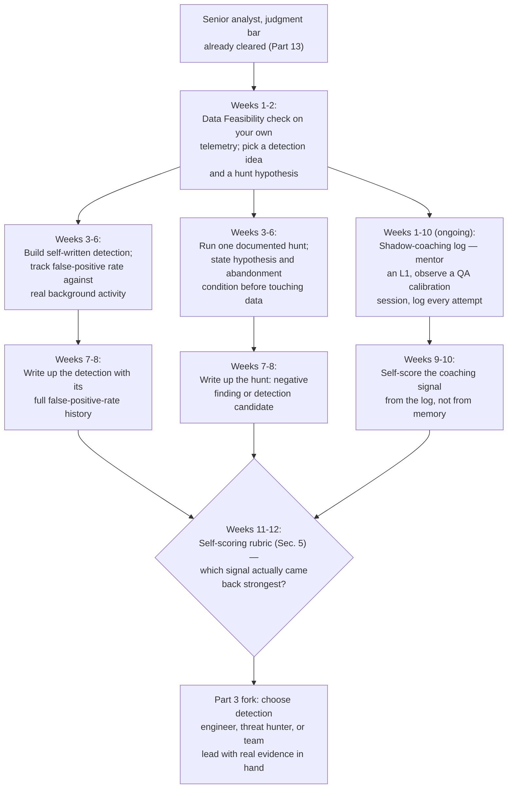

# Part 14 — The Senior-Analyst Study Plan and the Portfolio That Earns a Branch Choice

## Why this part exists

**[CONCEPT]** Part 13 covered what changes when you actually become a senior analyst: owning novel investigations, mentoring a triage call without taking it over, applying a severity model to a case that doesn't map cleanly onto its clearest examples. This part covers what you build next. Part 3's specialization framework will eventually ask you to choose a branch — detection engineer, threat hunter, incident responder, team lead, or staying a strong individual contributor — using aptitude signals like whether ambiguity energizes or drains you. That framework is only as good as the evidence you bring to it. A preference you've never tested against real friction is a guess wearing the costume of a decision.

**[CONCEPT]** SOC Manager's Operating Handbook, Part 13 — Career Ladders & Promotion Criteria, §3, names three organizationally-defined bars a committee will actually look for at the branch point: a detection-engineer candidate with real merged detections and a tracked false-positive rate, a threat-hunter candidate with a completed hunt record built on falsifiable hypotheses, and a team-lead candidate with a passed coaching-aptitude assessment and a shadow-lead cycle. That's how the organization evaluates readiness for each branch, and this part does not re-derive any of it — the bar belongs to that book, cited here for what it is: the target a reader arrives at needing evidence for, months before any committee convenes.

**[CONCEPT]** What this part owns is narrower and comes earlier: the study and lab work that produces one real, honest piece of evidence toward each of those three bars, built in parallel, before you've committed to any single branch. Not the full five-detection work-sample bar — Part 15 owns getting you the rest of the way there once you've chosen detection engineering. Not the full two-hunt record — Part 16 owns that. Not the full shadow-lead cycle — Part 19 owns that. This part gets you one well-documented detection with a tracked false-positive rate, one hunt with a stated falsifiable hypothesis, and one shadow-coaching log, so that when you reach Part 3's fork, you're choosing based on what the work actually felt like and what you actually produced, not on which title sounds best on a resume.

> **Cross-Book Pointer**
> This part does not explain how a promotion committee scores a branch-specific evidence packet, how the coaching-aptitude assessment in the team-lead bar is designed, or how a detection-as-code review pipeline's separation-of-duties gate actually works as organizational policy. See SOC Manager's Operating Handbook, Part 13 — Career Ladders & Promotion Criteria, §3 for the three branch bars themselves, and Detection Engineering Handbook V2, Part 22 — Detection as Code and Parts 34–35 — Threat Hunting Fundamentals and Hunt Types for the technical methodology behind two of this part's three projects. Come back here for what you personally do to arrive at those bars with real evidence already built, not a plan to build it later.

## 1. Why build toward all three bars before choosing one

**[CONCEPT]** Aptitude self-assessment is cheap to get wrong in one specific way: it's easy to be confident about a preference you've never actually tested. "I think I'd enjoy hunting" and "I've run one hunt, scoped it, watched it resolve to a clean negative finding, and wanted to run another one the same week" are different claims, and only the second one is evidence. The first is a hypothesis about yourself. This part treats it as exactly that — something to test, not something to trust.

**[MINDSET]** The specific failure this section exists to prevent is choosing a branch on the story a title tells rather than the texture of the daily work. "Threat hunter" sounds more interesting to say out loud than "detection engineer" to a lot of people who have never actually sat with a hypothesis that resolves to nothing after four hours of genuine effort. "Team lead" sounds like a promotion to people who have never sat through a QA calibration session as an observer and noticed how much of the job is watching someone else struggle through a problem you could solve in ninety seconds, and not stepping in. Building minimum real evidence toward all three before choosing converts "sounds interesting" into "I've done a version of this and here's what I learned," which is a categorically stronger basis for a decision that will shape a year or more of study.

> **Career Trap**
> Picking a branch off the salary-survey number or the job-title prestige, with zero hands-on evidence of what the daily work actually demands, routinely produces someone six months into a detection-engineering track discovering they find tuning tedious rather than absorbing, or six months into a hunting track discovering they can't tolerate a hypothesis that resolves to nothing. The fix: run this part's three lightweight projects before committing a study plan's worth of hours to one branch. A rough weekend and a few weeks of evenings spent finding out you dislike hunting is cheap. Discovering the same thing eight months into Part 16's full hunt-record curriculum is not.

**[SENIOR/SPECIALIST]** This doesn't mean spreading effort so thin that none of the three projects is real. Each of the three below is scoped to be completable — one detection, one hunt, one running log — inside roughly a 12-week window at a sustainable pace, per the worked calendar in §6. The goal isn't three shallow simulations of branch work; it's three genuine, if minimal, samples of it, honest enough that the feeling you have doing each one is actually informative.

The diagram below sequences the three projects as parallel tracks converging on the fork this book's Part 3 asks you to navigate.



**Figure 14.1 — A parallel-track evidence-building roadmap, senior analyst to the Part 3 branch fork.** *CONCEPTUAL.* Illustrates one reasonable 12-week sequencing of this part's three projects, run in parallel rather than one after another, so the choice at Part 3 draws on real evidence and a real felt reaction to each kind of work, not preference alone. This is a pacing illustration, not a claim that every reader's own schedule will match it week for week — §6 covers how to compress or stretch it against a real work and shift-pattern constraint. Diagram ID `FIG-1401`.




## 2. The self-written detection with a tracked false-positive rate

**[SENIOR/SPECIALIST]** "Self-written" has to mean something specific here, or the evidence is worthless the first time someone asks a follow-up question about it. It means a detection where you picked the behavior, wrote the query logic yourself, tuned it against real or realistic false-positive sources, and can describe — from memory, because you lived through it — exactly what happened to the false-positive rate between the first version and the last. Copying a public Sigma rule and deploying it unmodified proves you can read documentation. It doesn't prove you can reason about a detection's failure modes, which is the actual skill the detection-engineer branch bar is checking for.

**[L1/L2]** This is a different rigor bar than Part 12's L2-tier exercise of writing a rule and then deliberately breaking it with a false positive on purpose. That exercise teaches you to *recognize* a false positive when you cause one intentionally, in a controlled setting, once. This project asks you to *track* a false-positive rate over a sustained observation window against activity you didn't script — the difference between knowing what a false positive looks like and knowing how to reduce a real one without breaking the true-positive case you built the rule to catch in the first place.

### 2.1 [HOME LAB — companion volume not yet written] Building a personal detection-as-code repository

**[STUDY PLAN]** A planned SOC Home Lab Handbook will eventually own the full step-by-step build instructions for a home-lab detection pipeline. Until it exists, here is enough to attempt this project now.

Set up a small git repository — GitHub or GitLab both work, and both offer free CI minutes for a personal project. Structure it as one file per detection, named by a short ID you assign yourself, with a metadata block at the top of the file (a plain-language statement of the behavior it targets, the specific fields the query depends on, what "normal" looks like on your own data, what you expect to trigger a false positive, and a threshold stated as a number). Detection Engineering Handbook V2, Part 22 — Detection as Code defines the full metadata standard and the branching/pull-request/CI pipeline a real team runs this on top of — this project is a deliberately smaller version of that same discipline, run by one person, not a replacement for learning the real thing eventually.

Pick a behavior you actually have telemetry for. If your home lab already has a small Linux host, a Windows VM, or a cloud account generating logs, look at what's actually flowing before choosing a detection idea — a rule for a data source you don't have is a thought experiment, not a portfolio piece. Write the query against your own SIEM, log aggregator, or even a script that greps structured log lines if that's what you have. Write a short script (a GitHub Action is enough) that runs your query's logic against two stored fixture sets: a true-positive fixture you construct on purpose, and a false-positive fixture pulled from your own real, benign background activity over at least a week. Require both to pass before you consider a version "tested."

> **Ground Truth**
> A false-positive rate of zero measured against three days of your own lab's traffic proves almost nothing — three days is barely enough time for your lab's normal automated jobs, scheduled tasks, and your own manual admin work to show up even once each. A defensible number needs a sustained observation window, typically two to four weeks, against activity that includes whatever routine noise your environment actually generates: patch jobs, backup scripts, your own troubleshooting sessions. If your first week produces a suspiciously clean zero, that's a signal your fixture data is too thin, not that your detection is already perfect.

> **Analyst's Note**
> A solo home-lab pipeline can't have a real three-person separation of duties — you're the author, the reviewer, and the merge-approver, every time. The workaround that actually helps: don't merge a rule the same day you write it. Open the pull request, walk away for at least 24 hours, and come back to review your own diff cold, the way an actual second reviewer would. You'll catch a surprising number of "this obviously fires on that scheduled backup job" problems on the second look that you missed writing it the first time, purely because you're no longer holding the whole design in short-term memory.

### 2.2 Tracking the rate honestly

**[STUDY PLAN]** Keep a running log from the day the detection first goes live in your lab, not from the day you decide to write up the portfolio piece. The table below is the minimum a reviewer or interviewer will actually want to see — not a single final number, but the trajectory that got you there, because the trajectory is what proves you tuned it rather than got lucky once.

TEMPLATE — false-positive-rate tracking log, permanent ID `TMPL-1401`. Use this from the day a self-written detection goes live in your home lab through at least four weeks of observation; a single week's row proves nothing on its own (see the Ground Truth box above).

| Week | Alerts fired | Confirmed true positives | Confirmed false positives | FP rate | Tuning change made |
|---|---|---|---|---|---|
| 1 | 14 | 1 | 13 | 93% | None yet — baseline observation |
| 2 | 9 | 1 | 8 | 89% | Added exclusion for scheduled backup job |
| 3 | 3 | 1 | 2 | 67% | Narrowed threshold field to exclude one legitimate admin account |
| 4 | 2 | 1 | 1 | 50% | Added exception for a documented monthly maintenance window |

CONCEPTUAL SAMPLE — illustrative numbers for a single made-up detection; your own real log will show a different curve, a different starting rate, or possibly no convergence at all if the behavior you picked doesn't tune the way you expected. The limitation this table doesn't automate: deciding *which* exclusion is safe to add without quietly blinding the rule to the real attack behavior it was meant to catch — that judgment call is the actual skill Part 15 will ask you to demonstrate at scale, and no template does it for you.

> **Field Test**
> **Setup:** Your self-written detection has been live against real lab telemetry for at least two weeks and has fired at least once.
> **Action:** Without looking at your own tracking log, write down from memory what you believe your current false-positive rate is and name the single most common false-positive source. Then check the log.
> **Expected result:** Your remembered rate should be within a reasonable margin of the logged one, and you should correctly name the dominant false-positive source. If you can't reconstruct either from memory, you haven't actually been tuning this detection — you've been letting it run and checking on it occasionally, which is a different, much weaker claim than "I tracked and reduced a false-positive rate."

## 3. The documented hunt with a falsifiable hypothesis

**[SENIOR/SPECIALIST]** A hunt record earns its place in a branch-neutral portfolio only if it actually behaves like a hunt and not like alert triage with extra steps. Detection Engineering Handbook V2, Part 34 — Threat Hunting Fundamentals defines the discipline in full: a Threat Hypothesis is a specific, falsifiable statement naming a subject, a behavior, and an implied negation — not a topic like "let's look at unusual sudo activity," which has no pass/fail condition and no way to know when you're done. This part doesn't re-derive that methodology. It tells you what to personally build using it, once, before you've decided whether hunting is your branch.

### 3.1 What the hunt record actually has to contain

**[STUDY PLAN]** Four things, written down before you touch any data, per the methodology DEH V2 Part 34 §§2–4 lays out in full: the hypothesis itself, stated with a real subject and a real negation; a Data Feasibility check confirming the telemetry your hypothesis depends on actually exists at usable fidelity in your own environment, since DEH V2 Part 34 §3 names skipping this check as the single most common reason a hunt burns a day producing nothing but a rediscovery that a required field was never logged; a scope — which population, which time window, and what "done" looks like; and a stated abandonment condition — what result, if you saw it, would make you conclude the hypothesis was wrong or untestable and stop, rather than keep pivoting indefinitely looking for something to have been worth the time.

> **Cross-Book Pointer**
> This part does not walk through query construction, pivoting, enrichment, or timeline-building mechanics — Detection Engineering Handbook V2, Part 34 — Threat Hunting Fundamentals covers all four in depth, worked against a full running example. Read that for the technique. This section is about producing one complete, honestly documented hunt using that technique, as evidence for yourself and for whoever reviews your portfolio later.

### 3.2 [HOME LAB — companion volume not yet written] Running one hunt end to end

**[STUDY PLAN]** A planned SOC Home Lab Handbook will eventually own a dedicated hunt-lab build guide. Until it exists, here's enough to run one real hunt now, using whatever home-lab telemetry you already have from the detection project in §2 or from earlier study-plan projects in this book.

Pick a hypothesis about a population you can actually observe — an account type, a host role, a specific service — not "attackers" in the abstract. A workable starter hypothesis for a small home lab: "an account scoped to a single automated function should never produce an interactive login session, and any account that does deserves review." Before running a single query, write down: the population (which specific accounts or hosts this applies to), the time window (long enough to build a real baseline before the window you're actually scoring), and the stop condition (every flagged session reviewed to a disposition, or your retained log history exhausted, whichever comes first). Then check Data Feasibility — do you actually have the fields this hypothesis depends on, logged, at the retention you need? If the honest answer is no, that's not a failed hunt. A documented finding that the behavior can't currently be hunted because the telemetry doesn't exist is itself a legitimate, useful negative result — write it up as one.

Build a baseline first (what does normal look like for this population, over your available history), then a scoring query (what would a deviation from that baseline look like in the most recent window), exactly as DEH V2 Part 34 §5 sequences it. If something flags, pivot to the next related event — the authentication event before it, the process or service change after it — and enrich it with whatever ownership or context you have before deciding whether it's real.

> **Blind Spot**
> A hunt that "finds something" on the very first attempt, in your own small lab, is more likely to be a lab artifact — a test account you forgot about, a script you yourself ran interactively once and forgot — than a genuine signal of hunting skill. The harder, more valuable outcome to document honestly is a clean negative finding: a hypothesis tested fully against real telemetry, over a real window, that resolves to "nothing matched, and here's exactly what I searched and what I couldn't check." A reviewer who has run real hunts will trust a well-documented negative finding over a suspiciously tidy first-attempt "discovery" in a lab you control end to end.

### 3.3 Ending the hunt: either real ending counts

**[MINDSET]** Per DEH V2 Part 34 §9, a hunt ends one of two legitimate ways: a documented negative finding that names exactly what was searched and what telemetry gaps limit confidence in the result, or a new detection candidate confirmed real enough on manual review to be worth building into a standing rule. "Found nothing, moving on" with no write-up is not an acceptable ending under that methodology, and it's a wasted opportunity here specifically: the five minutes it takes to write down what you checked and didn't find is what turns the hunt into evidence at all, rather than an afternoon nobody — including future you — can verify happened.

If your hunt does resolve to a detection candidate, notice the efficiency this creates for your portfolio: DEH V2 Part 36 — Hunt to Detection describes exactly this conversion path, and a hunt that produces a real detection candidate means your §2 detection project and your §3 hunt record can be the same underlying work, documented from two different angles — the hunt write-up showing the hypothesis discipline, the detection write-up showing the false-positive-rate tracking once the candidate went live. That's not cutting a corner. It's the same efficiency a real detection-engineering program gets from treating a hunt's output as just another pull request against the same pipeline, per DEH V2 Part 36's own framing.

> **Field Test**
> **Setup:** You're about to start a hunt and believe you have real hypothesis discipline.
> **Action:** Before running a single query, write your stated hypothesis, your Data Feasibility check result, your scope, and — specifically — what result would make you abandon the hypothesis, on paper or in a file with a timestamp. Seal it (don't edit it once queries start running). Run the hunt. Afterward, compare your actual stopping point against what you wrote down beforehand.
> **Expected result:** You should have actually stopped at the condition you named, in either direction — either the abandonment condition triggered and you stopped, or it never triggered and you kept going to your stated time-box or population limit. If you find yourself quietly redefining "done" partway through to keep chasing a lead your own pre-stated scope didn't cover, that's evidence the hypothesis discipline isn't real yet — it's a sign you were pattern-matching to "something interesting," which is the exact failure mode DEH V2 Part 34 §2 names as the difference between a hypothesis and a topic.

## 4. The shadow-coaching log

**[LEAD/MANAGEMENT TRACK]** The team-lead branch bar in SOC Manager's Operating Handbook, Part 13 — Career Ladders & Promotion Criteria, §3.3 asks for a passed coaching-aptitude assessment and a completed shadow-lead cycle — a structured, organizationally-run process that assumes you already have some standing to shadow a real team lead. You don't need a title, or even a confirmed interest in leadership, to start building the evidence that assessment will eventually draw on. What you need is a habit: a running, honest log of every real coaching interaction you have, starting now, while you're still purely an individual contributor.

### 4.1 What actually goes in the log

**[LEAD/MANAGEMENT TRACK]** Four kinds of entries, logged the same day they happen so you're recording what actually occurred rather than a flattering reconstruction a week later: any time you helped a newer analyst work through a ticket without taking the keyboard yourself; any QA calibration session you sat in on, even purely as an observer; any time you delegated or explained a task to someone else instead of just doing it faster yourself; and — this is the entry type people skip because it's uncomfortable to write down — any time you meant to coach and caught yourself rewriting the other person's work instead.

TEMPLATE — shadow-coaching log, permanent ID `TMPL-1402`. Log an entry the same day the interaction happens, not from memory at the end of the week.

| Date | Activity | What you actually did | Coached, or took over? | Note for your own review |
|---|---|---|---|---|
| Sep 3 | Helped L1 triage an ambiguous alert | Asked what they'd already checked, suggested the next field to pull, let them run the query | Coached | Took real restraint not to just pull the field myself — worth repeating |
| Sep 9 | Sat in on a QA calibration session | Observed only, scored two tickets silently, compared to the reviewer's score after | Observed | My score matched on one, was two points softer on the other — asked why afterward |
| Sep 16 | New analyst stuck on an escalation write-up | Rewrote two sentences myself "to save time" | Took over | Should have talked through the missing context instead of typing it for them |
| Sep 24 | Walked a peer through a false-positive tuning decision | Explained the tradeoff, let them choose the exclusion | Coached | First time this felt natural instead of effortful |

CONCEPTUAL SAMPLE — illustrative entries for a single made-up log; the specific mix of "coached" versus "took over" entries you actually accumulate is the real evidence, not this table's exact wording. The judgment call this template doesn't automate: deciding, in the moment, whether stepping in was genuinely necessary (a live incident with no time to explain) or just faster and more comfortable — that distinction is exactly what SOC Manager's Handbook Part 13 §3.3's coaching-aptitude assessment is designed to test later, and this log is where you start honestly noticing the pattern in yourself before anyone formally assesses it.

### 4.2 The habit that ruins the log before it starts

**[MINDSET]** The single most common way this log stops being useful is writing only the entries that make you look like a natural coach. A log with nine "coached" rows and zero "took over" rows, four weeks in, isn't evidence of strong delegation instinct — it's evidence you stopped writing down the times you didn't coach well, which is the exact self-assessment blind spot this needs to survive.

> **Blind Spot**
> A shadow-coaching log you keep entirely on your own can tell you how often you noticed yourself taking over instead of coaching. It cannot tell you how it actually felt from the other side — whether the newer analyst you were "coaching" experienced genuine guidance or a slower version of being told the answer. Once every few weeks, ask the person directly: "when I walked you through that, did it feel like you figured it out, or like I did?" Their answer, not your own log entry, is the check that keeps this from becoming a self-flattering record.

> **Cross-Book Pointer**
> This part does not cover how a coaching-aptitude assessment is actually designed or scored, or what a formal shadow-lead cycle has to include once you're a real candidate for the seat. See SOC Manager's Operating Handbook, Part 13 — Career Ladders & Promotion Criteria, §3.3 for the organizational bar, and this book's own Part 19 — The Team Lead Transition: Testing Your Own Aptitude Before You Ask for the Seat for the fuller self-administered version of that same aptitude check, once you're seriously weighing the branch rather than just keeping the log open as one option among three.

## 5. Assembling the branch-neutral portfolio

**[SENIOR/SPECIALIST]** By roughly week 10 of the calendar in §6, you should be holding three real artifacts: a detection with a false-positive-rate history that shows real tuning, a hunt write-up ending in a documented negative finding or a detection candidate, and a shadow-coaching log with an honest mix of coached and took-over entries. The next step is turning the felt experience of building each one into an actual score, rather than relying on which one you enjoyed most in the moment — enjoyment and skill correlate, but they're not the same measurement, and a log entry beats a mood.

### 5.1 The self-scoring rubric

**[STUDY PLAN]** Score each track from 1 (this felt like a chore I was relieved to finish) to 5 (I wanted to keep going past what the project required) on two separate dimensions — how the work felt, and what the artifact actually showed — because the two can disagree, and when they do, that disagreement is itself information worth sitting with before Part 3's fork.

| Track | What the artifact showed | Felt-sense score (1–5) | Artifact-quality score (1–5) | Honest note |
|---|---|---|---|---|
| Detection engineer | FP-rate history, tuning trajectory | | | Did tuning feel like solving a puzzle or like busywork? |
| Threat hunter | Hunt write-up, hypothesis discipline | | | Did a clean negative finding feel like a real result or like nothing happened? |
| Team lead | Shadow-coaching log entries | | | Did restraint (not taking over) feel natural or exhausting? |

A track scoring low on felt-sense and high on artifact-quality is worth taking seriously, not dismissing — it can mean you're more naturally capable at something than you currently enjoy, which is exactly the kind of signal Part 3's aptitude framework is built to surface rather than a contradiction to explain away.

> **Analyst's Note**
> Don't just fill in the numbers and move on — write one honest sentence per row about what specifically made the work feel the way it did. "Tuning felt like busywork" and "tuning felt like busywork because I kept adding exclusions without understanding why the false positive happened in the first place" point to different fixes: the first might be a real aptitude signal, the second is a study gap Part 15's fuller detection-engineering curriculum can close before you write the branch off.

### 5.2 Using the portfolio before and after the fork

**[INTERVIEW PREP]** This same portfolio does double duty once you've chosen a branch. Internally, it feeds directly into the evidence packet a promotion committee reviews per SOC Manager's Operating Handbook, Part 13 — Career Ladders & Promotion Criteria, §4.2 — a real merged detection with a false-positive-rate history and a real hunt write-up are exactly the "branch-specific work sample" line item that table names, built months before any formal nomination rather than assembled under deadline pressure after one. Externally, each artifact becomes a concrete answer to the interview question every candidate dreads getting asked vaguely and answering vaguely back: "tell me about a detection you built" or "walk me through a hunt that didn't find anything" stop being hypothetical the moment you have a real tuning history or a real documented negative finding to narrate from, rather than a generic description of what you'd do in theory.

**[SENIOR/SPECIALIST]** None of this replaces the deeper, branch-specific portfolio work Parts 15 through 17 walk you through once you've actually chosen — one detection with a tracked false-positive rate is a long way from the five merged detections SOC Manager's Handbook Part 13 §3.1 names as the real work-sample bar, and one hunt is a long way from the two-hunt record §3.2 names. What this portfolio buys you is a head start with real, honest evidence behind it, and — just as important — the standing to say no to a branch that looked good on paper and turned out to feel wrong in practice, before you've sunk a year into it.

## 6. A worked 12-week study-plan calendar

**[STUDY PLAN]** The calendar below assumes roughly five to six hours a week outside your shift, split across the three tracks, and a realistic 12-week pace for a first pass through all three. If you're on a fixed rotation with limited off-shift time, stretch this to 18 or 20 weeks rather than dropping the shadow-coaching log or the hunt — both need real elapsed time to produce honest evidence regardless of how many hours you throw at them in a single sitting.

```text
TEMPLATE — senior-analyst branch-portfolio calendar, permanent ID TMPL-1403.
CONCEPTUAL SAMPLE — illustrative pacing for a reader with roughly 5-6 hours/week outside shift;
adjust the week count to your own schedule, not the hour total per week.

Weeks 1-2   Data Feasibility check on your own home-lab or work-visible telemetry.
            Pick one detection idea and one hunt hypothesis you can actually test with
            what you have. Open the shadow-coaching log; log the first entry this week,
            even if it's small.

Weeks 3-6   Build and deploy the self-written detection; begin FP-rate tracking (TMPL-1401)
            immediately, not after tuning feels "done." In parallel, run the hunt: Data
            Feasibility, scoping, hypothesis and abandonment condition written down before
            any query runs. Keep logging shadow-coaching entries as they happen.

Weeks 7-8   Write up the detection with its full FP-rate history, including what didn't
            work. Write up the hunt to a real ending — negative finding or detection
            candidate — per Sec. 3.3. Do not skip the write-up because the hunt "found
            nothing."

Weeks 9-10  Continue the shadow-coaching log; by week 9 you should have enough entries
            (aim for at least 8-10) to see a real pattern rather than one or two data
            points. Ask at least one person you "coached" how it actually felt from their
            side (Sec. 4.2's Blind Spot check).

Weeks 11-12 Fill in the self-scoring rubric (Sec. 5.1) honestly, one sentence of reasoning
            per row. Compare felt-sense against artifact-quality. Read (or re-read) Part 3's
            specialization framework with all three artifacts in hand, not from memory of
            how each project felt three weeks ago.
```

This template's main limitation: it assumes you can start the hunt and the detection in the same window, which works if your home lab already has usable telemetry from earlier study-plan projects in this book. If you're building lab telemetry from zero, add two to three weeks before Week 1 for basic ingestion setup — this calendar starts from "I have logs to query," not from "I need to stand up a SIEM first."

> **What Would Change My Mind**
> This part treats building minimum real evidence toward all three branch bars in parallel as a better use of a senior analyst's next 12 weeks than picking a branch from Part 3's framework first and only then building toward that one bar. If a reader who committed to a single branch immediately, using only the self-assessment questions in Part 3, showed comparably low rates of later branch-switching and comparably strong portfolio outcomes to a reader who built all three artifacts first, that would undercut this part's central bet that hands-on evidence beats early commitment — and this part's guidance should soften toward "build the artifact for whichever branch you're already fairly confident about, and only hedge across all three if you're genuinely undecided."

---

## Cross-references

This part assumes Part 3 — Choosing Your Path: A Specialization Decision Framework (the aptitude questions this portfolio's evidence eventually answers) and Part 13 — L3 / Senior Analyst: Judgment Without a Playbook (the judgment bar this part's projects build on top of). It feeds forward into Part 15 — Becoming a Detection Engineer, Part 16 — Becoming a Threat Hunter, and Part 19 — The Team Lead Transition, each of which takes one of this part's three artifacts the rest of the way to its full branch-specific bar. Outside this book, it cites SOC Manager's Operating Handbook, Part 13 — Career Ladders & Promotion Criteria, §§3–4 for the three organizationally-defined branch bars and the evidence-packet mechanics this portfolio feeds, and Detection Engineering Handbook V2, Part 22 — Detection as Code and Parts 34–36 — Threat Hunting Fundamentals, Hunt Types, and Hunt to Detection for the technical methodology behind the detection and hunt projects, without re-deriving either.
