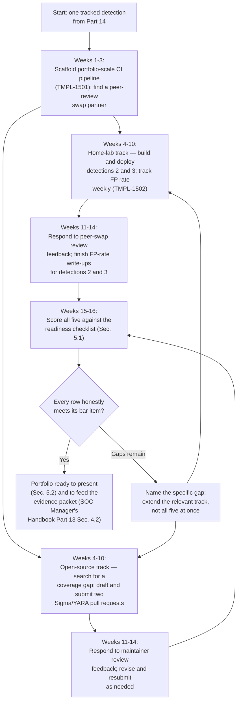

# Part 15 — Becoming a Detection Engineer: Skills, Portfolio, and the Work-Sample Bar

## Why this part exists

**[CONCEPT]** Part 14 got you one real artifact toward the detection-engineer branch: a self-written detection, deployed in your own home lab, with a tracked false-positive rate that actually moved as you tuned it. That's real evidence, and it's nowhere near the bar. SOC Manager's Operating Handbook, Part 13 — Career Ladders & Promotion Criteria, §3.1 sets the actual entrance requirement for this branch as a work-sample bar, stated precisely: at least five detections merged through a real detection-as-code review pipeline, under your own authorship, with a post-deployment false-positive rate that stayed inside whatever tuning threshold that pipeline's review gate sets. This part exists to close the distance between one home-lab detection and that bar, honestly — which means confronting the part of the bar a candidate without a detection-engineering job can't fake: a *real* review pipeline, not a solo repository where you're the only person who ever reads your own diff.

**[CONCEPT]** This part owns three things, all of them things you personally build before anyone hands you a job that hands you a pipeline: open-source Sigma and YARA contributions as a way to put your work through a genuine external review gate you didn't have to build yourself; a personal detection-as-code pipeline, in a home-lab git repository, that scales the discipline Part 14 started from one rule to a real portfolio; and false-positive-rate tracking as a standing personal habit rather than a number you calculate once, right before an interview. It does not own how a detection-as-code pipeline actually works mechanically — the branching model, the metadata standard, separation of duties as a CI-enforced gate. Detection Engineering Handbook V2, Part 22 — Detection as Code already owns that in full, and this part cites it rather than re-teaching it. It does not own how a promotion committee scores the evidence packet this portfolio eventually feeds — SOC Manager's Operating Handbook Part 13 owns that, cited below for exactly what it asks for and nothing more.

**[L1/L2]** If you're still an L1 or L2 analyst, this part is a preview, not a to-do list — you'll get more out of it once you've actually chosen the detection-engineer branch through Part 3's framework and built Part 14's first artifact. It's worth one read now anyway: knowing that "merged through a real review pipeline" is the actual bar, not "wrote some detection logic," changes what you notice the first time you see a rule get tuned on your own team.

**[SENIOR/SPECIALIST]** If you're past that point and already hold Part 14's single tracked detection, this part is written directly at you. The rest of it assumes you have that one artifact, know roughly what tuning a false positive out of a rule feels like, and are ready to do it four more times under conditions that produce evidence a stranger — an interviewer, a promotion committee, a hiring manager — can actually verify.

## 1. The bar, restated from the side of the desk that has to clear it

**[CONCEPT]** SOC Manager's Operating Handbook, Part 13 — Career Ladders & Promotion Criteria, §3.1 states the detection-engineer entrance bar as a work sample, not a self-declared interest, because a committee that promotes on interest alone gets a detection engineer who learns the review pipeline on the job, at the cost of every reviewer's time and every rule's early false-positive rate while that learning happens. The bar has three separate conditions, and a candidate's evidence has to satisfy all three, not just one:

- Five detections, plural — not five ideas, not five drafts, not five rules you wrote and never shipped.
- Merged through the actual detection-as-code review pipeline, under your own authorship — a rule someone else had to substantially rewrite before it could merge doesn't count, no matter whose name is on the commit.
- A post-deployment false-positive rate that stayed inside whatever tuning threshold the pipeline's own review gate sets — a number measured after the rule went live against real traffic, not a number estimated before deployment.

> **Cross-Book Pointer**
> This part does not explain how a promotion committee weighs this bar against the rest of a candidate's evidence packet, or how the bar sits alongside the hunt-record and coaching-aptitude bars for the other two branches. See SOC Manager's Operating Handbook, Part 13 — Career Ladders & Promotion Criteria, §3.1 for the bar itself and §4.2 for the full evidence-packet checklist a committee will eventually expect — this part builds toward the "branch-specific work sample" line item that packet names, months before you're anywhere near a formal nomination.

### 1.1 What "own authorship" rules out

**[SENIOR/SPECIALIST]** Own authorship means you picked the behavior, reasoned through what "normal" looks like well enough to write the condition that excludes it, and can explain — from memory, because you lived through it — every threshold and exclusion in the file and why it's set where it is. It rules out downloading a well-regarded public rule, changing a field name, and submitting it as your own idea. It also rules out a rule a reviewer had to rewrite the logic of before merging; a PR that started as yours and got substantially rebuilt by someone else in review produced a good detection, but it isn't your work sample.

### 1.2 The gap the bar doesn't mention: you probably don't have a pipeline yet

**[SENIOR/SPECIALIST]** Here's the honest problem. The bar in §3.1 was written from inside an organization that already runs a detection-as-code pipeline with real separation of duties — an author, a technical reviewer, and a merge-approver who are three different people, none of whom can approve their own work, enforced by branch-protection settings rather than trusted to memory. Detection Engineering Handbook V2, Part 22 — Detection as Code §3 covers exactly why that separation matters and how a CI platform enforces it. If you don't have a detection-engineering job yet, you don't have that pipeline, and no amount of personal discipline turns a solo home-lab git repository into a three-person review gate — you're the author, and whoever else touches the repository is nobody, because nobody else has a reason to.

> **Ground Truth**
> "Merged through a real review pipeline" sounds like a bar you either clear or don't. In practice, a candidate assembling this evidence before they have the job it's meant to certify readiness for is assembling the closest honest substitute available, not clearing the bar as written — and pretending otherwise in an interview is a worse move than saying so directly. The rest of this part builds two different kinds of substitute evidence: a personal pipeline that gets the mechanical discipline right even though it can't replicate real separation of duties (§2), and open-source contribution, which gives you an actual third party with no reason to be generous reviewing your actual work (§3). A candidate who can describe honestly which of their five detections cleared a real external review and which only cleared their own solo process is giving an interviewer something to trust. A candidate who blurs the two isn't.

## 2. Building a personal detection-as-code pipeline that's honest about what it can't do

**[SENIOR/SPECIALIST]** Part 14 §2.1 got you as far as one git repository, one file per detection, a metadata block, and a GitHub Action running your query's logic against a true-positive fixture and a false-positive fixture. That was enough for one rule. Getting to five, and getting the portfolio to a state where it demonstrates a real habit rather than a single weekend's effort, means treating the repository itself as a piece of infrastructure you maintain, not a folder you occasionally add a file to.

### 2.1 [HOME LAB — companion volume not yet written] Scaffolding a CI pipeline that actually blocks a bad merge

**[STUDY PLAN]** A planned SOC Home Lab Handbook will eventually own the full step-by-step build guide for a production-grade personal detection pipeline. Until it exists, here's enough to build one that does real work now, scaled from Part 14's single-rule version.

Structure the repository the way Detection Engineering Handbook V2, Part 22 §1 describes a real team's rule repository: one file per detection, named by an ID you assign yourself, metadata as YAML front matter, query logic as the file body, and `main` as a protected branch that mirrors what's actually "shipped" in your own lab. Add three CI stages that run automatically on every pull request, not just the one you built for Part 14's single rule:

1. **Lint and schema validation** — a script that checks your metadata block has every field you've decided is required (behavior targeted, fields the query depends on, a stated false-positive source, a numeric threshold) and that the query at least parses for your target platform. DEH V2 Part 22 §5 covers what a real team's lint stage checks in full; a solo version can start much smaller and still catch the "I forgot to fill in the threshold field" class of mistake that costs you nothing to catch automatically.
2. **Fixture-based testing** — the same true-positive/false-positive fixture pattern Part 14 introduced, but committed to the repository as a growing library rather than rebuilt per rule, so a change to one detection's shared logic (a lookup list, a baseline definition) gets re-tested against every fixture that depends on it, not just the one you're actively editing.
3. **A required-status-check setting on your `main` branch** — most git platforms let you mark specific CI jobs as required before a merge button unlocks, even on a free personal account. Turn this on. It's the single control that turns "I try to remember to run the tests before merging" into "the platform will not let me merge without it," which is the actual mechanism DEH V2 Part 22 §2 describes as the difference between a policy and an enforced gate.

TEMPLATE — personal detection-as-code pipeline scaffold checklist, permanent ID `TMPL-1501`. Use this once, when you're moving from Part 14's single-rule repository to a portfolio-scale one; re-check it any time you add a new detection type your existing fixtures don't cover.

```text
[ ] main branch protected; direct pushes blocked, PR required for every change
[ ] Lint/schema CI job runs on every PR and is marked as a required status check
[ ] Fixture library structured so a shared-logic change re-tests every dependent detection
[ ] Every merged detection's metadata block names its own false-positive source explicitly
[ ] Versioning convention decided and written down (see 2.3) before the fourth detection,
    not invented retroactively when a rule needs its first real tuning change
```

This checklist's main limitation: none of it can verify that your fixtures are honest. A fixture you wrote from imagination instead of from real captured lab telemetry will pass every test and still misfire the first time it meets real background noise — the discipline in this checklist only enforces that a test exists and runs, not that the test means anything.

### 2.2 Getting a second real reviewer without a team

**[SENIOR/SPECIALIST]** Part 14's Analyst's Note already named the core problem: a solo pipeline can't have real separation of duties, because you're the author, the reviewer, and the merge-approver every time, and the 24-hour cold-review trick only ever gives you a second look from the same person who designed the rule. At portfolio scale, across five detections instead of one, that limitation is worth taking one step further than waiting a day and reading your own diff again.

> **Analyst's Note**
> Find one other person doing the same kind of home-lab detection-engineering work — a study-group peer, someone from a CTF or detection-engineering community, a person you met at a local security meetup — and trade pull requests. You review one of theirs, they review one of yours, on a fixed weekly or biweekly cadence. Neither of you is a professional detection-engineering reviewer, and you should say so plainly if this comes up in an interview, but a second human being who didn't write the rule, reading it cold and asking "why does this threshold assume that," catches a real category of blind spot that reading your own work a second time never will.

**[MINDSET]** Be precise with yourself about what this peer-review swap does and doesn't give you. It gets you closer to DEH V2 Part 22 §3's separation-of-duties principle than a solo repository does, because a genuinely different person is now looking for the false-positive source you missed. It does not give you a merge-approver with actual authority over a production environment, and it does not give you the stakes a real team's reviewer operates under — nobody's on-call rotation gets paged if your peer's review missed something. Name that gap honestly in your portfolio write-up rather than letting "reviewed by a peer" sound like more than it is.

### 2.3 Versioning and metadata discipline at portfolio scale

**[STUDY PLAN]** One rule tolerates a loose versioning habit. Five don't, because by the time you're tuning your third or fourth detection you need to be able to answer "what changed, and when" without re-reading every commit message. Adopt DEH V2 Part 22 §8's versioning categories rather than inventing your own: a MAJOR bump when the underlying behavior a rule targets changes, a MINOR bump when you tune an existing rule's threshold or add an exclusion without changing what it's fundamentally trying to catch, and treat your own `git log` on each detection's file as that rule's audit trail, exactly as DEH V2 Part 22 §1 describes it for a real team.

## 3. Open-source Sigma and YARA contributions: borrowing a review pipeline you didn't have to build

**[SENIOR/SPECIALIST]** Here's the move that actually closes most of the gap §1.2 named. A public Sigma or YARA rule repository already has the thing your solo home lab structurally can't: a maintainer, or a small group of maintainers, with a real reputation staked on the repository's quality, who will read your pull request critically because they have no reason to be generous, and who will merge it, request changes, or reject it based on the same kind of technical scrutiny a real employer's reviewer would apply. That's a genuine external review gate. You didn't build it, you don't control it, and it doesn't know or care that you're using it to build a portfolio — which is exactly what makes a merge into it real evidence instead of a story about your own process.

### 3.1 Why a merged public pull request outweighs a solo home-lab merge

**[SENIOR/SPECIALIST]** A rule merged into your own repository proves you can write a detection and pass your own test. A rule merged into a repository like SigmaHQ's public collection, or an actively maintained community YARA rule set, proves something stronger: that a stranger with domain expertise and no stake in your career read your logic, tried to find its false-positive source, and decided it was good enough to ship into a resource other people rely on. An interviewer can independently verify this — the pull request, the review comments, and the merge are all public and permanent, which is a category of evidence a private home-lab repository can never quite match no matter how well you document it yourself.

### 3.2 Getting your first contribution merged

**[STUDY PLAN]** Start with a project that has active maintainers and a written contribution process — SigmaHQ's public Sigma rule repository is the most widely used example for detection logic, and there are several actively maintained community YARA rule collections for malware and tooling signatures. Read the contribution guidelines before you write a single line; most of these projects reject a meaningful share of first-time submissions for process reasons (wrong metadata format, missing a required field, duplicating an existing rule) that have nothing to do with whether the underlying idea is good, and those are exactly the rejections you can avoid by reading first.

Pick a technique with thin existing coverage rather than one that's already covered by a dozen similar rules in the same repository. A new Sigma rule for a well-covered technique like a common living-off-the-land binary is much more likely to be flagged as duplicate effort — a real, useful rejection that still costs you a review cycle you didn't need to spend. A gap you can identify by actually searching the existing rule set first, before you start writing, is both more likely to merge cleanly and closer to real detection-engineering judgment than picking whatever technique happens to be easiest to demonstrate.

> **Analyst's Note**
> Before you write a single query for an open-source contribution, search the target repository for existing rules covering the same or an adjacent technique. Ten minutes of searching regularly saves a rejected PR and, more importantly, teaches you to read an existing rule set for coverage gaps — which is close to the exact skill a real detection-engineering team exercises before adding anything new to its own rule set.

### 3.3 What open-source contribution can't give you

**[SENIOR/SPECIALIST]** A merged public Sigma or YARA rule proves your logic passed a real external reviewer's scrutiny. It does not give you post-deployment false-positive data in the sense SOC Manager's Operating Handbook Part 13 §3.1 means it, because you don't operate the environments where that public rule eventually runs — you have no visibility into how often it fires or misfires once other people deploy it. That's a genuine, permanent limitation of this kind of evidence, not something a better write-up fixes.

The practical answer is a mixed portfolio: some of your five detections carry real post-deployment false-positive tracking because you wrote, deployed, and tuned them in your own home lab under Part 14's discipline (§4 below); others carry proof of a real external review because they merged into a public repository maintained by people with no reason to wave your work through. Neither type alone satisfies every clause of the bar in §1 as written for an employed detection engineer. Together, honestly labeled, they're the strongest evidence available to someone building this record before the job exists.

> **What Would Change My Mind**
> This part treats a portfolio mixing home-lab-deployed detections with tracked false-positive data and open-source-merged detections with real external review as comparably strong pre-hire evidence for the detection-engineer branch — stronger, in combination, than five detections of either type alone. If structured feedback from real hiring pipelines showed interviewers and promotion committees consistently discounting open-source-only evidence regardless of its quality, treating nothing short of an actual employer-side pipeline merge as credible, that would undercut this section's central claim, and this part's guidance should shift toward telling a reader to prioritize getting hired into any detection-adjacent role first and building the rest of the five-detection record on the job.

## 4. False-positive-rate tracking as a personal habit, at portfolio scale

**[STUDY PLAN]** Part 14's false-positive-rate tracking log (`TMPL-1401`) followed one detection through roughly four weeks of observation. A portfolio of five needs the same discipline running in parallel across every detection you've shipped, with the added job of letting you compare across them — because "I tracked a false-positive rate once" and "I track false-positive rates as a running habit across everything I ship" are different claims, and only the second one is what the branch bar is actually checking for.

### 4.1 Extending the single-rule log into a portfolio tracker

**[STUDY PLAN]** Keep one aggregate view alongside your five per-detection logs, updated on the same cadence — weekly is reasonable for a home-lab volume of alerts — so you can see the whole portfolio's health at a glance instead of having to reconstruct it from five separate files right before you need it.

TEMPLATE — five-detection portfolio tracker, permanent ID `TMPL-1502`. Update this weekly from the day your fourth and fifth detections go live; a portfolio-level view assembled only once, right before an interview, can't show a real trajectory, for the same reason Part 14's Ground Truth box named for a single rule observed over three days.

| Detection ID | Source | Live since | Current FP rate | Trend (4-week) | Last tuning change |
|---|---|---|---|---|---|
| `DET-HL-01` | Home lab, own pipeline | Week 1 | 12% | Falling | Added exclusion for scheduled backup job |
| `DET-HL-02` | Home lab, own pipeline | Week 5 | 40% | Falling | Narrowed threshold field |
| `DET-OSS-01` | Merged, SigmaHQ | Week 3 | Not observable — no deployment visibility | — | N/A — upstream maintained |
| `DET-HL-03` | Home lab, own pipeline | Week 8 | 8% | Stable | None yet — still in observation |
| `DET-OSS-02` | Merged, community YARA set | Week 6 | Not observable — no deployment visibility | — | N/A — upstream maintained |

CONCEPTUAL SAMPLE — illustrative entries for a made-up five-detection portfolio; your own real numbers, sources, and mix of home-lab versus open-source detections will differ. The judgment call this template doesn't automate: deciding how many of your five should carry real tracked FP data versus real external review — that ratio is a personal choice about which gap in the bar you're better positioned to close, not a fixed formula.

### 4.2 Measuring your own false-positive rate honestly

**[MINDSET]** Detection Engineering Handbook V2, Part 38 — False Positive Engineering, §6 names three specific ways a reported false-positive rate misleads without anyone technically lying: folding benign positives into the false-positive count inconsistently from one measurement to the next, counting the denominator after an upstream suppression rule has already filtered out most of the noise so the detection logic gets credit for a quality improvement it didn't actually make, and dropping auto-closed alerts out of the calculation entirely so automation looks like it's improving quality when it's really just reducing visibility. None of that requires a team or a production SIEM to do to yourself — a solo home-lab tracker is just as capable of quietly drifting its own convention rule to rule, and a candidate who can't explain their own counting convention consistently under a follow-up question loses more credibility than a candidate with a genuinely higher, honestly measured number.

> **Field Test**
> **Setup:** You have at least three detections live in your home lab, each tracked for a minimum of two weeks under `TMPL-1502`.
> **Action:** Without looking at your tracker, write down each detection's current false-positive rate, its dominant false-positive source, and the exact convention you're using — whether a benign-but-expected alert counts as a false positive or gets tracked separately. Then check the tracker against what you wrote.
> **Expected result:** Your remembered numbers should be close to the logged ones, and your stated convention should match what you've actually been recording all along. If your convention has quietly shifted between detections — one rule's benign positives excluded, another's folded in as errors — that's the exact drift DEH V2 Part 38 §6 warns a reported rate can hide, and it's worth fixing before anyone else asks you to explain the number.

> **Blind Spot**
> A false-positive rate tuned to near zero against your own home lab's traffic only proves the rule survived your own lab's specific noise — your own scheduled jobs, your own small number of accounts, your own admin habits. It says nothing about how the same logic behaves against an unfamiliar environment with more users, different baseline behavior, and noise you've never personally generated, which is exactly the environment a real employer's pipeline will eventually deploy it into. State this limitation plainly in your portfolio write-up rather than letting a clean home-lab number imply more confidence than a single lab can support.

## 5. Assembling and presenting the five-detection portfolio

**[SENIOR/SPECIALIST]** By the time you have five detections in some state of "live and tracked" or "merged and public," the last piece of work is turning that pile of evidence into something a stranger can evaluate in five minutes, not something they have to reconstruct by reading five separate repositories cold.

### 5.1 The readiness checklist

**[STUDY PLAN]** Score each of your five detections against the actual bar in §1, not against how finished the rule feels to you. A detection that's live, tuned, and beautifully documented but that you can't honestly claim passed a real external reviewer is worth logging accurately as such — the checklist's value is in what it makes you admit, not in a clean sheet of checkmarks.

| Detection ID | Own authorship confirmed | Real external reviewer (peer swap or open-source maintainer) | Observation window ≥ 4 weeks | FP-rate convention stated and consistent | Tuning history documented |
|---|---|---|---|---|---|
| `DET-HL-01` | Yes | Peer-swap review, Week 6 | Yes | Yes | Yes |
| `DET-HL-02` | Yes | Not yet | Yes | Yes | Yes |
| `DET-OSS-01` | Yes | Yes — SigmaHQ maintainer review | N/A — not self-deployed | N/A | N/A |
| `DET-HL-03` | Yes | Not yet | No — 3 weeks | Yes | Partial |
| `DET-OSS-02` | Yes | Yes — community maintainer review | N/A — not self-deployed | N/A | N/A |

CONCEPTUAL SAMPLE — illustrative scoring for a made-up five-detection portfolio at a specific point in time; treat every "not yet" or "no" row as a real task, not a rounding error to gloss over before an interview.

> **Career Trap**
> Building a detection-as-code repository with a real CI pipeline the week before an interview, then merging five rules through it in a single weekend, produces a repository that looks identical on paper to one built and used honestly over months — right up until an interviewer asks what the false-positive rate looked like in week two versus week six, and there's no week-two data, because the rule didn't exist yet. The fix: start the pipeline and the tracking log the same week you pick your first detection idea, months before you expect to need the portfolio for anything, so the timestamps in your own git history and your own log are real evidence instead of a reconstruction assembled under deadline pressure.

**CASE-1501 — five merges in a week to hit the number.** *COMPOSITE CASE EXAMPLE* — constructed from patterns across multiple detection-engineer branch transitions, not one traceable individual.

> **Career Autopsy — "five merges in a week to hit the number"**
>
> **The decision:** A senior analyst who'd chosen the detection-engineer branch found five existing, well-regarded rules in a public Sigma rule repository, forked each one, adjusted a field name and a threshold value slightly on each, and submitted all five as new pull requests inside a single week, aiming to hit the "five merged detections" number as fast as possible.
>
> **Why it seemed reasonable:** Every one of the five covered a real technique, every file carried the analyst's own name in the commit history, and the community reviewers merging them were checking for correct syntax and real coverage, not auditing whether the underlying idea was original — three of the five merged within days with no pushback at all.
>
> **How it failed:** The first interviewer who asked "walk me through why this rule uses a ten-minute correlation window instead of five" got a guess, not an answer, because the analyst had adjusted the number without ever understanding what had driven it in the original rule. Worse, a maintainer flagged one of the five as substantially duplicate to a better-maintained existing rule three weeks later and reverted the merge — a public, permanent event in exactly the git history that had been offered up as portfolio evidence.
>
> **The fix:** Pull the claimed count back down to two genuinely original contributions — ones the analyst could describe from memory, including the specific false-positive source that had shaped every threshold in the file — and spend the freed effort on original home-lab detections tracked under Part 14's discipline instead. An interviewer only needs enough evidence to trust that you can do the reasoning yourself; two rules you can defend under a real follow-up question outperform five you can't.

### 5.2 Presenting a mixed-provenance portfolio to an interviewer or a committee

**[INTERVIEW PREP]** Lead with the distinction §1.2's Ground Truth box names, not around it. Tell an interviewer plainly which of your detections carry real post-deployment false-positive data from your own home lab and which carry a real external maintainer's review with no deployment visibility of your own — that honesty is itself evidence of the exact judgment the branch bar is checking for, because a detection engineer who can't tell the difference between "I tested this myself" and "someone else's review vouched for this" is missing a distinction their actual job depends on daily.

Have one detection from each category ready as a two-minute walkthrough: the behavior it targets, the false-positive source that shaped its current form, and — for the home-lab one specifically — what the tuning trajectory in your tracker actually looked like, not just the final number. "It started at a 93% false-positive rate and I brought it down to 12% over four weeks by adding these three exclusions, in this order, for these reasons" is a concrete, verifiable answer. "It has a low false-positive rate" is not, and it's exactly the kind of vague claim Part 8's interview-prep work trains you to replace with a specific number and a specific mechanism.

## 6. A roadmap from one detection to a presentable five

**[STUDY PLAN]** The diagram below sequences the work in §§2 through 5 as two tracks run in parallel — the home-lab pipeline track and the open-source contribution track — converging on the readiness checklist in §5.1. Treat the week numbers as a reasonable default pace against roughly five to six hours a week outside your shift, the same assumption Part 14's calendar used, not a fixed deadline.



**Figure 15.1 — A parallel-track roadmap from one tracked home-lab detection to a presentable five-detection portfolio.** *CONCEPTUAL.* Illustrates one reasonable sequencing of the home-lab and open-source tracks this part builds, run in parallel rather than one after another, converging on the readiness checklist in §5.1. This is a pacing illustration, not a claim that every reader's actual review cycles — especially the open-source track's, which depends on volunteer maintainers' own schedules — will land on these exact weeks. Diagram ID `FIG-1501`.




**[MINDSET]** Notice that the open-source track's timeline in the diagram above is the one most likely to slip, and that slippage isn't a sign you're doing anything wrong. A volunteer maintainer reviewing your pull request is fitting it in around their own job, and a review that takes six weeks instead of two says nothing about your rule's quality. Build slack into your own expectations for that track specifically, and don't let a slow review cycle on the open-source side talk you into padding the home-lab side with rushed, under-observed detections just to keep the overall timeline moving.

## 7. Common traps at this stage

**[MINDSET]** Two failure patterns show up often enough at this specific stage to name directly, beyond the copy-paste shortcut §5.1's autopsy already covers.

The first is treating the five-detection number as the finish line instead of the false-positive-rate discipline underneath it. A candidate who ships five detections, hits the number, and stops tracking any of them the moment the portfolio "looks done" has demonstrated that they can build detections, not that they maintain them — and maintenance, not initial construction, is most of what a real detection-engineering job actually consists of day to day. Keep at least one detection in your portfolio actively changing, tuned, and re-observed, the same way Part 14's closing note warned against a lab project that gets built once and never touched again.

The second is over-indexing on the open-source track because it feels like faster, more legible progress — a merged public pull request is satisfying in a way a slowly-improving home-lab false-positive rate isn't, because the merge is a single visible event and the tuning trajectory is a slow grind with no equivalent moment of external validation. Resist letting that asymmetry decide your effort allocation. The home-lab track is where you build and prove the actual tuning judgment the branch exists to certify; the open-source track proves you can pass someone else's review. Both matter, and the one that feels less rewarding day to day is not the one to shortchange.

---

## Cross-references

This part assumes Part 3 — Choosing Your Path: A Specialization Decision Framework (the aptitude signals that route a reader toward this branch) and Part 14 — The Senior-Analyst Study Plan and the Portfolio That Earns a Branch Choice (the single tracked detection this part's portfolio work starts from). It feeds forward into Part 18 — Staying a Strong Individual Contributor and Part 24 — Building Your Own Career Roadmap, where this portfolio becomes one input into a longer-range plan. Outside this book, it cites SOC Manager's Operating Handbook, Part 13 — Career Ladders & Promotion Criteria, §3.1 and §4.2 for the branch's work-sample bar and the evidence-packet mechanics this portfolio feeds, without re-deriving how a committee scores either; and Detection Engineering Handbook V2, Part 22 — Detection as Code for the pipeline mechanics (branching, the metadata standard, separation of duties as a CI-enforced gate) and Part 38 — False Positive Engineering, §6 for the honest false-positive-rate measurement discipline this part's tracking habit is built on, in both cases citing the mechanics rather than re-teaching them.
