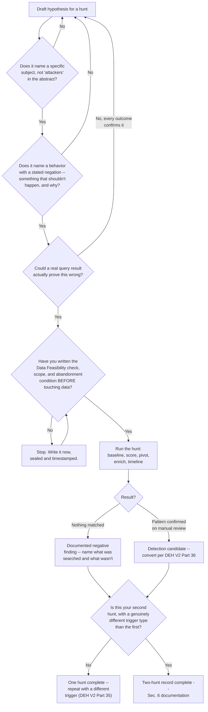

# Part 16 — Becoming a Threat Hunter: Hypothesis Discipline and the Hunt Record

## Why this part exists

**[CONCEPT]** SOC Manager's Operating Handbook, Part 13 — Career Ladders & Promotion Criteria, §3.2 names the threat-hunter branch bar in one clause: a completed hunt record — at least two structured hunts, run under a real hunting methodology, with at least one resolving to a documented negative finding or converting into a shipped detection candidate. That is how the organization decides someone is ready for the title. It is not a study plan, and this part does not turn it into one by re-deriving it. What this part owns is narrower and comes first: the two hunts themselves, run by you, before any committee is involved, documented well enough that the reasoning survives being read cold by a stranger months later.

**[CONCEPT]** Part 14 already got you started. Its portfolio-building calendar had you run one hunt with a stated hypothesis and abandonment condition, as one of three parallel tracks feeding Part 3's specialization fork. If you did that project honestly, you already have something toward this bar — possibly even a full hunt one. This part assumes that starting point and finishes the job: getting you a genuinely different second hunt, teaching you the specific discipline a committee or an interviewer actually probes for (which is not query fluency), and giving you a documentation standard that makes both hunts auditable rather than just completed.

**[CONCEPT]** The central discipline this part protects is stated plainly in SOC Manager's Handbook Part 13 §3.2 itself: "a candidate can be technically strong at querying and still be a poor hunter if every hunt they've run started from 'let's see what's weird in this data' rather than a falsifiable hypothesis." Everything below is built around that one sentence — how to tell the difference in yourself before someone else tells you, and how to build two hunts that would survive the specific test that sentence implies.

> **Cross-Book Pointer**
> This part does not teach hunt methodology from scratch — hypothesis formation, Data Feasibility checking, scoping, query construction, pivoting, enrichment, or timeline building. Detection Engineering Handbook V2, Part 34 — Threat Hunting Fundamentals defines that methodology in full, worked end to end against a real running example, and Part 35 — Hunt Types covers the seven distinct triggers a hunt can start from and what a defensible ending looks like for each. Read those for the technique. This part is about producing two real, complete hunts using that technique, and about the specific evidence a future reviewer will want to see that you actually used it — not a shortcut around learning it.

## 1. What the bar is actually testing, and what it isn't

**[CONCEPT]** SOC Manager's Handbook Part 13 §3.2 is an organizational evaluation mechanic — who reviews the hunt record, how a specialist reviewer is looped into the promotion committee alongside the team lead, what happens if a candidate's two hunts both stall on a hypothesis nobody could operationalize. None of that belongs in this book, and none of it is repeated here. What does belong here is the target that mechanic is pointed at: two structured hunts, run under DEH V2 Part 34–35's methodology, at least one ending in a real result. Read that sentence as a checklist, not a mood. It names a count (two), a method (the DEH methodology, not an improvised one), and an ending condition (negative finding or detection candidate, not "I looked around"). Every section below builds toward exactly those three things and nothing extra.

**[SENIOR/SPECIALIST]** The bar also names, explicitly, what a committee tests a candidate against once the record exists: "ask the candidate to state, before they touch the data, what a negative result would look like and what would make them abandon the hypothesis." That is not a rhetorical flourish in a promotion document — it is the literal interview question a specialist reviewer is coached to ask, and it has exactly one honest way to pass it: you actually did that, in writing, before you touched the data, on both hunts, and you can produce the artifact. Section 6 covers building that artifact. Sections 4 and 5 cover living up to it on two real hunts first.

> **Ground Truth**
> "I've done some threat hunting" is one of the most common overstatements this book's own review pattern sees on a resume, and it usually means something closer to "I ran a query I hadn't run before and found nothing wrong with it." That's not a lie exactly — it's a category error, the same one Part 34 §1 draws a hard line around: alert triage, ad hoc log-browsing, and a real hunt look similar from the outside because both involve staring at logs, but only one of them starts from a falsifiable claim written down before the data is touched. A specialist reviewer who has actually run hunts will ask the abandonment-condition question inside the first two minutes, and "I didn't write one down" ends the conversation regardless of how much querying skill the rest of the interview demonstrates.

## 2. Hypothesis discipline: the skill querying fluency doesn't prove

### 2.1 The three-part test, restated as a self-check

**[SENIOR/SPECIALIST]** DEH V2 Part 34 §2 gives the working definition: a Threat Hypothesis names a subject, a behavior with an implied negation, and it has to be able to fail. Turn that into three questions you ask about your own draft hypothesis before you let yourself call it one:

- **Does it name a subject specifically?** Not "attackers," not "the network" — an account type, a host role, a segment, something you could point to on an asset list.
- **Does it name a behavior with a stated negation?** Not "does something suspicious" — a concrete action, plus the reason it shouldn't happen for that specific subject.
- **Can a real query result prove it wrong?** If every plausible outcome would read as confirming the hypothesis, it's a foregone conclusion wearing a hypothesis's grammar, not an actual hypothesis.

**[L1/L2]** This is a sharper bar than Part 12's L2-tier hypothesis-driven investigation exercise, which mimics the ambiguity of a real ticket but doesn't require the same falsifiability discipline — an L2 investigation can reasonably start "something about this session feels off" and sharpen from there under time pressure, because a ticket already has a fired alert anchoring it. A hunt has no alert to anchor it. If the hypothesis isn't specific and falsifiable before you touch data, there's nothing anchoring the search at all, and "something feels off" turns into an unbounded fishing expedition with no way to know when you're done.

### 2.2 The abandonment condition is the part people skip

**[SENIOR/SPECIALIST]** A stated hypothesis without a stated abandonment condition is half the discipline. The abandonment condition is the specific result that would make you conclude the hypothesis was wrong, or untestable with what you have, and stop — not "keep looking a little longer," not quietly redefining the population mid-hunt to keep chasing something interesting. Write it as a concrete, checkable trigger: "if the flagged-session count after the full scoring window is zero, or if fewer than three accounts in the population have enough baseline history to score against, I stop and write up a negative finding or a Visibility Debt finding, whichever applies." That's checkable. "I'll know it when I see it" is not.

> **Career Trap**
> The single most common way a self-built hunt record fails a specialist reviewer's follow-up question is writing the hypothesis and abandonment condition *after* running the queries, once the result is already known, and backdating the write-up to make it read as if the discipline came first. It's an easy trap to fall into by accident — you ran a curious query, something interesting turned up, and it feels natural to frame the write-up as "I hypothesized X" even though the actual sequence was "I looked, then I explained." The fix is mechanical, not moral: write the hypothesis, the Data Feasibility check, the scope, and the abandonment condition into a dated file or a sealed note *before* the first query runs, and never edit that file once queries start. If you can't produce a timestamp that predates your own result, a reviewer has no way to distinguish real discipline from a retroactive story — and the honest version of "I wrote this after the fact" is a weaker but still recoverable answer; a fabricated timestamp is not recoverable at all.

> **Field Test**
> **Setup:** You have a hunt idea in mind and have not yet run a single query against real data.
> **Action:** Write your hypothesis, your Data Feasibility check result, your scope (population, time window, stop condition), and your abandonment condition into a plain-text file. Note the file's timestamp, or commit it to a personal git repository so the commit hash and timestamp are independently verifiable. Do not edit that file again once you start querying.
> **Expected result:** When the hunt ends, your actual stopping point should match what the sealed file said, in either direction — either the abandonment condition triggered and you stopped, or it never triggered and you ran to your stated scope limit. If you find yourself wanting to edit the sealed file partway through to make the ending look cleaner, that urge is itself the signal: hypothesis discipline is exactly the thing that resists that urge, per DEH V2 Part 34 §2's distinction between a real hypothesis and a foregone conclusion looking for support.

## 3. Building a hunt lab with injected adversary behavior `[HOME LAB — companion volume not yet written]`

**[SENIOR/SPECIALIST]** A small home lab's biggest limitation as a hunting environment is exactly the one DEH V2 Part 34's own worked example runs into: a lab with no real attacker in it, hunted honestly, produces mostly clean negative findings, because nothing malicious is actually happening. A negative finding is a legitimate ending and Section 4 covers building one properly — but a hunt record built entirely from hunts that could only ever end one way doesn't exercise the pivot, enrichment, and detection-candidate-conversion half of the methodology at all. This section covers deliberately injecting real, technique-mapped adversary behavior into your own lab so at least one of your two hunts has a genuine chance of finding something, without waiting indefinitely for your own background noise to accidentally produce an attack.

### 3.1 Reusing what you already have

**[STUDY PLAN]** If you built the ingestion pipeline in Part 5 or the detection and hunt projects in Part 14, you already have telemetry flowing and at least one hunt's worth of Data Feasibility groundwork done. That's the environment this project extends — don't stand up a second, separate lab. Add one new capability to the existing one: a repeatable, safe way to execute a specific, MITRE ATT&CK-mapped technique against a disposable VM inside your lab, on demand or on a schedule.

**[STUDY PLAN]** Atomic Red Team (an open-source library of small, discrete technique executions mapped directly to ATT&CK technique IDs, maintained by Red Canary) is the most accessible tool for this. On Windows, the `Invoke-AtomicRedTeam` PowerShell module runs a single named atomic test — a specific LSASS-access technique, a specific persistence mechanism, a specific credential-access behavior — against the local machine, and cleans up after itself if you ask it to. On Linux, the library ships shell-based atomics for a comparable range of techniques. Either way, run these only against a disposable VM you can snapshot beforehand and roll back afterward, never against a machine holding anything you'd mind losing — some atomics genuinely modify system state (create scheduled tasks, drop files, touch the registry) as part of accurately emulating the technique.

### 3.2 The trap in injecting behavior you already know about

**[MINDSET]** If you personally choose which technique to run and personally watch it execute, then go hunting for exactly that technique, you haven't run a hunt — you've run a detection test with extra steps, because you already know the answer before the first query. The value of a real hunt comes partly from not knowing in advance whether anything is there. Preserve that by making the injection genuinely blind to yourself.

**[STUDY PLAN]** Two workable ways to do this on a solo budget: schedule the injection to run automatically, at a randomized time inside a window you set, chosen from a short pool of three to five candidate techniques by a script whose selection you don't read until after the hunt concludes — a scheduled task or cron job that logs its choice to a file you commit not to open, or encrypts the choice with a password you set aside and don't use until afterward. Or, if you have a study partner working through this same part (Part 8 covers finding one for interview prep, and the same partner works here), have them pick and run the technique on your lab over remote access while you're not watching, and tell you only after you've written up your conclusion.

> **Ground Truth**
> "I ran an Atomic Red Team test, watched my SIEM catch it, and called that a hunt" is a common shortcut, and it isn't one — it's a detection validation exercise, which is a real and useful thing to do, just not the thing SOC Manager's Handbook Part 13 §3.2 is asking for. The distinguishing feature of a hunt is that you don't know the answer going in. If you chose the technique, ran it yourself, and immediately went looking for exactly what you knew you'd planted, you've tested whether your detection fires — genuinely useful, and worth doing — but you haven't tested your own hypothesis discipline under real uncertainty, which is the specific thing this branch bar exists to certify.

> **Blind Spot**
> Even a properly blinded injection has a structural limit a fully organic hunt doesn't: you know, at minimum, that *something* was injected during the window, even if you don't know what. That's a weaker uncertainty than a real production hunt, where the honest prior is "probably nothing, but I don't actually know that either." Don't oversell a blinded lab hunt in an interview as identical to hunting in a live enterprise environment — it isn't, and a specialist reviewer who's run real hunts will notice the difference if you claim otherwise. Frame it honestly instead: a rehearsal of the full methodology, under a real, self-imposed uncertainty, against telemetry you built and understand — which is exactly what a home lab can credibly claim, and exactly what an experienced reviewer will actually credit if you describe it that way.

## 4. Hunt one: running the methodology end to end against injected behavior

**[SENIOR/SPECIALIST]** Use whichever of the three candidate techniques you seed the blind pool with in §3.2, but design the pool around a hypothesis you can state specifically ahead of time, per Section 2's test — not "something in this window." A workable pool for a first hunt: a scheduled-task persistence technique, an LSASS credential-access technique, and a discovery technique that enumerates local accounts. Before the injection window opens, write the hypothesis and abandonment condition for whichever signal you'll actually be hunting.

### 4.1 Writing the pre-registration before the window opens

**[STUDY PLAN]** A workable pre-registration for this pool: "In the population of processes running under standard user or service accounts on the target VM, no process should read LSASS memory or create a new scheduled task in the next 24 hours without a corresponding change-ticket entry I control myself. Data Feasibility: confirmed — Sysmon Event ID 10 (process access) and Event ID 1 (scheduled-task creation, or the Security log's 4698) are both flowing from Part 5's pipeline. Population: the one disposable VM in the injection pool. Time window: the 24 hours following the scheduled injection. Stop condition: every flagged process-access or task-creation event reviewed to a disposition, or the 24-hour window elapsed with none. Abandonment condition: if the window elapses with zero flagged events and I've confirmed the telemetry was actually flowing throughout (not silently stopped), I close this as a negative finding."

**[SENIOR/SPECIALIST]** Notice what that pre-registration does not say: it doesn't say "check for the scheduled task technique," even though that's plausibly one of the three techniques in the pool. It states the hypothesis at the level of the *behavior class* the detections in the pool would actually produce, so the hunt stays honest about not knowing which specific technique, if any, will fire during the window — you're hunting the shape of the behavior, not the specific plot you half-remember seeding.

### 4.2 Pivot, enrichment, and a real ending

**[SENIOR/SPECIALIST]** Once the window closes, run the DEH V2 Part 34 sequence exactly as that part lays it out: baseline first (what does this VM's normal process-access and task-creation pattern look like, ideally from a prior clean window), then score the actual injection window against that baseline, pivot from any flagged event to the account and the parent-process chain that produced it, enrich with whatever ownership or change-ticket context your lab tracks, and build a timeline if anything survives to that stage.

**[SENIOR/SPECIALIST]** Two honest endings are available, and both count. If nothing flags — the injected technique used a variant your detection logic and your hunt's baseline comparison both miss, or the pool happened to select a technique that doesn't touch the fields you're scoring — write up a documented negative finding, naming exactly what was searched, exactly what population and window it covered, and exactly what confidence-limiting gap (if any) you found. If something flags and survives manual review as the real injected technique, you have a detection candidate: write the pattern up as an Analytic per DEH V2 Part 36 — Hunt to Detection's conversion path, and note explicitly that the underlying behavior was injected and confirmed, not just plausible — that distinction matters to a future reviewer checking your reasoning, not just your conclusion.

> **Analyst's Note**
> Whichever ending you get, open the sealed record of which technique actually ran *after* you've written the conclusion, not before, even if you're dying to know. Comparing your written conclusion against the real answer after the fact, rather than peeking mid-hunt, is the only way this exercise actually tests whether your methodology would have caught something you didn't already know was there — peeking early quietly turns the whole exercise back into the detection-validation shortcut Section 3.2's Ground Truth box warns against.

## 5. Hunt two: a genuinely different trigger

**[SENIOR/SPECIALIST]** SOC Manager's Handbook Part 13 §3.2 asks for two structured hunts, not two versions of the same hunt with a different technique swapped in. DEH V2 Part 35 — Hunt Types names seven distinct triggers a real hunt can start from — IOC-based, TTP-based, anomaly-based, intel-led, incident-led, gap-driven, and retrospective — and DEH Part 35 §1 makes the point directly: what actually differs across a hunt's life isn't the methodology underneath (that's constant, per Part 34), it's the answer to "what specific thing, external to my own curiosity, justified spending a time box on this." Choosing a second hunt with a genuinely different trigger than the first is what turns "I ran two hunts" into "I can hunt from more than one kind of starting signal," which is the actual breadth a specialist reviewer is checking for.

**[STUDY PLAN]** If hunt one was TTP-based (as the injected-behavior project in Section 4 is, since it starts from a named technique rather than a specific indicator or a live incident), a strong, achievable second hunt for a solo lab is gap-driven: pick a standing detection you or a peer already wrote — your own Part 14 self-written detection, or a public rule you've deployed and tuned — and hunt specifically for the coverage gap in its own logic, the exact way DEH V2 Part 34 §10.9 documents its own worked detection candidate, DET-34-01, missing an attacker who evades a TTY-presence baseline simply by never allocating a pseudo-terminal in the first place. State the hypothesis as: "an attacker performing the same behavior class this detection targets, but omitting the specific field or condition the detection's logic depends on, would not fire it — and I should be able to find, or fail to find, evidence of that specific evasion in telemetry the detection itself doesn't inspect."

**[STUDY PLAN]** An anomaly-based second hunt is the other strong, low-cost option if a gap-driven hunt doesn't fit your lab's existing detection set: pick a population (accounts, hosts, a process type) with enough baseline history in your Part 5 telemetry to score a genuine statistical or behavioral deviation, without any specific technique or indicator triggering it — the hypothesis becomes "this population's behavior has been stable across my available baseline, and any account or host that deviates from that stable pattern in the scoring window deserves review," which is close in shape to the running example DEH V2 Part 34 §10 itself works through against real captured lab evidence.

> **Cross-Book Pointer**
> This part does not walk through all seven hunt-type shapes with worked examples — Detection Engineering Handbook V2, Part 35 — Hunt Types covers IOC-based, TTP-based, anomaly-based, intel-led, incident-led, gap-driven, and retrospective hunts in full, each against real captured telemetry from that book's own home-lab honeynet. Read Part 35 before committing to your second hunt's trigger type, so the choice is informed by what each type actually demands of your available data, not just a guess at which label sounds most impressive on a resume.

**[SENIOR/SPECIALIST]** Whichever trigger you choose for hunt two, run the same pre-registration discipline as Section 4.1 — hypothesis, Data Feasibility, scope, abandonment condition, sealed and timestamped before the first query. The trigger differs; the discipline that makes the record auditable does not.

The diagram below sequences this part's two-hunt build as a self-check flow, gating advancement on the honesty of your own hypothesis rather than on time elapsed.



**Figure 16.1 — Self-assessment flow: is this a real hunt yet, and is the two-hunt record actually complete?** *CONCEPTUAL.* Illustrates the hypothesis-discipline self-check from Section 2 gating entry into a real hunt, and the trigger-diversity check from Section 5 gating the completed record — not a capture of any specific hunt-management tool's own workflow. The three left-branch loops back to the same node deliberately: a hypothesis that fails any one of the three tests isn't a smaller hunt, it's not a hunt yet, and the fix is rewriting it, not lowering the bar. Diagram ID `FIG-1601`.




## 6. Documenting a hunt so a future reviewer can audit the reasoning, not just the conclusion

**[STUDY PLAN]** A hunt record that only states the conclusion — "hunted for X, found nothing" — gives a reviewer nothing to check. The version that survives an audit states, in order, exactly what you knew before you started, exactly what you decided to search for and why, and exactly where the search actually stopped, so a stranger reading it cold six months later could either reproduce your reasoning or spot precisely where it broke down.

TEMPLATE — the hunt record log, permanent ID `TMPL-1601`. Fill in the top block before running a single query, and do not edit it afterward; fill in the bottom block only once the hunt has actually concluded.

```text
HUNT RECORD -- TMPL-1601

Sealed before any query runs (timestamp / commit hash: ______________)

  Trigger type (per DEH V2 Part 35):  ______________________________
  Threat hypothesis (subject + behavior + negation):
    ____________________________________________________________
  Data Feasibility check result:
    ____________________________________________________________
  Scope -- population:                ______________________________
  Scope -- time window:                ______________________________
  Scope -- stop condition:             ______________________________
  Abandonment condition (the specific result that ends this hunt
  as untestable or disconfirmed):
    ____________________________________________________________

Filled in only after the hunt concludes

  Baseline method used:                ______________________________
  Query logic (link to file / saved search):  ________________________
  Pivots run, and the join key used for each:
    ____________________________________________________________
  Enrichment applied:                  ______________________________
  Ending:  [ ] Documented negative finding   [ ] Detection candidate
           [ ] Visibility Debt finding (telemetry didn't exist)
  What was searched, precisely (for a negative finding):
    ____________________________________________________________
  What confidence-limiting gap remains, if any:
    ____________________________________________________________
  If a detection candidate: link to the written-up Analytic and its
  false-positive-driver list.
```

This template's main limitation: it records what you searched and why, but it cannot verify that your baseline was actually built from a clean, pre-injection window rather than a window that already contained the behavior you're scoring against — that specific check (a baseline built from the same window being hunted is a tautology, not a baseline, per DEH V2 Part 34 §3) is a judgment call the template reminds you to make, not one it makes for you.

> **Cross-Book Pointer**
> This part does not cover how a promotion committee's specialist reviewer scores a hunt record against the branch bar, or how that review gets folded into the evidence packet a team lead assembles. See SOC Manager's Operating Handbook, Part 13 — Career Ladders & Promotion Criteria, §4.2 for the evidence-packet mechanics — the row naming "detection PRs, hunt records, or shadow-lead log" as the branch-specific work-sample line item a committee actually reads. This part's `TMPL-1601` is built specifically so that row has something real and auditable behind it, not a summary written the week before a nomination.

> **Career Autopsy — "the hypothesis I wrote after I already knew the answer"** (`CASE-1601`, COMPOSITE CASE EXAMPLE)
>
> **The decision:** A senior analyst preparing a threat-hunter branch application runs a curious query against their SIEM out of habit during a slow shift, notices an odd cluster of outbound connections from one host, and — impressed by the finding — writes up a polished hunt record afterward, framing it as if a stated hypothesis and abandonment condition had come first.
>
> **Why it seemed reasonable:** The finding was real, the write-up was thorough, and reconstructing the "hypothesis" after the fact felt like a formatting exercise rather than a fabrication — the analyst genuinely believed, by the time they finished writing, that they'd basically thought that way going in.
>
> **How it failed:** In the branch interview, the specialist reviewer asked the exact question SOC Manager's Handbook Part 13 §3.2 coaches reviewers to ask: what would a negative result have looked like, and what would have made you abandon this before you saw the cluster? The analyst had no answer that predated the finding, because none had ever existed — the honest sequence was look first, explain second. The reviewer didn't accuse anyone of lying; they simply noted, correctly, that the record showed query fluency and a real finding, but no verifiable hypothesis discipline, and asked for a second hunt run the right way before revisiting the branch decision.
>
> **The fix:** Every hunt from that point forward used a sealed, timestamped file exactly like `TMPL-1601`'s top block, committed to a personal git repository before the first query ran. The second hunt, run this way, resolved to a clean negative finding — a less exciting result than the accidental cluster, but the one that actually answered the reviewer's question, because the timestamp on the sealed commit predated the result by three days and could be checked by anyone.

## 7. Self-scoring: do you actually have the discipline, or a good story about it

**[MINDSET]** The felt-sense-versus-artifact-quality rubric Part 14 §5.1 introduced for choosing between branches applies with extra weight here, because threat hunting is the one branch among the three where the felt sense of the work and the actual skill are most likely to diverge in a specific direction: a hunt that resolves to nothing can feel like wasted time even when it's a genuinely well-run negative finding, and a hunt that stumbles onto something exciting by accident can feel like skill even when the discipline behind it was thin. Score honestly, and score the discipline separately from the outcome.

TEMPLATE — hypothesis-discipline self-scoring rubric, permanent ID `TMPL-1602`. Use this on both hunts once each has concluded, scoring the process you actually ran, not how satisfying the ending felt.

| Check | Score (0–2) |
|---|:---:|
| Hypothesis named a specific subject, not a population stated in the abstract | |
| Hypothesis named a behavior with a real, stated negation | |
| Abandonment condition was written and sealed before any query ran | |
| Data Feasibility was checked and recorded before scoping, not discovered mid-hunt | |
| Actual stopping point matched the sealed abandonment condition, in either direction | |
| Write-up names exactly what was searched, not just the conclusion | |

0 = not present. 1 = partially present or reconstructed with some doubt about timing. 2 = clearly present, sealed, and independently checkable (a timestamp or commit hash, not your own memory). A hunt scoring below 8 of 12 has real discipline gaps worth fixing before you count it toward the two-hunt bar — a low score doesn't disqualify the hunt from being a useful rehearsal, but it does mean the write-up shouldn't yet be presented as branch-bar evidence.

**[MINDSET]** The row most people score generously without noticing is the fifth one. It's tempting to read "I decided the abandonment condition had effectively triggered" as satisfying it, even when the sealed file said something more specific that didn't quite happen. Go back and reread the literal sealed text, not your memory of its spirit, before scoring that row.

> **Field Test**
> **Setup:** You've completed both hunts and scored each on `TMPL-1602`.
> **Action:** Hand both sealed pre-registration files and both final write-ups — with the scores hidden — to a peer or mentor who has run real hunts, and ask them to score the same six rows independently, without telling them your own scores first.
> **Expected result:** Your self-scores and theirs should land within a point or two on most rows. A large gap on the abandonment-condition or Data-Feasibility rows specifically is worth taking seriously — it usually means the write-up reads more disciplined than the sealed file actually was, which is exactly the gap between story and record this section exists to catch before an actual specialist reviewer catches it instead.

## 8. Assembling the completed hunt record for the branch bar and for an interview

**[INTERVIEW PREP]** Once both hunts are documented on `TMPL-1601` and self-scored on `TMPL-1602`, you have the specific artifact SOC Manager's Handbook Part 13 §4.2's evidence packet names as the branch-specific work sample for this track — a real hunt record, not a description of one, ready months before any formal nomination. Internally, that record is what a team lead and specialist reviewer will actually read when your name comes up for the threat-hunter branch. Externally, it converts a dreaded interview question — "walk me through a hunt that didn't find anything" — from a hypothetical you'd have to improvise into a real narrative you can walk a stranger through field by field, because the sealed file proves the sequence rather than asking them to trust your memory of it.

**[INTERVIEW PREP]** Practice narrating both hunts out loud before the interview, in the order a reviewer will actually probe them: hypothesis first, abandonment condition second, only then the mechanics and the ending. Candidates who lead with the finding — "so I found this weird cluster of connections" — are, without meaning to, performing the exact retroactive-story pattern the Career Autopsy above walks through. Leading with the sealed pre-registration instead signals, before a single follow-up question gets asked, that the discipline came first.

**[SENIOR/SPECIALIST]** This two-hunt record is a floor, not a ceiling. Once you're actually working the threat-hunter branch, a real hunting program runs many more hunts than two, across a real backlog of hypotheses, on a cadence SOC Manager's Handbook Part 13 §3.2 and DEH V2 Part 34 §11 both describe from the program-management side. What this part gets you is the minimum real, honest, auditable evidence to walk through that door — not a claim that two hunts make you a finished hunter.

> **What Would Change My Mind**
> This part treats a sealed, timestamped pre-registration file as meaningfully different evidence than a well-written retrospective account of the same hunt, even when both describe an identical hypothesis and an identical ending. If a structured review of promotion outcomes showed specialist reviewers accepting retrospective hunt write-ups at a rate indistinguishable from sealed pre-registered ones — no measurable difference in follow-up-question failure rate, no measurable difference in later on-the-job hunting performance — that would undercut this part's central bet that the sealed-timestamp mechanic is doing real evidentiary work rather than just satisfying a reviewer's aesthetic preference for paperwork, and this part's guidance should soften toward "write it up honestly, timing optional."

## 9. A worked calendar for completing the two-hunt record

**[STUDY PLAN]** The table below assumes you've already completed Part 14's single-hunt project and have a home lab with real telemetry flowing. It sequences the injected-behavior hunt (Section 4) and a second, differently-triggered hunt (Section 5) across a realistic pace for five to six hours a week outside your shift (CONCEPTUAL SAMPLE — illustrative pacing, not a validated benchmark) — stretch the week counts, not the hour target, if your schedule is tighter.

| Week | Focus | Deliverable | Where it's checked |
|---|---|---|---|
| 1 | Set up the injection pool (3–5 Atomic Red Team techniques); arrange blind scheduling or a partner | Injection pool live, scheduling mechanism confirmed working on a test run | Self-check: can you confirm a technique ran without knowing which one |
| 2 | Write and seal Hunt One's pre-registration; open the injection window | Sealed `TMPL-1601` top block, timestamped before window opens | Git commit timestamp or file hash |
| 3 | Run Hunt One: baseline, score, pivot, enrich, timeline | Hunt One concluded to a negative finding or detection candidate | `TMPL-1601` bottom block filled in |
| 4 | Choose Hunt Two's trigger type (per DEH V2 Part 35), confirm Data Feasibility | Sealed `TMPL-1601` top block for Hunt Two | Git commit timestamp or file hash |
| 5–6 | Run Hunt Two: baseline, score, pivot, enrich, timeline | Hunt Two concluded, genuinely different trigger type from Hunt One | `TMPL-1601` bottom block filled in |
| 7 | Self-score both hunts on `TMPL-1602`; get a peer's independent score on both | Two completed rubrics, self and peer, compared | §7's Field Test |
| 8 | Practice narrating both hunts aloud, hypothesis-first, for interview prep | A five-minute walkthrough of each hunt you can deliver without notes | Part 8's interview-practice format |

This calendar's main limitation: it assumes the injection scheduling in week 1 works cleanly on the first try, which is optimistic — Atomic Red Team executions occasionally fail silently against a hardened or unusually configured VM, and discovering that only after opening a blind window wastes the window. Run at least one fully unblinded, known-technique test execution before committing to the real blind schedule, purely to confirm the mechanics work, and don't count that dry run as either of your two hunts.

---

## Cross-references

This part assumes Part 3 — Choosing Your Path: A Specialization Decision Framework (the aptitude questions this record's evidence eventually answers), Part 13 — L3 / Senior Analyst: Judgment Without a Playbook (the judgment bar this part's hunts are built on top of), and Part 14 — The Senior-Analyst Study Plan and the Portfolio That Earns a Branch Choice (whose single-hunt project is this part's starting point). It feeds forward into Appendix A5 — Branch-Readiness Trackers, where `TMPL-1601` and `TMPL-1602` live as reusable artifacts, and into Part 8 — Interview Prep From the Candidate's Chair for narrating the completed record under interview conditions. Outside this book, it cites SOC Manager's Operating Handbook, Part 13 — Career Ladders & Promotion Criteria, §3.2 for the threat-hunter branch bar this part builds toward and §4.2 for the evidence-packet mechanics that bar feeds, and Detection Engineering Handbook V2, Part 34 — Threat Hunting Fundamentals, Part 35 — Hunt Types, and Part 36 — Hunt to Detection for the hunt methodology, trigger taxonomy, and conversion mechanics this part deliberately does not re-derive.
