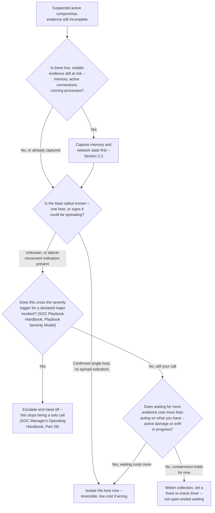

# Part 17 — Becoming an Incident Responder: From Alert Triage to Leading a Response

## Why this part exists

**[CONCEPT]** Triage and incident response share a queue and a set of tools, and they are not the same job. A triage analyst's decision, at its hardest, is "escalate or don't" — a real, sometimes agonizing call, but one with a clean exit: once it's escalated, the case belongs to someone else. An incident responder doesn't get that exit. The case lands on you, the evidence is never complete, and the decisions you make in the first thirty minutes — what to capture before you touch anything, whether to isolate a host now or watch it a little longer, what you can say with confidence versus what you're guessing — determine how much of the truth is still recoverable by the time anyone else gets involved. This part is about building the specific skills that gap demands: enough host and memory forensics to read a live system instead of just its logs, enough malware-behavior literacy to describe what a piece of code is doing without needing to reverse-engineer it, and enough practiced judgment to make a containment call when the picture in front of you is still missing pieces.

**[CONCEPT]** SOC Manager's Operating Handbook, Part 28 — The Manager's Role in a Major Incident owns what a manager personally does once an incident is declared major: staffing surge, board communication cadence, retainer activation, and the decision-authority boundary that keeps an incident commander from also fielding executive phone calls. This part does not re-derive any of that, and the self-run tabletop exercise in Section 5 is deliberately built as the participant's version of a drill that book runs from the manager's chair — practicing the technical decision under pressure, not practicing how to protect the person making it. SOC Playbook Handbook's Ransomware Master Playbook, in turn, owns the operational incident-commander playbook itself: the containment and eradication sequence, the criteria for declaring an incident resolved. This part's job is narrower than either: what you personally build, study, and practice so that when a real case lands on you — or when you're eventually trusted to run one — you have the underlying skill the playbook assumes rather than just the playbook's steps memorized.

**[CONCEPT]** This part assumes you've already run the specialization self-assessment in Part 3 — Choosing Your Path: A Specialization Decision Framework and landed on, or are seriously weighing, the incident-response branch. It also assumes the judgment habits Part 13 — L3 / Senior Analyst: Judgment Without a Playbook and the portfolio groundwork in Part 14 — The Senior-Analyst Study Plan and the Portfolio That Earns a Branch Choice are already in motion — this part builds the IR-specific layer on top of that foundation, not a replacement for it.

## 1. What changes when escalating stops being the answer

### 1.1 Triage hands off a case; incident response owns what happens to it

**[CONCEPT]** The clearest way to see the shift is to notice what happens to uncertainty in each role. A triage analyst facing an ambiguous signal has a correct, defensible move available at almost every turn: gather what the playbook asks for, escalate with a clear statement of what's known and what isn't, and let the next tier resolve the rest. An incident responder facing the same ambiguity has no next tier to hand it to in the moment — you are the next tier, at least for the minutes or hours it takes for anyone more senior to get read in. The skill that triage rewards is recognizing when you've hit the edge of your authority and routing cleanly. The skill incident response rewards is operating competently past that edge, because the edge is where the job actually starts.

**[SENIOR/SPECIALIST]** That difference shows up concretely in what "good" looks like on a bad day. A strong L2 triage call on an ambiguous phishing report is a clean escalation with the right context attached. A strong incident-response call on a suspected active compromise is a sequence of decisions — what to capture first, what to isolate and when, what to tell people who are asking for certainty you don't have yet — each of which has to be defensible on its own, because nobody is going to review and correct it before the next one has to be made. You're not being asked to be right every time. You're being asked to reason well enough, fast enough, that a reviewer looking at your case notes afterward can see the logic even where the outcome turned out to be wrong.

### 1.2 Where this part's job ends and the other books' begins

**[CONCEPT]** Three things belong to other books specifically so this part doesn't have to guess at them badly. What an incident commander does operationally — containment sequencing, eradication timing, the criteria for declaring an incident resolved — is SOC Playbook Handbook's Ransomware Master Playbook. What a SOC manager does during a live major incident — staffing, board communication, retainer activation, the decision-authority line — is SOC Manager's Operating Handbook, Part 28. What the four-axis competency matrix checks for at the judgment axis specifically, and how a promotion committee reads evidence against it, is SOC Manager's Operating Handbook, Part 10 — Competency Models & Skills Matrices and Part 13 — Career Ladders & Promotion Criteria, both already covered from your side of the desk in Part 2 and Part 11 of this book. What's left — and what this part actually owns — is the skill stack and the personal practice history that make you someone worth trusting inside any of those three structures before anyone hands you the title.

> **Cross-Book Pointer**
> This part's Section 5 self-run tabletop is not a smaller version of SOC Manager's Operating Handbook Part 28's manager-side drill — it's a different exercise testing a different chair. Part 28's Field Test puts a manager through an unannounced tabletop where a simulated CISO tries to pull the incident commander off a live technical decision, and checks whether the manager holds the decision-authority boundary. This part's tabletop puts *you* in the technical seat and checks whether you can make and defend a containment call under incomplete information without anyone protecting your attention from anything. Read Part 28 to understand the organizational boundary a real incident commander operates inside; run this part's version to build the skill that boundary is there to protect.

## 2. The skill stack beyond triage

**[CONCEPT]** Three specific capabilities separate someone who can triage an incident-shaped alert from someone who can actually work an incident: reading what happened on a host well enough to reconstruct a timeline, reading what's still running in memory well enough to catch what a disk image alone would miss, and reading a suspicious binary's behavior well enough to describe what it does without needing to disassemble it. None of these three requires expert-level depth to be useful. All three require more than triage ever asked of you.

### 2.1 Basic host forensics: what "basic" actually buys you

**[SENIOR/SPECIALIST]** "Basic host forensics" here means a specific, bounded skill: given access to a live or imaged endpoint, you can identify what ran, when, and what it touched, using the artifacts an operating system leaves behind whether or not anyone was watching at the time. On Windows, that means knowing where to look — Prefetch and the Amcache for evidence of execution, the Security and Sysmon event logs for process creation and network connections, Run and RunOnce registry keys and scheduled tasks for persistence, the Master File Table and USN Journal for file activity that predates or outlives a log rotation — and knowing how to pull those artifacts without altering them in the process. On Linux, the equivalent list is shorter but no less load-bearing: shell history, cron and systemd timers, `auth.log` or the journal for authentication events, and `/proc` for anything still running at the moment you look. None of this requires memorizing every artifact's binary format. It requires knowing which artifact answers which question, and building enough hands-on repetition that you reach for the right one under time pressure instead of remembering it exists three hours later.

**[SENIOR/SPECIALIST]** The tools that make this practical without requiring you to parse raw binary structures by hand are widely used and free: Eric Zimmerman's forensic tool suite (often invoked through KAPE for targeted, repeatable artifact collection) and Autopsy for full-disk analysis and timeline reconstruction on the Windows side; Sysinternals' Autoruns, Process Explorer, and TCPView for live-system triage before an endpoint gets imaged at all. Learning these tools well enough to answer "what ran on this box and what did it change" inside an hour, on data you didn't generate yourself and don't already know the answer for, is the actual bar — not naming the tools, using them against something you haven't seen before.

### 2.2 Basic memory forensics: reading what's still running

**[SENIOR/SPECIALIST]** Memory forensics matters because a surprising amount of what a real intrusion does never touches disk in a form a host-forensics pass will find: process injection, in-memory-only payloads, credentials sitting in a process's working set, network connections that closed before anyone thought to check NetFlow. "Basic," for this part's purposes, means you can capture memory correctly — before you do anything else that might overwrite or evict it — and then run a standard set of checks against that capture rather than a fully custom investigation: process trees that don't make sense (`pstree`), network connections tied to processes that shouldn't have them (`netscan`), signs of code injected into a legitimate process rather than run as its own (`malfind`), and command-line arguments that reveal what a process was actually told to do (`cmdline`). Volatility 3 runs all of these against a raw memory capture without requiring you to understand the memory manager internals the plugin itself is built on.

**[SENIOR/SPECIALIST]** The sequencing matters as much as the technique. Memory is the most volatile evidence on a live system — it degrades the moment power is lost and changes continuously while the system keeps running — which means memory acquisition has to happen *before* any containment action that might reboot, power off, or otherwise disturb the host. This is the single most common way a well-intentioned first responder destroys the exact evidence that would have told them what actually happened. Section 3 covers the containment-decision framework this sequencing feeds into.

> **Career Autopsy — "reimage it and move on"**
>
> **The decision:** An analyst investigating a suspected credential-theft case on a single workstation, working alone late in a shift with a queue backing up behind them, isolated the host from the network, confirmed a suspicious process was still running, killed it, and then handed the machine to IT for a same-night reimage so the user could be back online by morning.
>
> **Why it seemed reasonable:** The immediate threat looked contained — network access cut, malicious process terminated — and a fast reimage read as the responsible, decisive move: get the compromised endpoint out of production as quickly as possible and let the user get back to work.
>
> **How it failed:** Killing the process before capturing memory destroyed the only copy of an in-memory-only payload that never wrote itself to disk; the reimage a few hours later destroyed everything else. When a second, related alert surfaced on a different host three days later, there was no way to confirm whether the two incidents were connected, what the first payload had actually done, or what credentials it might have accessed — because the only host that could have answered those questions no longer existed in any recoverable form.
>
> **The fix:** A one-line rule fixed this for good: capture memory before you kill anything, and don't authorize a reimage until whoever is running the case confirms evidence collection is actually complete — not just "looks handled." A five-minute memory capture costs almost nothing next to a workstation's downtime; treating it as optional under time pressure is the mistake, not the time pressure itself.

### 2.3 Malware-behavior fundamentals, short of reverse engineering

**[SENIOR/SPECIALIST]** The skill this part asks for is behavioral literacy, not reverse engineering. You do not need to disassemble a binary, unpack a packer, or read compiled code to be useful in an incident — that's a real, deep specialist skill in its own right, and treating it as a prerequisite for incident response is a common and costly overreach this part's Career Trap below names directly. What you do need is the ability to look at a suspicious file's behavior — what it writes, what it connects to, what it spawns, how it persists — and describe that behavior in terms an investigation can act on immediately: does this look like a credential stealer, a downloader staging a second payload, ransomware in a pre-encryption discovery phase, or something else entirely.

**[SENIOR/SPECIALIST]** Two levels of triage get you most of the way there. Static triage — computing a hash and checking it against threat-intelligence sources, running `strings` against the binary, inspecting the PE header with a tool like PEStudio for suspicious imports or an absent digital signature — tells you what a file *might* do before it ever runs. Behavioral (dynamic) triage — detonating the sample in an isolated sandbox, whether a purpose-built service or your own isolated home-lab VM, and watching what it actually does — tells you what it *did* do, and is the more reliable of the two because malware authors routinely obfuscate the static picture specifically to defeat the first check. Mapping what you observe to MITRE ATT&CK technique IDs turns a vague "it looked suspicious" into a specific, reusable statement — "T1055 process injection into explorer.exe, followed by T1071 C2 over HTTPS to a domain registered four days ago" — that another responder, or a detection engineer building a rule from your findings, can act on directly.

> **Cross-Book Pointer**
> This part covers only enough malware-behavior literacy to describe what a sample is doing in ATT&CK terms during a live investigation. Detection Engineering Handbook V2, Part 44 — Adversary Behaviour for Defenders covers the fuller technical depth behind that same behavior — the evidence each ATT&CK stage leaves, how it gets detected, and the visibility gaps that persist even with strong tooling — organized as a detection-engineering reference, not an incident-response one. Read it once you want to go deeper than "what is this doing right now" into "what would have caught this earlier, and what still wouldn't."

> **Career Trap**
> Deciding that real incident-response credibility requires learning to reverse-engineer malware — disassembly, unpacking, decompilation — before you've built the behavioral-triage habit this section actually asks for is a common, expensive detour. Reverse engineering is a genuine specialist skill with its own multi-hundred-hour learning curve, and most incident-response work never requires it: a sandbox detonation and an ATT&CK mapping answer the question an active investigation is actually asking ("what is this doing and what do I do about it right now") faster and more reliably than a disassembler will, for the overwhelming majority of cases you'll actually see. Build the behavioral-triage skill first, all the way to fluency, and only pick up reverse engineering later if a specific case — or a specific career turn toward malware analysis as its own specialty — actually calls for it.

## 3. Containment decisions under incomplete information

**[SENIOR/SPECIALIST]** Every skill in Section 2 exists to feed one recurring decision: what do you do right now, with the evidence you have, knowing more evidence is still coming and that waiting for it has its own cost. This is the judgment layer Part 13 of this book names as the thing that separates senior analysts who've built real judgment from those who've only accumulated tenure, applied to the specific, high-stakes shape incident response gives it. Getting this decision right consistently is not about having a bigger mental checklist — it's about having a small number of ordering principles you apply the same way every time, so the decision doesn't have to be reinvented from scratch while the clock is running.

**[SENIOR/SPECIALIST]** Four principles do most of the work. First, evidence order: capture what degrades fastest before you do anything that might destroy it — memory before you kill a process, a live network-connection snapshot before you pull a cable, a screenshot of what's on screen before you touch the keyboard. Second, reversibility: prefer containment actions you can undo over ones you can't, when the evidence doesn't yet justify an irreversible move — isolating a host from the network is reversible; wiping it is not. Third, blast-radius honesty: treat "I don't know whether this has spread" as a real answer that changes your next move, not a gap to paper over with confidence you don't have — a single confirmed host with no lateral-movement indicators supports a narrower, faster containment action than a case where you genuinely don't know yet. Fourth, the escalation trigger: know, before you're in the middle of a case, what severity threshold hands the decision to someone else entirely — SOC Playbook Handbook, Part 29 — Playbook Severity Model defines that threshold operationally, and once a case crosses it, the call is no longer yours to make solo, full stop.

**[SENIOR/SPECIALIST]** Figure 17.1 below turns those four principles into a decision sequence you can actually run against a live case, rather than a list you have to remember to consult.



**Figure 17.1 — A containment decision sequence for incomplete-information cases.** *CONCEPTUAL.* `FIG-1701`. Illustrates the four ordering principles in this section — evidence-order, reversibility, blast-radius honesty, and the severity-trigger handoff — as a sequence you can run against a real case in minutes, not a capture of any specific organization's actual incident-response procedure.




> **Field Test**
> **Setup:** Pull a completed case from your DFIR home-lab (Section 6) or a past real investigation where containment happened, and set a 15-minute timer.
> **Action:** Without looking at what you actually did the first time, work through Figure 17.1 against the case using only the evidence that was available at the moment containment was decided — not evidence that surfaced afterward. Write down each branch you took and why.
> **Expected result:** Your reconstructed decision should match what actually happened, or produce a clearly better one you can defend on the evidence available at the time. If you can't reconstruct a defensible sequence inside 15 minutes against a case you already know the ending to, running the same decision live, on a case you don't know the ending to, is not yet a strength — treat that as the specific gap to close before your next tabletop.

## 4. Is the incident-response branch actually the right fork for you

**[SENIOR/SPECIALIST]** Part 3 — Choosing Your Path: A Specialization Decision Framework already walks the general aptitude questions that separate detection engineering, threat hunting, and incident response as branches. Two signals specific to incident response are worth naming directly, because they don't show up cleanly in that general framework. First: does working with an incomplete, degrading picture under time pressure feel like the interesting part of the job, or the stressful part you'd rather design your way around? Detection engineering and threat hunting both reward comfort with ambiguity on a timeline you mostly control; incident response adds a clock that isn't yours to set. Second: are you drawn more to the host-level, hands-on-keyboard technical depth this part's skill stack builds, or to the broader pattern-across-many-cases thinking a hunt or a detection rule rewards? Both are real technical depth. They are not the same kind, and building toward one for a year only to discover you wanted the other is an expensive year to redo.

> **Blind Spot**
> A self-run tabletop or home-lab case, done entirely alone, can validate that you can reason through a containment decision correctly with time to think. It cannot validate that you'll hold that same reasoning together with a phone ringing, a manager asking for a status update, and a queue of other things demanding attention at the same time — because you're both the analyst and the only source of pressure in the exercise. Section 5's tabletop format below builds in an artificial pressure source specifically to partially close this gap; it still isn't a substitute for the real thing, and the honest way to close the rest of it is a documented shadow rotation on an actual incident, even a minor one, the first time your organization runs one.

## 5. Home-lab project one: running your own tabletop, as a participant

**[SENIOR/SPECIALIST]** A tabletop exercise is a structured, talked-through simulation of an incident — no live systems touched, just a scenario, a clock, and a sequence of decisions made out loud or in writing as new information gets revealed. Organizations run these to test their incident-response plan and their people; SOC Manager's Operating Handbook, Part 28 describes the manager-side version, built to test whether a decision-authority boundary holds under a simulated executive trying to break it. This section builds a different version, sized for one person or a small informal group, built to test your own decision-making against Figure 17.1's sequence rather than to test an organization's structure.

**[SENIOR/SPECIALIST]** Here is a complete, runnable design. Pick a scenario — a laptop reporting a suspicious process that persisted through a reboot, a server showing signs of lateral movement from a compromised credential, a workstation whose user reports a ransom note — and write it as a short scenario card: what you know at minute zero, and nothing else. Recruit a moderator if you can (a study-group partner, a mentor, even a willing non-technical friend reading from a script); run it solo if you can't, using a second sealed envelope or a locked note instead of a live moderator. Set a strict clock — 45 to 60 minutes total works well for a first attempt. Every five to seven minutes, the moderator reveals one new piece of information from a pre-written sequence (a memory-capture result, a new host showing the same indicator, a call from someone in the building) regardless of where you are in your own reasoning, forcing a decision before you feel ready rather than after. Narrate every decision out loud or in writing as you make it — what you're doing, why, and what you still don't know — because the narration, not the final outcome, is what a later self-review or a mentor's feedback actually has something to work with.

**[SENIOR/SPECIALIST]** Close every run with the same fixed debrief, done immediately while the reasoning is still fresh: what decision would you make differently with the information you had at each point (not the information you have now); which of Figure 17.1's four principles did you actually apply versus skip under pressure; and what specific piece of Section 2's skill stack — a forensic artifact you didn't think to check, a memory-analysis step you skipped — would have changed your confidence at any decision point. That debrief, written down, is what turns a tabletop from an evening's exercise into evidence — feed it directly into the DFIR case log Section 8 builds.

## 6. Home-lab project two: a DFIR VM lab `[HOME LAB — companion volume not yet written]`

**[SENIOR/SPECIALIST]** This project — an isolated virtual lab built to practice host and memory forensics against a deliberately compromised machine — is exactly the kind of step-by-step infrastructure build a planned SOC Home Lab Handbook will eventually own in full depth (VM sizing, snapshot management, hardware-cost tradeoffs). It doesn't exist yet, so what follows carries enough detail to build and run this lab now, on your own hardware or a cloud VM, without waiting for that book.

**[SENIOR/SPECIALIST]** The goal is a small, isolated environment where you can safely detonate real or simulated malicious behavior against a target VM, then practice exactly the host- and memory-forensics workflow from Section 2 against evidence you generated yourself and don't already know the full answer for. Three components make this work.

**[SENIOR/SPECIALIST]** First, isolation. Run the lab inside a hypervisor (VirtualBox and VMware Workstation Player are both free for personal use) on a host-only or internal network with no route to your real network or the internet — this is non-negotiable the moment you're detonating anything you didn't write yourself, and it's the single most common home-lab safety mistake to get wrong. Second, a target VM: a fresh Windows 10 or 11 install (a 90-day evaluation image from Microsoft works fine) with Sysmon installed and configured to a public, well-documented configuration (the SwiftOnSecurity Sysmon config is a widely used, free starting point) so your later analysis has real, high-fidelity logs to work against, not just default Windows auditing. Third, a source of behavior to investigate: either a curated, publicly available malware sample run inside an intentionally sacrificial, snapshotted VM you're prepared to discard (never on hardware or a network you actually use), or — the lower-risk option most readers should start with — a benign attack-emulation tool like Atomic Red Team, which executes real ATT&CK techniques (a scheduled-task persistence mechanism, a credential-dumping attempt, a discovery command sequence) without deploying anything actually malicious, giving you real forensic artifacts to hunt for with none of the containment risk.

**[SENIOR/SPECIALIST]** Snapshot the target VM clean before every run, so a bad detonation or a mistake in your own analysis costs you a five-minute revert instead of a rebuild. Then work the same sequence every time: capture memory (WinPmem or Magnet RAM Capture, both free) before you do anything else; run Volatility 3 against that capture for the checks in Section 2.2; pull the disk-based artifacts KAPE targets by default; build a timeline in Autopsy; and write up what happened as a case using the DFIR case-log template in Section 8. The table below sequences a first build across four sessions rather than one long sitting, which is both more realistic against a normal week's free time and lower-risk if something in the setup needs troubleshooting partway through.

The checklist below (`TMPL-1702`) sequences the DFIR VM lab's first build into four sessions, so a first attempt doesn't stall on trying to do the whole thing in one sitting.

| Session | Build/practice step | Skill it exercises | Done |
|---|---|---|---|
| 1 | Install hypervisor; build target VM on an isolated host-only network with no external route | Isolation discipline — the non-negotiable first step | ☐ |
| 1 | Install and configure Sysmon (SwiftOnSecurity config) on the target VM; take a clean snapshot | Building high-fidelity telemetry before you need it | ☐ |
| 2 | Install Atomic Red Team; run three to five benign technique emulations against the clean snapshot | Generating real forensic artifacts with no containment risk | ☐ |
| 2 | Capture memory with WinPmem immediately after the run, before any other action | Volatile-evidence-first sequencing (Section 2.2) | ☐ |
| 3 | Run Volatility 3's `pstree`, `netscan`, `malfind`, and `cmdline` against the capture | Basic memory forensics (Section 2.2) | ☐ |
| 3 | Run KAPE against the VM for a targeted host-artifact collection; open the output in Autopsy | Basic host forensics (Section 2.1) | ☐ |
| 4 | Build a timeline reconstructing what ran, when, and what it touched, using only what you collected | End-to-end reconstruction, not tool output in isolation | ☐ |
| 4 | Write the run up as a completed entry in the DFIR case-log template (Section 8) | Turning a lab session into portfolio evidence | ☐ |

**[SENIOR/SPECIALIST]** Repeat the four-session cycle with a new technique set or a real, carefully sandboxed malware sample once the benign version feels routine — the case log in Section 8 is what turns a repeated exercise into a growing, demonstrable body of work rather than the same drill run five times with nothing to show for the difference.

## 7. Certification sequencing for this branch: GCIH, then GCFA, then GNFA

**[STUDY PLAN]** Part 6 — Certifications: What Actually Matters, and When already establishes the core sequencing for this branch: GIAC's GCIH before GIAC's GCFA, because GCIH's incident-handling framework — preparation through lessons learned — is the container GCFA's forensic methodology sits inside, and studying artifact analysis before you've internalized where it fits in a full incident lifecycle produces technique knowledge with nowhere to attach. This part adds one more step to that sequence, specific to readers pursuing incident response as a genuine branch rather than a certification of general awareness: GIAC's GNFA (Network Forensic Analyst) after GCFA, not before or instead of it.

**[STUDY PLAN]** The reasoning follows the same logic Part 6 uses for GCIH-before-GCFA. GCFA grounds forensic reasoning at the host level — what ran, what it touched, when — and GNFA extends that same reasoning outward to the network, covering packet-capture analysis, protocol-level investigation, and reconstructing what a host talked to and when from wire evidence rather than host artifacts alone (GIAC, "GIAC Network Forensic Analyst (GNFA)," GIAC, 2026: https://www.giac.org/certifications/network-forensic-analyst-gnfa/). Network evidence mostly answers a question that only makes sense once you're already fluent in the host-level version of it: studying GNFA's network-forensics methodology before you can read a host's own timeline confidently is the same isolated-technique trap Part 6 warns against for GCFA-before-GCIH, one layer further out.

**[STUDY PLAN]** One honest caveat this part owes you: GNFA is more specialized and lower-frequency than the first two. GCIH and GCFA are close to a default expectation for someone building a genuine incident-response track record; GNFA pays off specifically if your target work involves network-heavy investigations — a large enterprise network, an MSSP running IR retainers across many clients, or a future turn toward a network-forensics specialty — and pays off less if your organization's incidents are mostly host- and identity-centric with thin network visibility to begin with. Treat it as the third step for readers who've confirmed that fit, not an automatic default the way GCIH is for anyone starting this branch.

The table below extends Part 6's sequencing table with GNFA and the reasoning behind its position.

| Certification | Sits after | What it adds beyond the previous step | Typical study time | Typical cost |
|---|---|---|---|---|
| GIAC GCIH | — (first step for this branch) | Structured incident-handling framework — the container every later step sits inside | 80–120 hrs | ~$2,500 incl. training |
| GIAC GCFA | GCIH | Host-level forensic methodology — artifact analysis, timeline reconstruction, evidence handling | 100–150 hrs | ~$2,500 incl. training |
| GIAC GNFA | GCFA | Network-level forensic methodology — packet capture, protocol analysis, reconstructing host activity from wire evidence | 60–100 hrs | ~$2,500 incl. training |

## 8. Building your own DFIR case log before anyone assigns you a real case

**[SENIOR/SPECIALIST]** Every completed tabletop run and every DFIR home-lab session in Sections 5 and 6 is disposable evidence unless you write it down in a form someone else — a mentor, an interviewer, a future promotion reviewer — can actually read and evaluate. The template below (`TMPL-1701`) is that form: use it immediately after every tabletop run and every home-lab case, while the reasoning is still fresh, not retroactively reconstructed from memory weeks later.

```text
TEMPLATE — DFIR case-log entry, permanent ID TMPL-1701

Case ID: ____________ (self-assigned, e.g. HL-DFIR-004)
Source: [ ] Tabletop exercise  [ ] Home-lab VM case  [ ] Real investigation (sanitized)
Date / duration:

Scenario, in one or two sentences:
<!-- what you knew at the start, not what you know now -->

Evidence collected, in the order you collected it:
<!-- name the specific artifact or capture and why you got it first -->
1.
2.
3.

Key timeline (what happened, when, per your own reconstruction):

Behavioral indicators observed, mapped to ATT&CK technique IDs:
<!-- e.g. "T1053.005 scheduled-task persistence; T1071.001 C2 over HTTPS" -->

The containment decision you made, and what information was still missing
at the moment you made it:
<!-- this is the entry a reviewer or interviewer will actually ask about --
     write the reasoning, not just the outcome -->

What would have changed your decision, if anything, with different evidence:

Lessons learned — the one thing you'd do differently next time:

Time spent on this case (hours):
```

**[SENIOR/SPECIALIST]** The field that does the most work in that template is the containment-decision entry — not because the outcome matters most, but because it's the field that proves you can reason through Figure 17.1's sequence under real or simulated pressure, which is the exact evidence a promotion reviewer, a hiring panel, or your own honest self-check is actually looking for. A log with ten completed cases and thin containment-reasoning entries proves you ran ten exercises. A log with three cases and a fully worked containment decision in each proves something closer to what this branch actually demands.

> **Analyst's Note**
> Build the habit of writing the case-log entry before you look up whether your containment call was "right." The moment you check the answer first, the write-up quietly turns into a justification for whatever you already know worked, instead of an honest record of what you actually reasoned through with the information you had. The record is only useful later if it's honest now.

**[INTERVIEW PREP]** If you're asked in an interview or a promotion conversation to describe a real incident-response decision, a completed case-log entry is the difference between a vague summary and a specific, defensible answer: what you knew, what you did first and why, and what you'd do differently. Part 8 — Interview Prep From the Candidate's Chair (this book) covers building the fuller story bank this evidence feeds into — this section's job is making sure the case log has real, honest material in it by the time you need to draw on it.

## 9. A study-and-lab roadmap for the incident-response branch

**[STUDY PLAN]** The schedule below sequences this part's certification path, tabletop practice, and DFIR home-lab work across roughly twelve to eighteen months, assuming five to six hours a week outside a normal shift. Every hours-per-week figure is a `CONCEPTUAL SAMPLE` — illustrative pacing, not a validated benchmark — adjust the total timeline before cutting the home-lab or tabletop work short, since those two rows are what actually produce interview-ready evidence.

```text
CONCEPTUAL SAMPLE -- illustrative pacing, not a validated benchmark

Months 1-3   -- GCIH study (framework fluency) .................... 6-8 hrs/wk
             -- First DFIR VM lab build (Section 6, sessions 1-2) ... in parallel
Months 3-4   -- GCIH exam
             -- DFIR VM lab sessions 3-4; first case-log entry
Months 4-6   -- First self-run tabletop (Section 5) ................ one per month
             -- GCFA study begins ................................. 6-8 hrs/wk
Months 6-8   -- GCFA exam
             -- Second DFIR VM lab cycle, real sandboxed sample
Months 8-10  -- Second and third tabletop runs
             -- Case log reaches 4-6 completed entries
Months 10-13 -- GNFA study, only if network-heavy IR work is the
                confirmed target (Section 7) ....................... 5-6 hrs/wk
Months 13-18 -- Ongoing tabletop cadence (quarterly minimum);
                case log becomes the portfolio artifact referenced
                in an L3-to-IR-branch nomination conversation
```

> **Ground Truth**
> A study plan this linear reads cleaner on paper than any real career actually runs — a real incident at work, a shift change, or a stretch where the home-lab VM breaks and sits unfixed for three weeks will all happen and will all push this timeline out. That's fine. What isn't fine is letting the certifications quietly become the whole plan while the tabletop and home-lab rows slip indefinitely, because a promotion reviewer or an interviewer weighing incident-response readiness is checking for demonstrated judgment under incomplete information first — GCIH and GCFA prove you know the frameworks; the case log is what proves you can actually use them.

## Cross-references

**Within this book:** Assumes Part 3 — Choosing Your Path: A Specialization Decision Framework (the branch-aptitude self-check this part's Section 4 extends), Part 6 — Certifications: What Actually Matters, and When (the GCIH-before-GCFA sequencing this part extends with GNFA), Part 13 — L3 / Senior Analyst: Judgment Without a Playbook (the judgment-without-a-playbook habit this part applies to containment decisions specifically), and Part 14 — The Senior-Analyst Study Plan and the Portfolio That Earns a Branch Choice (the portfolio groundwork this part's DFIR case log builds on). Points forward to Part 8 — Interview Prep From the Candidate's Chair (the story bank the case log feeds) and Part 24 — Building Your Own Career Roadmap (the milestone plan this part's Section 9 schedule can feed into).

**Other volumes:** SOC Manager's Operating Handbook, Part 28 — The Manager's Role in a Major Incident, for the manager-side decision-authority boundary and tabletop drill this part's Section 5 deliberately builds a participant-side counterpart to, and Part 10 — Competency Models & Skills Matrices for the judgment axis this part's containment-decision framework is evidence against. SOC Playbook Handbook, Part 29 — Playbook Severity Model, for the severity trigger Figure 17.1 cites as the point a containment decision stops being a solo call, and the Ransomware Master Playbook for the operational incident-commander sequencing this part assumes rather than re-derives. Detection Engineering Handbook V2, Part 44 — Adversary Behaviour for Defenders, for the fuller technical depth behind the malware-behavior fundamentals in Section 2.3.
