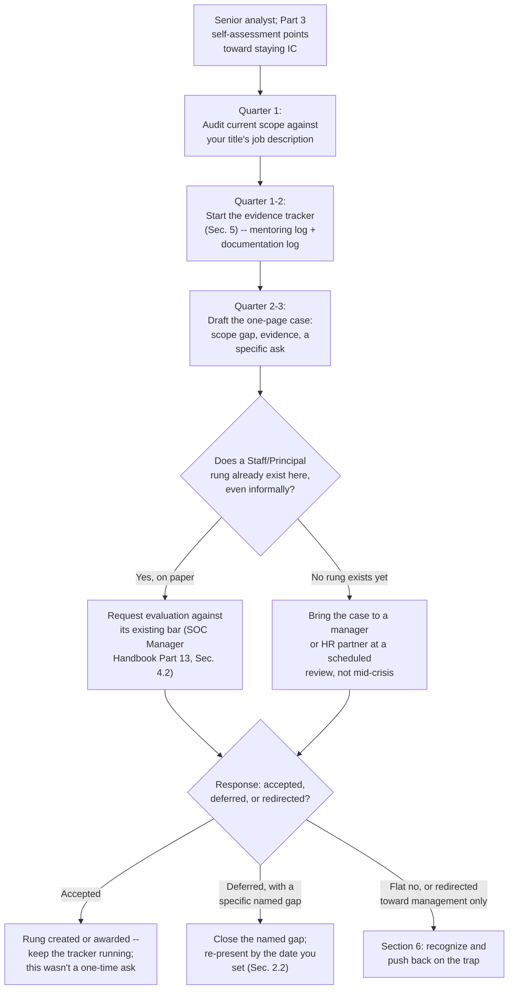

# Part 18 — Staying a Strong Individual Contributor: The Staff/Principal Analyst Path

## Why this part exists

**[CONCEPT]** SOC Manager's Operating Handbook, Part 13 — Career Ladders & Promotion Criteria, §3.4 names a real, unlabeled failure most career ladders default into: three named branches out of senior analyst — detection engineer, threat hunter, team lead — and a fourth road that quietly has no title, no evidence bar, and no pay ceiling above Senior Analyst at all. That section is written from the organization's chair. It tells a SOC manager to build an explicit Staff or Principal Analyst rung, and it names the cost of skipping it: a ladder that quietly becomes "promote into management or your pay tops out," which pushes people who don't want to manage anyone into a management seat purely because it's the only route to a bigger number on the next offer. This part answers the same problem from the opposite chair. You are not the manager deciding whether to build that rung. You are the analyst who has already used Part 3 — Choosing Your Path's self-assessment framework and concluded, honestly, that you want to keep doing the individual-contributor job at a genuinely senior level rather than branch into detection engineering, threat hunting, incident response, or team leadership. What do you personally do next — whether or not your organization has already built the rung you're aiming for?

**[CONCEPT]** Three things, in the order this part covers them. Build a case — a real, evidenced argument, not a request for sympathy — for a Staff or Principal rung where none exists yet, using the same evidence categories a formal evidence packet would ask for even if no committee is currently asking for them (Section 2). Accumulate mentoring and documentation contributions specifically, because those are the two evidence categories that most directly demonstrate Staff-level impact without requiring a title change or supervisory authority to produce them (Sections 3–4). And recognize, by name, the specific pressure — sometimes explicit, usually not — to abandon the individual-contributor track for a management seat you don't actually want, with real language to push back on it before you've accepted it by default (Section 6).

**[CONCEPT]** This part does not design a dual-ladder pay structure, does not decide what a Staff Analyst's pay band should be relative to a team lead's, and does not run the promotion committee that eventually evaluates your case. Those are organizational decisions. SOC Manager's Operating Handbook Part 13 §3.4 already owns the first two; §4 of that same part owns the committee mechanics regardless of which rung is under review. What this part owns is narrower: the case you personally build, the evidence you personally accumulate, and the conversation you personally have — whether that conversation happens in front of a formal committee your organization already runs, or in a one-on-one with a manager who has never been asked this question before, because nobody on their team has asked it either.

> **Cross-Book Pointer**
> This part does not explain how a promotion committee is composed, how a pay band gets set, or how an organization decides whether a Staff/Principal rung is worth building at all. See SOC Manager's Operating Handbook, Part 13 — Career Ladders & Promotion Criteria, §3.4 for the organizational design decision and §4.2 for the evidence-packet mechanics a committee runs once any rung exists. Come back here for what you do, on your own initiative, to make that rung real for yourself — whether your organization has already built it or has never once been asked to.

## 1. The fourth road, and why it disappears by default

**[CONCEPT]** A career ladder with three named branches and one unnamed default isn't neutral about which direction it steers you toward. Every branch bar SOC Manager's Operating Handbook Part 13 §3 names — five merged detections for detection engineering, two structured hunts for hunting, a passed coaching-aptitude assessment for team lead — comes with a title, a defined evidence bar, and a stated pay ceiling above it. Staying an excellent individual contributor, doing exactly the work you were doing at Senior Analyst but at greater depth and with sharper judgment, usually comes with none of the three. Not because the work is worth less — a Staff Analyst who personally owns the hardest escalations of the month, mentors newer analysts with no formal assignment, and keeps the team's actual runbooks accurate is producing real, measurable value — but because nobody built a rung to certify it, so nothing about your title, your pay, or your standing in a promotion conversation moves, no matter how much better you get at the job.

**[MINDSET]** Left unaddressed, the result is a slow erosion rather than one bad decision. You keep getting better. Your scope keeps quietly expanding because you're the person everyone routes the hardest case to. Your title and pay stay exactly where they were the day you decided not to branch. A year or two later, the gap between what you're actually doing and what your offer letter says you do is wide enough that a competing employer's recruiter, reading your real scope off a resume, offers you a title and a number your current employer never got around to matching — not because your current employer disagreed you'd earned it, but because nobody with the authority to fix it was ever asked the direct question.

> **Ground Truth**
> "Just keep doing great work and it'll get recognized eventually" is genuinely believed by plenty of good managers, and it's mostly false for exactly this fourth road — because there's no scheduled moment that forces the recognition to happen on its own. A detection-engineer candidate gets evaluated because the branch bar exists and someone eventually checks it against a committee agenda. A Staff/Principal candidate with no formally built rung gets evaluated only when someone — almost always the candidate — puts the question in front of a person with the authority to answer it. Waiting for this to surface unprompted is a bet against a mechanism that structurally doesn't exist yet in most SOCs, not a reasonable expectation of how visibility usually works.

**[SENIOR/SPECIALIST]** SOC Manager's Operating Handbook, Part 18 — Attrition & Retention names the downstream cost of exactly this pattern from the org's side: Table 18.1's "plateau/no-growth exit" row, typically surfacing two to four years past the branch point, with "nowhere to go" cited directly in the exit interview as the driver, and the org-side fix named as a dual-ladder design under Part 13 §3.4. That's useful to you for a reason beyond confirming the pattern is real: it means your organization, if it has any management-development literature or an HR partner who's encountered this before, likely already has a name for the exact risk you represent if this goes unaddressed. Section 6 covers using that fact directly, in the room, rather than treating your own situation as a novel problem nobody has thought about.

## 2. Building a case for a rung that doesn't formally exist

**[SENIOR/SPECIALIST]** A case is not a complaint that you deserve more, and it isn't a request for your manager to notice you. It's a short, specific document that states three things: the scope you're already carrying that your current title doesn't describe, the evidence that scope is real and sustained rather than a single good quarter, and the specific title, pay band, or standing you're asking for in response. Missing any one of the three turns a strong case into a vague one — and a vague case is exactly the kind of ask a manager can agree with in the room and then quietly never act on, because nothing about it was specific enough to act on.

### 2.1 What the case actually has to state

**[SENIOR/SPECIALIST]** Start with a scope audit: pull up your current job description or the last leveled description your organization actually used to hire someone into your title, and list, specifically, what you're doing today that isn't in it. Not "I'm really good at my job" — concrete items: you personally take the hardest escalations that used to route to your manager, you're the de facto answer to "who do I ask" for a specific detection area or client relationship, you've fixed three runbooks in the last two quarters that were wrong in ways nobody else had caught. Pair each item with evidence from the tracker in Section 5, not from memory — a scope claim with no dated evidence behind it reads exactly like the vague praise a manager's paragraph produces in SOC Manager's Handbook Part 13 §4.2's evidence-packet table, which that table explicitly treats as insufficient on its own.

**[SENIOR/SPECIALIST]** Close with a specific ask, stated as a sentence you could say out loud without hedging: "I'm asking to be evaluated for a Staff Analyst title and pay band reflecting the escalation, mentoring, and documentation scope this case documents." A case that ends in "I just want to be recognized for what I'm doing" gives the person reading it nothing concrete to say yes or no to, and an ask with no shape is the easiest kind of ask to defer indefinitely with good intentions and no actual movement.

> **Analyst's Note**
> Write the case as a one-page document you'd hand to someone, not a speech you plan to deliver from memory. A written case survives a manager forgetting the specifics of a good conversation three weeks later; a verbal case doesn't. It also forces you to notice, while drafting it, exactly where your evidence is thin — a gap that's cheap to close now and expensive to discover in the room when someone asks a follow-up question you can't answer with anything more specific than "I feel like I do a lot of that."

### 2.2 Who you build it for, and when

**[SENIOR/SPECIALIST]** Bring the case to whoever actually has standing to act on it — usually your direct manager first, and your manager's manager or an HR partner if your organization has no precedent for this kind of ask and your direct manager has no authority to create one. Time it to a scheduled review cycle, not a moment of frustration or a counter-offer negotiation. A case presented calmly, months before any external offer is on the table, reads as a considered request; the identical case presented the week you're weighing a competing offer reads as leverage, and SOC Manager's Handbook Part 13 §5's own leveling-drift case shows what happens when an organization starts granting titles under that kind of pressure instead of against a real evidence bar — it becomes a pattern the next leveling audit has to unwind, and you're the one left holding a title that audit may later flag as unsupported, not the manager who granted it under pressure.

**[SENIOR/SPECIALIST]** Ask, explicitly, whether a scope-based senior-IC path has ever actually been evaluated at your organization, separate from the team-lead branch — not "is there room to grow," which invites a vague answer, but that specific question. If the honest answer is "we've never looked," that's not a rejection. It's the actual opening the rest of this section exists to help you use.

> **Career Autopsy — "one clean ask, then silence" (`CASE-1801`, composite case example)**
>
> **The decision:** A senior analyst spends a weekend drafting a genuinely strong one-page Staff Analyst case — a scope audit, six months of mentoring-log entries, three documented runbook fixes — and presents it in a single one-on-one, then waits for a response.
>
> **Why it seemed reasonable:** The case was real and well-evidenced, the manager reacted positively in the room, and pushing further immediately after a good conversation felt like it would come across as impatient or presumptuous.
>
> **How it failed:** The manager agreed the case had merit and said they'd "raise it at the next planning cycle." Two planning cycles passed with no formal answer, because raising it wasn't the manager's top priority and no specific date had been attached to a follow-up. The analyst, having "already made the ask," didn't want to seem like they were nagging, and 14 months passed with the case sitting exactly where it was left.
>
> **The fix:** Close every presentation of the case with a specific date for a specific answer — "can we revisit this by [date] with a yes, a no, or a named gap to close" — rather than a request that trails off into an open-ended "I'll raise it." A case with no follow-up date defaults to never, not because anyone decided no, but because nobody decided anything.

### 2.3 A sequencing plan

**[STUDY PLAN]** Treat building the case as a sequenced project with real elapsed time attached, not a single weekend of writing. The diagram below sequences a reasonable two-to-three-quarter pass: audit your scope, start the tracker in Section 5, draft the case once real evidence exists rather than before it, and route the response — including a flat no or a redirect toward the management track — back to a defined next step instead of letting it dissolve into silence the way CASE-1801 above shows a case can.





**Figure 18.1 — A case-building roadmap from self-assessment to a decision.** *CONCEPTUAL.* Illustrates one reasonable sequencing of building a Staff/Principal case over roughly two to three quarters, including the branch point where an organization's response routes back to Section 6's pushback language. This is a pacing illustration, not a claim that every organization's review cycle or response timeline will match it, and not a capture of any specific individual's case. Diagram ID `FIG-1801`.

## 3. Mentoring contributions as demonstrable evidence

**[SENIOR/SPECIALIST]** Mentoring is the first of the two evidence categories that most directly prove Staff-level impact, because it demonstrates something a raw ticket-closure number can't: that your judgment is propagating to other people without you having to personally handle every case it touches. A Staff Analyst who's the reason three newer analysts triage better than they did six months ago has produced something durable — that judgment stays on the team even on the days that Staff Analyst is out sick — in a way that a personally-fast closure rate never does on its own.

### 3.1 What counts, specifically

**[SENIOR/SPECIALIST]** Four kinds of entries count as real mentoring evidence, and each one needs a specific instance attached, not a general impression: helping a newer analyst work through a stuck triage call without taking the keyboard yourself; being sought out, unprompted, as the person a peer asks before escalating further; sitting in on or co-running a QA calibration session, even informally; and running an ad hoc knowledge-sharing session — a 20-minute walkthrough of a detection area, a client quirk, a tool feature — that wasn't assigned to you by anyone. "I mentor people" is not evidence. "On March 3rd, a Tier 1 analyst brought me a stuck alert; I asked what they'd already ruled out, suggested the next field to pull, and let them run it themselves" is.

**[SENIOR/SPECIALIST]** This part's own Part 14 — The Senior-Analyst Study Plan and the Portfolio That Earns a Branch Choice introduces a shadow-coaching log (`TMPL-1402`) built to feed the team-lead branch's coaching-aptitude bar. If you already kept that log while you were weighing branches, the raw entries are directly reusable here — but the signal you're reading out of them changes. Part 14's version of the log asks whether you'd supervise well: does restraint come naturally, would you delegate rather than rewrite. This part's version asks a narrower, different question: does your presence in the room measurably raise the judgment of the people around you, with no reporting relationship or supervisory authority attached at all. The same entry can answer both questions; only the question you're asking of it changes with the branch.

### 3.2 Where this differs from the team-lead evidence bar

**[SENIOR/SPECIALIST]** A Staff/Principal case never has to demonstrate you could manage anyone, because you're not asking to manage anyone. Don't pad the case with entries that only prove supervisory potential — a QA calibration session you observed silently proves you can watch a process; it doesn't prove peer influence unless you can point to something that changed because you were in the room. The strongest entries in this category show a peer or a newer analyst doing something differently afterward because of what you showed them, not just that you were present while they worked.

> **Field Test**
> **Setup:** You believe your informal mentoring is a real, demonstrable pattern rather than a handful of memorable moments you're generalizing from.
> **Action:** Pick three people you've informally helped in the last quarter. Ask each one directly: "when I walked you through that, did it change how you'd handle something similar on your own next time, or did it just get that one ticket closed?"
> **Expected result:** At least two of the three should describe something that changed in how they'd approach a similar case on their own — a question they'd now ask first, a field they'd now check before escalating. If all three describe only the one ticket getting resolved, that's real information: what you've been doing so far is helpful triage, not yet the kind of mentoring evidence a Staff/Principal case needs, and it's worth adjusting how you help before you adjust how you log it.

### 3.3 Logging it honestly

**[MINDSET]** The same discipline that keeps a shadow-coaching log useful applies here: log the entry the day it happens, not from memory a month later when you're assembling the case, and log the times a "coaching" attempt actually turned into you doing the work yourself, not only the ones that went well. A mentoring log with no honest failures in it isn't evidence of consistent mentoring — it's evidence you stopped writing down the times it didn't work, which is exactly the self-flattering pattern that makes a self-kept log worth checking against an outside voice periodically, per the Blind Spot in Part 14 §4.2.

## 4. Runbook and documentation-quality contributions as evidence

**[SENIOR/SPECIALIST]** The second evidence category is documentation and process ownership — the specific, dated instances where you made the team's actual working material more accurate, not the general sense that you're "good at documentation." SOC Manager's Operating Handbook, Part 14 — Mentorship & Knowledge Transfer, §3.2 builds a knowledge-capture audit from the organization's side, run against a departing employee or a named bus-factor risk, to find exactly this kind of undocumented, tacit knowledge before it's lost. This section is the individual's version of the same instinct, run continuously and voluntarily rather than under the pressure of a two-week notice period: you find and fix the gap in the team's shared knowledge before anyone has to run an audit to discover it's missing.

### 4.1 What counts as a real contribution

**[SENIOR/SPECIALIST]** A real contribution changes what a second person, cold, can successfully do with the document — the same bar SOC Manager's Handbook Part 14 §5 sets for judging whether captured knowledge actually transferred. Concretely: you rewrote an escalation path that was wrong in a way that had already caused at least one real miss; you added the specific rationale behind a suppression rule or an exception list that previously existed with no written reason anyone else could point to; you caught a runbook step referencing a tool or a contact that no longer existed, and fixed it before it caused a real delay during a live incident rather than after. Each of those is a dated, findable, checkable event. "I keep our documentation up to date" is not — it's the same unfalsifiable shape as "I mentor people," and it survives no follow-up question about specifics.

**[SENIOR/SPECIALIST]** If part of your ongoing scope includes maintaining detections without having formally branched into the detection-engineer track — a real, common shape for a strong Staff-level generalist — hold your own contributions to the same standard Detection Engineering Handbook V2, Part 22 — Detection as Code sets for a rule's metadata and tuning history, even if your organization's review pipeline doesn't formally require it of you. A tuning change with no recorded rationale is exactly the kind of undocumented tacit knowledge SOC Manager's Handbook Part 14 §3.2's audit is built to find later, at greater cost, if you don't record it yourself now.

**[SENIOR/SPECIALIST]** For the mechanics of what a genuinely well-structured playbook or runbook entry actually looks like — section order, the level of specificity a step needs, how a good escalation path is written — this part does not re-derive any of it. SOC Playbook Handbook, Foundations / Playbook Library already owns playbook structure and mechanics for the whole series; use that structure when you write the fix, and treat this section's job as narrower: recognizing which fixes are worth making and documenting that you made them.

> **Cross-Book Pointer**
> This part does not cover how to write a well-structured playbook or runbook entry, or how a detection repository should record ownership metadata and tuning history. See SOC Playbook Handbook, Foundations / Playbook Library for playbook structure and Detection Engineering Handbook V2, Part 22 — Detection as Code for rule-metadata standards. Come back here for what counts as evidence once you've made the fix, not for how to write the fix itself.

### 4.2 The quiet-fixer trap

**[MINDSET]** The most common way this evidence category disappears entirely is the most avoidable one: you fix the thing, quietly, in the moment it needs fixing, and move on without telling anyone or writing it down anywhere that survives past the fix itself. Six months later, the runbook is correct, the team is better off, and there is no record anywhere that you're the reason — which means it can't function as evidence for anything, including your own honest self-assessment of how much you've actually contributed.

> **Blind Spot**
> A pattern of quietly fixing things as you find them, with no changelog, no dated commit message with your name attached, and no mention to your lead, is invisible to your own case-building later — you'll genuinely struggle to reconstruct, from memory, everything you fixed over the last year, because the fixing itself never felt notable enough at the time to remember on purpose. The habit that closes this gap costs almost nothing: one line in a shared changelog, or a message to your lead the same week — "fixed the escalation path for [X], it was pointing at a contact who left eight months ago" — turns a real contribution that would otherwise vanish into a dated, checkable entry for the tracker in Section 5.

## 5. The Staff/Principal evidence tracker and self-scoring rubric

**[STUDY PLAN]** The two tables below turn Sections 2 through 4 into something you actually fill out over time rather than reconstruct from memory the week you draft your case. Neither maps onto the four-axis competency matrix SOC Manager's Operating Handbook Part 10 defines — that matrix scores technical skill, tool proficiency, communication, and judgment against a rung that already exists. This rubric scores a narrower signal most SOCs currently have no formal row for at all, precisely because the Staff/Principal rung itself is usually the thing missing.

### 5.1 The evidence tracker

TEMPLATE — the Staff/Principal evidence tracker, permanent ID `TMPL-1801`. Log an entry the same week it happens, across all three categories, so the tracker reflects what actually occurred rather than a flattering reconstruction assembled right before you present a case.

| Date | Category | What happened | Evidence artifact | Why it's Staff-level scope |
|---|---|---|---|---|
| Mar 3 | Mentoring | Walked a Tier 1 analyst through a stuck alert without taking the keyboard | Ticket ID `INC-4471` | Analyst independently applied the same reasoning to a similar case two weeks later |
| Apr 9 | Documentation | Rewrote the escalation path for a client's environment quirk, no rationale had existed | Runbook commit `a91f2c` | Fixed after a near-miss; second analyst used it cold within a month with no questions |
| May 14 | Escalation ownership | Took the hardest ticket of the week directly, no one asked me to | Ticket ID `INC-4589` | Case had no runbook match; disposition documented and reused as a reference two months later |
| Jun 2 | Technical depth | Tuned a self-owned detection after it produced 3 false positives in a week | Detection repo PR `#118` | FP rate tracked and cut from 40% to under 10% over three weeks |

CONCEPTUAL SAMPLE — illustrative entries for a single made-up log; the specific mix and pace of entries you actually accumulate is the real evidence, not this table's exact wording. This tracker's main limitation: it records that something happened, not whether it mattered enough to move a case forward on its own — that judgment call, weighing which entries actually demonstrate Staff-level scope versus ordinary strong Senior Analyst work, is what Section 5.2's rubric and your own honest read of the pattern have to supply.

### 5.2 The self-scoring rubric

TEMPLATE — the Staff/Principal readiness self-scoring rubric, permanent ID `TMPL-1802`. Score each row 0 to 2 based on your tracker's actual entries over the trailing two quarters, not on how the last month felt.

```text
0 = not present. 1 = partially present, or present but undocumented. 2 = clearly present
and backed by at least one dated tracker entry.

| Row                                                                       | Score (0-2) |
|-----------------------------------------------------------------------------|:-----------:|
| I own the hardest escalations in my area without being formally assigned  |             |
| Peers seek me out before escalating further, not just when assigned to me |             |
| I've initiated at least one real runbook or documentation fix, unassigned |             |
| A newer analyst can point to something I taught them that changed how     |             |
|   they now work, not just that a ticket got closed                        |             |
| I can state my specific ask -- title, pay band, scope -- in one sentence  |             |

Total /10. Below 6: keep building the tracker for another quarter before drafting a case --
the evidence isn't dense enough yet to survive a follow-up question. 6-10, sustained across
two consecutive quarters: you have a real, evidenced case, not a feeling that you deserve one.
```

This rubric's main limitation is the same one every self-scored worksheet in this book carries: it tells you whether your own evidence is dense enough to build a case, not whether the person receiving that case will actually act on it — Section 2.2's timing and follow-up discipline, not this rubric, is what closes that second gap.

> **Analyst's Note**
> Run the rubric at the end of every quarter, not just once before you draft a case. A single strong quarter can be a fluke of an unusually hard week; a pattern of 6-or-above scores across two or three consecutive quarters is what actually distinguishes a real, sustained Staff-level pattern from a good month you're generalizing from.

## 6. Recognizing and pushing back on the "promote into management or your pay tops out" trap

**[MINDSET]** Section 1 named the structural reason this trap exists: a ladder with no fourth rung has no other route to a bigger number, so management becomes the only offer on the table by default, not because anyone decided it should be the only good option for you specifically.

> **Career Trap**
> "The only way to grow your pay from here is into management" is the single most common form this trap takes, and it's rarely stated as a threat — usually it's a plain fact, said by a manager who has never personally seen a Staff/Principal rung exist anywhere they've worked, not a deliberate move to push you somewhere you don't want to go. That doesn't make it less costly to accept by default. The fix: ask the specific question — "has a scope-based senior-IC path ever been evaluated here, separate from the team-lead seat?" — before assuming the answer is no. If the honest answer is "we've never actually looked," that's your opening to build the case in Section 2, not a closed door.

### 6.1 How the trap actually sounds

**[MINDSET]** It rarely arrives as an explicit ultimatum. It sounds like "there's really no more room to grow without taking on people," said kindly, in a review where your actual performance is being praised in the same breath. It sounds like an off-cycle "Senior" or "Lead" title offered with no real change in scope or pay band — the exact retention-driven shortcut SOC Manager's Handbook Part 13 §5 documents from the organizational side as the seed of leveling drift, which costs you specifically the moment a future leveling audit corrects a title that was never backed by real evidence. And it sounds like a manager offering you the open team-lead seat as a reward for being the best individual performer on the team, with no coaching-aptitude check run first — precisely the pattern SOC Manager's Handbook Part 13 §3.3's own autopsy names as a mistake from the org's side, arriving here as an offer instead of a decision already made about you.

### 6.2 The language that pushes back

**[INTERVIEW PREP]** Push back with specific questions, not general objections — a specific question is answerable, and an answer is something you can act on, while a general objection ("I'm not sure I want to manage") is easy for a well-meaning manager to smooth over without actually addressing it.

- "Has a scope-based senior-IC path — a Staff or Principal rung — ever been formally evaluated here, separate from the team-lead track?"
- "If it hasn't, I'd like to formally request that we evaluate one, using a documented case I can bring — can we set a specific date to review it?"
- "If the team-lead seat is being offered because I'm the strongest individual performer right now, has a coaching-aptitude check been run, the way a real promotion committee would run one — or is this seat being offered on performance metrics that don't actually test for that?"
- "I want to understand: is this title change coming with a real change in scope and pay band, or is it a title without the evidence packet behind it?" — the direct, individual-side version of the question SOC Manager's Handbook Part 13 §5 says a leveling audit will eventually ask about any off-cycle title, whether or not you asked it first.

**[INTERVIEW PREP]** If your organization has documented attrition patterns anywhere accessible to you — an HR debrief, a retention initiative, even an offhand comment from a manager about "why people leave around year three" — naming the plateau-exit pattern directly, in those terms, is legitimate leverage, not a threat: "I understand this is a recognized pattern where a strong senior IC leaves because there's nowhere to go without switching tracks — I'd rather solve that here than become the next data point for it." You're not inventing the argument. SOC Manager's Handbook Part 18's own Table 18.1 already names it, and Part 13 §3.4 already names the fix; you're only pointing your own organization at material that, if it has any real people-operations function, it likely already half-knows.

> **Career Autopsy — "took the lead seat to keep growing pay" (`CASE-1802`, composite case example)**
>
> **The decision:** A strong senior analyst with a genuinely high depth-without-title driver accepts an open team-lead seat two years past the branch point, not because coaching energized them, but because it was, in their manager's words, "the only real path to the next pay band from here."
>
> **Why it seemed reasonable:** The pay increase was real and immediate, the seat was open now rather than hypothetically someday, and turning it down felt like turning down the only offer actually on the table.
>
> **How it failed:** Within four months, the same signals SOC Manager's Handbook Part 13 §3.3's own autopsy names from the organizational side showed up from the inside instead: watching a newer analyst work through a problem more slowly than they would have themselves felt corrosive rather than satisfying, every QA calibration session felt like time away from the technical work they actually wanted to be doing, and they were still personally closing the hardest tickets on top of the new coaching load rather than delegating them. The pay increase held; almost everything else about the day-to-day work got worse.
>
> **The fix:** Two quarters in, the analyst asked, directly, whether a scope-based Staff Analyst path existed as an alternative to the lead seat — the question that should have been asked before accepting the seat, not after. It hadn't existed, but naming the gap explicitly, backed by four genuine, undesired months of lead-seat evidence about fit, was what finally got a Staff rung seriously discussed rather than assumed off the table. The analyst moved back to an individual-contributor seat within the year, at a partially preserved pay band — a real cost, but a smaller one than staying in a seat that didn't fit for another two years to avoid an awkward conversation.

## 7. When the org genuinely has none of this, and never will

**[MINDSET]** Some organizations will hear a well-built case, agree it's reasonable, and still not build the rung — not out of bad faith, but because a small SOC's org chart genuinely can't support a title tier a headcount of eight people doesn't need, or because a management-only culture is load-bearing in a way one analyst's case isn't going to move on its own. Recognizing that outcome honestly matters as much as building the case in the first place, because it's the difference between staying deliberately and staying by default.

**[MINDSET]** If a real, well-evidenced case gets a genuine, considered no rather than a deferral, you have three honest options, and none of them is "keep asking the same way and hope." You can ask for a pay-band adjustment without a title change — some organizations that won't create a new rung will still correct compensation against a documented scope gap, because that's a smaller organizational commitment than a new title tier. You can decide the current scope and pace genuinely still work for you even without the title — a real, legitimate choice, not a failure, provided it's a choice you're making with clear eyes rather than one you've drifted into (Part 23 — Managing Your Own Burnout, Plateaus, and Career Pacing covers telling the two apart). Or you can take the tracker you've been building in Section 5 and treat it as exactly the evidence an external interview loop is built to respond to — Part 8's candidate-side interview prep turns concretely on having specific, dated evidence like this rather than a general sense that you're ready for more, and a Staff/Principal-shaped scope is a real, marketable thing at a lot of organizations even where your current one has decided not to name it.

> **What Would Change My Mind**
> This part treats building a documented, well-timed case as a materially better strategy than waiting for informal recognition, even at an organization with no precedent for a Staff/Principal rung. If a reasonable sample of readers who built a real case using Sections 2 through 5 saw no better outcome — no rung created, no pay correction, no stronger leverage in an eventual external search — than a comparable group who simply kept doing strong work and said nothing, that would undercut this part's central bet that documented evidence changes outcomes here, and the guidance should shift toward treating the case-building work as primarily useful for your own clarity and eventual external negotiation, rather than a real lever on your current employer specifically.

---

**Cross-references:** This part assumes Part 3 — Choosing Your Path: A Specialization Decision Framework (the depth-without-title signal and the fourth-road preview this part builds the full case-building path from) and Part 14 — The Senior-Analyst Study Plan and the Portfolio That Earns a Branch Choice (the shadow-coaching log this part's mentoring evidence reuses under a different read). Outside this book, it cites SOC Manager's Operating Handbook, Part 13 — Career Ladders & Promotion Criteria (§3.4 for the dual-ladder design and the trap this part names, §3.3 for the coaching-aptitude bar a team-lead offer should have been checked against, §4.2 for the evidence-packet standard this part's case mirrors, §5 for the leveling-drift risk an off-cycle title carries), Part 14 — Mentorship & Knowledge Transfer (§3.2's knowledge-capture audit, mirrored here as a voluntary, ongoing individual habit), Part 18 — Attrition & Retention (Table 18.1's plateau-exit pattern, cited as leverage in Section 6), and Part 10 — Competency Models & Skills Matrices (the four-axis matrix this part's rubric deliberately sits next to, not inside). It also cites SOC Playbook Handbook, Foundations / Playbook Library for playbook-writing mechanics and Detection Engineering Handbook V2, Part 22 — Detection as Code for rule-metadata standards, both cited for the documentation-quality bar in Section 4 without re-deriving either. It connects forward to Part 8 — Interview Prep From the Candidate's Chair and Part 23 — Managing Your Own Burnout, Plateaus, and Career Pacing for what to do with this part's evidence if your own organization never builds the rung.
