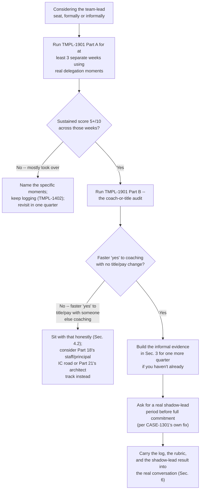

# Part 19 — The Team Lead Transition: Testing Your Own Aptitude Before You Ask for the Seat

## Why this part exists

**[CONCEPT]** SOC Manager's Operating Handbook, Part 13 — Career Ladders & Promotion Criteria, §3.3 tells a manager exactly what to check before handing someone an open team-lead seat: a structured coaching-aptitude assessment (a mock delegation scenario, a mock difficult-conversation role-play), a 90-day shadow-lead cycle with a reduced individual queue, and a QA calibration session run under a current lead's supervision. That's the organization's test, and it exists because CASE-1301 in that same section documents what happens when a SOC skips it — its fastest, highest-QA-score analyst gets handed the seat with no assessment, keeps personally closing the hardest fifth of the queue instead of delegating it, and two direct reports go a full quarter with no real coaching before the pattern gets caught. This part does not re-derive that assessment, that shadow-lead cycle, or that autopsy. It builds something narrower: a version of the same test you can run on yourself, privately, months or years before any manager convenes a committee about you.

**[CONCEPT]** The reason a self-administered version is worth building, separate from the organizational one, is that CASE-1301's damage in the manager's handbook is measured in team throughput and two under-coached direct reports. That's real cost, and it's not yours to carry alone — but it isn't the only cost a wrong seat produces. The analyst who takes a lead role that turns out to be a bad fit personally absorbs a different bill: months of dreading the parts of the job that don't play to their strengths, a technical edge that quietly erodes while they're not the one at the keyboard, and — if it goes badly enough — an awkward, visible walk-back that reads to everyone watching as a demotion even when it's the right correction. Section 4 below tells that story in full. The org's test protects the team. This part exists to protect you, and the two protections aren't the same thing, even though they're checking a version of the same underlying signal.

**[CONCEPT]** Three things follow from that framing, in order. Section 2 builds a self-test for the specific instinct SOC Manager's Handbook Part 13 §3.3's assessment is designed to catch — do you rewrite a delegated task instead of coaching it — using real delegation moments you already have, not a role-play you can't run alone. Section 3 covers building informal leadership evidence before any title exists, so the record you'd eventually bring to a real evidence packet is accumulating now rather than getting reconstructed under deadline pressure later. Section 4 asks the question underneath both: whether you want to coach, or you want the title, because those are different desires that happen to point at the same open req. None of this is new territory for this book — Part 13, §1.2 and §5 already had you practicing the coach-versus-intervene call on a single mentee ticket, and Part 14, §4 already had you logging it in the shadow-coaching log (`TMPL-1402`). This part is where that practice gets formalized into an honest, repeatable self-test, before you ever ask for the seat.

> **Cross-Book Pointer**
> This part does not explain how a coaching-aptitude assessment is designed, how a shadow-lead cycle is structured, or how a promotion committee weighs either. See SOC Manager's Operating Handbook, Part 13 — Career Ladders & Promotion Criteria, §3.3 for the organizational mechanics in full, including CASE-1301, the composite case of a team that got hurt when that assessment was skipped. Come back here for the self-administered version you can run before anyone on the other side of that desk is involved at all.

## 1. Why you should run this test years before anyone asks you to

**[LEAD/MANAGEMENT TRACK]** The organizational version of this test runs at exactly the moment it's least comfortable to fail: after a seat has opened, after you've been named as the leading internal candidate, often after your manager has already started treating the promotion as a formality. Failing a coaching-aptitude assessment at that point is not a private, low-stakes data point — it's a visible "not yet" in front of people who were expecting a "yes," and per SOC Manager's Handbook Part 13 §3.3, a committee is supposed to name the specific gap rather than issue a vague non-answer, which means the gap becomes a documented, known fact about you, not something you get to quietly work on unobserved. Running a private version of the same test a year earlier costs you nothing and tells nobody anything you don't choose to share.

**[LEAD/MANAGEMENT TRACK]** That asymmetry is the entire argument for this part. A self-administered test can be wrong about you in ways the sections below name explicitly — self-scoring has real limits — but it fails privately, cheaply, and repeatably, which a real committee process structurally cannot. If this month's honest answer is "I clearly took over more than I coached," you get to try again next month with no record anyone else ever sees. If the organization's version returns the same answer, you're now the internal candidate whose coaching aptitude assessment didn't clear, with a manager who has to decide what to do about a seat they've already started planning around.

> **Ground Truth**
> Most SOCs still hand out the team-lead seat the way CASE-1301 describes — as a reward for being the best individual performer, decided in a single conversation, with no structured check on coaching aptitude at all. If your own organization works this way, the absence of a formal test doesn't mean the underlying question doesn't matter; it means nobody is going to ask it for you before you're already holding the title. Ask it yourself first. A SOC that skips the assessment isn't proof the seat is safe to accept untested — it's one less safeguard between you and CASE-1301's outcome, not evidence the outcome can't happen to you specifically.

**[MINDSET]** Coaching aptitude is a real, testable disposition — closer to the six branch-fit signals Part 3, §2 scores you on than to a fixed trait you either have or don't. Part 3, §2.5 named "coaching energy" as one of those six signals and pointed forward to this part for the fuller version of the check. A low score this month is information about where you are right now, not a verdict on who you're capable of becoming. What isn't safe to do is skip the check entirely and assume the coaching part will simply develop once you're holding the title and can no longer opt out of the job — that assumption is exactly what Section 4's Career Trap below names directly.

**[SENIOR/SPECIALIST]** Notice that this test is already partly running, whether you've named it yet or not. Part 13, §1.2 covered mentoring a triage call without taking it over as a senior-analyst-level skill, entirely independent of any leadership ambition — the same restraint that makes a good senior analyst a good mentor on a single ticket is the raw material this part scales up into a standing self-test. If you're a strong senior analyst who has never once stopped yourself mid-correction to ask what a newer analyst would do next instead of just telling them, you haven't skipped this part's test yet — you just haven't started noticing you're already in it.

**[L1/L2]** If you're still an L1 or L2 analyst, the team-lead seat itself is a long way off, and nothing here is asking you to plan for it yet. What's worth noticing now, at no cost, is your own reaction the next time you help a newer teammate or a new hire work through something you already know how to do: did you answer their question, or did you just do the thing for them because it was faster? That reaction, logged honestly even once at this stage, is the same raw signal Section 2 below builds into a formal habit — you're just getting an early, informal read on it years before it matters for a promotion.

## 2. The delegation-instinct self-test: do you rewrite the work, or coach it

### 2.1 What the organization would test, and why you can't fully replicate it alone

**[LEAD/MANAGEMENT TRACK]** SOC Manager's Handbook Part 13 §3.3 names a mock delegation scenario and a mock difficult-conversation role-play as the assessment's core exercises — controlled, artificial situations built specifically so an assessor can observe the instinct under pressure without waiting for a real one to occur. You can't fully reproduce that alone: a role-play needs someone playing the other role, and a mock scenario loses most of its value once you know it's a test and can perform the "right" answer instead of revealing your actual instinct. Trying to simulate the organization's exercise solo mostly teaches you what you already believe about yourself, which is the exact self-report problem Part 3, §3's Blind Spot warned against for the branch-fit worksheet generally.

**[LEAD/MANAGEMENT TRACK]** The self-administered substitute isn't a simulation — it's a scoring discipline applied to delegation moments you're already having for real, on shift, this week, with actual stakes attached. You have more real delegation opportunities available to you right now than a formal assessment could ever manufacture: a newer analyst stuck on a ticket, a peer asking how you'd approach something, a piece of a project you could hand off instead of finishing yourself. The test isn't inventing the scenario. It's noticing, honestly, what you actually do the next several times one shows up.

### 2.2 Running the test on real delegation, not a hypothetical

**[LEAD/MANAGEMENT TRACK]** Over the next two to three weeks, watch for any moment where you could either do a piece of work yourself or hand a meaningful piece of it to someone else — coaching them through it rather than completing it and reporting the result. This includes the mentoring moments Part 13, §1.2 already covers, but it's broader: a shift-handoff note someone else could draft with your review instead of you writing it outright, a small process fix you could describe to a teammate instead of just applying it yourself, a piece of an on-call rotation you could let someone newer own instead of quietly backstopping every decision they make.

**[LEAD/MANAGEMENT TRACK]** The moment that actually matters is the one right before you act: notice the specific urge to just do it yourself, name it silently ("I could finish this in ninety seconds if I take it back"), and force a pause before choosing. What you do after the pause is the data. Choosing to hand it off anyway, after noticing the urge, counts as a real coaching choice. Choosing to take it back after noticing the urge is useful information too — it tells you the urge is currently stronger than the discipline, which is exactly the pattern worth scoring rather than hiding from yourself.

> **Field Test**
> **Setup:** At least three real opportunities this week to hand off a piece of work you could do faster yourself — a mentoring moment, a project piece, a process explanation.
> **Action:** For each one, before acting, silently name the urge to just do it yourself if you notice it. Then choose: hand it off and coach, or take it back and explain why afterward, honestly, in one sentence. Log all three the same day, not from memory at the end of the week.
> **Expected result:** You should be able to name, for each of the three, which choice you made and what you noticed about the urge itself — not just what got done. If you can't remember noticing an urge at all on any of the three, that's worth treating as its own data point: either you're not yet in the habit of watching for the moment, or the urge to take over is strong enough that it's not registering as a choice at all, which is the more concerning of the two readings.

### 2.3 The self-scoring rubric

**[LEAD/MANAGEMENT TRACK]** The checklist below (`TMPL-1901`, homed in Appendix A5 — Branch-Readiness Trackers) turns a week of logged delegation moments into a score, and adds the second half of this part's self-test — the honest coach-or-title audit Section 4 builds on. Fill out Part A weekly, using real moments from Section 2.2; don't attempt Part B until you have at least three separate weeks of Part A behind you.

```text
TEMPLATE — the self-administered coaching-aptitude checklist, permanent ID TMPL-1901

PART A -- Delegation-instinct scoring
Score each row 0-2, based on one week's real delegation moments (Sec. 2.2), not a
hypothetical. 0 = did not happen this way. 1 = partially. 2 = clearly happened this way.

| Row                                                                            | Score (0-2) |
|----------------------------------------------------------------------------------|:-----------:|
| Let the other person attempt the full task before offering help                |              |
| Asked a question that surfaced their reasoning before supplying your own       |              |
| When you corrected something, corrected the smallest fixable piece, not the whole approach |     |
| The final output shipped with their name on it, not a version you quietly rewrote |            |
| You can say what they learned from doing it, not only that it got done         |              |

Total /10. Below 5 in a given week: you likely took over more than you coached this
week -- name the specific moment and what a coached version would have looked like
instead. 5-10, sustained across three or more separate weeks: real delegation-instinct
evidence, not one good week.

PART B -- The coach-or-title honest audit (answer in order; do not start until Part A
has at least three logged weeks behind it)
1. If this seat came with the coaching responsibility but NO title change and NO pay
   change, would you still want it -- yes, no, or unsure?
2. If this seat came with the title and the pay, but someone else did the actual
   coaching, would you still want it -- yes, no, or unsure?

If (1) is the faster, more certain "yes," that's a real signal you want the coaching
work itself. If (2) is the faster "yes," that isn't disqualifying, but it is evidence
you want the title more than the seat's daily work -- worth sitting with honestly
before you ask for it (Sec. 4).

<!-- Do not backfill Part A after a bad week to make the average look better -- the
     rubric is only evidence if it's scored the same day the moment happened. -->
```

This checklist is something you fill out privately, with no submission requirement and no reviewer — its value depends entirely on scoring it the same day a moment happens, not reconstructing a flattering week from memory later. Its main limitation is the one Section 2.4's Blind Spot names directly: it can tell you what you noticed yourself doing, not how it actually landed for the person on the other end of it.

### 2.4 What a "rewrote it" pattern actually means

**[MINDSET]** A single low-scoring week is not a verdict — the queue has bad weeks, incidents happen that genuinely require you to step in, and one week of mostly taking over tells you about that week, not about your standing instinct. What matters is the trend across a rolling handful of weeks, the same discipline Part 13's own senior-judgment rubric (`TMPL-1301`) applies to reasoning quality: one data point is a data point, a pattern across three or more is evidence. If you already have `TMPL-1402` entries running from Part 14's shadow-coaching log, don't start Part A from a blank page — go back and score your last month of logged entries against this rubric instead of waiting to generate new ones. The raw material is very likely already sitting there.

> **Blind Spot**
> This rubric can tell you whether you noticed yourself taking over instead of coaching. It cannot tell you how the coaching actually felt from the other person's side — a newer analyst who got exactly the right amount of Socratic questioning from your perspective may still have felt slower, more anxious, and less supported than if you'd just told them the answer directly. Once every few weeks, ask the person you coached a direct question: "did that feel like you figured it out, or like I walked you to an answer I'd already decided on?" Their answer is the check your own log can't produce, and it's the same check Part 14, §4.2 already asked you to run once — this part is asking you to make it a habit, not a one-time gesture.

**[STUDY PLAN]** Run this rubric monthly for at least a full quarter before drawing a conclusion about your own delegation instinct — a single strong month, like a single strong ambiguous-ticket reconstruction in Part 13's judgment self-test, could be luck, low queue pressure, or an unusually easy set of mentoring moments rather than a real, durable pattern. Three consecutive months averaging 5 or higher on Part A is a defensible claim to make about yourself. One good month is a data point worth logging, not a claim worth repeating to anyone else yet.

## 3. Building informal leadership evidence before any title exists

**[LEAD/MANAGEMENT TRACK]** SOC Manager's Handbook Part 13 §3.3's bar for the team-lead branch includes a completed shadow-lead cycle — at least one full stand-up rotation and one QA calibration session run with a current lead observing. That's an organizationally-run process you need standing to enter; you can't schedule it yourself as an individual contributor. What you can do, starting now, is build the same category of evidence informally, in pieces, without anyone having to grant you a shadow-lead assignment first.

### 3.1 Running a QA calibration session as a participant

**[LEAD/MANAGEMENT TRACK]** SOC Manager's Handbook, Part 15 — Quality Assurance Programs, §3.2 owns how a calibration session is run and governed; the one mechanic worth borrowing here is that every reviewer scores independently before anyone compares notes, so you don't need to be a designated QA reviewer to sit in on this as a participant if your team runs one. Ask your manager or team lead whether you can score the same batch alongside the official reviewers, purely as practice, with your score compared but not counted.

**[LEAD/MANAGEMENT TRACK]** What you're actually testing by participating has nothing to do with whether your score matched the room's. It's what you notice about your own behavior once a real disagreement surfaces: do you argue for your own score because you want to be right, or do you get genuinely curious about what the other reviewer weighed differently and update your own read of the ticket? Watching your own instinct in that moment, in a low-stakes setting where you're not the accountable reviewer, is a cheap, real rehearsal for the exact instinct a team lead needs every time two analysts on their team disagree about anything — see Part 15, §3.1 for why reviewers drift apart from each other in the first place, if you want the org-side reasoning behind the disagreement you're watching yourself react to.

> **Analyst's Note**
> If your team doesn't run formal QA calibration sessions at all, you can still build a version of this with one or two peers: pick five closed tickets nobody's scored yet, agree on a simple three-category rubric in advance, score independently, then compare and talk through anything that diverges. It won't produce an organizationally valid calibration record — that's not the point. It's a rehearsal for resolving disagreement about someone else's judgment call without either caving immediately or digging in defensively, and that rehearsal is worth having before a real team's disagreement is yours to referee.

### 3.2 Mentoring an L1 without taking over their queue

**[LEAD/MANAGEMENT TRACK]** This is the same discipline Part 13, §1.2 and §5 already covered in depth as senior-analyst mentoring practice, and it doesn't change here — what changes is the frame. There, the point was building your own judgment and modeling good triage restraint. Here, the exact same behavior, logged consistently in `TMPL-1402`, is direct evidence toward the coaching-aptitude signal this part is testing. You don't need a new activity. You need to keep doing the one you're already doing, deliberately, and treat the log as evidence rather than a side habit.

**[LEAD/MANAGEMENT TRACK]** The specific tell worth watching for, beyond the delegation-instinct rubric in Section 2, is whether your mentoring is expanding past a single mentee. A team lead coaches several people at once, often with genuinely different needs — one analyst who needs more autonomy and less checking-in, another who needs more structure and closer follow-up. If you've only ever mentored one person, one way, you have real evidence about coaching in general but no evidence yet about adjusting your approach to different people, which is a distinct skill a lead role demands daily.

### 3.3 The unglamorous coordination work nobody has to give you a title to do

**[LEAD/MANAGEMENT TRACK]** A meaningful share of what a team lead actually does day to day is coordination work with no glamour attached to it at all, and almost none of it requires a title to start practicing. The table below lists activities you can volunteer for now, what each one actually tests, and how to fold it into the logging habit you're already building.

The table below is a menu, not a checklist — pick two or three that fit your team's actual gaps rather than trying to do all of them at once.

| Activity | What it actually tests | How to log it |
|---|---|---|
| Draft a runbook update after a ticket exposed a gap | Whether you write for someone else's future use, not just your own memory | Note it in `TMPL-1402` as a coaching-adjacent entry |
| Run a stand-up when the team lead is out | Whether you can hold structure and airtime for others without dominating it | Ask one attendee afterward what worked and what didn't |
| Propose and run a short peer study session on a technique | Whether you can teach a group, not just one person one-on-one | Note attendance and one thing you'd change next time |
| Volunteer to onboard the next new hire's first week | Sustained coaching over days, not a single ticket | A daily one-line log entry, not a single retrospective note |
| Draft an on-call handoff template your team doesn't already have | Whether you build tools for other people's benefit, not just your own | Ask whether anyone actually used it unprompted the next rotation |

**[MINDSET]** None of these five activities individually proves anything. What they build, together and over time, is the same kind of evidence Part 14, §4 already asked you to start collecting — a record you didn't manufacture the week before a nomination, because it was already sitting there when someone finally asked.

## 4. Deciding honestly: do you want to coach, or do you want the title

### 4.1 Two different desires that happen to point at the same open req

**[MINDSET]** "I want to be a team lead" is a sentence that can mean two genuinely different things, and it's worth separating them before you say it out loud to anyone with the authority to act on it. It can mean: I get real, sustained satisfaction from watching someone else grow more capable, even when it's slower than doing the work myself. Or it can mean: I want the title, the pay band, the visible marker that I've progressed, and the coaching part is something I assume I'll manage once I'm in the seat. Both desires are honest. Only the first one describes wanting the actual job.

> **Career Trap**
> Assuming the coaching part will develop naturally once you're holding the title, and you can no longer opt out of the day-to-day, is one of the most common — and most costly — versions of this mistake. A title doesn't install an instinct; it just removes your ability to avoid discovering, in front of your new direct reports, whether the instinct was ever there. The fix: run Section 2's delegation-instinct rubric and Section 4.2's audit below before you ask for the seat, not after you've already accepted it — a weak result now costs you nothing but a private, honest look at yourself. The same result discovered three months into the role costs you and everyone reporting to you.

### 4.2 The coach-or-title honest audit

**[MINDSET]** Part B of `TMPL-1901`, introduced in Section 2.3, is where this distinction gets tested directly rather than argued about in the abstract. The two questions are deliberately structured to separate the desires: would you want the coaching responsibility with no title or pay attached, and would you want the title and pay with the coaching responsibility handed to someone else. Answer both, in that order, and notice which answer came faster and with less internal negotiation — the speed and certainty of the answer is as informative as the answer itself, because a genuinely wanted answer rarely needs much talking yourself into.

**[MINDSET]** A "yes" to the first question and an "unsure" or "no" to the second is the strongest possible signal that you want the actual job. A fast, certain "yes" to the second and a hesitant answer to the first deserves real honesty, not defensiveness — it doesn't mean you're disqualified from ever wanting the seat, but it does mean the title itself, not the coaching, is doing most of the pulling right now, and Part 3, §4.5's staff/principal individual-contributor road — the fourth road SOC Manager's Handbook Part 13 §3.4 names explicitly, built out in this book's own Part 18 — might be answering the actual desire underneath "I want to be recognized as senior" better than a lead seat ever will.

### 4.3 The seat that cost more than it paid

**[MINDSET]** Sections 4.1 and 4.2 are abstract until they're not. Here's what skipping both actually costs one person, concretely.

**CASE-1901 — the seat that cost more than it paid.** *COMPOSITE CASE EXAMPLE* — constructed from patterns across multiple individual transitions, not one traceable analyst.

> **Career Autopsy — "said yes because it was offered"**
>
> **The decision:** A senior analyst with three years of strong triage judgment and an active mentoring habit is offered an open team-lead seat after the incumbent leaves. The analyst accepts within the week — no coaching-aptitude self-test run beforehand, no honest audit of whether the pull was the coaching work or the title — reasoning that turning it down would look like a lack of ambition and might not come around again.
>
> **Why it seemed reasonable:** The offer came from a manager who clearly respected the analyst's technical work, the pay increase was real, and every visible signal — tenure, QA score, a track record of helping newer teammates — pointed toward "obviously qualified." Nothing in the decision process asked the narrower question this part is built around: not whether the analyst *could* do the job, but whether they actually wanted the parts of it that don't look like the job they were already good at.
>
> **How it failed:** The technical work that had made the analyst's days feel genuinely good — the hardest ticket, the novel investigation, the satisfaction of a clean disposition — mostly disappeared, replaced by 1:1s, coverage planning, and a steady stream of other people's half-finished reasoning to sit with instead of finish. Unlike CASE-1301's team-level failure, the team here did fine; the analyst ran calibration sessions on schedule and delegated reasonably well once pressed. What failed was personal: eleven months in, the analyst realized they dreaded roughly half of every week, had let their own technical currency lapse — no hands-on time on a genuinely hard case in nearly a year — and had never once asked themselves, before saying yes, whether they wanted to coach or wanted to be seen as having arrived. Stepping back down to a senior individual-contributor role the following quarter was the right call and still felt, socially, like a demotion nobody around them quite knew how to talk about.
>
> **The fix:** Run Section 2's delegation-instinct rubric and Section 4.2's honest audit before accepting an offer, not after — a fast, certain "yes" to wanting the coaching itself, independent of title and pay, is the actual signal worth trusting. If an offer arrives before you've run the test, ask for a real shadow-lead period first, per the fix CASE-1301 describes on the organization's own side: reduced individual queue, one supervised calibration session, a mentor already doing the job, with an explicit understanding that stepping back afterward is a legitimate outcome and not a failure — a standing option this book's Part 18 builds out in full as the dual-ladder road that makes "no, and that's fine" a real answer instead of the only unlabeled one.

> **What Would Change My Mind**
> This part treats a self-administered delegation-instinct rubric and a coach-or-title audit, run before accepting a lead seat, as meaningfully protective against the personal cost CASE-1901 describes. If a structured comparison of analysts who ran a self-test like this one before accepting a lead role against analysts who didn't showed no measurable difference in later role-fit satisfaction or step-back rate, that would undercut this part's central bet — and the guidance here should shift toward treating the shadow-lead period itself as the only real signal worth trusting, with the self-test recast as useful reflection rather than a genuine predictor.

## 5. Putting it together before you ask for the seat

### 5.1 The decision flow

**[LEAD/MANAGEMENT TRACK]** The diagram below sequences Sections 2 through 4 into one routing decision — what a sustained delegation-instinct score and an honest coach-or-title answer should actually point you toward, before you say yes to anything.



**Figure 19.1 — Deciding whether to pursue the team-lead seat, self-test through shadow-lead.** *CONCEPTUAL.* Illustrates the routing this part's sections build toward — a sustained delegation-instinct score feeding an honest coach-or-title audit, with real off-ramps toward Part 18's individual-contributor road or Part 21's architect track built in rather than treated as failure. It is a decision-support sketch for one person's own reasoning, not a capture of any organization's actual process. Diagram ID `FIG-1901`.




### 5.2 What to do with a "not ready yet" from your own test

**[MINDSET]** A weak result from your own test deserves the same discipline SOC Manager's Handbook Part 13, §6 asks a real committee to apply to a candidate: name the specific gap, not a vague feeling. "I scored 3 out of 10 on delegation instinct three weeks running, and the pattern is specifically that I rewrite anything I think will take a newer analyst more than ten minutes" is a closeable, specific finding. "I don't think I'm quite ready" is not — it's the self-directed version of the vague "not yet" Part 13, §6 warns a team lead never to hand a candidate, and it's just as useless when you hand it to yourself.

**[STUDY PLAN]** Set a real retest window — one quarter is a reasonable default, long enough to show a genuinely different pattern rather than a lucky week, short enough that you're not deferring the question indefinitely. In the interim, keep the evidence-building work in Section 3 running regardless of this quarter's rubric score; a weak delegation-instinct result doesn't mean the mentoring, the calibration-session practice, or the coordination work stop being worth doing — it means you have a specific, named thing to work on inside them, which is a better position than "generally not ready" ever was.

## 6. Carrying this into the actual conversation

**[INTERVIEW PREP]** Whether the seat gets offered to you or you go ask for it, the moment eventually arrives where someone with real authority over the decision asks a version of "why do you want this." A vague answer — "I think I'd be good at it," "I'm ready for the next step" — is the internal-promotion equivalent of the certification-stacked resume Part 7 warns a candidate against: it sounds like preparation and demonstrates none. What this part has been building is the material for a specific answer instead.

**[INTERVIEW PREP]** "I've been logging my own delegation instinct for the last two quarters, and I'm sustaining a 7 or better — here's a specific example of a mentoring moment I almost took over and didn't" is a concrete, checkable claim. "I sat in on three QA calibration sessions as a participant and here's a category where my score diverged from the team's and what I learned from the disagreement" is another. Per SOC Manager's Handbook Part 13, §4.2, a real evidence packet wants exactly this kind of specific, dated, personally-generated record — not because the packet is this part's territory to build, but because the record you've been keeping for yourself since Section 2 is, without any extra work, most of what that packet eventually needs from you.

**[MINDSET]** The honest coach-or-title answer from Section 4.2 belongs in that conversation too, stated plainly rather than performed. Saying "I ran the numbers on this for myself, and the coaching itself is what I want, independent of the title" to a manager who's about to make a real staffing decision is a stronger, more trustworthy signal than enthusiasm alone — and if your honest answer instead pointed you toward Part 18's individual-contributor road or Part 21's architect track, saying that plainly, before accepting a seat that was never really the fit, is not a lesser outcome. It's the entire point of testing this before you ask, rather than finding out after you've already said yes.

---

**Cross-references:** This part assumes Part 3 — Choosing Your Path: A Specialization Decision Framework (the coaching-energy signal, §2.5, this part builds into a full self-test), Part 13 — L3 / Senior Analyst: Judgment Without a Playbook (the mentor-without-taking-over discipline, §1.2 and §5, practiced here at leadership scale), and Part 14 — The Senior-Analyst Study Plan and the Portfolio That Earns a Branch Choice (the shadow-coaching log, `TMPL-1402`, this part's rubric scores directly). It connects forward to Part 18 — Staying a Strong Individual Contributor and Part 21 — The SOC Architect / Principal Technical Track, the two off-ramps Section 4 and Figure 19.1 route toward when the honest audit points away from coaching, and to Part 20 — From Team Lead to SOC Manager, for what comes next once the seat is real. Outside this book, it cites SOC Manager's Operating Handbook, Part 13 — Career Ladders & Promotion Criteria, §3.3 and §4.2 (the organizational coaching-aptitude assessment, shadow-lead cycle, and evidence-packet mechanics this part's self-test feeds without re-deriving) and Part 15 — Quality Assurance Programs, §3.2 (the calibration-session mechanics Section 3.1 asks you to participate in, not redesign).
