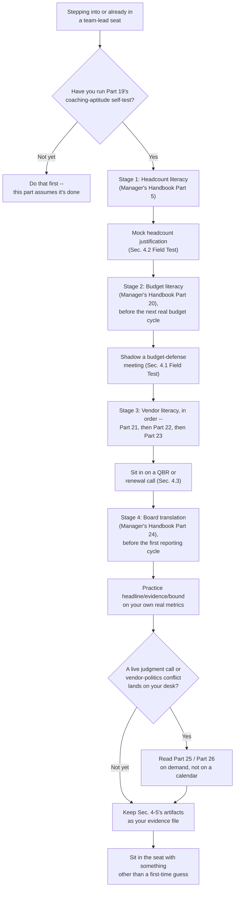

# Part 20 — From Team Lead to SOC Manager: What Changes and What to Learn First

## Why this part exists

**[CONCEPT]** Part 19 tests whether you actually want to coach people instead of personally closing the hardest ticket in the queue, and whether you can delegate a task without quietly rewriting it. That's real preparation, and if you've done it honestly, you arrive at a team-lead seat already knowing something true about your own aptitude. None of it, though, touches the domain that opens up the moment "team lead" becomes "SOC manager": a budget with your name on the approval line, a vendor contract you're now expected to have an opinion about, a headcount number a CFO will ask you to defend, and a board or CISO audience that judges you on a narrative built from numbers you didn't personally generate. SOC Manager's Operating Handbook owns that domain in full organizational depth — Section B for staffing and headcount, Section E for vendor, tooling, and budget management, Section F for governance, risk, and the executive interface. This part is not a summary of that material. It's the order to learn it in, before you need it, and the low-stakes rehearsals that let you touch each piece once at a safe distance instead of live, for the first time, during a real budget cycle.

**[CONCEPT]** State the boundary plainly, because it's easy to blur here more than almost anywhere else in this book: this part does not explain how a five-category SOC budget is structured, how a three-year total-cost-of-ownership model gets built, how an MSSP contract's service-level clauses should be negotiated, or how an operational metric becomes a board-ready risk sentence. Those are SOC Manager's Operating Handbook, Part 5 — Headcount & Capacity Modeling, Part 20 — Building & Defending the SOC Budget, Part 21 through Part 23's vendor-management sequence, and Part 24 — Executive & Board Reporting, respectively, and each one owns its mechanics completely. The test this whole book applies, restated for this specific jump: if a paragraph describes how the organization builds or governs one of those instruments, it belongs in that book, cited, not rewritten here. If a paragraph describes what you personally read, practice, and rehearse before you're the one building it, it belongs here.

**[CONCEPT]** What this part actually covers, in order: an honest self-assessment of what exposure you already have to each domain; a study sequence tied to when each skill is actually tested on the calendar, not front-loaded all at once the week you get the title; three specific low-stakes rehearsals — shadowing a budget-defense meeting, drafting a mock headcount justification, and sitting in on a vendor renewal call before you own one; a way to turn those rehearsals into a personal evidence file nobody's formally asked you to build yet; and the mindset shift underneath all of it, which has less to do with spreadsheets than with getting comfortable being judged on a story built from other people's numbers.

> **Cross-Book Pointer**
> This part does not explain how a SOC budget's five-category structure is built, how a total-cost-of-ownership or exit-cost model works, how an MSSP contract's SLA and audit clauses should be negotiated, or how an operational metric gets translated into a board-ready risk sentence. See SOC Manager's Operating Handbook, Part 5 — Headcount & Capacity Modeling, Part 20 — Building & Defending the SOC Budget, Part 21 — Tooling Procurement & Platform Strategy, Part 22 — MSSP & Managed-Service Contract Management, Part 23 — Vendor Relationship & Renewal Management, and Part 24 — Executive & Board Reporting for that organizational machinery in full. Come back here for the order to read them in and the rehearsals to run before you're the one building any of it for real.

## 1. What actually changes: the domain a team lead has never had to own

**[CONCEPT]** A team lead's job, done well, is already a real management job — scheduling, coaching, QA participation, being the first escalation point when a shift needs a judgment call. None of that disappears when the title changes to SOC manager. What gets added is a second job stacked on top of the first, and the two jobs use almost none of the same muscle. The table below names the domains that are genuinely new, not an extension of anything a team lead already does day to day.

| Domain | Team lead's version | SOC manager's version | Owned in full by |
|---|---|---|---|
| Staffing math | Fills the shift calendar against a headcount someone else set | Builds and defends the headcount number itself, including the shrinkage assumption behind it | `soc-manager:part5` |
| Money | Has an opinion on whether the team is understaffed | Owns a dollar figure a finance partner will ask hard questions about | `soc-manager:part20` |
| Tooling decisions | Reports friction with the current platform | Scopes the requirement, runs the PoC, prices the total cost and the exit cost of a new one | `soc-manager:part21` |
| Vendor contracts | Escalates a missed SLA to someone above them | Reads, negotiates, and governs the contract clause that defines what "missed" even means | `soc-manager:part22` |
| Vendor lifecycle | Notices a renewal is coming up | Runs the renewal calendar, the risk score, and the sprawl-rationalization call | `soc-manager:part23` |
| Executive audience | Reports up to the SOC manager | Is the one a board or CISO asks the skeptical follow-up question | `soc-manager:part24` |

**[LEAD/MANAGEMENT TRACK]** Every row on the right side of that table shares one property the left side doesn't: the evidence you're judged on is no longer something you can point to directly, like a closed ticket or a QA score with your name attached. A headcount number is judged months later against a queue that either held up or didn't. A budget case is judged against a fiscal year you can't rerun. A board narrative is judged by people who weren't in the room when the underlying work happened and will only ever see your translation of it. That shift — from evidence you personally generated to evidence you're now responsible for representing accurately on someone else's behalf — is the actual hinge this part is built around, more than any specific formula in the chapters it cites.

> **Ground Truth**
> "You've been managing people for a couple of years as a team lead, so the budget and vendor side will come naturally once you're in the seat" is close to the single most common thing a departing SOC manager tells their successor, and it undersells the actual gap by a wide margin. Coaching, delegation, and QA calibration are muscle you've already built, and they genuinely do carry over. Turning a volume-and-handle-time distribution into a defensible headcount number, or a vendor's proprietary rule syntax into a priced exit-cost line, is not an extension of that muscle — it's a distinct skill set with its own vocabulary, and for most first-time managers the first real exposure to it happens the week a live budget cycle or contract renewal is already underway, not before.

## 2. Self-assessment: scoring your own exposure before you study anything

**[LEAD/MANAGEMENT TRACK]** Before building a study sequence, get an honest read on what exposure you already have. Some team leads have quietly absorbed a fair amount of this by proximity — sitting near a manager who thinks out loud, or inheriting a spreadsheet someone else built. Others have never seen any of it done. The worksheet below scores six domains on a simple 0-to-3 scale, so the sequence in Section 3 can start from where you actually are instead of assuming everyone starts at zero.

TEMPLATE — the manager-transition exposure self-scoring worksheet, permanent ID `TMPL-2001`, filed in Appendix A6 alongside the career-roadmap and self-audit templates.

```text
For each domain, score 0-3 honestly, using the anchors below rather than a gut feel:
  0 = never seen this done up close
  1 = watched it happen at least once, but couldn't reproduce any part of it
  2 = helped build or review one real piece of it, with someone else driving
  3 = built a real (not mock) version of it myself, unsupervised, at least once

| Domain                                              | Score (0-3) | What would move you up one point |
|-------------------------------------------------------|:-----------:|-------------------------------------|
| Headcount / capacity modeling                          |             | <!-- name the specific worked example you'd need to reproduce -->
| Budget category structure & cost framing               |             |
| Tooling procurement (PoC, TCO, exit-cost thinking)      |             |
| Vendor / MSSP contract literacy (SLA, audit clauses)    |             |
| Vendor renewal & risk-scoring literacy                  |             |
| Board / executive translation                          |             |

Total /18. Below 6: start Section 3's sequence from Stage 1, in order, with no
shortcuts. 6-12: you have real but uneven exposure -- use the sequence to fill
the specific gaps the worksheet just named, not to relearn what you already
scored a 2 or 3 on. Above 12: you likely already have enough exposure that
Section 4's rehearsals matter more to you right now than Section 3's reading list.
```

**[MINDSET]** A low total score here is the normal starting point, not a warning sign — most team leads score a zero or one on most of these rows, because nothing about doing the team-lead job well requires touching any of them. The worksheet's only job is making sure the zeroes and ones get closed in Section 3, on a schedule, before they're tested live — not turning them into a source of anxiety about a jump you haven't even made yet.

> **Blind Spot**
> Scoring yourself a 2 on vendor-contract literacy because you once sat through a renewal call tells you that you were in the room, not that you understood what you were watching. There's no way to check, from inside your own head, whether you actually followed why a clock-start definition mattered or just nodded along — the gap only shows up the day you're the one negotiating it. Pair every self-score above a 1 with one specific thing you could explain to someone else cold. If you can't say in two sentences why the clock-start gap in an MSSP SLA matters, per SOC Manager's Operating Handbook, Part 22 §1.2, the honest score is a 1, not a 2, regardless of how many meetings you attended.

## 3. The study sequence: what to read, in what order, and why the order matters

**[STUDY PLAN]** Reading all five chapters this part cites in one sitting the week you get the title produces shallow familiarity with everything and real depth in nothing — you'll recognize the vocabulary in the room without being able to reproduce the arithmetic behind it. Waiting to read each one until the exact week it's tested produces the opposite failure: you learn the mechanics live, under the deadline pressure most likely to produce a bad first pass, which is precisely the shape of failure SOC Manager's Operating Handbook, Part 20 §2's own Operational Reality box names from the org's side — a budget built on an incomplete comparison "routinely gets treated as the finished case anyway, because it's the number that's easiest to pull." The fix is a staged sequence: read each part far enough ahead of the calendar event that actually tests it that you have time to build a mock version once, quietly, before the real one is due.

**[STUDY PLAN]** The table below sequences the five core parts against the calendar events that actually trigger them, with a verification step for each stage — a concrete way to check the reading actually landed, not just that you finished the chapter.

| Stage | Timing relative to your transition | Read | Why this order | How to check it landed |
|---|---|---|---|---|
| 1 | Before or in week one | `soc-manager:part5` — Headcount & Capacity Modeling | You inherit a live headcount number on day one; every later stage treats this number as a fixed input | Can you redo the flat-vs.-segmented worked example from memory well enough to explain to a peer why segmenting by time block beats a single daily average? |
| 2 | Within the first quarter, ahead of the next real budget cycle | `soc-manager:part20` — Building & Defending the SOC Budget | The five-category structure and the cost-per-analyst/cost-per-alert framing are the direct input to any budget ask; better read before the first real cycle than during it | Can you name, unprompted, the one category most often folded silently into "tooling," and explain why that's a problem? |
| 3a | Before your next tooling decision, or before inheriting a vendor relationship that already exists | `soc-manager:part21` — Tooling Procurement & Platform Strategy | Teaches how a platform decision should be evaluated — total cost of ownership and exit cost together — before you inherit one that wasn't evaluated that way | Could you sketch the two highest-weighted rows of the RFP scorecard for a tool your own team already uses? |
| 3b | Before your first vendor contract review or quarterly business review | `soc-manager:part22` — MSSP & Managed-Service Contract Management | Gives you the SLA and audit-clause vocabulary needed to read a contract you didn't negotiate yourself | Can you find, in a real contract you have access to, the specific event that starts the clock on its primary SLA metric? |
| 3c | Before your first renewal negotiation | `soc-manager:part23` — Vendor Relationship & Renewal Management | Renewal leverage only means something once you understand what you're negotiating for (3a) and what the contract actually says (3b) | For one real vendor relationship, can you state how many days remain before its renewal drops into the low-leverage band of the §2.3 table? |
| 4 | Before your first board or CISO reporting cycle | `soc-manager:part24` — Executive & Board Reporting | The board deck borrows its headline numbers directly from Stages 1 through 3; reading this first, with no numbers in hand yet, produces a narrative built around numbers you don't actually have | Can you turn one of your own team's real metrics into a headline/evidence/bound answer, unscripted, in under a minute? |
| 5 | On demand, whenever a live judgment call or a vendor-politics conflict lands on your desk — not on a fixed calendar | `soc-manager:part25` — Risk Acceptance & Manager Decision-Making Under Uncertainty; `soc-manager:part26` — Cross-Team Politics & Stakeholder Alignment | These two are read against a live situation, because the trigger is a real conflict, not a season | Can you name the specific escalate-versus-accept criterion, or the specific stakeholder-alignment tactic, that applies to the exact case in front of you right now? |

**[STUDY PLAN]** Stage 3's internal order — Part 21, then Part 22, then Part 23 — isn't invented for this book; it mirrors the sequence Part 21's own closing section describes for its own material: "once a decision panel signs off using the framework in §5, Part 22 turns the lock-in mitigations named in §4.1 into actual contract language... Part 23 then picks the exit-cost model back up every renewal cycle as standing negotiating leverage." Reading Part 23 first — jumping straight to renewal tactics because a renewal happens to be due soonest — teaches you how to negotiate hard without teaching you what number to negotiate for, because that number lives in Part 21's total-cost-of-ownership and exit-cost models, not in Part 23 itself.

**Figure 20.1 — A staged roadmap from team lead to a first budget/vendor/board cycle.** *CONCEPTUAL.* Diagram ID `FIG-2001`. Illustrates the sequence this section argues for — reading gated to the calendar event that actually tests it, with a rehearsal between each stage — rather than a single reading list consumed all at once. It is a personal-preparation flow, not a capture of any specific organization's onboarding process.




## 4. Low-stakes practice before you own any of it

**[LEAD/MANAGEMENT TRACK]** Reading the sequence above makes you fluent in the vocabulary and familiar with the mechanics as described on a page. It does not tell you what it feels like to sit in the actual room, or whether you can produce a defensible number under real time pressure with your own team's messy real data instead of a clean worked example. The three rehearsals below are named directly in this part's own scope: shadow a budget-defense meeting, draft a mock headcount justification, and sit in on a vendor renewal call — each one a way to touch the real mechanics once, at a safe distance, before your name is the one on the line.

### 4.1 Shadow a budget-defense meeting

**[LEAD/MANAGEMENT TRACK]** Ask your own manager directly whether you can sit in, silently, on the next budget review or quarterly business review where the SOC's numbers get discussed one level up. Frame the ask honestly — preparation for a role you're actively working toward, not a request to participate or add commentary. Once you're in the room, watch for three specific things this part's reading list already told you to look for: whether the five budget categories from SOC Manager's Operating Handbook, Part 20 §1 show up as five distinct lines or get quietly folded together; whether a cost-per-alert figure, if one comes up, is ever presented without a paired quality signal, the exact trap that part's §4 names; and how the room handles the one number that's moving in the wrong direction, if there is one — whether it gets named up front or discovered by someone else's question.

> **Field Test**
> **Setup:** A budget review or quarterly business review one level above your current seat is scheduled sometime in the next quarter.
> **Action:** Ask to attend as a silent observer. Bring a notebook and track, live, which of the five budget categories from SOC Manager's Operating Handbook, Part 20 §1 actually appear as distinct lines, and which single number in the meeting draws the hardest follow-up question.
> **Expected result:** Afterward, you should be able to reconstruct which number drew the hardest question, whether the presenter had a ready answer or improvised one, and which of the five categories (if any) got silently merged into another. If you can't reconstruct any of that, you were watching the meeting's slides, not its actual mechanics — go again next cycle with a narrower thing to track.

### 4.2 Draft a mock headcount justification

**[LEAD/MANAGEMENT TRACK]** Using your own team's real volume and handle-time numbers — or a reasonable estimate, if you don't have clean access to the real figures yet — run SOC Manager's Operating Handbook, Part 5's arithmetic on paper, privately, with no intention of submitting it anywhere. Segment your team's actual ticket volume by time block the way that part's §6 worked example does, build a shrinkage stack for your own team's real PTO, training, and meeting overhead per §4.1, and see whether the number you land on survives its own stress test against a high-volume day, per §7. The exercise's entire value is practicing the specific arithmetic you'll be asked to reproduce for real, not producing a number that merely looks plausible on a slide.

> **Career Trap**
> Building your mock headcount justification straight to a comfortably padded final number — rough mental math on your team's volume, plus a buffer that feels safe — is faster and produces nothing you could actually defend under one follow-up question about where the buffer came from. A padded guess and a modeled number look identical on a slide and completely different the moment someone asks "how did you get to that figure." Run the real arithmetic — volume, handle time, the shrinkage stack, segmented by time block — even on a private, informal draft. Skipping straight to a plausible number defeats the entire purpose of practicing now instead of live.

### 4.3 Sit in on a vendor renewal call or quarterly business review before you own one

**[LEAD/MANAGEMENT TRACK]** Ask to shadow the next MSSP or vendor quarterly business review, or a renewal negotiation call, that your manager or a dedicated vendor-relationship owner runs. Watch for whether the SLA numbers under discussion are the vendor's own framing or get cross-checked against an independent internal record — SOC Manager's Operating Handbook, Part 22 §4.1 names the failure mode directly: "a QBR that only reviews the vendor's own framing of its own performance isn't governance — it's a briefing." Notice where the relationship sits on Part 23 §2.3's leverage-decay curve — is this a conversation happening with a hundred-plus days of runway left, or is it already deep in the low-leverage band because nobody started the review early enough. If a champion's tool comes up as a retirement candidate, watch how — or whether — the political sequencing from Part 23 §5 actually gets applied.

> **Analyst's Note**
> If your organization doesn't run a clean, formal QBR you can ask to shadow, the same rehearsal works one level down: sit in on an ordinary tuning-request turnaround conversation or a support-ticket escalation with any existing vendor. You're not there to learn the specific product — you're there to see what a governance cadence actually looks like as a lived, recurring meeting instead of a paragraph in a book, before your own name is the one a vendor account team is reading for signs of how much runway you have left.

## 5. Building the artifacts before anyone asks for them

**[STUDY PLAN]** Keep everything Section 4 produces: the mock headcount model, your notes from the shadowed budget meeting and the vendor call, and — this is worth starting as its own running habit — a monthly log where you take one or two of your own team's real operational numbers and write out the headline/evidence/bound three-layer answer SOC Manager's Operating Handbook, Part 24 §7 teaches, without ever presenting it to anyone. Do this across two or three quarters and you have a real personal evidence file, built the same way Part 14 of this book teaches a senior analyst to build a branch-neutral portfolio before choosing a specialization: not for a formal packet nobody's asked you to assemble, but because the material is genuinely useful the day someone does ask.

> **Ground Truth**
> SOC Manager's Operating Handbook, Part 13 §3.3 names a real, structured bar for the analyst-to-team-lead branch — a coaching-aptitude assessment, a shadow-lead cycle, explicit voluntary interest — because a promotion committee runs that specific decision. No equivalent structured bar exists anywhere in that book for the team-lead-to-SOC-manager jump, because in most organizations that move is a hiring decision made one level up, not a committee-run promotion with a defined evidence packet the way the analyst branches are. That's not an oversight this book can close by inventing a packet that doesn't exist — it means the burden of proof sits entirely on you to build convincing evidence nobody is formally requesting yet, which is the actual reason Sections 4 and 5 exist: they're evidence for a bar that was never written down.

**[LEAD/MANAGEMENT TRACK]** One caution on the log itself: include at least one entry where the real number was genuinely bad, not just ones where the story came together cleanly. The habit worth building is naming the uncomfortable number first and clearly, the way SOC Manager's Operating Handbook, Part 24 §4's worked example does — "the one number moving in the wrong direction is..." — not practicing only the version of this skill that works when everything already looks good.

## 6. What a promotion conversation for this jump is likely to test

**[INTERVIEW PREP]** Whether this move happens as an internal promotion conversation or an external SOC-manager interview, the questions that actually probe this material tend to be scenario-based rather than definitional — nobody asks you to define cost-per-alert; they ask you to walk through a decision. This book's own Part 8 covers the general method for any candidate-side technical conversation: narrate your reasoning out loud, build a story bank of real material instead of improvising in the room. Applied to this specific jump, that story bank is exactly what Sections 4 and 5 just built.

| Likely scenario question | The artifact that answers it |
|---|---|
| "Walk me through how you'd justify adding headcount to this team." | Your mock headcount justification (§4.2), including the specific trap you caught yourself falling into on a first draft |
| "Tell me about a time you had to present a number that wasn't good news." | An entry from your translation-practice log (§5) where the real number was genuinely bad, not a smoothed-over version |
| "How would you decide whether to renew a vendor or look for a replacement?" | Your notes from the shadowed QBR or renewal call (§4.3), read against Part 23 §2.3's leverage-decay table |

**[INTERVIEW PREP]** Notice what none of these questions are asking: a panel probing this jump is checking whether you've touched the mechanics at all, not whether you already have three years of budget-cycle experience you can't possibly have yet as a first-time manager. An honest answer that names the specific trap you caught in a mock exercise — "I built a first draft, realized I'd folded vendor services into tooling the same way SOC Manager's Operating Handbook Part 20 warns against, and rebuilt it" — reads as more credible than a vague assurance that you'll "pick it up quickly," because it's evidence you already started.

## 7. The mindset shift underneath the mechanics

**[MINDSET]** As an analyst or a team lead, you know whether you did the job well because the evidence is checkable and mostly yours: the ticket closed with a correct disposition, the QA score came back at a specific number, the mentee's next ticket showed real improvement. Moving into the budget, vendor, and board domain quietly removes a lot of that direct verifiability. A finance partner's loaded-cost multiplier, a vendor's self-reported SLA compliance number, a QA sample someone else pulled — you're now building judgment on top of inputs you didn't personally generate and often can't fully audit. And the narrative you build from those inputs gets judged by people, sometimes months later, who weren't in the room for any of the underlying work and will only ever see your translation of it. Getting comfortable with that — rather than quietly trying to re-verify everything yourself, which doesn't scale, or presenting false confidence in numbers you haven't actually checked — is a psychological adjustment at least as real as any of the reading in Section 3.

> **Career Autopsy — "learn the budget deck the week it's due"** (`CASE-2001`, COMPOSITE CASE EXAMPLE)
>
> **The decision:** A newly promoted SOC manager, strong as a team lead for two years, decides to learn the budget process by running the first real cycle live rather than studying or rehearsing beforehand, reasoning that the finance partner assigned to the SOC would walk them through whatever they didn't already know.
>
> **Why it seemed reasonable:** The finance partner was genuinely available and helpful, the first real deadline felt far off at the moment of the promotion, and two years of successfully learning analyst and team-lead work on the fly had made "I'll figure it out when it's actually in front of me" feel like a personally proven strategy rather than a risk.
>
> **How it failed:** The first budget draft compared only payroll and licensing across two staffing options — the exact incomplete comparison SOC Manager's Operating Handbook, Part 20 §2's own Operational Reality box warns is "routinely gets treated as the finished case anyway." Training, facilities, and vendor-services costs were missing entirely. Reviewing the draft cold in the room, the finance partner asked where the standing incident-response retainer's cost was. The new manager didn't have an answer live, in front of the CISO. The number went back for a two-week rebuild, and the delayed submission pushed a genuinely needed headcount addition to the following quarter.
>
> **The fix:** The same manager, the following year, read Part 5 and Part 20 a full quarter ahead of the next cycle, ran a private mock version of the full five-category budget using Section 4.2's exercise extended to all five categories, and caught the exact "vendor services folded into tooling" trap on their own draft before anyone else in the room had to point it out.

> **What Would Change My Mind**
> This part treats staged, sequenced pre-study and low-stakes rehearsal as producing a materially better first budget, vendor, and board cycle than learning the same material live under real deadline pressure. If a broad sample of first-time SOC managers who skipped this kind of preparation performed just as well on their first cycle — judged by whether their first budget case, first vendor renewal, or first board deck survived its first hard follow-up question without a rebuild — as those who rehearsed beforehand, that would undercut this part's central bet on rehearsal over on-the-job learning, and the guidance here should shift toward treating a good mentor and a forgiving first cycle as an adequate substitute for personal preparation.

## Where this goes next

**[CONCEPT]** Not everyone who works through this study sequence and these rehearsals will conclude that budget, vendor, and board work is where they want to spend their attention — some will find the technical-platform side of the tooling decisions in Section 3's Stage 3 far more interesting than the dollar figure attached to them, which is worth noticing honestly rather than pushing past, and is exactly the signal Part 21 — The SOC Architect / Principal Technical Track picks up as an alternative leadership path that never requires owning a board deck. For those who do want this seat, Part 24 — Building Your Own Career Roadmap folds this part's staged sequence and rehearsal artifacts into the same 12-to-24-month milestone plan that closes out this book, so the study plan built here doesn't stay a standalone list but becomes one leg of a single, personal roadmap.

## Cross-references

This part assumes SOC Manager's Operating Handbook, Part 5 — Headcount & Capacity Modeling, Part 20 — Building & Defending the SOC Budget, Part 21 — Tooling Procurement & Platform Strategy, Part 22 — MSSP & Managed-Service Contract Management, Part 23 — Vendor Relationship & Renewal Management, and Part 24 — Executive & Board Reporting for the organizational mechanics this part deliberately does not re-derive, and Part 13 — Career Ladders & Promotion Criteria §3.3 for the structured team-lead branch bar this part's own gap analysis (§5) contrasts against. It cites Part 25 — Risk Acceptance & Manager Decision-Making Under Uncertainty and Part 26 — Cross-Team Politics & Stakeholder Alignment as situational, on-demand reading rather than calendar-staged material. Within this book, it assumes Part 19 — The Team Lead Transition is already complete, borrows Part 8's candidate-side interview-preparation method for §6, mirrors Part 14's branch-neutral portfolio logic for §5's evidence file, and connects forward to Part 21 — The SOC Architect / Principal Technical Track and Part 24 — Building Your Own Career Roadmap.
