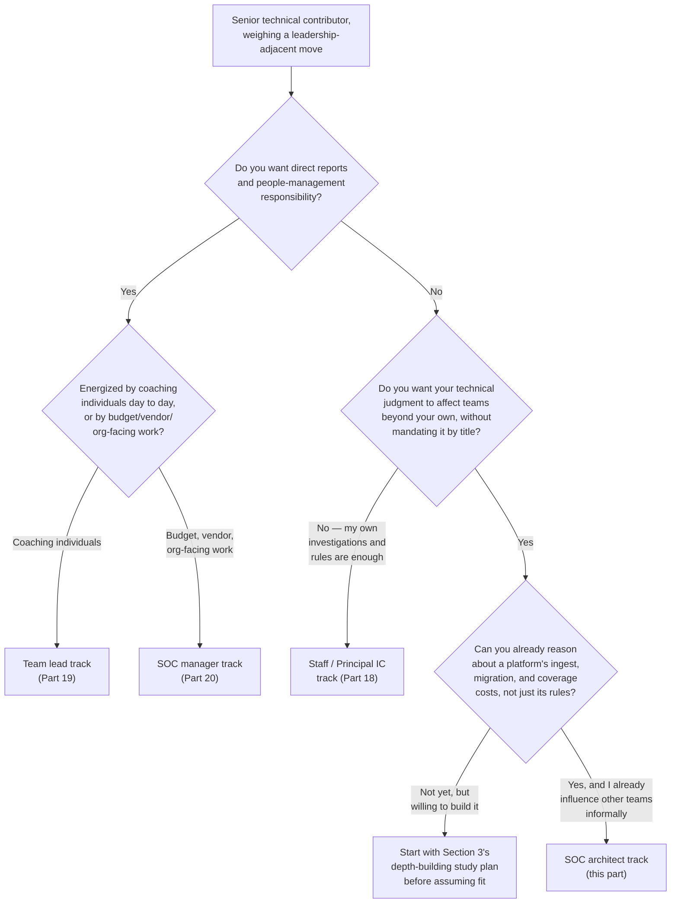

# Part 21 — The SOC Architect / Principal Technical Track

## Why this part exists

**[CONCEPT]** Part 19 tests whether you actually want to coach people. Part 20 maps the study plan for a team lead who wants to become a SOC manager, taking on budget, vendor, and headcount work. This part is for a different answer to the same underlying question — "what does leadership look like for me" — from someone who reads Part 19's coaching-aptitude self-test, or Part 20's vendor-renewal shadowing exercise, and recognizes honestly that neither is the job they want. This track is the third road out of senior analyst: technical leadership with no direct reports, built on platform architecture, detection-program design across an entire SOC, and cross-team technical authority earned through demonstrated depth rather than a title on an org chart.

**[CONCEPT]** This is not the same road as Part 18's Staff/Principal Analyst track, even though both share the property of requiring no people management. The difference is scope, not seniority. A Staff/Principal Analyst's evidence lives inside their own investigations, their own mentoring record, their own contribution to runbook quality — real, valuable, and bounded to the work one person can personally touch. An architect's evidence lives one level up: the pipeline every detection engineer's rules run inside, the coverage model the whole SOC measures itself against, the schema every analyst's query has to speak, the migration decision that resets six months of institutional muscle memory if it goes wrong. You can be an outstanding Staff Analyst without anyone downstream of your work ever needing to know your name. You cannot be a credible architect that way — the whole point of the role is that decisions you influence touch people who never asked your opinion directly.

**[CONCEPT]** This part does not re-derive how a SOC actually runs a tooling procurement — the RFP, the weighted scorecard, the proof-of-concept design, the total-cost-of-ownership and exit-cost models a decision panel signs off on. SOC Manager's Operating Handbook, Part 21 — Tooling Procurement & Platform Strategy owns that organizational mechanic in full, run by the manager, with the manager accountable for the outcome. What this part owns is narrower and comes from the other side of that same table: the technical depth and cross-team credibility you personally build so that when a manager runs that process, you are the person they ask to fill in the rows a checklist can't fill in on its own — and so that, over years, your judgment on a build-versus-buy call or a migration estimate is trusted before the RFP ever goes out, not just consulted once it does.

> **Cross-Book Pointer**
> This part does not explain how a tooling-procurement RFP is scoped, how a weighted evaluation scorecard is structured, or how a decision panel runs a proof-of-concept and reference-call process. See SOC Manager's Operating Handbook, Part 21 — Tooling Procurement & Platform Strategy for that organizational machinery in full — who runs it, what it weighs, and how a total-cost-of-ownership and exit-cost model get built. Come back here for what you personally build, years before that process starts, so your input into it is worth asking for.

## 1. What the architect track actually is — and isn't

**[CONCEPT]** Strip away the title, and the SOC architect role is three overlapping responsibilities, none of which require a direct report. First, platform architecture: owning the technical shape of the data pipeline and detection tooling the entire SOC depends on — how telemetry gets ingested and normalized, how the correlation and detection-as-code layers are structured, what the platform can and can't absorb without a redesign. Second, detection-program design at the scale of the whole SOC: not writing individual detections (that's the detection-engineer branch, Part 15), but designing the coverage model, the quality metrics, and the debt-management cadence that every detection engineer's work gets measured against. Third, cross-team technical authority: the ability to get an IR team, a threat-hunting team, and a detection-engineering team — none of whom report to you — to actually adopt a shared standard, because your reasoning is sound and your track record backs it, not because you outrank anyone.

**[SENIOR/SPECIALIST]** That third piece is the one most technically strong candidates underestimate, and it's the reason this track is genuinely a leadership track even without a single direct report. A brilliant platform design that nobody outside your own team adopts hasn't actually solved the whole-SOC problem it was built to solve — it's produced a well-engineered island. Section 6 below covers building that authority directly; the point to internalize now is that the technical depth in Sections 3 through 5 is necessary for this track and not sufficient for it on its own.

### 1.1 How this differs from the detection-engineer branch

**[SENIOR/SPECIALIST]** A senior detection engineer, per this book's Part 15, builds a track record of merged, low-false-positive detections inside a detection-as-code pipeline — Detection Engineering Handbook V2, Part 22 — Detection as Code owns the mechanics of that pipeline in full, and this part does not re-teach them. The architect track is what opens up when the more interesting question stops being "is this specific rule well-built" and becomes "is the pipeline itself well-built, and does it scale to the next three years of telemetry sources, log volume, and detection-engineer headcount." A detection engineer owns rules. An architect owns the system rules live inside, plus the standards that decide what "well-built" even means across every team writing rules against it.

### 1.2 How this differs from the SOC manager track

**[SENIOR/SPECIALIST]** Part 20 maps the SOC manager track as budget, vendor relationships, headcount, and board-facing accountability — real organizational authority, exercised through the org chart. The architect track exercises a different kind of authority: technical credibility, exercised through being right often enough, transparently enough, that teams outside your reporting line choose to follow your recommendation without being told to. A SOC manager can mandate a platform migration. An architect earns the standing to be the person a SOC manager consults before deciding whether to mandate one — genuinely different skills, and, per Section 2's self-assessment, a person strong in one is not automatically strong in the other.

> **Ground Truth**
> "Architect" gets used loosely in a lot of SOCs as a fancier title for "our most senior detection engineer," with no actual change in scope — still writing and reviewing rules inside one team, just with a bigger number in the job title. That's not a failure of the person holding the title; it's a sign the organization never built the whole-SOC platform-ownership scope the title is supposed to describe. If your own "architect" title looks like this, the gap between the title and the actual job described in this part is real, and closing it is what Sections 3 through 6 are for — not a reason to assume you've already arrived.

## 2. Testing whether this track actually fits you

**[MINDSET]** Part 3's specialization framework asks whether sustained ambiguity energizes or drains you, and whether you'd rather chase a falsifiable hypothesis or hunt the edge case that breaks your own rule. The architect track needs a different, later-stage question, because by the time you're weighing it seriously you've likely already cleared the senior-analyst fork and built real depth in a branch. The question here is narrower: do you want your technical judgment to have consequences for people outside your own team, without wanting the org-chart authority — the direct reports, the headcount and budget ownership — that would let you simply mandate those consequences.

**[MINDSET]** The diagram below routes that question against the two other technical-leadership-adjacent tracks this book covers in the same section — team lead (Part 19) and SOC manager (Part 20) — plus the fourth road this track sits next to rather than above, staying a Staff/Principal Analyst (Part 18). None of the four is a promotion in the sense of outranking the others; they select for different aptitudes the same way the three specialist branches in Part 3 do, and this book's own structural decision to give leadership three separate parts instead of one blended chapter exists specifically so a reader testing team-lead aptitude in Part 19 can honestly conclude the architect track in this part fits them better, without that conclusion getting buried under one averaged "are you leadership material" score.



**Figure 21.1 — Routing yourself among the technical-leadership-adjacent tracks: team lead, SOC manager, architect, or staying a Staff/Principal IC.** *CONCEPTUAL.* Illustrates the self-assessment questions this part uses to separate the architect track from the other three leadership-adjacent roads this book covers in Parts 18 through 20, not a capture of any individual's actual decision path. A "not yet" answer at any branch is a study-plan input, not a disqualification — Section 8's self-scoring rubric is built for exactly that case. Diagram ID `FIG-2101`.




**[MINDSET]** Notice that two of the four branches in Figure 21.1 — architect and Staff/Principal IC — never touch the org chart at all. That's deliberate, and it's this book's own version of the fourth-road problem SOC Manager's Operating Handbook, Part 13 — Career Ladders & Promotion Criteria, §3.4 names from the organization's side: a ladder that treats "leadership" as synonymous with "people management" quietly tells every strong technical contributor who doesn't want direct reports that their only path to more scope and pay is a management title they don't actually want. The architect track is what a whole-SOC-scale version of that fourth road looks like once you're past Staff/Principal IC's own individual-investigation scope and want your technical judgment to matter at the level of the SOC's shared platform instead.

## 3. The technical depth an architect actually needs

**[SENIOR/SPECIALIST]** "Deep platform internals" is a phrase that sounds impressive and specifies nothing until you name what it actually covers. For this track, it means being able to reason, in real technical detail, about four things most detection engineers touch only at the edges: how telemetry gets parsed and normalized before any detection logic ever sees it, how a correlation engine actually resolves entities and time windows across multiple events rather than scoring one log line at a time, how a detection-as-code pipeline's review gates and CI checks actually enforce quality rather than just existing as policy, and how a coverage model represents — honestly, without an all-green heatmap papering over the gaps — what the SOC can and can't actually see.

**[SENIOR/SPECIALIST]** None of those four is this part's material to teach from scratch. Detection Engineering Handbook V2, Part 6 — Normalisation owns parsing and schema-translation mechanics, including the migration-cost model Section 4 builds on. Part 22 — Detection as Code owns the git-based rule pipeline and ownership model that makes "detection program" mean more than a shared folder of queries. Part 41 — Detection Coverage owns the six-tier coverage model (no visibility, telemetry only, partial detection, reliable detection, multi-source detection, tested/recently validated) that rejects the all-green heatmap this section just warned against, and Part 43 — Detection Debt owns treating testing, documentation, and tuning gaps as an inventory to pay down rather than a vague feeling of being behind. An architect's job is to have read all four cover to cover, more than once, and apply their models to a real platform decision on demand.

> **Analyst's Note**
> The fastest way to tell whether you've actually internalized this material versus just read it once: try to draw your own SOC's real detection pipeline from telemetry source to fired alert, labeling every hop with which of Detection Engineering Handbook V2's parts governs it, from memory, without opening the book. If you get stuck on a hop — you don't actually know what happens to a log between the collector and the SIEM's index, say — that's not a minor gap. That hop is exactly where a migration estimate or a coverage claim quietly goes wrong later, and it's cheaper to find the gap now, on a whiteboard, than during a real cutover.

**[SENIOR/SPECIALIST]** The distinguishing skill this section is actually building toward is breadth held at real depth, not shallow familiarity with everything. A detection engineer's depth is usually concentrated in one or two domains and one query language. An architect needs enough working depth across the whole pipeline — from ingest through detection-as-code through coverage measurement — to notice when a decision that looks contained to one layer (say, adding a new EDR telemetry source) actually has consequences three layers away (a coverage model that now needs a new row, a detection-as-code review queue that now needs a new reviewer with that telemetry's specific expertise). That cross-layer pattern recognition is the part of the job a checklist genuinely cannot do for you, and it's built by years of deliberately reading and applying material outside whatever domain you happened to specialize in first.

## 4. Migration and TCO literacy: your homework behind a number a manager will ask for

**[SENIOR/SPECIALIST]** SOC Manager's Operating Handbook, Part 21, §2.2's weighted evaluation scorecard has two rows a manager cannot fill in credibly from a vendor's sales deck alone: "data ingest/normalization fit, own messiest source" and "three-year TCO: license + migration + retraining." Both rows need a real number, built from real technical reasoning about your own SOC's actual detections and actual data, not a vendor's marketing claim. That reasoning is exactly what Section 3 above was building toward, and this section is where it gets applied to a specific, high-stakes question: what would it actually cost, in engineering hours and in temporary capacity loss, to move this SOC's detection content onto a different platform.

**[SENIOR/SPECIALIST]** Detection Engineering Handbook V2, Part 6 prices real migration cost across four components — the platform cost itself, the per-rule field-mapping effort, parity-testing to confirm the migrated rule still fires the same way it did before, and the dual-running overlap while both platforms operate side by side during cutover. An architect's job, when a manager asks "roughly what would this cost us," is to produce a credible answer built from that four-component structure, applied to this SOC's actual rule count and actual messiest log source — not a guess, and not the vendor's own rosy migration timeline repeated back uncritically. SOC Manager's Operating Handbook, Part 21, §3.2's worked example shows exactly how nonlinear that number gets: a finalist that wins the functional bake-off and quotes the cheaper license every year can still lose on fully loaded three-year cost once mapping effort and retraining are priced honestly, because a genuinely different schema family multiplies the mapping-hours-per-rule figure far past what the license-price gap alone would suggest.

> **Career Autopsy — "the confident estimate with no real number behind it"**
>
> **The decision:** A senior detection engineer with strong platform knowledge but no history of pricing a real migration is asked by their SOC manager for a rough cost estimate on moving 200 detection rules to a finalist SIEM. They estimate "a few weeks, maybe a month," based on general familiarity with both platforms' query languages.
>
> **Why it seemed reasonable:** They knew both query languages well and had migrated a handful of personal rules between them in a home lab without much friction, so a month felt like a reasonable, slightly padded guess.
>
> **How it failed:** The estimate never separated mapping effort from parity-testing effort from the dual-run overlap the way Detection Engineering Handbook V2, Part 6's four-component model does, and it was built from the platforms' cleanest fields rather than the SOC's actual messiest log source. The real migration ran past four months, and the SOC manager's finance conversation, built on the original estimate, had to be reopened midstream — a credibility cost that landed on the manager, but that the engineer's next estimate was trusted far less for.
>
> **The fix:** Before the next platform conversation, the engineer built a personal migration-cost worksheet modeled directly on Detection Engineering Handbook V2, Part 6's four components, priced against their own home lab's rule set first (Section 4.1 below), so the next real estimate came from a repeatable model instead of a familiarity-based guess.

### 4.1 Building the estimating habit before you're asked for a real number

**[STUDY PLAN]** The discipline behind a credible TCO estimate is a habit, not a one-time calculation, and it's one you can start building with your own home-lab rule set long before any real migration decision reaches you.

**[STUDY PLAN]** `[HOME LAB — companion volume not yet written]` Set up two log-ingestion platforms in your home lab — a free-tier or self-hosted instance of two genuinely different backends is enough; Elastic and a Sigma-backed alternative, or Wazuh and a second SIEM, both work. Write, or reuse, 10 to 15 detections against your first platform, covering at least one rule against your messiest log source. Then run a real, timed migration: for each rule, log minutes spent on field mapping, minutes spent confirming the migrated rule fires the same way against the same test data (parity-testing), and a rough estimate of dual-run overlap cost if this were a live SOC. Total those three the way Detection Engineering Handbook V2, Part 6's model does, and compare your per-rule mapping-hours figure against the manager handbook's worked example — roughly 2 hours per rule for a closely related schema family, roughly 6 hours for a genuinely different one — to see which end of that range your migration landed on, and why.

**[STUDY PLAN]** The point isn't the specific number your lab produces — 15 rules tell you nothing directly transferable to a 340-rule production migration. The point is building the muscle of separating mapping cost from parity-testing cost from dual-run cost as three distinct, individually estimable things under real timed conditions, so the next time a manager asks for a number you have a structure to reason inside instead of a gut feel dressed up as an estimate.

> **What Would Change My Mind**
> This section treats hands-on migration-cost estimating practice as a meaningfully different skill from general platform fluency — the Career Autopsy above shows someone technically strong on both platforms individually still producing a bad estimate because they'd never actually timed a real mapping-and-parity-testing cycle. If a large sample of real migration estimates showed no measurable accuracy difference between architects who'd run a timed practice exercise like Section 4.1's and those who hadn't but had strong general platform knowledge, that would suggest the practice itself adds less than this section claims, and the guidance here should shift toward "general depth is sufficient" rather than treating deliberate estimating practice as a distinct, necessary rep.

## 5. Detection-program design across a whole SOC

**[SENIOR/SPECIALIST]** A detection engineer, per Part 15, is measured on their own merged rules and those rules' post-deployment false-positive rate. An architect designing a detection program at whole-SOC scale is measured on a different question entirely: does the SOC, as a system, know where its coverage actually is, know whether that coverage is getting better or worse over time, and have a working process for paying down the gaps rather than just accumulating them. That's three distinct pieces of program design — a coverage model, a quality metric set, and a debt-management cadence — and Detection Engineering Handbook V2 owns the technical mechanics of all three (Part 41, Part 42, and Part 43 respectively) in depth this part does not re-derive.

**[SENIOR/SPECIALIST]** What this part owns is what it looks like for you, personally, to practice designing at that scale before anyone hands you the whole-SOC mandate to do it for real. The clearest practice ground is your own home lab, scaled honestly to what a lab can actually represent.

**[STUDY PLAN]** `[HOME LAB — companion volume not yet written]` Build and maintain a personal detection-coverage matrix against your home lab's own detections, using Detection Engineering Handbook V2, Part 41's six-tier model (no visibility, telemetry only, partial detection, reliable detection, multi-source detection, tested/recently validated) as the scoring scale, mapped against a deliberately small slice of MITRE ATT&CK — 10 to 15 techniques you can realistically instrument and test, not an attempt to cover the whole matrix shallowly. Score every technique honestly rather than defaulting to the top tier the moment a rule exists; a rule never tested against a real emulated run belongs at "reliable detection" or "multi-source detection" at best, not "tested/recently validated" — the gap between those tiers is the exact all-green-heatmap failure Part 41 exists to name. Revisit the matrix monthly and track which techniques moved tiers; a matrix that never changes is evidence you're filling out a spreadsheet once, not running a program.

**[STUDY PLAN]** After a few months, layer Part 42's quality metrics on top at the same small scale — each detection's alert-to-finding ratio, how stale its last real test run is — and layer Part 43's debt framing on top of that: name, explicitly, which gaps you're choosing not to close this month, and why, the way a real debt ledger tracks a chosen backlog rather than an accidental one. This three-layer habit, run together rather than as one-off exercises, is the actual rep for whole-SOC program design; a coverage matrix alone only proves you can fill in a spreadsheet, not run a program.

> **Blind Spot**
> A coverage-quality-debt exercise run entirely in a home lab, by one person, on 10 to 15 techniques, cannot show you what the same model looks like under real organizational friction — a detection engineer who disagrees with your tier scoring, a manager who wants the debt ledger to look better before a board update than your honest accounting would produce, 300 rules instead of 15. It proves you understand the mechanics well enough to run them, not that you can run them under the political and scale pressure a real whole-SOC program creates. Treat the lab version as necessary practice for the mechanics, and actively look for a chance to shadow or co-run a real coverage review — even one quarter's worth, even as an observer — before treating the lab exercise alone as proof you're ready.

## 6. Cross-team technical authority without a title

**[LEAD/MANAGEMENT TRACK]** This is the piece Section 1 flagged as the one technically strong candidates most often skip, because it doesn't feel like a technical skill and doesn't show up on any certification. Cross-team technical authority is the ability to get a team that doesn't report to you — threat hunters, incident responders, a detection-engineering team other than your own — to actually adopt a standard, a schema convention, or a pipeline design you proposed, because the reasoning holds up under challenge, not because anyone told them to.

**[LEAD/MANAGEMENT TRACK]** You build this the same way you'd build any other track record this book covers: with artifacts, not assertions. The single most useful artifact is a written architecture decision record — a short document that states a real technical decision, the alternatives actually considered, the tradeoffs, and the reasoning for the choice — produced and circulated before anyone asks you to, on a decision your SOC has already made informally without ever writing the reasoning down. An unsolicited, well-reasoned ADR that survives a peer's genuine challenge is worth far more, as evidence of cross-team authority, than a job title with nothing behind it.

> **Field Test**
> **Setup:** Identify one real technical decision your SOC has already made informally — which log format a new telemetry source gets normalized into, which correlation pattern a specific detection uses, how a specific piece of the pipeline handles a known edge case — with no written record of why.
> **Action:** Write a one-page architecture decision record: the decision, at least two genuine alternatives that were realistically on the table, the tradeoffs between them, and your stated reasoning for the choice actually made or the choice you'd recommend instead. Send it to one peer outside your own team — a detection engineer, a hunter, an IR analyst — and explicitly ask them to challenge it, not just approve it.
> **Expected result:** A real ADR survives at least one substantive challenge with your reasoning holding up, or gets genuinely revised by the challenge in a way that makes it better. If the peer has nothing to push back on at all, either the decision was genuinely uncontroversial or the ADR wasn't specific enough to be checkable — in either case, that's useful information about whether this was a real test of the skill or a formality.

**[LEAD/MANAGEMENT TRACK]** Do this more than once, and a pattern starts to accumulate that a future SOC manager can actually point to when they're deciding who to bring into a real procurement conversation, per SOC Manager's Operating Handbook, Part 21, §2.1's requirement that the requirement gets scoped and inventoried by someone who already understands the platform's real content before any RFP goes out. That inventory work — counting the standing rules, ranking log sources by actual alert-volume contribution, mapping the mandatory integration surface — is exactly the kind of unglamorous, whole-SOC-scale technical work an architect with a real ADR track record gets asked to help with, because the manager already has evidence the reasoning will be sound.

> **Career Trap**
> Building deep platform knowledge in isolation — reading every part of Detection Engineering Handbook V2 relevant to this track, running every home-lab exercise in Sections 4 and 5 — and never once circulating a written opinion outside your own team is a common trap specifically because the depth work feels like real progress and is genuinely necessary. It just isn't sufficient, and it's invisible to you from the inside: you feel like you're building the architect skill set, and in a narrow sense you are, but nobody outside your own team has any evidence of it yet. The fix: treat one circulated ADR or cross-team proposal per quarter as a non-negotiable part of the study plan in Section 8, not an optional extra once the "real" technical work is done.

## 7. The build-vs-buy call: the individual's side

**[SENIOR/SPECIALIST]** SOC Manager's Operating Handbook, Part 21, §6 walks through how migration cost differs by platform category — SIEM, EDR, SOAR, TIP — and names, for a SOAR platform specifically, that the dominant migration risk is a playbook that silently closes the wrong ticket or contains the wrong host, a materially worse failure than a detection that quietly stops matching. Deciding what's safe to automate at all is SOC Playbook Handbook, Part 30 — Automation and SOAR's territory, cited there and not re-derived here either. What an architect actually gets asked to weigh in on, underneath all of that organizational process, is narrower and highly technical: can we build this correlation logic or this automated playbook step ourselves, inside the platform we already run, or does it genuinely require buying a new module or a new vendor relationship to get.

**[SENIOR/SPECIALIST]** That's a real technical judgment call, not a procurement decision, and it's the one a manager will lean on you for before the RFP conversation even starts — sometimes specifically to avoid one entirely, because the honest technical answer is "we can build this with what we already have." Practicing that judgment personally means running a small-scale version of the discipline SOC Manager's Operating Handbook, Part 21, §2.3 names for a real proof-of-concept: test a candidate build against your own messiest data, not a clean synthetic example, before concluding it's feasible. If you're weighing whether your home lab's pipeline can absorb a new correlation pattern without a new tool, build it against the messiest log source you have and see whether it actually holds up.

**[STUDY PLAN]** Keep a personal log of every build-vs-buy call you reason through this way, even informally — what you were weighing, what you tested to check feasibility, and what you concluded. A handful of these, accumulated honestly over a year, is a concrete answer the next time someone asks why your opinion on a real procurement question should carry weight: not "I've read a lot about this platform," but "here are four specific calls I reasoned through, including one I got wrong."

> **Analyst's Note**
> If your SOC is running a real procurement process and you have no vote in the room, ask to sit in on one PoC session or one reference call anyway, purely as an observer. You're not there to influence the decision — you're there to build pattern recognition for what a real PoC looks like when it's testing the vendor's demo environment instead of your own conditions, so the next time you're asked for a technical opinion, you've actually seen the process fail once from the inside rather than only read about it happening to someone else.

## 8. The architect-readiness self-scoring rubric and study plan

**[STUDY PLAN]** The table below turns Sections 3 through 7 into a single self-scoring worksheet you can run against yourself honestly, on your own, with no committee and no submission requirement. Score each row 0 to 2: 0 means not present yet, 1 means partially present or untested under real conditions, 2 means clearly present with a concrete artifact behind it — a written estimate, a coverage matrix, a circulated ADR, a logged build-vs-buy call — not just a feeling that you understand the area.

TEMPLATE — The SOC architect readiness self-scoring rubric, permanent ID `TMPL-2101`

```text
Score each row 0-2. 0 = not present. 1 = partially present, untested under real conditions.
2 = clearly present, backed by a concrete artifact you could show someone if asked.

| Row                                                                      | Score (0-2) |
|----------------------------------------------------------------------------|:-----------:|
| Cross-layer platform depth (Sec. 3): can trace your own SOC's pipeline    |             |
| end to end and name which DEH V2 part governs each hop, from memory       |             |
| Migration/TCO estimating (Sec. 4): built a real, timed migration cost     |             |
| estimate using the mapping/parity-testing/dual-run model, not a guess     |             |
| Program-design practice (Sec. 5): maintains a running coverage-quality-   |             |
| debt exercise, revisited on a real cadence, not a one-time spreadsheet   |             |
| Cross-team authority (Sec. 6): has circulated at least one unsolicited    |             |
| ADR or proposal outside your own team that survived a real challenge     |             |
| Build-vs-buy judgment (Sec. 7): keeps a logged record of build-vs-buy     |             |
| calls reasoned through personally, including at least one you got wrong  |             |

Total /10. Below 6: the gap is likely still in depth-building (Secs. 3-5) rather than
visibility (Secs. 6-7) -- keep building before circulating more widely. 6-8: you likely have
real depth but thin cross-team evidence -- prioritize Section 6's quarterly ADR habit next.
9-10 sustained across two or more quarterly reviews: you have a real, evidenced case for the
track, independent of whether a title or an org chart currently reflects it.

<!-- Re-score quarterly, not once. A single high score after one intense study sprint proves
     you can perform under focus, not that the depth and habits are durable. -->
```

This rubric is something you run privately, on a fixed quarterly cadence, the same way Part 3's branch-fit worksheet gets re-tested against real field-test evidence rather than trusted on a single self-report. Its main limitation is the Blind Spot already named in Section 5: it can tell you whether you have real, artifact-backed depth by your own honest accounting, not whether that depth would survive the political and scale friction of a real whole-SOC platform decision.

**[STUDY PLAN]** A reasonable sequencing across roughly 12 to 18 months, for a reader starting from real branch-level depth (a strong detection engineer or a Staff/Principal Analyst per Part 18) but with no architect-scale practice yet: months 1 through 4 on Section 3's cross-layer depth work, reading Detection Engineering Handbook V2 Part 6, Part 22, Part 41, and Part 43 in full; months 3 through 8 running Section 4's timed home-lab migration exercise at least twice, on two different platform pairs; months 5 through 12 running Section 5's coverage-quality-debt exercise monthly, long enough to see real drift and correction rather than one snapshot; and, starting no later than month 6, one circulated ADR per quarter per Section 6 regardless of how the depth work is progressing, because the cross-team evidence takes its own separate time to accumulate.

## 9. Building the evidence, and the traps that undermine it

**[SENIOR/SPECIALIST]** What accumulates from Sections 3 through 8, run honestly over a year or more, is a portfolio a future SOC manager can actually evaluate: a small but real coverage-quality-debt program you've run and can walk through, two or three timed migration-cost estimates with the reasoning shown, a handful of circulated ADRs with the challenges and revisions attached, and a logged build-vs-buy record including at least one call you got wrong. None of this requires a committee, a formal nomination, or a title change to start — the same property Part 13's evidence-building advice names for the L3-to-branch transition applies here at a later career stage: the evidence is worth building whether or not anyone has agreed yet to evaluate you against it.

**[SENIOR/SPECIALIST]** The mirror-image trap to Section 6's isolation trap is accepting an "Architect" or "Principal Engineer" title with none of Sections 3 through 8's actual depth behind it — often offered, with good intentions, as a retention lever or a way to reward someone senior without a formal promotion process. SOC Manager's Operating Handbook, Part 13, §5 names the organizational cost of exactly this pattern as leveling drift, and the individual cost lands on you specifically the first time a real migration estimate or a real cross-team standards conflict lands on your desk with the title already attached and none of the underlying evidence built yet. If you're offered the title before the rubric in Section 8 scores 6 or higher, treat the offer as a runway to build the evidence, not as proof it already exists — the gap between the title and the depth is invisible to everyone except you, until the day it isn't.

**[MINDSET]** The honest failure mode to watch for in yourself, more than in how anyone else evaluates you, is confusing comfort with a platform for depth in it. Years of daily use of one SIEM produces real, valuable fluency — and it is not the same thing as being able to reason about a genuinely different platform's schema-migration cost, or design a coverage model that would survive a skeptical peer's challenge, or write an ADR that holds up when someone outside your own team pushes back on it. The self-scoring rubric in Section 8 is built specifically to separate those two things, because familiarity is the easiest kind of evidence to mistake for readiness, and it's the one this track's actual work will expose fastest once a real decision — not a familiar one — lands on your desk.

## 10. Where this goes next

**[CONCEPT]** This track has no formal finish line the way a certification exam or a promotion committee vote does, and that's a real, structural difference from Part 19's team-lead track or Part 20's SOC-manager track, both of which eventually run through an organizational process with a defined evaluation moment. The architect track's evidence accumulates until a manager or a peer group recognizes it and starts routing real decisions your way — which means the discipline of running Section 8's rubric on a fixed quarterly cadence, whether or not anyone else is watching yet, matters more here than in almost any other track this book covers. Nobody is going to tell you when you're ready. The evidence in Sections 4 through 7, honestly accumulated, is what tells you instead.

**[MINDSET]** If, after running this part's self-assessment and a few real quarters of the rubric in Section 8, the honest read is that you want the depth-building parts of this track (Sections 3 through 5) but genuinely dread the cross-team visibility work in Section 6 — the ADRs, the circulated proposals, the deliberate exposure to challenge — that's real, useful information, not a personal failing to push through. Part 18's Staff/Principal Analyst track rewards exactly the same depth-building instinct at a scope that doesn't require it, and revisiting Figure 21.1's decision tree with that specific piece of evidence in hand is a better use of your time than forcing the visibility work because the architect title sounds more senior than the alternative.

---

**Cross-references:** This part assumes Part 3 — Choosing Your Path: A Specialization Decision Framework (the aptitude-signal self-assessment this part's later-stage version in Section 2 builds on), Part 18 — Staying a Strong Individual Contributor (the fourth-road track this part sits next to rather than above), and Part 19 — The Team Lead Transition (the coaching-aptitude self-test this part's own self-assessment routes away from in Figure 21.1). Outside this book, it cites SOC Manager's Operating Handbook, Part 21 — Tooling Procurement & Platform Strategy (§§2.1–2.3, 3.2, and 6, for the organizational procurement process this part's technical-depth-building explicitly feeds without re-deriving) and Part 13 — Career Ladders & Promotion Criteria (§3.4, for the fourth-road/dual-ladder concept this track extends to whole-SOC scope, and §5, for the leveling-drift risk named in Section 9's Career Trap). It cites Detection Engineering Handbook V2, Part 6 — Normalisation, Part 22 — Detection as Code, Part 41 — Detection Coverage, Part 42 — Detection Quality, and Part 43 — Detection Debt for the technical mechanics behind Sections 3 through 5, and SOC Playbook Handbook, Part 30 — Automation and SOAR for the automation-safety boundary named in Section 7, none of which this part re-derives.
