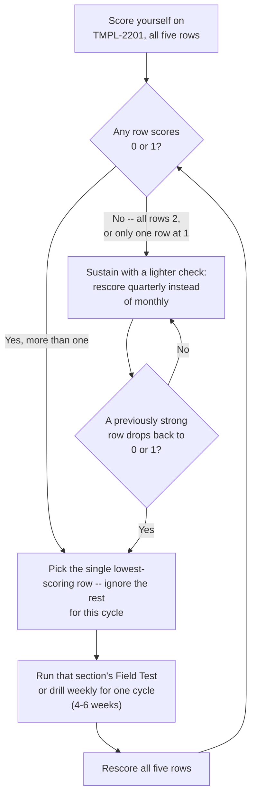

# Part 22 — The Analyst Mindset: Habits That Separate Strong Performers From Weak Ones

## Why this part exists

**[CONCEPT]** Every earlier part in this book was scoped to a rung: what an L1 studies, what an L2 builds, what a senior analyst owns, what a team lead tests in themselves before asking for the seat. This part breaks that pattern on purpose. The four habits below — documenting under time pressure instead of after it, treating a wrong call as information instead of an attack on your competence, saying "I'm confident" only when the evidence actually supports it, and staying curious about a ticket after it's closed — don't belong to a tier. They predict who keeps growing at every stage this book covers, from a first-month L1 to a SOC architect five years in, and they predict it independently of raw technical skill.

**[CONCEPT]** That independence is the whole reason this part exists. Two analysts with near-identical technical ability, tool fluency, and QA scores can diverge sharply over 18 months, and the difference is almost never a skill either of them lacks. One writes the note before the memory fades; the other reconstructs it Friday afternoon. One hears "you missed this" and asks what evidence would have caught it; the other explains why it wasn't really a miss. One says "I'm not sure" out loud when they're genuinely not sure; the other says "definitely" every time because it sounds more competent. None of that shows up on a résumé. All of it shows up, eventually, in whether a nomination clears or stalls.

**[CONCEPT]** This part is not about how a manager scores any of this. SOC Manager's Operating Handbook, Part 10 — Competency Models & Skills Matrices already owns the mechanics of the judgment axis these habits ultimately feed into, and Part 13 — Career Ladders & Promotion Criteria owns how a committee weighs the evidence a habit like this produces over time. Neither gets re-derived here. This part's job is narrower and lives entirely on your side of the desk: what the habit actually looks like day to day, why it's hard to build under real time pressure and real social pressure, and how to check honestly whether you've built it or are just telling yourself you have. Section 6 also names the specific mindset failure that most often hides behind a stalled promotion when nothing else on paper looks wrong — pattern-matching to lucky guesses — and gives you a way to catch it in yourself before a reviewer catches it for you.

## 1. Why these four habits are cross-cutting, not a stage

### 1.1 The same habit, a different cost each time you skip it

**[CONCEPT]** A habit is cross-cutting when the underlying behavior stays the same but the stakes and the surface it's applied to change completely as you move up. Documentation discipline at L1 means a two-line escalation note that lets Tier 2 pick the ticket up cold. Documentation discipline at senior analyst means the reasoning behind a severity-model override, written down well enough that a peer could audit it later. Documentation discipline in the lead and management track means a decision rationale — why this headcount ask, why this vendor, why this risk-acceptance call — written clearly enough to survive a follow-up question from someone who wasn't in the room. Same habit. Wildly different consequence for skipping it, and a much higher cost the further up the ladder you go.

**[CONCEPT]** That's the pattern behind all four habits in this part, and it's why they get one dedicated chapter instead of being folded into each tier's own section. Building the habit early, while the stakes are small and the reps are cheap, is strictly better than discovering you never built it once the stakes are a board-facing incident update or a promotion packet with your name on it.

### 1.2 What the same habit looks like at each stage

**[CONCEPT]** The table below maps each habit's concrete manifestation across the stages this book covers — read it as a lead-in to Sections 2 through 6, not as a substitute for them.

The table below shows what each cross-cutting habit actually looks like at a given career stage, so you can spot which version applies to your current queue before reading the section that develops it.

| Habit | L1/L2 | Senior/Specialist | Lead/Management Track |
|---|---|---|---|
| Documentation under time pressure | Escalation note complete before shift ends, not reconstructed the next morning | Novel-investigation reasoning written in language a peer could audit, not just a category code | Decision rationale for a resourcing or risk call, written the same day, before memory smooths it over |
| "I was wrong" as data | Accepting a QA correction without arguing the reviewer misunderstood the ticket | Logging a wrong disposition with the specific evidence that would have flipped it | Owning a bad staffing or escalation-policy call in a postmortem without a manager defending it as unavoidable |
| Confidence calibrated to evidence | Saying "I can't determine this without X" instead of guessing to close the ticket | Stating a confidence level on a disposition and checking it against the actual base rate over months | Not overstating certainty to an executive mid-incident to sound more in control than the evidence supports |
| Curiosity past closure | Asking why a rule actually fired, not just that it matched | Following up on a hunch that resolved to nothing, to check if the negative result itself is worth logging | Asking whether last quarter's process fix actually held, instead of assuming the ticket closing meant the problem closed with it |

## 2. Documentation discipline under time pressure

### 2.1 The specific failure: "I'll write it up properly later"

**[L1/L2]** The failure isn't skipping documentation outright — almost nobody does that openly, because a bare ticket with no notes gets noticed fast. The failure is writing a thin placeholder note while the queue is stacking up, promising yourself a proper write-up once things calm down, and then writing that proper version from memory hours or a full shift later. By then you don't have your actual reasoning anymore. You have the resolution, plus a reconstruction that quietly fits your reasoning to the answer you already know — the exact hindsight-bias mechanism the ambiguous-call reasoning log in this book's Part 11 is built to defeat, because logging before the resolution is known is the only thing that protects against it.

**[L1/L2]** The tell that you're doing this is simple: if you can't remember, a week later, what specifically made a case ambiguous at the time — only what it turned out to be — you were documenting the conclusion, not the reasoning. A reviewer reading that note six months from now, or you, reading your own note in a promotion self-audit, gets nothing usable from it either way.

### 2.2 What changes at senior tiers and on the lead track

**[SENIOR/SPECIALIST]** At senior analyst, the stakes rise because the thing you're documenting is often the only record that a defensible reasoning process happened at all. This book's Part 13 walks through what "reasoning from the underlying threat model" looks like on a novel investigation with no runbook entry — the discipline this section adds is writing that reasoning in near-real-time, while you still remember which evidence ruled a hypothesis out and which one you just got tired of chasing. A severity-model override written a day later tends to read as more confident and linear than the investigation actually felt, because memory quietly edits out the false starts, and that edited version is worse evidence, not better, if anyone ever needs to audit it.

**[LEAD/MANAGEMENT TRACK]** On the leadership track, documentation discipline under time pressure shows up hardest during an actual incident, when writing anything down feels like the least urgent thing in the room. SOC Manager's Operating Handbook, Part 28 — The Manager's Role in a Major Incident owns the organization's crisis-communication cadence and decision-authority structure during a live event; this part's concern is narrower and personal — whether you, specifically, capture the reasoning behind a call you made under pressure (why you surged staffing this way, why you escalated to the board at this moment and not sooner) close enough to the moment that the post-incident review in SOC Manager's Operating Handbook, Part 29 — Post-Incident Organizational Review gets your real reasoning to examine rather than a tidied-up story assembled after the fact, once you already know how it turned out.

> **Cross-Book Pointer**
> This part does not cover how a major incident's decision-authority is structured, how staffing surge decisions get made organizationally, or how a post-incident review program is run. See SOC Manager's Operating Handbook, Part 28 — The Manager's Role in a Major Incident and Part 29 — Post-Incident Organizational Review for that mechanics. Come back here for the personal habit underneath both: capturing your own real-time reasoning before the incident's own narrative gravity rewrites it in your memory.

### 2.3 A drill and a trap worth naming directly

> **Career Trap**
> Rewriting a rough, real-time note into a polished version once the pressure is off feels like an improvement, and it usually is a readability improvement — but if the rewrite changes what you claim you were thinking at the time, rather than just clarifying how you phrase it, you've quietly replaced your actual reasoning with a cleaner story that happens to match the outcome. The fix: keep the rough, timestamped original alongside any polished rewrite, and never delete it. If a promotion review or an interview ever asks you to walk through the reasoning, the rough version is the one that's actually true to what you knew when you knew it.

> **Field Test**
> **Setup:** Pick your next genuinely time-pressured ticket or task — one where finishing fast feels more urgent than writing anything down.
> **Action:** Force yourself to write a two-to-three-sentence, timestamped note of your actual reasoning before you move to the next item, even if it feels like it's costing you time you don't have.
> **Expected result:** The note should take under two minutes and should still make sense to you, unedited, a week later. If you find yourself unable to spare two minutes on a ticket that took 20, the pressure isn't real time scarcity — it's a documentation habit that hasn't been built yet, and the fix is reps, not a faster queue.

## 3. Treating "I was wrong" as data, not a threat

### 3.1 The defensive reflex, and what it actually costs

**[MINDSET]** Being corrected — by a QA reviewer, a Tier 2 analyst, a mentor, or your own review of a closed ticket — triggers a reflex in almost everyone: explain why the miss wasn't really a miss, why the ticket was unusually confusing, why a reasonable person would have made the same call. Some of that is sometimes true. The problem is that the reflex fires whether or not it's true, and it fires fastest exactly when the correction is most useful — a genuinely surprising miss that reveals a real gap in your reasoning, not a trivial one. An analyst who reflexively defends every correction never actually updates on the correction's content, because defending it and learning from it are two different uses of the same 10 seconds, and you can only do one.

**[MINDSET]** The cost isn't just missing the lesson once. A reviewer who has to argue you into accepting a correction stops offering the harder, more useful ones, because the exchange isn't worth the friction. Your feedback pipeline quietly filters down to only the safe, low-value notes, and you experience that as "I don't get much feedback anymore," never connecting it to your own reflex as the cause.

### 3.2 An organizational program and a personal reflex are different things

**[MINDSET]** Blameless postmortem culture — the organizational condition where reporting your own near-miss early doesn't cost you standing — is real, well-studied territory, and it's not something you build alone. SOC Manager's Operating Handbook, Part 19 — Team Culture & Psychological Safety owns that organizational program in full: how a manager builds a culture where mistakes surface early instead of getting hidden until they're bigger. That program matters and it's outside this book's scope to redesign.

> **Cross-Book Pointer**
> This part does not explain how to build a blameless postmortem culture, how psychological safety gets established across a team, or what a manager does when that safety is missing. See SOC Manager's Operating Handbook, Part 19 — Team Culture & Psychological Safety for that organizational mechanics. What this part owns is the other half of the same problem: even inside a genuinely safe team, some analysts still respond to being wrong with defensiveness, because the habit is personal, not just structural — a safe team makes the habit easier to build, but it doesn't build it for you.

**[MINDSET]** That's the distinction worth holding onto: a psychologically safe team removes the *organizational* cost of admitting error. It does nothing about the *internal* cost — the private discomfort of finding out you were wrong — and that internal cost is exactly what the defensive reflex in Section 3.1 exists to avoid. You can work on a team with excellent psychological safety and still personally flinch every time someone corrects you, because the flinch was never really about the team's culture. It's about how you, individually, process being wrong, and that's the thing this section asks you to work on directly.

### 3.3 A career autopsy, told twice

> **Career Autopsy — "the reviewer misunderstood the ticket" (`CASE-2201`, composite case example)**
>
> **The decision:** An L2 analyst, corrected in a QA calibration sample on a severity call, spends the review meeting explaining the specific reasons the case was unusual rather than asking what evidence the reviewer used to reach a different call. A year and a half later, now a senior analyst, the same person is told in a mentoring debrief that their override of a severity-model match on a live case looks unsupported to the peer reviewing it — and responds the same way, walking through why the case was special rather than asking what the reviewer actually saw that they didn't.
>
> **Why it seemed reasonable both times:** Each individual case genuinely did have real complicating factors, and explaining them felt like the accurate, honest response rather than a defensive one — from the inside, "let me clarify what actually happened" and "let me defend my ego" feel identical.
>
> **How it failed:** Neither correction actually got absorbed, because the energy that should have gone into "what would I need to see to change this call next time" went into justifying the specific instance instead. The pattern repeated at L2 and again at L3 — not because the underlying skill gap was the same technical mistake twice, but because the *response* to being corrected was the same reflex twice, and that reflex is what actually generalizes, for better or worse, across every stage you'll ever hold.
>
> **The fix:** A mentor eventually pointed out the pattern directly rather than the individual case: "you explain, you don't ask." The analyst started deliberately opening every correction with one specific question — "what would you have needed to see to catch this faster than I did" — before saying anything about why the case was hard. The habit, once named, took about two months to feel automatic instead of forced.

### 3.4 A concrete practice: the wrong-call debrief

**[MINDSET]** The fix isn't "try to feel less defensive," which is advice with no mechanism behind it. It's a small, repeatable structure you run every time you're corrected, that physically slows down the reflex long enough for the useful part of the correction to land. Ask yourself, out loud or in writing, in this order, every time: what specifically did I miss, what evidence was available that I didn't weigh correctly, and what would I need to see next time to catch it sooner. Notice that none of those three questions ask "was I actually wrong" — that question is where the defensive reflex lives, and skipping straight past it to the mechanism is what breaks the reflex's grip.

> **Analyst's Note**
> Say "thank you, that's useful" before you say anything else, even if you don't feel it yet. It's a small, almost mechanical trick, but it forces a half-second gap between the correction landing and your mouth moving, and that half-second is usually enough for the defensive version of your response to lose its head start to the curious version.

## 4. Calibrating stated confidence to actual evidence

### 4.1 Two failure directions, and why both are costly

**[MINDSET]** Confidence calibration means the word you actually say — "confirmed," "likely," "I can't tell without more data" — tracks how much evidence you really have, not how the case happens to make you feel. Two failure directions exist, and they're both real, not just theoretical opposites. Overconfidence says "definitely benign" on a case you've mostly pattern-matched rather than actually verified, and it's costly the first time the pattern doesn't hold and nobody double-checked because you sounded so sure. Underconfidence says "I'm not sure, could be anything" on a case where you actually do have enough evidence for a real disposition, and it's costly because it either pushes work needlessly up the chain or trains everyone around you to discount your stated uncertainty as background noise rather than a real signal worth acting on.

**[MINDSET]** Both failure modes share the same root cause: the word you say isn't actually derived from the evidence in front of you. It's derived from something else — how confident you generally feel that day, how fast you want to close the ticket, how much you want to sound competent in front of whoever's reading the note. Calibration means closing that gap, so "confident" and "actually well-supported" become the same thing, reliably, whether or not it's a comfortable thing to say.

### 4.2 Building your own calibration record

**[MINDSET]** You already have the raw material for this if you've built the ambiguous-call reasoning log from this book's Part 11 — that log's confidence field (low, medium, high), logged before the resolution is known, is exactly the data a calibration record needs. What this section adds is reviewing that field specifically, on its own, rather than only reviewing whether your final disposition was right. Pull every entry you marked "high confidence" over the last few months and check the actual hit rate. If "high confidence" entries are wrong one time in three, the word "high" isn't tracking your actual evidence — it's tracking something else, and the fix is recalibrating what evidence threshold earns that word from you, not just trying to feel more careful next time.

**[MINDSET]** Do the same check on your "low confidence" entries. If most of them turned out to be correct anyway, you're systematically underselling calls you actually had enough to make — which costs you real credibility over time, because a reviewer who checks your "low confidence" calls and keeps finding them right starts quietly discounting the label rather than trusting it.

> **Field Test**
> **Setup:** Pull at least 10 already-resolved tickets from your own reasoning log or memory where you stated a confidence level before knowing the resolution.
> **Action:** Group them by stated confidence (low, medium, high) and calculate the actual hit rate in each group — the percentage where your disposition matched what actually happened.
> **Expected result:** "High confidence" entries should land well above 90%; "medium" somewhere in the middle; "low" should genuinely reflect a coin-flip-adjacent hit rate, not a disguised version of medium or high. If any group's hit rate doesn't roughly match what the label implies, your calibration is off in a specific, correctable direction — recheck the evidence bar you're using before assigning that label going forward, and rerun this test again in a few months.

### 4.3 Confidence calibration on the lead and management track

**[LEAD/MANAGEMENT TRACK]** The same habit gets higher-stakes and more public once you're speaking for a team rather than for your own ticket. Overstating certainty to an executive mid-incident — "we have this fully contained" before containment is actually confirmed — buys a moment of appearing in control and costs real credibility the first time the situation reopens and the earlier statement turns out to have outrun the evidence. SOC Manager's Operating Handbook, Part 24 — Executive & Board Reporting and Part 25 — Risk Acceptance & Manager Decision-Making Under Uncertainty own the organizational mechanics of how that communication and those risk calls get structured; this part's concern is the personal habit feeding both — whether the confidence you project actually matches the evidence you're holding, moment to moment, especially under the specific pressure of a room that wants a clean answer and a live incident that doesn't have one yet.

> **Cross-Book Pointer**
> This part does not cover how executive and board reporting is structured, what cadence a risk-acceptance decision follows, or how a manager decides when to escalate uncertainty upward versus own it at their own level. See SOC Manager's Operating Handbook, Part 24 — Executive & Board Reporting and Part 25 — Risk Acceptance & Manager Decision-Making Under Uncertainty for that organizational mechanics. This section is about the narrower personal habit underneath both — not overstating your own certainty under the social pressure of a room that wants a confident answer more than an honest one.

> **Career Trap**
> Answering "are we contained" with a flatly confident "yes" because that's the answer the room wants, rather than "contained as far as our current visibility shows, still verifying two hosts," feels like it's providing reassurance. It's actually transferring risk from the moment of the answer to the moment the gap is discovered — and the second moment costs you more credibility than the honest, hedged answer would have cost you the first time. The fix: state your actual confidence and the specific gap in your visibility in the same breath, every time, even when the room's body language makes clear it wants a cleaner answer than that.

## 5. Staying curious about a closed ticket

### 5.1 Why the default incentive works against you

**[MINDSET]** A queue rewards closing tickets, not understanding them, and that incentive is entirely reasonable at scale — a SOC that spent unlimited time on every alert would never clear the queue at all. The problem is that "reasonable at scale" and "good for your own growth" point in slightly different directions, and if you let the queue's own incentive fully decide how much attention a closed ticket gets, you get none left over for the two most useful questions a closed ticket can still answer: why did this actually fire, and did the thing that closed the ticket actually fix the underlying condition, or just make the ticket go away.

> **Ground Truth**
> "Once it's closed, it's done" is the honest, practical operating assumption a queue is built around, and it's mostly correct for throughput purposes — most closed tickets genuinely don't need another minute of your attention. The part that's false is treating that as true of *every* closed ticket, including the ones that were interesting, surprising, or narrowly avoided a worse outcome. Those specific tickets are where the actual learning lives, and a habit of moving on the instant the queue clears means you systematically skip exactly the cases most worth revisiting.

### 5.2 What curiosity actually looks like in practice

**[L1/L2]** At the early tiers, curiosity is small and cheap: after a routine alert closes, spend thirty seconds asking why the rule actually fired — not just that the field matched, but what real-world behavior the rule is trying to detect and whether this specific instance was a clean example of it or a near-miss the rule happened to catch anyway. That habit builds the technical-skill axis SOC Manager's Operating Handbook, Part 10 §3.1 names directly, faster than volume alone does, because volume without the "why" question teaches pattern recognition without the underlying model that lets pattern recognition generalize to a case that doesn't look quite like the last one.

**[SENIOR/SPECIALIST]** At senior analyst and beyond, curiosity gets more valuable and rarer, because the incentive to move on is stronger — you have more tickets competing for the same attention. The specific habit worth building here is following up on a hunch or hypothesis that resolved to nothing, rather than treating a clean negative as closed and forgotten. This book's Part 15 — Becoming a Detection Engineer covers how a tracked negative result becomes real portfolio evidence once you've deliberately chosen that branch; the habit itself starts earlier and doesn't require having chosen a branch yet — it's simply the discipline of asking, after a ticket closes clean, whether the reason it closed clean is actually understood or just accepted.

> **Analyst's Note**
> Keep a running list — one line each — of tickets that closed but left a "huh, that's odd" feeling you didn't chase down at the time. Revisit the list once a month, not to reopen every ticket, but to notice whether the same odd feeling keeps recurring across different tickets. A pattern that shows up three separate times in your own "huh, that's odd" list is very often a real detection gap or a real process gap that nobody's named yet, and you're the only person positioned to notice it, because nobody else is looking at your specific list.

## 6. The mindset failure that masquerades as a skill gap: pattern-matching to lucky guesses

### 6.1 What it actually is

**[MINDSET]** SOC Manager's Operating Handbook, Part 10 §3.4 defines the judgment axis as the ability to correctly resolve ambiguity and explain the reasoning afterward in a way a reviewer could reconstruct and check. Pattern-matching to lucky guesses is the specific failure that produces the *same visible outcome* as real judgment — a correct disposition — without any of the reasoning underneath it that would let a reviewer actually check anything, because there's nothing to check. It's recognizing that a case superficially resembles others that turned out benign, or others that turned out malicious, and calling it accordingly, without ever engaging the underlying question of *why* those earlier cases were what they were. On a queue where most cases genuinely do resemble something you've seen before, this produces a long, clean run of correct dispositions — right up until a case arrives that resembles nothing, and the same reflex either freezes, guesses, or reflexively escalates, none of which SOC Manager's Operating Handbook, Part 13 §2.2 counts as a passing response to that exact test.

> **Cross-Book Pointer**
> This part does not explain how a promotion committee tests for this specific failure, how the judgment axis gets scored on a matrix, or what evidence a reviewer weighs when deciding whether a "meets" rating on that axis is real. See SOC Manager's Operating Handbook, Part 10 — Competency Models & Skills Matrices, §3.4, and Part 13 — Career Ladders & Promotion Criteria, §2.2, for that organizational mechanics — both written from the reviewer's side of the desk. This section is the individual's side of the same distinction: how to catch this pattern in yourself before it's a reviewer who catches it, and this book's own Part 11 and Part 13 already build tier-specific self-tests (a narration drill at L2, a cold-reconstruction rubric at L3) that this section's diagnostic in §6.3 sits alongside, at a level meant to apply regardless of which tier you're currently in.

### 6.2 Why it stalls a promotion with nothing else visibly wrong

**[MINDSET]** This failure mode is worth naming explicitly because it produces one of the most disorienting experiences in a stalled career: every other number looks fine — handle time, QA score, communication — and the nomination still comes back "not yet," with the gap named as judgment, feeling arbitrary because pattern-matching to a lucky guess and real judgment feel completely identical from the inside. Both produce the confident feeling of knowing the right answer. They diverge only on a case that resembles nothing you've seen, and a routine queue can go a long time without handing you one, which means the gap can sit invisible to you specifically far longer than it would to an outside reviewer watching for it directly.

**[MINDSET]** That's also why this failure disproportionately shows up as a surprise. A technical-skill or communication gap usually has some visible precursor — a QA note, a rewritten escalation. A pattern-matching habit dressed up as judgment often has none, because every visible metric it produces looks exactly like the metrics real judgment would produce, right up until the one case that tells the difference.

### 6.3 The self-diagnostic: three questions that pattern-matching can't survive

**[MINDSET]** You don't need to wait for a novel case to find out which one you've built, and you don't need a reviewer to run this on you. Pull a disposition you're genuinely confident about, one you reached fast, and ask yourself three questions in order.

First: what specific evidence would have changed this disposition, and did you actually check whether that evidence was present, or did you just note that the case looked like others that turned out this way? A real answer names a specific field, log source, or behavior you checked; a pattern-matching answer describes a resemblance instead.

Second: can you explain the *mechanism* — why the technique or the legitimate activity you're calling this actually produces the indicators you're looking at — rather than just the *recognition* that this shape usually means this outcome? Recognition without mechanism is exactly what "I've seen this before" gives you, and it's real, useful information right up until the case in front of you differs from what you've seen in a way that matters and recognition alone can't detect.

Third: would this same reasoning, unchanged, work on a case from a completely different environment with different tooling and a different baseline of normal — or does it quietly depend on this specific queue's history? Judgment built on the underlying threat model transfers. Pattern-matching built on this queue's recent history usually doesn't, and that's the exact gap a novel case, a new job, or a new environment will expose without warning.

> **Blind Spot**
> This self-diagnostic can tell you whether your stated reasoning holds together internally — whether you can name a mechanism instead of just a resemblance. It cannot tell you whether your evidence itself was correctly interpreted, because you're both the person answering the three questions and the person judging your own answers, and a confidently wrong mechanism can pass all three questions just as cleanly as a correct one. Run this diagnostic on a case where you have access to someone who already knows the ground truth at least once a quarter — the value of the exercise is in being checked against something outside your own head, not just in feeling more rigorous about your own reasoning.

### 6.4 A career autopsy: the same habit, twice, mistaken for two different problems

> **Career Autopsy — "a fast right answer, twice, that nobody could check" (`CASE-2202`, composite case example)**
>
> **The decision:** An analyst clears L1 to L2 quickly on strong metrics and a genuinely fast, mostly-correct disposition rate. Roughly two years later, now a team lead being evaluated for a SOC-manager-track stretch assignment, the same analyst makes a series of fast, confident staffing and escalation-policy calls during a short-staffed stretch — most of them turn out fine, one doesn't, and when asked afterward to explain the reasoning behind the calls that worked, the honest answer is closer to "it felt right based on what usually works" than to a stated mechanism anyone else could evaluate in advance.
>
> **Why it seemed reasonable both times:** Both times, the track record of correct calls was real and recent, and a real track record of being right is genuinely persuasive — to the analyst and to everyone watching. Nothing about being fast and mostly right announces, on its own, whether the underlying process would survive a case it hadn't already seen a version of.
>
> **How it failed:** At L2, the failure was named directly, per this book's Part 11: a fine-looking independent-closure rate masked a habit of escalating anything that didn't map to a known shape — resolving ambiguity through avoidance rather than reasoning. At the leadership stretch assignment, the same gap showed up as its mirror image: not avoiding ambiguous calls, but making them fast and confidently on pattern-match rather than a stated model of the tradeoff, until the one staffing call that didn't fit the pattern went wrong with nobody positioned to catch it early — because nobody, including the analyst, had ever been able to see the reasoning well enough to check it in advance.
>
> **The fix:** Naming it as one recurring habit, rather than two unrelated performance dips two years apart, changed what actually got worked on. Instead of treating the leadership-track stumble as a new problem to coach separately, the fix targeted the shared root: build the habit of stating the falsifiable mechanism behind a call, out loud, before making it, at whatever tier you're currently working — the same three-question check in §6.3, run as a matter of practice rather than only after something goes wrong.

### 6.5 The fix, in practice

**[MINDSET]** The corrective habit is smaller than it sounds: before committing to a fast, confident call — a disposition, a staffing decision, a risk call — state the mechanism out loud or in writing, in one sentence, before you act on it. "This is benign because scheduled tasks from this account always run under this parent process, and this one does" is a mechanism. "This looks like the usual pattern" is not, and forcing yourself to notice the difference, in the moment, is what actually closes the gap — not more volume on cases that already resemble something you've solved before.

## 7. Self-assessment: the cross-cutting mindset rubric

**[STUDY PLAN]** The table below is a repeatable self-scoring worksheet across all four habits plus the pattern-matching flag from Section 6, usable at any tier this book covers — score it honestly, monthly at first and quarterly once the habits feel automatic, and keep dated copies rather than overwriting the last one, so you can see whether a habit is actually improving or just feels like it is.

```text
TEMPLATE — the cross-cutting mindset self-scoring rubric, permanent ID TMPL-2201

Score each row 0-2 based on your own last month of work.
0 = rarely true. 1 = sometimes true, inconsistent. 2 = consistently true, with evidence you could point to.

| Habit                                                                | Score (0-2) | Evidence you'd point to |
|-----------------------------------------------------------------------|:-----------:|--------------------------|
| Notes/decisions documented same-day, before memory smooths them over  |             |                          |
| Corrections met with a question, not a defense, most of the time      |             |                          |
| Stated confidence checked against actual hit rate in the last quarter |             |                          |
| At least one closed ticket revisited out of curiosity this month      |             |                          |
| Can state the mechanism, not just the resemblance, on your last three
  fast/confident calls                                                  |             |                          |

Total /10. Below 5: pick the single lowest-scoring row and run its section's Field Test or drill
before touching the others -- five weak habits worked on simultaneously is a plan you won't
actually follow. 8-10, sustained across two or more scoring cycles: real evidence this is genuinely
a built habit, not a good month.

<!-- Fill the "evidence you'd point to" column with something specific -- a log entry, a note, a
     dated example -- not a general impression. A row with no specific evidence is a row you
     haven't actually tested, which is a different finding from a low score, and tells you where
     to look first. -->
```

This is something you fill out privately, with no submission requirement — its home in this book's appendix set is Appendix A6 — Career Roadmap & Self-Audit Templates, alongside the burnout and roadmap worksheets Parts 23 and 24 build on. Its main limitation is the same one every self-scored rubric in this book carries: it measures whether you believe you're doing the thing, and belief and reality diverge fastest on exactly the habit you're worst at, because that's the one you have the least practiced eye for noticing in yourself.

**[STUDY PLAN]** The flow below turns a single scoring pass into a repeatable loop rather than a one-time inventory — run it after your first pass at `TMPL-2201`, and again every time a cycle finishes.





**Figure 22.1 — The mindset self-scoring loop: from a monthly inventory to a targeted drill to a sustained quarterly check.** *CONCEPTUAL.* Diagram ID `FIG-2201`. Illustrates the individual's own repeatable cycle for finding and closing the weakest of the four cross-cutting habits — not a capture of any specific analyst's actual timeline, and not a claim about how many cycles a given habit takes to build for any particular reader. The rescoring step deliberately never terminates, because none of these are habits you finish once and keep forever without maintenance.

## 8. This is a maintenance habit, not a milestone

**[MINDSET]** Nothing in this part gates a promotion the way a competency-matrix row does, and that's exactly why it's easy to under-invest in relative to a study plan with a clear deadline attached. There's no formal moment where someone certifies that you've built real confidence calibration the way a nomination cycle certifies a technical-skill row. The only check is the one you run on yourself, on the cadence Figure 22.1 lays out, for as long as you're doing this work — which, if this book's own L1-through-architect spine describes your career, is a very long time.

**[MINDSET]** That's also why this part sits ahead of Part 23's burnout and pacing chapter and Part 24's closing roadmap synthesis. A genuinely built habit — documenting in real time, absorbing a correction instead of fighting it, saying "I don't know" when you don't, staying curious past the point the queue rewards it — also makes a long SOC career more sustainable, because all four reduce the chronic, low-grade friction that grinds a career down faster than any single hard incident does. Part 23 picks that thread up directly.

> **What Would Change My Mind**
> This part treats these four habits as genuinely predictive of long-run growth, independent of raw technical skill, based on the pattern this book's own case material and the SOC Manager's Operating Handbook's judgment-axis research describe. If a structured comparison showed two cohorts of analysts — one coached explicitly on these four habits, one given equivalent extra technical study time instead — reaching promotion and judgment-axis benchmarks at indistinguishable rates over two or three years, that would undercut this part's central bet that mindset habits are a distinct, worth-dedicating-a-chapter-to lever rather than something that just falls out of enough technical reps. This part's guidance should soften toward "these habits are a pleasant side effect of good technical practice" if that evidence ever showed up.

---

**Cross-references:** This part assumes SOC Manager's Operating Handbook, Part 10 — Competency Models & Skills Matrices (§3.4 for the judgment axis, §3.1 for the technical-skill axis) and Part 13 — Career Ladders & Promotion Criteria (§2.2 for the volume-versus-judgment distinction Section 6 generalizes). It cites SOC Manager's Operating Handbook Part 19 — Team Culture & Psychological Safety (§3.2), Part 24 — Executive & Board Reporting, Part 25 — Risk Acceptance & Manager Decision-Making Under Uncertainty, Part 28 — The Manager's Role in a Major Incident, and Part 29 — Post-Incident Organizational Review, for organizational mechanics this part deliberately does not re-derive. Within this book, it builds on Part 2 — Reading the Machinery From Below, Part 9 — Surviving and Excelling as an L1 Analyst, Part 11 — Making the Jump to L2, and Part 13 — L3 / Senior Analyst: Judgment Without a Playbook, and connects forward to Part 15 — Becoming a Detection Engineer, Part 19 — The Team Lead Transition, Part 23 — Managing Your Own Burnout, Plateaus, and Career Pacing, and Part 24 — Building Your Own Career Roadmap, whose Appendix A6 worksheet set this part's `TMPL-2201` joins.
