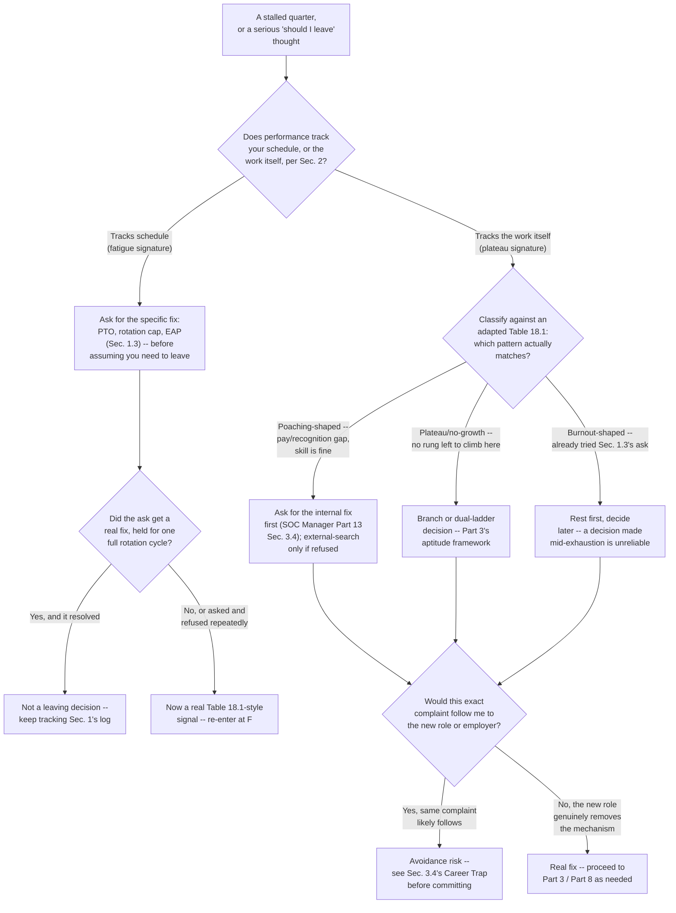

# Part 23 — Managing Your Own Burnout, Plateaus, and Career Pacing

## Why this part exists

**[CONCEPT]** SOC Manager's Operating Handbook, Part 17 — Burnout, Fatigue & Wellbeing and Part 18 — Attrition & Retention study the same territory this part covers, from the opposite chair. Part 17 gives a manager the circadian science behind rotation design, a burnout risk scorecard run on a monthly cadence across a team, and a mandatory disconnect policy after a major incident. Part 18 gives a manager a taxonomy for classifying a departure, a cost model for what replacing you actually costs, and a lever scorecard for which fix moves a resignation rate and which one only feels like it should. Both are real, useful machinery — and both describe something being done *to* you, or *about* you, by someone else, on a cadence someone else controls. This part answers a narrower, earlier question: what do you notice about your own week, on your own, before any of that organizational machinery has a reason to activate?

**[CONCEPT]** That gap matters because the two clocks rarely run at the same speed. A monthly scorecard is a lagging instrument by design — it needs a month of data before a trend shows up, and Part 17 §3.1 says as much directly about its own organizational leading indicators: they're still slower than the disengagement they're trying to catch. You have a faster instrument available: you're in the room every shift, and you know things about your own sleep, your own dread level walking into a specific queue, and your own reaction to an ambiguous ticket that no scorecard captures until it's already showing up in a metric. This part's job is teaching you to read that faster instrument honestly, before a manager's slower one catches up to what you already know.

**[CONCEPT]** Four questions structure the rest of this part, in the order you'll actually hit them: how do you notice your own disengagement before it becomes a resignation letter (§1); how do you tell a stalled quarter that's really fatigue apart from a stalled quarter that's really a skill or judgment plateau (§2); how do you decide whether a lateral move or a specialization change is the real fix or a well-disguised way to avoid the harder problem (§3); and how do you build a continuing-education habit sturdy enough to survive a job change instead of resetting to zero every time you switch employers (§4). None of this replaces the organizational programs SOC Manager's Handbook Parts 17 and 18 own — the rotation policy, the pay-band correction, the dual-ladder design, the mandatory disconnect window. Those stay exactly where that book put them, cited here and never rebuilt. What this part owns is what you do with what you notice, days or months before any of that machinery has enough data to notice it for you.

## 1. Reading your own signals before someone else has to

### 1.1 Why a manager's scorecard is always the slower instrument

**[MINDSET]** SOC Manager's Operating Handbook, Part 17 — Burnout, Fatigue & Wellbeing, §3.2 gives a manager a burnout risk scorecard: overtime hours over a trailing 30 days, PTO days used against what's accrued, unplanned absences, on-call page frequency, a QA-score trend read over 3 consecutive months. Every one of those rows is a real signal, and every one of them is also, structurally, a lagging one — none of them can fire until the underlying pattern has already been running long enough to leave a paper trail. You don't have to wait for the paper trail. You already know, this week, whether Sunday night has started producing a specific knot in your stomach that Wednesday night doesn't, or whether you've caught yourself opening a job board during a slow stretch on shift for the third time this month. Those aren't yet metrics. They're the same information a metric will eventually contain, just a month or two earlier and only visible to you.

**[MINDSET]** SOC Manager's Handbook Part 18 — Attrition & Retention, §2.3 gives a manager a second tool for closing the same gap: the stay interview, a short structured conversation with someone who has no plans to leave, asking what would make them look at other openings and what's kept them through a hard week recently. Nothing stops you from running that exact conversation on yourself, on a fixed quarterly cadence, without waiting for a manager to schedule it. The two fixed questions worth asking yourself, in writing, are the same ones Part 18's own field test uses: what's the one thing that would make you actually start looking, and what's kept you here through the last genuinely hard week. Write both answers down. A written answer from three months ago is a real baseline to check a new answer against; a felt sense you're reconstructing from memory under stress is not.

> **Analyst's Note**
> Keep a running, private note — a single page is enough — with one line added every couple of weeks: a number from 1 to 10 for how the week felt, plus one sentence on why. Six months of that note is a better self-diagnostic than a single retrospective conversation with yourself on a bad day, because it separates a genuinely bad week from a genuine trend the same way Part 17 §3.1's leading-indicator logic does for a manager watching a whole team. A retrospective memory of "this year has been rough" is unreliable in exactly the way a running log isn't.

### 1.2 A self-tracked version of the scorecard

**[MINDSET]** Table 23.1 in §3 below is this part's main self-diagnostic worksheet, but before you can use it, you need raw material to feed it — the same categories of evidence Part 17's Table 17.2 pulls from a team's HR and scheduling systems, just self-observed instead of pulled from a dashboard you may not have access to anyway. Four numbers are worth tracking on your own, monthly, whether or not your SOC formally tracks them for you: hours worked beyond your scheduled shift in the trailing 30 days, PTO days actually taken against what you've accrued in the trailing 6 months, how many times in the last 2 weeks you've caught yourself dreading a specific queue or shift before it starts, and whether your own sense of your reasoning quality on an ambiguous ticket has felt sharper, flatter, or worse over the last 90 days compared to the 90 days before that.

**[MINDSET]** None of these four numbers is diagnostic alone, for the same reason Part 17 §3.2 says no single row on its own scorecard is diagnostic alone — an analyst who skips PTO to save days for a planned trip isn't in the same situation as one who skips it because the backlog waiting on return makes the time off feel like a cost. The value of tracking your own four numbers is the same as the value of the scorecard Part 17 builds for a manager: it gives you something concrete to interrogate in your own quarterly self-check, instead of a vague, unfalsifiable feeling that something's off.

> **Blind Spot**
> Part 17 §3.3 names a specific population its own scorecard structurally misses: the analyst who is burned out and still performing, who never uses PTO, never flags anything, and keeps every visible number flat through sheer discipline until they resign with no warning. Your own self-tracking has the identical blind spot, turned on yourself — if suppression is your actual coping strategy, you will honestly self-report "fine" on every one of these four numbers, because suppression doesn't feel like a lie from the inside. The fix Part 17 gives a manager for this — ask "what would make you actually take the time off you've been sitting on" instead of "are you okay" — works on yourself too. Ask yourself the specific, practical version of the question, not the general one that a suppression habit will answer on autopilot.

### 1.3 What to do with an honest answer

**[MINDSET]** If your own honest answer to the quarterly self-check in §1.1 is that something has shifted, the next move is not automatically a resignation, a lateral-move request, or a dramatic life change — it's a direct conversation with your own manager, using the specific language this book already gives you rather than a vague "I think I might be burning out." Part 17 §4.1 tells a manager what a real wellbeing program should offer: an enforced PTO minimum, access to a mental-health benefit that doesn't route through your own chain of command, and a rotation-exposure policy if a specific queue is the mechanism. You are entitled to ask for any of those three things directly, by name, before you've decided anything bigger — "I've been on the phishing queue for eleven of the last fourteen shifts and I want the rotation cap Part 17's own worked example describes" is a request a reasonable manager can act on immediately, and it costs you nothing to ask for it before assuming the only fix is somewhere else entirely.

## 2. Fatigue or plateau: telling the two apart from the inside

### 2.1 Why the two feel identical from a stalled quarter's inside

**[CONCEPT]** A quarter where nothing feels like it's clicking produces the same surface complaint whether the underlying cause is a sleep debt you've been carrying since a bad rotation started, or a genuine skill ceiling you've quietly hit and stopped pushing against. Both show up as the same words in your own head: this feels harder than it used to, I don't feel sharp, I'm not sure I'm actually getting better anymore. Treating both with the same fix is where this goes wrong. Rest fixes fatigue and does nothing for a plateau; a harder, more deliberate study plan fixes a plateau and does nothing for fatigue except add one more obligation on top of a sleep debt that needed rest, not more homework.

**[MINDSET]** The single most useful discriminator is whether the dip tracks your schedule or tracks the work itself, independent of when you're doing it. Fatigue is schedule-shaped: it gets measurably worse on the third and fourth night of a run, per the cumulative-sleep-debt pattern SOC Manager's Handbook Part 17 §1.4 documents from the manager's side, and it gets measurably better after two consecutive full nights off, whether or not you've studied anything new in between. A genuine plateau is work-shaped, not schedule-shaped: the same category of ambiguous ticket trips you up whether you're rested or not, and a weekend of good sleep with zero deliberate practice doesn't move it at all, because the ceiling isn't about how alert you are — it's about a specific piece of judgment or technique you haven't built yet.

### 2.2 The fatigue signature, checked against your own schedule

**[MINDSET]** SOC Manager's Handbook Part 17 §1.1–§1.2 documents the mechanism behind why a night shift, or a run of consecutive nights, produces a real, physiological dip in judgment quality that has nothing to do with skill: the window of circadian low sits centered on roughly 2 a.m. to 6 a.m. regardless of how motivated or well-trained the person in the seat is, and Part 17 §1.4's own composite, illustrative worked case (SOC Manager's Handbook `CASE-1701`, not a validated benchmark, but consistent with general shift-work ergonomics research) shows a QA-sampled miss rate that climbed from about 3% on the first night of a run to over 9% by the seventh, then returned to baseline once the run was capped at four consecutive nights. If your own stalled quarter maps onto a recent schedule change — a new rotation, more consecutive nights than you've worked before, a stretch with no full weekend off — the fatigue explanation should be your working hypothesis first, not last, because the mechanism behind it is well documented and it resolves with rest on a timescale of days, not months.

### 2.3 The plateau signature, checked against the work itself

**[SENIOR/SPECIALIST]** A genuine plateau has a different signature, and Part 11 — Making the Jump to L2: Closing the Judgment Gap already names the version of it that shows up earliest in a career: judgment is the axis that most often hides behind a stalled review, because it's the hardest one to self-assess honestly from the inside. The senior-tier version of the same problem is quieter and easier to miss, because by the time you're a few years in, you've built enough pattern-matching speed to dispose of most tickets quickly and correctly without the underlying reasoning actually improving — which is exactly the mindset failure this book's own Part 22 — The Analyst Mindset names as pattern-matching to lucky guesses, recognized organizationally through the judgment axis SOC Manager's Handbook Part 10 defines, from the individual side of correcting it. A plateau feels, from the inside, less like difficulty and more like a flattening: the same categories of ticket that used to teach you something new now resolve on reflex, and the last genuinely hard case you can remember learning something from was longer ago than it should have been.

**[SENIOR/SPECIALIST]** SOC Manager's Handbook Part 16 — Performance Management & Coaching owns the organizational side of a related ambiguity, though its own diagnostic runs a different split than this section's: before a manager reaches for coaching at all, Part 16 §3 makes them rule out a training gap (the whole onboarding cohort shares the same blind spot) and a broken, untuned rule (Part 16 §3.5) as the actual cause of a decline, using the same "cheapest, fastest disqualifying test first" logic this book applies elsewhere. Part 16 itself never names wellbeing as a fourth branch — that's the gap Part 17 §2.2's Figure 17.1 fills from the other direction, routing a decline that isn't queue-specific and isn't a skill or training gap back toward a wellbeing question instead of a performance one. You have the advantage of running a version of that same elimination on yourself — checking whether a dip is schedule-shaped (fatigue) or content-shaped (a genuine plateau, per §2.3) — weeks before a manager would ever see enough data to run it on you, and a self-diagnosis you bring to a 1:1 already labeled correctly is a fundamentally different conversation than one where your manager has to guess first.

> **Ground Truth**
> "If the job feels harder than it used to, something's wrong with you" is the assumption that makes this whole self-diagnosis harder than it needs to be, and it's wrong often enough to name directly: a job that feels harder this quarter than it did a year ago is frequently the correct, expected result of a schedule change, a noisier queue, or genuine accumulated sleep debt — not evidence of a skill regression. Confusing "this got harder" with "I got worse" sends people chasing a study plan to fix a problem that two consecutive nights of real sleep would have resolved on its own.

> **Field Test — rested-versus-fatigued reasoning check**
> **Setup:** Pull two or three already-resolved, genuinely ambiguous tickets from your own recent queue — the same kind of material Part 11's own field test uses. You'll need one attempt made during a normally scheduled, reasonably rested stretch and one during the tail end of a demanding run of shifts.
> **Action:** Without looking at the original resolution, write out your reasoning and disposition for each ticket, timed at 10 minutes per ticket, once rested and once fatigued, at least a week apart.
> **Expected result:** If your reasoning quality and confidence differ noticeably between the two attempts — sharper, faster, more decisive when rested — that's real fatigue-signature evidence, and the fix is rest and a schedule conversation, not more study. If your reasoning is flat and equally uncertain in both conditions, on the same category of ticket, that's plateau-signature evidence: rest won't move it, and the honest next step is deliberate practice on that specific gap, the kind Part 12 and Part 14's study plans already build toward.

## 3. Lateral move, specialization change, or avoidance?

### 3.1 The same decision, three different real causes

**[CONCEPT]** Once §1 and §2 have told you something is genuinely off and roughly why, the next question is what to do about it — and "leave" covers at least three real, different situations that look identical from the outside and require opposite fixes. Figure 23.1 below routes the whole self-assessment from §1 and §2 through to this section's decision, so the diagnosis and the fix stay connected instead of the fix getting chosen on vibes after the diagnosis has already been done carefully.



**Figure 23.1 — Self-assessment routing: fatigue, plateau, or avoidance, through to a decision.** *CONCEPTUAL.* Illustrates the routing logic this part builds across §§1–3, connecting the fatigue-versus-plateau diagnostic in §2 to the leave-or-stay decision in §3 through a single self-scoring worksheet path; it is a design for reasoning through the decision, not a capture of any individual's actual case. `FIG-2301`.




### 3.2 The self-scoring worksheet: fatigue, plateau, or avoidance

**[MINDSET]** The worksheet below (`TMPL-2301`) turns §2's fatigue-versus-plateau signature and §3.4's avoidance test into a single seven-row self-score you can fill out honestly in about 10 minutes, before deciding which branch of Figure 23.1 you're actually on. Answer each row for the specific situation prompting a "should I leave" thought, not for the job in general — a worksheet answered in the abstract tells you nothing a worksheet answered about one real, current complaint won't tell you better.

TEMPLATE — Fatigue vs. plateau vs. avoidance self-scoring rubric, permanent ID `TMPL-2301`

```text
For each row, write down which column's description matches your honest, current experience --
not the answer that would be most convenient or most flattering to write down.
```

The table below is the worksheet itself: seven observable signals, and how each one tends to read under each of the three explanations.

**Table 23.1 — Fatigue vs. plateau vs. avoidance self-scoring rubric.** Use this to classify a specific "should I leave" thought before acting on it; the column that collects the most honest matches is a working hypothesis for Figure 23.1's routing, not a settled diagnosis.

| Signal | Reads like fatigue | Reads like a genuine plateau | Reads like avoidance |
|---|---|---|---|
| Rested-vs.-fatigued reasoning (§2's field test) | Sharper and faster once rested | Flat whether rested or not | — |
| Which ticket types trip you up | Any category, tied to a bad stretch | The same narrow category, every time | — |
| A full week of real rest, imagined | Feels like the actual fix | Little real change either way | Genuine relief, but the complaint still nags underneath |
| The identical work, different employer, imagined | Feels beside the point — rest is the variable | Feels like the same ceiling would follow you | Feels like a clean escape |
| The one complaint driving "should I leave" | Names a specific schedule or queue | Names a specific skill or ambiguity gap | Vague, and shifts when you ask "specifically what" |
| Your own 90-day reasoning trend (§1.2) | Tracks shift pattern, recovers on days off | Flat regardless of rest | Flat now, then "improves" the moment a move feels decided |
| A trusted peer's cold read of your reasoning, rested | Reads as normal | Reads as behind where it used to be | Reads as fine — they don't see what's driving the urge to leave |

**[MINDSET]** Score honestly, then look at which column collected the most matches — that column is a working hypothesis for Figure 23.1's routing, not a verdict. A worksheet filled out in ten minutes carries the same limitation Part 3's own branch-fit worksheet names for itself: it measures how you currently read your own situation, not how that reading holds up once tested. Run it alongside the direct ask in §1.3 and the field test in §2's own §2.2–§2.3 before treating a single pass through this table as settled.

### 3.3 Adapting the attrition taxonomy to diagnose yourself

> **Cross-Book Pointer**
> This part does not own the organizational cost model, the pay-band-correction mechanics, or the dual-ladder design process behind any of the fixes below — SOC Manager's Operating Handbook, Part 18 — Attrition & Retention owns all of that, including Table 18.1's five-pattern taxonomy (burnout-driven, competitor poaching, plateau/no-growth, shift-burden, performance-managed-out) built for a manager classifying someone else's departure. What this section does is turn that same taxonomy around and use it to classify your own situation before you act on it, which the organizational version was never built to do for you directly.

**[MINDSET]** Three of Table 18.1's five rows map cleanly onto a self-diagnosis, and matching yourself honestly against them before deciding to search externally changes what the right first move actually is. If your situation reads as burnout-shaped — the fatigue signature from §2.2, plus a specific queue or rotation you've already tried to get changed per §1.3 — the correct first move is still the ask, held for a full rotation cycle, not a resignation; Part 17 §2.1 is explicit that a rotation fix costs a manager nothing in engineering time and can land as a scheduling change within the week, which means refusing it repeatedly is a real, telling signal in its own right, not a reason to assume nothing can be done. If it reads as poaching-shaped — your skill and judgment are genuinely fine, and the honest complaint is that the internal ladder is slower or less generous than what the market is visibly paying for the same work — Part 18 §1.2 already names the mechanism from the organizational side: an internal path that's visibly capped or delayed relative to demonstrated readiness loses people to a competitor that doesn't have to out-pay a fair ladder, only a slow one. The individual-side move is to ask for the internal correction directly and specifically before testing the market, because asking costs you nothing and a market test you didn't actually need to run burns goodwill and time either way.

**[SENIOR/SPECIALIST]** If it reads as plateau-shaped — the work-tracking signature from §2.3, and a specific sense that there's no more room to grow in your current lane — this is exactly the fork this book's own Part 3 — Choosing Your Path: A Specialization Decision Framework exists to route you through, using aptitude signals rather than title appeal to choose a real direction instead of the first available exit. A specialization change chosen for the right reason, using Part 3's field tests before committing a year of study, is a genuine fix for a genuine plateau. A specialization change chosen because it's simply *different from what's gone flat* — with no real aptitude signal checked first — is the same mistake Part 3's own `CASE-0301` autopsy already documents: a senior analyst who chose the threat-hunter branch mainly because it was visible and different, discovered six months in that the actual daily texture of the work didn't fit, and had to restart.

### 3.4 The avoidance trap, and how to test for it before you commit

**[MINDSET]** The hardest of the three to self-diagnose honestly is avoidance: a decision to leave a role, a team, or an employer that feels, from the inside, exactly like a lateral move or a specialization change, but is actually a way of changing the scenery around a problem that will follow you unchanged into the new setting. The test that actually separates the two is simple to state and uncomfortable to run honestly: write down the single specific complaint driving the decision, then ask whether that exact complaint — not a softened version of it — would still be true in the new role or the new employer. "I'm tired of this specific noisy queue" is likely to resolve with a genuine rotation or employer change. "I feel like I've stopped learning anything" is not going to resolve just because the badge photo changes, if the actual cause is that you stopped seeking out ambiguous cases on purpose, the exact habit Part 9 — Surviving and Excelling as an L1 Analyst and Part 11 both build early and this part's §2.3 plateau signature names later.

> **Career Trap**
> Changing employers or teams every 12 to 18 months, right around the point where a stretch of real, difficult, ambiguity-tolerant work would start producing the senior-level evidence Part 14's study plan and Part 3's branch portfolios are both built around, is a specific and costly pattern: it resets the clock on exactly the kind of evidence — a tracked false-positive rate, a completed hunt record, a shadow-coaching log — that only accumulates with sustained ownership over real time. Each individual move can look, in isolation, like reasonable career management; the pattern across several of them, each one landing right before the harder, evidence-building phase of the work would start, is the signature this Career Trap names. The fix: before accepting or seeking a move, check honestly against §3.4's test whether the specific complaint driving it would survive the move — and if a pattern of near-identical timing keeps repeating across multiple past moves, treat that repetition itself as data about avoidance, not as a string of unrelated bad-fit jobs.

> **Career Autopsy — "a fresh start instead of a fixed rotation" (`CASE-2301`, composite case example)**
>
> **The decision:** A senior L2 analyst, seventeen months into a rotation-heavy queue with three unanswered requests to cap the consecutive-night runs described in Part 17 §1.4, accepted an external offer at a different SOC — same tier, similar pay, "a fresh start" cited as the main reason in the exit conversation.
>
> **Why it seemed reasonable:** The new employer's job posting emphasized a "modern, well-staffed" operation, the interview loop felt energetic and well-organized, and after seventeen months of an unresolved scheduling complaint, any change felt like it had to be an improvement over staying somewhere the specific ask kept being deprioritized.
>
> **How it failed:** The new SOC ran a comparable rotation model with the same lack of a formal consecutive-night cap, because the underlying problem — an unaddressed staffing gap that made rotation caps expensive to honor — was an industry-common pattern, not something specific to the first employer. Within four months, the same fatigue signature from §2.2 reappeared on the new team's queue, and the analyst had also lost seventeen months of continuous tenure that would have supported a stronger case for an internal L3 nomination at the original employer, per the evidence-accumulation logic Part 11 and Part 14 both build.
>
> **The fix:** Before accepting the new offer, the honest §3.4 test would have surfaced that the specific complaint — no enforced night cap — was never actually asked about in the new interview loop, despite Part 8's own interview-prep guidance to ask exactly this kind of shift-pattern-and-coverage question before accepting an offer. On the second search, six months later, the analyst asked the specific question directly in two interview loops, eliminated one otherwise-appealing offer on the answer alone, and accepted the other only after confirming a real four-night cap was enforced, not merely described as a policy.

**[LEAD/MANAGEMENT TRACK]** One specific version of the avoidance trap deserves its own naming: chasing a team-lead or management seat as an escape from a plateau or from front-line fatigue, rather than because coaching genuinely appeals to you. Part 19 — The Team Lead Transition: Testing Your Own Aptitude Before You Ask for the Seat builds the honest self-test for this directly — does watching someone else work through a problem more slowly than you would feel satisfying or corrosive — and the same SOC Manager's Handbook `CASE-1301` autopsy Part 19 discusses documents the organizational cost of skipping that check. The individual cost is just as real: a management seat taken to escape a queue you're tired of, rather than because coaching energizes you, tends to reproduce the exact same disengagement one layer up, on a harder-to-reverse title.

**[INTERVIEW PREP]** Once §3.3's routing and §3.4's honesty test point toward a real external or internal move rather than avoidance, Part 8 — Interview Prep From the Candidate's Chair becomes the next stop, and its own guidance on asking about shift pattern and on-call reality before accepting an offer is exactly the question this section's `CASE-2301` shows getting skipped the first time around. Don't skip the diagnosis in §§1–3 to get there faster; a well-prepared interview for the wrong move still lands you in the wrong move.

## 4. A continuing-education habit that survives a job change

### 4.1 Why employer-provided training resets to zero

**[STUDY PLAN]** Every SOC eventually offers some version of a training budget, a vendor certification voucher, or an internal lunch-and-learn series, and all of it shares one structural weakness worth naming before you build a habit around it: it belongs to the employer, not to you, and it evaporates the day you change jobs. A course half-finished on an old employer's LMS, a lab environment hosted on infrastructure you lose access to the moment your badge is deactivated, a mentor relationship that quietly fades once you're no longer on the same team — none of it survives the transition, and a study habit built entirely on top of employer-provided infrastructure resets to zero at exactly the moment career pacing matters most: the first few months in a new role, when you have the least context and the most to prove.

**[STUDY PLAN]** The fix is a standing, employer-independent personal lab `[HOME LAB — companion volume not yet written]`, sized to survive being unemployed, underemployed, or between jobs for a stretch, and kept running continuously rather than rebuilt fresh each time you need it for an interview or a study sprint. A standing personal lab that meets this bar doesn't need to be large: one low-cost VPS or a spare machine running a free-tier SIEM (Wazuh, Elastic's free tier, or Splunk Free), one or two log sources you control directly (a Sysmon-instrumented Windows VM, an `auditd`-instrumented Linux VM), and a personal git repository holding every detection rule, hunt writeup, and incident narrative you've ever built on it — the same detection-as-code habit Part 15 builds toward for a specific branch, applied here as general-purpose, employer-independent infrastructure rather than branch-specific portfolio work. Budget roughly $5 to $15 a month if you host it on a cheap VPS, or nothing beyond electricity if you run it on hardware you already own; the goal is a lab that keeps running through a 2-week gap between jobs, not one elaborate enough that letting it lapse for a quarter feels like starting over.

> **Analyst's Note**
> Your first 2 weeks at a new job are usually the least productive study time you'll have all year — new badge access is slow, new tool permissions take time to provision, and you're absorbing more institutional context than actual technical content. That dead time is exactly when a standing personal lab pays for itself: you can keep running a hunt, tuning a detection, or working through a CTF on infrastructure that doesn't care whose payroll you're on this week. An analyst whose only lab access lived inside the old employer's environment has genuinely nothing to work on during that gap; an analyst with a standing personal lab just keeps going.

### 4.2 A habit, not a binge

**[STUDY PLAN]** Table 23.2 sequences the specific activities worth a recurring time budget, distinguishing what actually travels with you across a job change from what doesn't, so a study plan built around it doesn't quietly depend on infrastructure you're about to lose.

**Table 23.2 — A continuing-education habit that travels with you (`TMPL-2302`).** Use this to build a recurring weekly or monthly time budget that doesn't depend on any single employer's training program; check the last column before counting an activity as part of your standing habit rather than a one-time employer perk (CONCEPTUAL SAMPLE — illustrative time budgets, not a validated benchmark).

| Activity | Typical Time Budget | What It Builds | Survives a Job Change? |
|---|---|---|---|
| Standing personal lab maintenance (§4.1) | 1–2 hours/week | Ongoing technical evidence, a running detection/hunt log | Yes — infrastructure you own |
| One CTF or guided challenge | ~3 hours/month | Applied technique practice under a real time box | Yes — self-directed |
| Community engagement (a Discord/Slack detection-engineering or SOC community, a local chapter) | 1 hour/week | Pacing signal, peer calibration, informal job-market awareness | Yes — your own membership |
| A conference or local meetup | 1 day/quarter | Exposure to what's changed since you last checked | Yes — attendance is personal |
| Employer-provided training budget or vendor course | Varies | Deep, often vendor-specific skill | No — tied to current employer |
| Certification study, sequenced per Part 6 | Bounded, per Part 6's sequencing table | A signal matched to a specific next career move | Partially — the credential travels, the study plan's timing doesn't |

**[STUDY PLAN]** The rows worth protecting first are the four marked "Yes" — they're the ones a job change can't take away from you, and they're also, not coincidentally, the ones that build the most durable evidence: a lab you've kept running for 2 years produces a materially different portfolio conversation than one rebuilt from scratch 3 months before every job search. Certifications, per this book's own Part 6 — Certifications: What Actually Matters, and When, remain a real and useful signal at specific career stages, but their *timing* is tied to the next move you're making, not to a habit that runs independently of your employment status — treat Table 23.2's last row as bounded and occasional, not as the backbone of your continuing-education plan.

### 4.3 Communities and conferences as pacing tools, not vanity metrics

**[MINDSET]** A community or a conference earns its place in Table 23.2 for a reason distinct from technical content: it's one of the few reliable, low-cost checks against isolation, and isolation is a real, underrated contributor to the fatigue signature §2.2 describes. An analyst who only ever compares their own pace against their current team's internal expectations has no outside reference point for whether "this feels hard right now" is normal or a genuine warning sign; a community — even an informal one, a Discord server for detection engineers, a local BSides-style meetup — gives you a second, independent read on the same question, and a peer group who will tell you plainly that everyone's queue looked like that in month 4 of a new rotation, or that no, actually, that specific workload sounds unusual, worth raising with your manager.

**[MINDSET]** Attending a conference or joining a community and treating that attendance itself as the accomplishment is the trap worth naming directly: a badge scan and three sessions watched passively build almost no durable evidence and cost a full day, while the same day spent running one focused CTF challenge or writing up one hunt from your own lab produces something you can point to later. Use conferences and communities for the pacing and calibration value §4.3 names here, not as a substitute for the harder, quieter habit-building work in §4.1 and §4.2 — they're a complement to a continuing-education habit, not the habit itself.

## 5. Pacing the whole career, not just this quarter

### 5.1 Three failure modes, one discipline

**[MINDSET]** Burnout, a genuine plateau, and avoidance dressed up as ambition are three different failure modes with three different fixes — rest, deliberate practice, and an honest test of whether the specific complaint would actually follow you — and the discipline underneath all three is the same one this part opened with: noticing your own signal early enough to act on the right fix instead of the first available one. A resignation letter, a lateral-move request, and a certification-study binge are all real, sometimes correct responses to a real problem. Each one is also, per §§2–4, a wrong and costly response to the wrong problem often enough that the diagnosis has to come first, every time, even when the diagnosis is inconvenient or slower than acting on instinct would be.

**[MINDSET]** None of the four numbers in §1.2, the fatigue-versus-plateau signature in §2, or the avoidance test in §3.4 is a one-time check. Career pacing, treated honestly, is a recurring practice — the same quarterly self-check this part opens with, run again and again across years, not a framework you apply once at a moment of crisis and then set aside. The reader who runs Figure 23.1's routing logic once, during one bad quarter, and never again has built a diagnostic tool and then left it in a drawer; the reader who runs it every quarter, whether or not anything currently feels wrong, catches the next stalled quarter closer to its start than its end.

> **What Would Change My Mind**
> This part treats the fatigue-versus-plateau discriminator in §2.1 — whether a dip tracks your schedule or tracks the work itself, independent of when you do it — as a reliable enough signal to act on before assuming a costlier fix like a lateral move or a specialization change. If a reader ran §2's rested-versus-fatigued field test honestly across several genuinely stalled quarters and found the two signatures reliably indistinguishable from the inside — reasoning quality just as flat when well-rested as when fatigued, with no real difference showing up regardless of which underlying cause was later confirmed by an actual schedule or workload change — that would undercut this part's central discriminator, and the guidance in §2 should shift toward treating a longer observation window, rather than a single rested-versus-fatigued comparison, as the minimum bar before trusting a self-diagnosis either way.

### 5.2 Where this hands off

**[CONCEPT]** This part gave you four things: a way to read your own disengagement signal faster than any organizational scorecard will, a discriminator for telling fatigue apart from a genuine plateau before choosing a fix, a taxonomy adapted from the organizational side for classifying your own "should I leave" moment honestly, including a direct test against avoidance, and a continuing-education habit built on infrastructure that survives a job change instead of resetting with one. It deliberately left the rotation policy, the wellbeing program design, the pay-band correction mechanics, and the dual-ladder design to SOC Manager's Operating Handbook Parts 17 and 18 and Part 13 §3.4, cited throughout rather than rebuilt here. Part 24 — Building Your Own Career Roadmap: A Self-Audit and Milestone Plan is where the self-diagnosis this part teaches gets folded into a structured, dated plan alongside the study plans, portfolio work, and self-assessment checkpoints from every earlier part in this book — treat this part's quarterly check as the recurring input that plan should keep getting re-run against, not a one-time verdict that plan can be built on and then forgotten.

---

**Cross-references:** This part assumes Part 3 — Choosing Your Path: A Specialization Decision Framework (the aptitude-based branch decision §3.3 routes a plateau-shaped self-diagnosis into), Part 6 — Certifications: What Actually Matters, and When (the sequencing table §4.2's Table 23.2 defers to), Part 11 — Making the Jump to L2: Closing the Judgment Gap (the judgment-axis self-assessment §2.3's plateau signature builds on), and Part 22 — The Analyst Mindset (the pattern-matching-to-lucky-guesses failure mode §2.3 names). It points forward, within this book, to Part 8 — Interview Prep From the Candidate's Chair (§3.4's shift-pattern interview question), Part 9 — Surviving and Excelling as an L1 Analyst and Part 14 — The Senior-Analyst Study Plan and the Portfolio That Earns a Branch Choice (the evidence-accumulation cost of the job-hopping Career Trap in §3.4), Part 15 — Becoming a Detection Engineer (the detection-as-code habit §4.1 generalizes), Part 19 — The Team Lead Transition (the coaching-aptitude self-test §3.4 warns against skipping), and Part 24 — Building Your Own Career Roadmap (where this part's recurring self-check feeds a dated plan). Outside this book, it cites SOC Manager's Operating Handbook, Part 13 — Career Ladders & Promotion Criteria (§3.4's dual-ladder design), Part 16 — Performance Management & Coaching (the skill-gap/training-gap/broken-process diagnostic §2.3 borrows the elimination logic from, without adopting its actual three-way split), Part 17 — Burnout, Fatigue & Wellbeing (the circadian mechanics, rotation caps, and burnout scorecard this part's self-tracking in §1 and §2 adapts throughout), and Part 18 — Attrition & Retention (the five-pattern attrition taxonomy §3.3 turns into a self-diagnostic, the poaching mechanism §1.2 grounds the ask-before-testing-the-market move in, and the stay-interview format §1.1 borrows).
