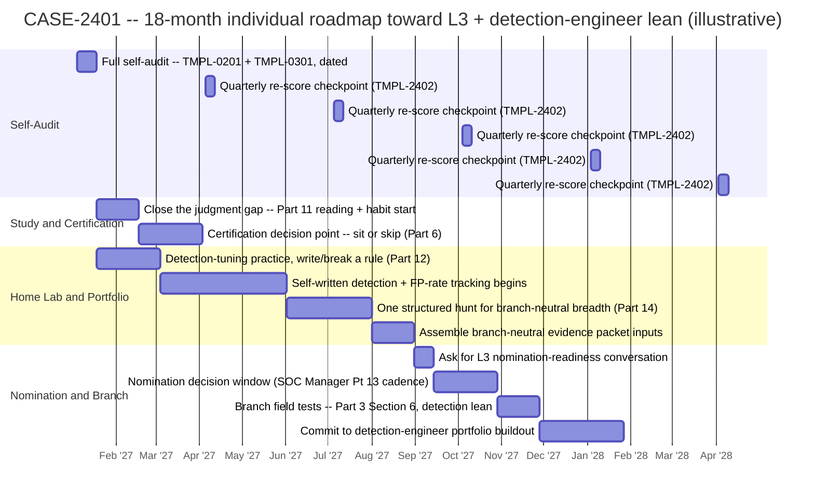
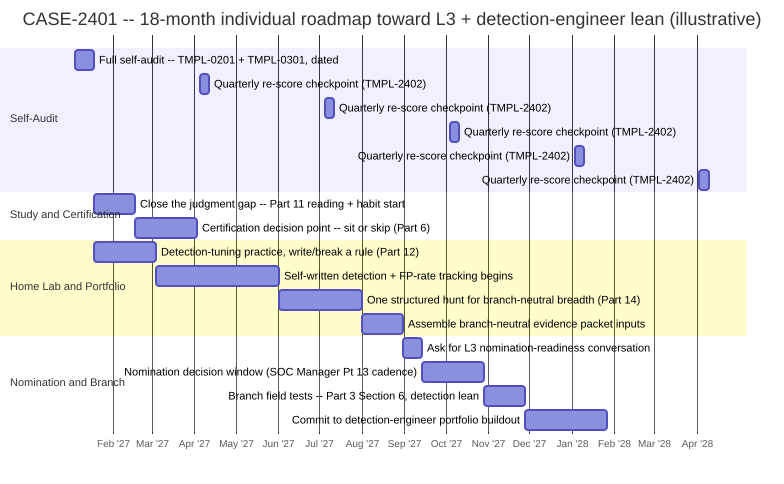

# Part 24 — Building Your Own Career Roadmap: A Self-Audit and Milestone Plan

## Why this part exists

**[CONCEPT]** Every earlier part in this book handed you one lever and told you how to pull it well: how to self-score against the four axes (Part 2), how to test your own branch fit (Part 3), what to build in a home lab at each tier (Parts 5, 10, 12, 14), which certification is actually worth a study cycle (Part 6), how to build a story bank (Part 8), and how to pace yourself without burning out (Part 23). None of them answer the question you're actually left holding once all of that exists as separate worksheets and habits: in what order, over the next 12 to 24 months, given a fixed number of hours outside your shift and a review cycle you don't control. A roadmap is not a longer to-do list stapled from eight earlier chapters. It's a sequencing decision under three real constraints — your own time, your organization's review cadence, and the finite attention of the specific people whose hour you need to generate real evidence.

**[CONCEPT]** *SOC Manager's Operating Handbook*, Part 33 — The Next Twelve Months: Building a SOC Roadmap answers this same sequencing question from the opposite chair: how a manager sequences hiring, tooling, training, and process investments against a budget and a hiring pipeline that can't move faster than it actually moves. This part does not re-derive that organizational machinery — it does not decide when your SOC opens a requisition, when a promotion committee convenes, or how a maturity assessment gets scored. What it owns is the individual-scale mirror: how you personally sequence your own study, your own home-lab builds, your own portfolio work, and your own self-audit checkpoints into one dated plan tied to a specific next rung or branch, built from a self-audit against the same four competency axes *SOC Manager's Operating Handbook*, Part 10 — Competency Models & Skills Matrices uses to evaluate you.

**[MINDSET]** The horizon below is capped at 12 to 24 months for the same reason *SOC Manager's Operating Handbook* Part 33 caps its own roadmap at 12 months: a shorter window is honest about what you can actually control, and a longer one invites the same compounding uncertainty that part names organizationally — a team reorg, a shift-pattern change, a move to a new city, a promotion cycle frozen for a quarter you didn't see coming. Eighteen months is long enough to carry a self-written detection through a tracked false-positive rate, a documented hunt, and a real nomination conversation. It is not long enough that one unpredictable event should invalidate the whole plan rather than one quarter of it — §8 builds the habit that keeps that difference from coming down to luck.

> **Cross-Book Pointer**
> This part does not explain how a SOC manager sequences a hiring wave against a tooling PoC, how a maturity assessment gets scored, or how a budget model absorbs a headcount line. *SOC Manager's Operating Handbook*, Part 33 — The Next Twelve Months: Building a SOC Roadmap owns that organizational sequencing problem in full, from the manager's chair. Read it once for the shape of the argument — sequencing is a harder problem than prioritization, and the resource that actually breaks a plan is rarely the one tracked on a spreadsheet — then come back here, where the same shape gets rebuilt around your own hours, your own evidence, and your own next rung instead of a headcount number.

## 1. A roadmap is a sequencing decision, not a longer study list

**[CONCEPT]** Prioritization asks which gap matters most. Sequencing asks a harder question: given that your judgment axis, your branch choice, and a stale home-lab project all matter, which one has to close first because something else depends on it, which ones can run in the same quarter without competing for the same scarce hour, and which one has to wait even though it's important, because starting it now would only produce a rushed version. Knowing that judgment is your weakest axis and knowing when to actually work on it are two different pieces of information, and confusing them is how a technically sound self-assessment still produces a plan that collapses the first time real life — a rough month, a schedule change, a certification exam you already paid for — collides with it.

**[MINDSET]** A study plan that lists every gap from every earlier part's worksheet, in no particular order, "for this year," isn't a roadmap. It's a wish list with a due date attached, and it fails for the same reason a SOC's wish-list budget fails a CFO review: nothing on it says what happens first, what depends on what, or what gets deliberately deferred. The rest of this part builds the actual sequencing discipline — which of your own gaps closes this quarter, which waits until next, and why that order isn't arbitrary.

## 2. The three resources your own roadmap actually arbitrates

**[CONCEPT]** *SOC Manager's Operating Handbook* Part 33 §1.1 names three scarce resources a manager's roadmap arbitrates: money, hiring throughput, and the bandwidth of a handful of senior people whose hours every new program consumes. Your own roadmap arbitrates three resources too, and only one of them looks anything like the organizational version.

**[MINDSET]** The first is your own weekly hours outside your shift — not unlimited, and rarely the 5-hours-a-week textbook figure a generic study-plan template assumes once you account for a rotating shift pattern, a rough month, or a life outside the SOC that also needs attention. The second is your organization's own review cadence: when a nomination window actually opens, how often a promotion committee convenes, whether your SOC runs *SOC Manager's Operating Handbook* Part 13's quarterly cycle or something looser — a calendar you don't set and can't accelerate by working harder, the direct individual equivalent of the hiring-throughput constraint that part names on the organizational side. The third, and the one most personal study plans never name explicitly, is the attention of the small number of people whose hour your evidence actually depends on: a mentor willing to review your hypothesis log, a team lead willing to run the calibration check in Part 2 §4.3, a peer willing to sit through a mock escalation. That attention is exactly as finite, person by person, as the senior-analyst bandwidth *SOC Manager's Operating Handbook* Part 33 §1.1 names as the resource most roadmaps forget to name at all — it just shows up one favor at a time instead of one program launch at a time.

> **Ground Truth**
> A "career roadmap" as most study-advice content describes it is a fixed timeline — 6 months to L2, 18 months to senior, 3 years to team lead — presented as though the only variable is how hard you work. That framing is mostly wrong, for the same reason a SOC's own 12-month roadmap isn't a fixed sequence either: your organization's review cadence, not your own effort, sets the ceiling on how fast a self-audit turns into an actual title change, and a roadmap that ignores that ceiling just produces a plan that feels behind schedule through no fault of the person running it. Build the plan around your own controllable pace and the org's own cadence as two separate inputs, not one blended guess.

## 3. Start from a self-audit, not a wish list

**[STUDY PLAN]** Every earlier part in this book already handed you a self-scoring instrument. A roadmap's first real step isn't picking a study topic — it's pulling every one of those instruments into one dated snapshot, so the plan gets built against real evidence about where you actually stand instead of a guess about where you probably stand. The table below names each input, where it comes from, and which part of the roadmap it feeds.

The table below states what each self-audit input actually tells you and which track of your own roadmap it should drive — pull all of them before writing a single line of TMPL-2401 in §6.

| Self-audit input | Source | What it tells you | Feeds into |
|---|---|---|---|
| Four-axis worksheet (`TMPL-0201`) | Part 2 | Where you stand today on technical skill, tool proficiency, communication, and judgment, against *SOC Manager's Operating Handbook* Part 10's own anchors | Your single lowest-scoring axis becomes the roadmap's first dedicated study/portfolio item, per Part 2 §3's gate-not-average rule |
| Branch-fit worksheet (`TMPL-0301`) | Part 3 | Which of the five roads past senior analyst — detection engineer, threat hunter, incident responder, team lead, or staying a strong individual contributor — your actual aptitude signals point toward | Determines which branch-specific portfolio work (this book's Parts 15–18) the roadmap builds toward once a tier move is behind you |
| Home-lab build-readiness audit (`TMPL-0501` and its later-tier equivalents) | Parts 5, 10, 12 | Whether your existing lab evidence is real, current, and reviewed, or quietly stale | Decides whether the home-lab track starts a brand-new project or first refreshes one that's gone dark for more than 90 days |
| Should-I-sit-this-exam-now rubric (`TMPL-0601`) | Part 6 | Whether a specific certification is worth this cycle's study hours right now, or a distraction from stronger evidence | Decides whether a certification exam date anchors a quarter's study track, or whether that quarter skips certification study entirely |
| Ambiguous-call and hypothesis logs | Parts 2, 11 | Whether your judgment axis has real, dated evidence behind it, or just a general sense of confidence that's never been tested | Decides whether a nomination-readiness conversation is realistic this cycle, per §5 |
| Burnout/plateau self-diagnostic | Part 23 | Whether a stalled quarter is fatigue, a genuine skill plateau, or avoidance dressed up as busyness | Decides whether the next quarter compresses, holds steady, or pushes harder — see §8's pacing check |

**[MINDSET]** Notice what this table doesn't include: a study topic you found appealing, a certification a coworker mentioned, or a branch that sounded interesting in a conference talk. None of those are self-audit inputs. They're preferences, and a roadmap built from preference instead of evidence is the individual version of the wish-list budget that opened §1.

> **Career Trap**
> Copying a generic "path to SOC manager in three years" timeline from a forum post or a certification vendor's marketing page, and treating it as your own roadmap because the stages sound roughly right, skips the one step that makes a roadmap actually yours: a self-audit against your own current evidence. A borrowed timeline can't know your judgment axis is your real gap, that your last home-lab project has been dark for eight months, or that your organization runs promotion reviews twice a year rather than the generic timeline's assumed quarterly cadence. The fix: run every worksheet in the table above, dated, before writing a single line of your own plan — a roadmap built on someone else's evidence is a roadmap built on nothing.

## 4. Four personal levers and their sequencing constraints

**[STUDY PLAN]** *SOC Manager's Operating Handbook* Part 33 §2 sorts every organizational investment into four levers — hiring, tooling, training, process — each with a different lead time and a different natural forcing function: the thing that makes an initiative actually happen on schedule instead of quietly sliding into next quarter. Your own roadmap sorts into four levers too, and the same lesson holds: the levers with a built-in forcing function get done, and the ones without one are the first to get quietly dropped under real life's own pressure, unless the roadmap itself supplies the missing discipline.

The table below compares the four personal levers on lead time, what has to exist before each can start, and whether anything besides your own discipline forces it to happen on time.

| Lever | Typical lead time | What it depends on first | Natural forcing function |
|---|---|---|---|
| Self-audit & checkpoint | Days to fill out a worksheet; the habit itself is the real cost | The instruments in §3's table already existing and being dated | Weakest — nothing external forces a quarterly re-score; §8 builds the only discipline that will |
| Study & certification | Weeks of reading; an exam date, once registered, is fixed | A specific next-rung or branch target (Part 3), so study time isn't open-ended | Moderate — a scheduled, paid exam date is one of the only real external deadlines an individual roadmap has, the closest thing to Part 33's open requisition |
| Home-lab build | 1 to 12 weeks per project, per Part 5 §2's own sequencing table | The self-audit naming which axis or branch the project should target | Weak — no purchase order, no contract renewal date; a lab that slips a quarter costs you nothing visible until an interviewer or a reviewer asks about it |
| Portfolio / evidence generation | Ongoing and cumulative — weeks to months of logged reps | A live home-lab project or a real ticket queue to draw evidence from | Weakest of all until your organization's own nomination cycle arrives — at which point it becomes the strongest forcing function you don't control |

**[MINDSET]** The bottom two rows are where most personal study plans quietly fail, for the same underlying reason *SOC Manager's Operating Handbook* Part 33 §2 names for the process lever on the organizational side: a home-lab build and a portfolio log have no built-in mechanism forcing you back to them once a hard week on shift eats the hours you'd planned to spend. A certification exam date at least sits on a calendar with a cost attached to missing it. A hypothesis log with no exam date and no manager checking it can go quiet for months with nobody but you ever noticing — which is exactly why §8's quarterly checkpoint exists: to be the forcing function these two levers don't generate on their own.

## 5. Reading your own gap into a dated plan

**[STUDY PLAN]** Once §3's self-audit is complete, the real work starts: translating each named gap into a specific item with a lever, a lead time, a dependency, and a quarter — not a restated version of the worksheet's own language. "Improve my judgment axis" is a self-score, not a plan; "run the blind ambiguous-ticket drill from Part 2 §4.3 monthly for two quarters, with a peer calibration check at the end of quarter one" is a plan you can actually put a date on. The same translation applies to a branch signal, a stale lab, or a certification decision — a self-audit finding only becomes useful once it's rewritten as a named action with a start condition and an end condition.

**[SENIOR/SPECIALIST]** This translation step is also where *SOC Manager's Operating Handbook* Part 33 §3.1's "looks like X, is actually Y" warning applies at the individual scale. A stalled technical-skill score sometimes really is a technical-skill gap — and sometimes it's actually a tool-proficiency gap in disguise, because you understand the right hypothesis but can't build the query fast enough in your specific platform to test it before an interviewer or a reviewer moves on. Don't schedule a technical-skill study block against a gap that's really a tool-proficiency gap; the wrong axis absorbs the study hours and the real gap stays exactly where it was.

## 6. Worked example: an 18-month roadmap toward L3 and a branch lean

**COMPOSITE CASE EXAMPLE `CASE-2401`** — merges patterns from more than one L2 analyst's actual first formal roadmap; no single person is identifiable, and every date and figure below is illustrative.

### 6.1 The starting point

**[SENIOR/SPECIALIST]** An L2 analyst, 14 months into the tier, runs the full self-audit from §3. The four-axis worksheet (`TMPL-0201`) scores technical skill and tool proficiency as "meets bar," communication as "not yet tested" — plenty of solid escalations written, none of them saved past the week they closed — and judgment as "emerging," with a thin, undated hypothesis log and no record of ever narrating reasoning on an ambiguous call before learning the resolution. The branch-fit worksheet (`TMPL-0301`) from Part 3 shows a high edge-case-orientation score and a middling hypothesis-patience score, a pattern the worksheet's own routing table reads as "investigate detection engineer first," confirmed provisionally rather than settled. A home-lab build-readiness check finds the original L1-era lab (Part 5) still runs, but hasn't had a new detection added in over five months — stale by Part 5 §7's own 90-day standard. No certification has been sat since an entry-level one three years ago; the Part 6 rubric (`TMPL-0601`) says a mid-tier certification is a reasonable, non-urgent option this cycle, not a priority.

**[SENIOR/SPECIALIST]** That picture isn't four unrelated findings; it's one shape. A judgment axis with no dated evidence and a communication axis with nothing saved past the week it shipped both point at the same root cause — real work is happening on shift every day, and almost none of it is being captured as evidence anyone, including the analyst, could later audit. A roadmap for this starting point has to fix the capture habit before it can fix either axis's actual score.

### 6.2 The roadmap, quarter by quarter

**[STUDY PLAN]** The roadmap below sequences four tracks — self-audit, study/certification, home-lab/portfolio, and the nomination-and-branch track — against the constraint named in §2: the same one or two people (here, a team lead willing to run calibration checks, and a senior detection engineer willing to review a merged rule) are the limited resource, so asking both people for something heavy in the same month is avoided even though neither ask costs a dollar.





**Figure 24.1 — CASE-2401's 18-month personal roadmap, sequenced across self-audit, study, home-lab, and nomination tracks.** *CONCEPTUAL.* `FIG-2401`. Illustrates the sequencing logic in §6.2: the self-audit and study tracks start in the same month because neither draws on the same reviewer's time the other needs, the home-lab track's detection-and-FP-tracking project is deliberately given a full 90 days rather than compressed to look faster, and the nomination track doesn't open until the portfolio inputs actually exist — never in parallel with a certification exam in the same quarter. It is a structural model of one composite individual's roadmap, not a capture of any single real person's actual plan.

**[SENIOR/SPECIALIST]** The self-written detection with a tracked false-positive rate `[HOME LAB — companion volume not yet written]` is the roadmap's load-bearing home-lab item: write one detection against your own home-lab telemetry (per Part 5's ingestion build), deploy it, and log every false positive it throws over at least 4 weeks before treating the false-positive rate as real evidence — a single week's clean run proves nothing, the same caution Part 14's own false-positive-rate log (`TMPL-1401`) states directly. The one structured hunt in month 7 through month 9 isn't there because this analyst has committed to the hunter branch — the branch-fit worksheet already leans detection engineer — it's there because Part 14 §1 recommends building branch-neutral breadth before a branch choice hardens, so a detection-lean roadmap still carries one real hunt into the evidence packet rather than assuming the lean is a certainty months before any field test has actually confirmed it.

### 6.3 What actually moved, and what the roadmap left honestly unresolved

**[SENIOR/SPECIALIST]** By month 18, the judgment and communication axes both move from their starting scores to "meets bar," backed by a dated hypothesis log, a saved set of escalation drafts, and two completed rounds of the peer calibration check from Part 2 §4.3 — real, checkable evidence, not a self-reported improvement. The nomination conversation happens on schedule in month 11, and the L3 title change lands in month 13, two months later than the optimistic case because the team lead's calibration availability slipped a few weeks in month 10 — a normal, absorbable slip, not a re-scope. The detection-engineer branch lean gets its first real field test (Part 3 §6) in month 15, confirming the edge-case-orientation signal held up under a real 60-minute tuning drill, and the branch-specific portfolio buildout (this book's Part 15) begins in month 16, carrying into next year's roadmap rather than finishing inside this one.

**[MINDSET]** The certification track is the roadmap's deliberate non-event: the Part 6 rubric said "reasonable, not urgent," and by month 4 the analyst decides, in writing on their own copy of `TMPL-2401`, to skip it this cycle in favor of the home-lab track — not a failure to execute the plan, but the plan working exactly as intended. A roadmap that reports every lever moving forward on schedule, with no deliberate skip and no honest slip anywhere in it, should be read with more suspicion than one that names both, for the same reason *SOC Manager's Operating Handbook* Part 33 §8 gives on the organizational side: a plan that claims everything closed on schedule either got lucky or isn't telling the whole story.

## 7. Common individual sequencing failures

### 7.1 Overloading one quarter because nothing on it costs money

**[MINDSET]** An organizational roadmap collides when two initiatives funded from different budget lines still draw on the same senior people's hours in the same quarter, per *SOC Manager's Operating Handbook* Part 33 §6.1. Your own roadmap collides the same way, minus the budget lines to hide behind: a certification exam, a home-lab build, and two separate asks for a mentor's reviewing time can all look independent because none of them costs a dollar, right up until they all land on the same 6 weeks of your actual life.

**COMPOSITE CASE EXAMPLE `CASE-2402`** — merges patterns from more than one analyst's first attempt at a formal personal roadmap; no single person is identifiable, and all figures are illustrative.

> **Career Autopsy — "none of these cost money, so schedule them all this quarter"**
>
> **The decision:** An L2 analyst books a GCIH exam for the end of March, starts a new home-lab DFIR build the same month, and asks their team lead for a peer calibration check on their judgment axis in the same 4-week window — reasoning that since none of the three requires budget approval, there's no real reason not to run all three in parallel and look ambitious to a reviewer.
>
> **Why it seemed reasonable:** Each item individually fit inside a reasonable weekly hour budget on paper, and stacking visible progress across three tracks in one quarter felt like the fastest way to build a strong nomination packet.
>
> **How it failed:** The exam got a passing score but no real retained understanding — cramming replaced spaced review the moment the lab and the calibration ask both needed hours the exam prep had already claimed. The DFIR lab build stalled at week 2 and stayed stalled for four months afterward, because the only two free evenings a week were absorbed by exam study. The team lead's calibration check happened on schedule, but the hypothesis log it reviewed was thin and rushed, and it surfaced nothing the analyst could actually act on, because there hadn't been time to build real evidence before the check, only time to schedule it.
>
> **The fix:** Treat your own hours the way *SOC Manager's Operating Handbook* Part 33 §1.1 treats a manager's named senior people: write down, honestly, which weeks a study, lab, or evidence-review item will actually draw on, and stagger any two that land in the same weeks — regardless of the fact that neither one required anyone's budget approval. `CASE-2401`'s own roadmap in §6.2 deliberately keeps the certification decision point and the detection-and-FP-tracking build in different months for exactly this reason.

### 7.2 Letting the roadmap go stale after you build it

**[MINDSET]** A roadmap built carefully once and never re-checked against its own assumptions doesn't stay accurate by default. It drifts toward whichever track already has a forcing function — per §4's table, that's the certification exam with the fixed date, never the home-lab build or the portfolio log — and nobody decides that drift on purpose.

**COMPOSITE CASE EXAMPLE `CASE-2403`** — merges patterns from more than one analyst whose first roadmap wasn't revisited after the quarter it was built in; no single person is identifiable, and all figures are illustrative.

> **Career Autopsy — "build the roadmap once in January, check it again next January"**
>
> **The decision:** An analyst builds a genuinely well-sequenced 18-month roadmap in January, following roughly the structure in §6, and schedules no checkpoint before the next annual self-audit.
>
> **Why it seemed reasonable:** The roadmap was carefully built, the sequencing looked sound on paper, and a quarterly review felt like it would just repeat a conversation already settled in January — a reasonable-sounding way to avoid what looked like redundant self-management overhead.
>
> **How it failed:** In month 5, the team moved to a new shift pattern that removed the two weekday evenings the roadmap's home-lab hours were built around. Nothing in the plan changed on paper, because there was no scheduled moment that asked whether the plan's own hour assumptions still held. By month 12, the certification track — which had its own fixed exam date — had shipped on schedule, while the home-lab and portfolio tracks, which had no comparable external deadline, had quietly gone untouched for seven months, discovered only when a nomination-readiness conversation the analyst finally asked for turned up a judgment axis with no new evidence since the previous spring.
>
> **The fix:** A written quarterly checkpoint (§8.1) that explicitly re-asks whether the hours and people the plan assumed are still available — not a status update on what already shipped. A roadmap with no scheduled moment to notice its own assumptions broke will drift exactly the way `CASE-2403`'s did, silently, toward whichever track already had a deadline attached.

## 8. Governing your own roadmap after it ships

### 8.1 The quarterly re-sequencing checkpoint

**[STUDY PLAN]** Part 2 §8 already builds a quarterly self-audit rhythm for the four competency axes specifically. This part's checkpoint is broader: not just "did my scores move," but "do the resource assumptions behind next quarter's plan still hold." Use the worksheet below (`TMPL-2402`) at the end of every quarter in your own copy of `TMPL-2401`, before touching next quarter's items — one sentence of framing before the template, and one after: this worksheet checks whether your plan's own assumptions survived the quarter, not whether you personally worked hard enough, and it can't tell you that a slipped item was your fault versus a genuinely unpredictable event; that judgment call stays yours.

TEMPLATE — Quarterly re-sequencing checkpoint, permanent ID `TMPL-2402`

```text
Run this at the end of every quarter in your TMPL-2401 roadmap, before writing next
quarter's plan.

1. What shipped this quarter, specifically -- not "made progress," a named, checkable
   outcome:
   -

2. What was supposed to happen but didn't. Name the specific blocker, not "ran out of
   time":
   -

3. Has the named person behind any track's evidence review -- a mentor, a team lead,
   a peer -- changed availability, left the team, or gotten pulled onto something else
   since last quarter? Y/N -- if yes, name the new constraint before scheduling next
   quarter's asks of them.
   <!-- name the actual person, the way Part 33 Section 1.1 insists a manager must --
        not "my mentor," a name -->

4. Self-audit delta since last quarter (attach the dated TMPL-0201 / TMPL-0301
   re-score):
   -

5. Pacing check: does next quarter's plan still fit your actual available hours, or has
   the last 90 days shown that number was optimistic? See Part 23 before answering
   "yes" reflexively.

6. Decision: proceed as planned / re-sequence (state exactly what moves and why) /
   hold one full quarter (state the specific trigger that will end the hold).
```

**[MINDSET]** Item 3 is the one most people skip, because naming a specific person feels more exposed than writing "waiting on feedback." Name them anyway. A roadmap that quietly assumes the same mentor will always have an hour to spare, the same team lead will always be available for a calibration check, and never checks that assumption against reality is building on exactly the resource `CASE-2402` and `CASE-2403` both show breaking without warning.

### 8.2 Deciding when a slip needs a re-scope, not just a note

**[MINDSET]** Most quarterly slips are absorbable with a note and a revised date, the same way *SOC Manager's Operating Handbook* Part 33 §7.3 treats most organizational slips — a lab project running 3 weeks over its budget doesn't need the whole 18-month plan rebuilt. Two conditions justify an actual re-scope. First, a slip that pushes an item past the roadmap's own horizon entirely — a branch portfolio that was supposed to finish inside 18 months but clearly needs 24 — which should be explicitly handed to the next roadmap cycle rather than left as a vague open item on this one. Second, a slip that reveals the original assumption about your own available hours or your own support network was wrong for reasons deeper than one bad quarter — discovering, for instance, that the one mentor your whole evidence-review plan depended on is leaving the team, which is a structural finding about your support network, not a scheduling one, and belongs in next quarter's self-audit as much as in this quarter's checkpoint.

> **Blind Spot**
> A roadmap you build entirely by yourself can't see whether your organization's own review cadence will actually cooperate with your timeline. You can execute every item in `TMPL-2401` on schedule, arrive at month 13 with a genuinely strong evidence packet, and still stall for two extra quarters because your SOC's promotion committee only convenes twice a year and you missed the window by three weeks. That isn't a flaw in your plan — it's a fact about the organizational cadence *SOC Manager's Operating Handbook* Part 13 owns, and no amount of self-audit rigor changes it. Find out your organization's actual review cadence before setting a nomination target date, not after building 12 months of evidence around a guess.

## 9. Tying the roadmap to a specific next rung or branch

**[CONCEPT]** `TMPL-2401` isn't one template with one shape — it forks depending on what "next" actually means for you, the same way *SOC Manager's Operating Handbook* Part 10 §5 shows the four-axis matrix itself forking by track past senior analyst rather than staying one shape forever.

**[L1/L2]** If your next rung is a tier move — L1 to L2, or L2 to L3 — your roadmap's home-lab and portfolio tracks pull almost entirely from this book's Parts 9 through 14: the first-year study plan and lab sequence (Part 10), the judgment-gap closing work (Part 11), the L2 study plan and hypothesis-driven investigation exercise (Part 12), and the senior-analyst branch-neutral portfolio (Part 14). The self-audit in §3 stays anchored to *SOC Manager's Operating Handbook* Part 10's same four axes throughout — a tier move never changes which four things you're being measured on, only how high the bar sits on each one.

**[SENIOR/SPECIALIST]** If your next rung is a specialist branch — detection engineer, threat hunter, or incident responder — your roadmap's home-lab and portfolio tracks fork toward this book's Parts 15 through 17, and your self-audit adds Part 3's six aptitude signals and branch-fit worksheet (`TMPL-0301`) on top of the four-axis worksheet, not instead of it. A branch-targeted roadmap should still carry at least one field test from Part 3 §6 inside its first two quarters, before a full year of portfolio work commits to a direction the underlying signal hasn't actually confirmed under real conditions.

**[LEAD/MANAGEMENT TRACK]** If your next rung is a leadership seat — team lead, SOC manager, or SOC architect — the fork runs deeper than a different portfolio item. This book's own Part 19 builds a self-administered coaching-aptitude check that has to run before the rest of a leadership-track roadmap makes sense, because *SOC Manager's Operating Handbook* Part 13 §3.3 requires that same check, run by the organization, before the title ever changes — no version of a leadership roadmap that skips testing this signal on yourself first counts as an honest plan. A leadership-track `TMPL-2401` should show the coaching-aptitude self-test and a shadow-lead cycle in its first two quarters, ahead of any budget or vendor reading from this book's Part 20 — aptitude gets confirmed before evidence gets built, not after.

**[MINDSET]** Whichever fork you're on, the same discipline from §3 through §8 applies without modification — self-audit first, four levers sequenced against real constraints, a quarterly checkpoint that catches drift before a year is gone. The template's shape changes with the target. The discipline behind it doesn't.

## 10. Stress-testing your draft before you commit a year to it

**[STUDY PLAN]** A draft roadmap that looks well-sequenced on paper still deserves one honest check before you commit real months to it — the individual version of the resource-collision stress test *SOC Manager's Operating Handbook* Part 33 §5.3 runs on an organizational roadmap before it ships.

> **Field Test**
> **Setup:** A draft `TMPL-2401` roadmap exists with items assigned to specific quarters, before you commit to it as your actual plan for the next 12 to 24 months.
> **Action:** For every item on the draft, write down the specific named person whose time or attention it depends on — a mentor, a team lead, a peer reviewer, or "myself only" if no one else is involved — and total how many separate asks of the same person land inside the same quarter.
> **Expected result:** Any quarter asking the same named person for more than one substantial favor — reviewing a hypothesis log and running a calibration check and sitting through a mock escalation, all in the same 6 weeks — flags for staggering before the plan ships, the same way `CASE-2402`'s collision shows happening in practice when nobody runs this check first. A draft where every item shows "myself only" is its own kind of warning: it likely means the plan has no outside-review step anywhere in it, which is the exact Blind Spot Part 2 §4.3 names for a self-score with nobody checking it.

## 11. Where this leaves you

**[CONCEPT]** This part closes the book's arc, and the honest summary of what it adds is narrow on purpose: every other part in this book taught you to work one lever well. This part is the discipline of not working four of them badly at once, by sequencing them against your own real hours, your own organization's actual cadence, and the real, finite attention of the specific people your evidence depends on — instead of treating a roadmap as a longer, more ambitious version of the same study list. `CASE-2401`'s roadmap didn't finish every track inside its 18-month window, and the branch portfolio it started explicitly carries into next year's plan. That's the honest case for this part's method, not against it: a roadmap that claims to close every gap on schedule either got lucky or isn't telling you the whole story, and a plan that names a slipped track with a dated next step is doing exactly what a living plan is supposed to do.

**[MINDSET]** The version of this discipline that actually holds is the one that survives past the first rung it helps you reach. An analyst who runs the self-audit hard for one 18-month cycle, gets the promotion, and then lets `TMPL-2401` and `TMPL-2402` go quiet has traded a standing habit for a one-time push — and the next fork, whether it's a branch choice or a leadership seat, will need the same discipline again, from a colder start than if the rhythm had simply kept running. Keep the roadmap alive after it gets you where you were aiming. The version of you two quarters ahead of the next question is in a categorically better position than the version scrambling to build a self-audit after someone else asks it first.

> **What Would Change My Mind**
> This part treats a self-built, quarterly-checked roadmap — sequenced against named personal constraints rather than a borrowed generic timeline — as producing meaningfully better outcomes than an unstructured "study whatever feels most urgent this month" approach. If a meaningful body of evidence showed that analysts who kept no formal roadmap at all reached the same rungs, on comparable timelines, with comparable evidence quality, as analysts who ran a structured self-audit and quarterly checkpoint, that would undercut this part's central bet, and the emphasis should shift from "build and govern a formal plan" toward "run the self-audit worksheets opportunistically, without the scaffolding of a dated template" — a lighter, cheaper practice this part currently treats as insufficient on its own.

---

**Cross-references:** This part assumes Part 2 — Reading the Machinery From Below (`TMPL-0201`'s four-axis self-scoring worksheet and its quarterly rhythm), Part 3 — Choosing Your Path (`TMPL-0301`'s branch-fit worksheet and field tests), Part 5 — The Home-Lab Foundation, Part 6 — Certifications (`TMPL-0601`'s sit-or-skip rubric), Part 9 through Part 12's tier-specific study plans, Part 14 — The Senior-Analyst Study Plan and Branch Portfolio (`TMPL-1401`'s false-positive-rate log), and Part 23 — Managing Your Own Burnout, Plateaus, and Career Pacing, as the source material this part sequences rather than re-teaches. It connects forward to this book's own Parts 15 through 21 — the branch-specific and leadership-track study plans a fork in §9 routes toward, once a self-audit and a roadmap target confirm the direction. Outside this book, it cites *SOC Manager's Operating Handbook*, Part 33 — The Next Twelve Months: Building a SOC Roadmap as the organizational-scale mirror this part's entire structure is built against, and *SOC Manager's Operating Handbook*, Part 10 — Competency Models & Skills Matrices and Part 13 — Career Ladders & Promotion Criteria for the evaluation mechanics — the matrix's four axes and the promotion committee's evidence packet and review cadence — that this part's self-audit and nomination-timing sections cite rather than re-derive.
